:orphan:

.. _benchmark_lange2025:

Lange+2025 — DESI DR1 Tracer Analysis
=======================================

**Paper:** Lange et al. 2025, arXiv:2512.15962

**Survey:** DESI DR1 galaxy clustering (BGS, LRG) + DES Y3/KiDS-1000/HSC-Y3 weak lensing

**Key result:** S8 = 0.794 ± 0.023 (DES/KiDS) | 0.793 ± 0.017 (HSC), Ω_m = 0.295 ± 0.012

Data repository (upon publication): https://zenodo.org/records/17831718

Overview
--------

The DESI DR1 tracer analysis fits a "decorated HOD" with assembly bias to four galaxy
samples spanning z = 0.2–0.8:

.. list-table::
   :header-rows: 1
   :widths: 10 12 10 20 12 12

   * - Sample
     - z range
     - z\ :sub:`eff`
     - n\ :sub:`g` [h³ Mpc⁻³]
     - DES/KiDS ESD
     - HSC-Y3 ESD
   * - BGS2
     - 0.2–0.3
     - 0.25
     - 3.71 × 10\ :sup:`−3`
     - Fig 3
     - Fig 4
   * - BGS3
     - 0.3–0.4
     - 0.35
     - 1.38 × 10\ :sup:`−3`
     - Fig 3
     - Fig 4
   * - LRG1
     - 0.4–0.6
     - 0.51
     - 5.70 × 10\ :sup:`−4`
     - Fig 3
     - Fig 4
   * - LRG2
     - 0.6–0.8
     - 0.70
     - 5.69 × 10\ :sup:`−4`
     - —
     - Fig 4

Number densities for BGS from Hahn+2023 (AJ 165, 253); for LRG from Zhou+2023 (AJ 165, 58).

Observables
-----------

- **wp(rp)**: projected clustering, π\ :sub:`max` = 80 h\ :sup:`−1` Mpc,
  11 bins in rp ∈ [0.4, 63] h\ :sup:`−1` Mpc.
- **ΔΣ(R)**: excess surface density (weak lensing),
  13 bins in R ∈ [2.5, 40] h\ :sup:`−1` Mpc.
  Two surveys: DES Y3/KiDS-1000 (Figure 3) and HSC-Y3 (Figure 4).

HOD model: ``Lange25HODModel``
-------------------------------

hod_mod implements the Lange+2025 HOD as :class:`~hod_mod.connection.hod.Lange25HODModel`:

- **Base occupation**: Zheng+2007 centrals + Kravtsov+2004 satellites
- **f_Gamma** ∈ [0.5, 1.0]: central galaxy completeness
- **A_cen**, **A_sat** ∈ [−1, 1]: effective assembly bias amplitudes

The assembly bias is implemented analytically via a ``(b−1)/b`` kernel on the
effective galaxy bias (2-halo term). This is an approximation to the N-body
decorated HOD used in the paper; quantitative agreement is limited.

.. note::

   The Lange+2025 paper uses AbacusSummit N-body simulations with a fully
   stochastic decorated HOD (Hearin+2016). The hod_mod analytical halo model
   cannot reproduce per-halo-concentration occupation — instead, A_cen and A_sat
   shift the effective galaxy bias via the (b−1)/b assembly bias kernel.
   Parameter recovery (especially S8 and Ω_m) is the primary validation target.

Free cosmology
--------------

The benchmark frees Ω_m and S8 = σ₈ √(Ω_m/0.3) with Planck 2018 Gaussian priors:

.. math::

   \Omega_m &= 0.3153 \pm 0.0073  \quad [\text{5}\sigma \text{ bounds: } 0.279, 0.352] \\
   S_8 &= 0.832 \pm 0.0114         \quad [\text{5}\sigma \text{ bounds: } 0.775, 0.889]

The S8 → σ₈ conversion uses σ₈ = S8 √(0.3/Ω_m); the power spectrum amplitude
is updated via ln10As ≈ ln10As_fid + 2 ln(σ₈/σ₈_fid) (fast, avoids CAMB per step).

Running the benchmarks
----------------------

.. code-block:: bash

   # MAP fit: joint wp+ESD, BGS2 + HSC-Y3 lensing
   python hod_mod/scripts/benchmarks/run_benchmark.py --model lange2025_bgs2_bwpd_hsc --plot

   # MAP fit: wp-only, BGS2 (with free cosmology)
   python hod_mod/scripts/benchmarks/run_benchmark.py --model lange2025_bgs2_bwpd_wp --plot

   # MAP fit: ESD-only, BGS2 + HSC
   python hod_mod/scripts/benchmarks/run_benchmark.py --model lange2025_bgs2_bwpd_esd --plot

   # Full MCMC (slow — free cosmology, 64 walkers × 4000 steps)
   python hod_mod/scripts/benchmarks/run_benchmark.py --model lange2025_bgs2_bwpd_hsc --mcmc --plot

Available model keys (bwpd series):

* wp-only: ``lange2025_bgs2_bwpd_wp``, ``lange2025_bgs3_bwpd_wp``,
  ``lange2025_lrg1_bwpd_wp``, ``lange2025_lrg2_bwpd_wp``
* ESD-only (HSC-Y3): ``lange2025_bgs2_bwpd_esd``, ``lange2025_bgs3_bwpd_esd``,
  ``lange2025_lrg1_bwpd_esd``, ``lange2025_lrg2_bwpd_esd``
* Joint wp+ESD (HSC-Y3): ``lange2025_bgs2_bwpd_hsc``, ``lange2025_bgs3_bwpd_hsc``,
  ``lange2025_lrg1_bwpd_hsc``, ``lange2025_lrg2_bwpd_hsc``

Data status
-----------

.. note::

   Data manually digitized with WebPlotDigitizer from Figures 3–4 of Lange+2025
   (arXiv:2512.15962).  Files are in **bwpd format** (rp, rp×wp upper-envelope; R, R×ΔΣ
   upper-envelope) and stored in ``data/lange2025_desi_dr1/<SAMPLE>/``:

   * ``wp_<sample>_bwpd.csv`` — projected clustering
   * ``ds_hsc_<sample>_bwpd.csv`` — HSC-Y3 excess surface density

   DES Y3/KiDS-1000 ESD is excluded from this release (data not yet transcribed).
   Replace with the published tables from Zenodo record 17831718 when available
   (currently under review) and update CSV headers accordingly.

Published results (Table 3, combined all samples)
-------------------------------------------------

.. list-table::
   :header-rows: 1
   :widths: 25 25 25 25

   * - Lensing
     - S8
     - Ω_m
     - σ₈
   * - DES Y3 + KiDS-1000
     - 0.794 ± 0.023
     - 0.295 ± 0.012
     - —
   * - HSC-Y3
     - 0.793 ± 0.017
     - 0.303 ± 0.010
     - —

Results (bwpd series)
---------------------

MAP fit summary for all Lange+2025 bwpd benchmarks.  All fits used Powell optimizer,
50 000 iteration limit, :math:`\delta x < 10^{-5}` tolerance.
Data are manually digitized from Figures 3–4 of Lange+2025 (accuracy ∼20–30%).

.. note::

   ESD-only fits have ndof < 0 (more free parameters than data points after scale cuts),
   so :math:`\chi^2/\text{dof}` is undefined.  These are listed as FAIL regardless.

wp-only — BGS2
^^^^^^^^^^^^^^

:math:`\chi^2 = 9.25 / 1` — **FAIL**

.. list-table::
   :header-rows: 1
   :widths: 28 20 28

   * - Parameter
     - MAP value
     - Published
   * - S8
     - 0.834
     - 0.794
   * - Ω_m
     - 0.312
     - 0.295
   * - ``log10mmin``
     - 12.241
     - —
   * - ``log10m1``
     - 13.548
     - —
   * - ``alpha``
     - 1.218
     - —

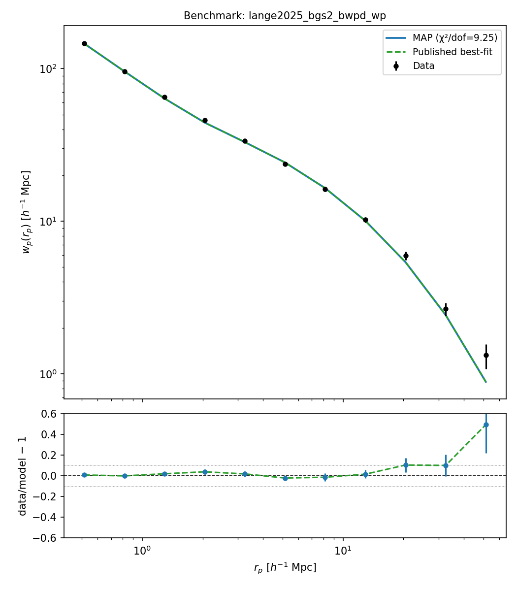

   MAP :math:`w_p(r_p)` vs BGS2 data (top) and residuals (bottom).

ESD-only — BGS2 × HSC-Y3
^^^^^^^^^^^^^^^^^^^^^^^^^^

:math:`\chi^2 = 4.24`; ndof = −3 — **FAIL** (underdetermined)

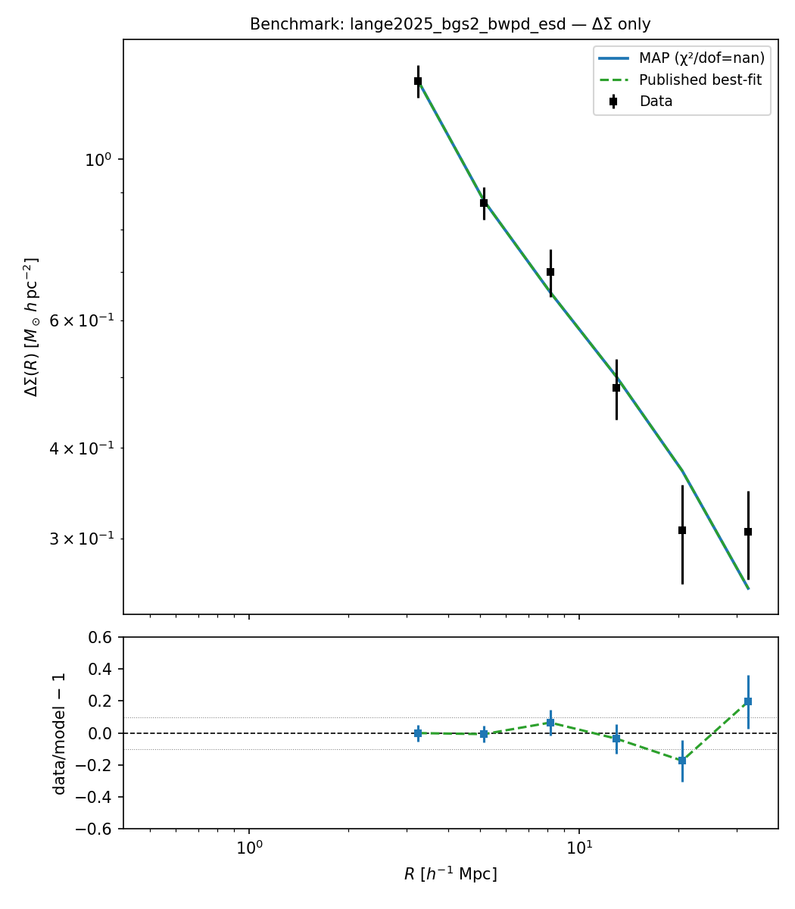

   MAP :math:`\Delta\Sigma(R)` vs BGS2 × HSC-Y3 data (ESD-only fit).

Joint wp+ESD — BGS2 × HSC-Y3
^^^^^^^^^^^^^^^^^^^^^^^^^^^^^^^

:math:`\chi^2/\text{dof} = 17.64 / 8 = 2.20` — **FAIL**

.. list-table::
   :header-rows: 1
   :widths: 28 20 28

   * - Parameter
     - MAP value
     - Published
   * - S8
     - 0.829
     - 0.793
   * - Ω_m
     - 0.302
     - 0.303
   * - ``log10mmin``
     - 12.154
     - —
   * - ``log10m1``
     - 13.444
     - —
   * - ``f_Gamma``
     - 0.849
     - —

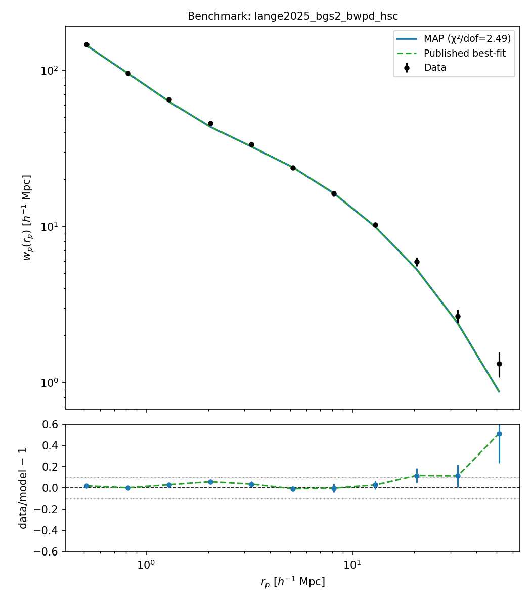

   MAP :math:`w_p(r_p)` vs BGS2 data.

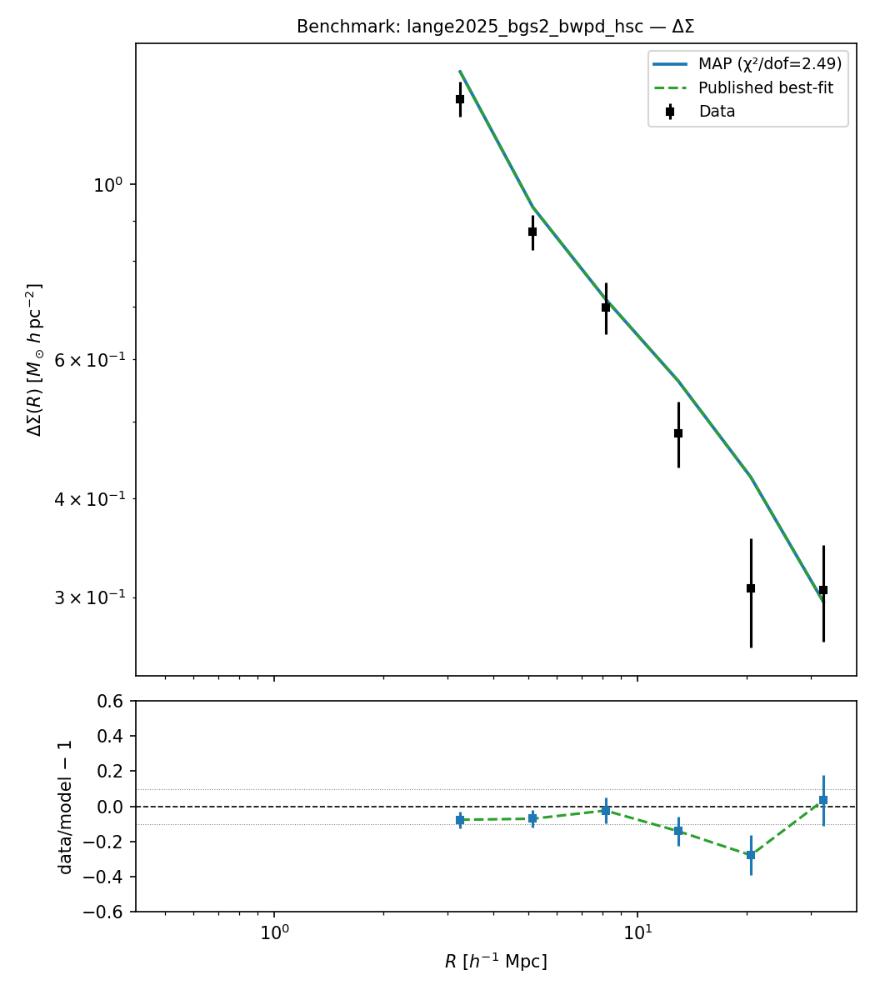

   MAP :math:`\Delta\Sigma(R)` vs BGS2 × HSC-Y3 data.

wp-only — BGS3
^^^^^^^^^^^^^^

:math:`\chi^2 = 13.54 / 1` — **FAIL**

.. list-table::
   :header-rows: 1
   :widths: 28 20 28

   * - Parameter
     - MAP value
     - Published
   * - S8
     - 0.836
     - 0.794
   * - Ω_m
     - 0.310
     - 0.295
   * - ``log10mmin``
     - 12.430
     - —
   * - ``log10m1``
     - 13.607
     - —

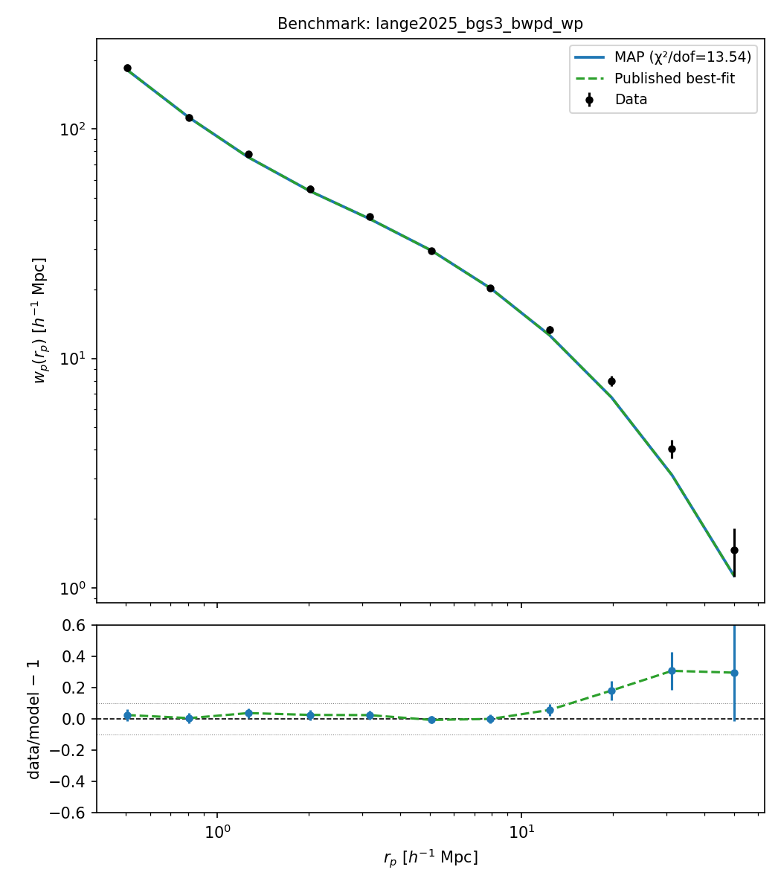

   MAP :math:`w_p(r_p)` vs BGS3 data.

ESD-only — BGS3 × HSC-Y3
^^^^^^^^^^^^^^^^^^^^^^^^^^

:math:`\chi^2 = 1.96`; ndof = −3 — **FAIL** (underdetermined)

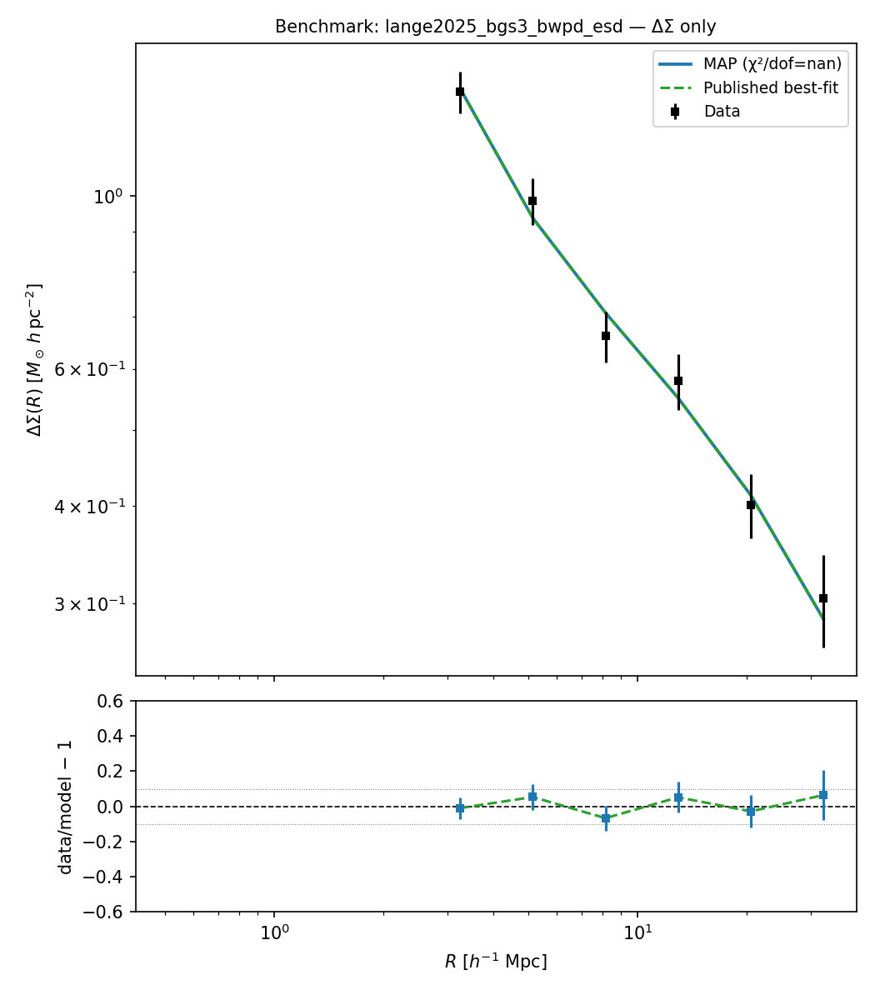

   MAP :math:`\Delta\Sigma(R)` vs BGS3 × HSC-Y3 data (ESD-only fit).

Joint wp+ESD — BGS3 × HSC-Y3
^^^^^^^^^^^^^^^^^^^^^^^^^^^^^^^

:math:`\chi^2/\text{dof} = 13.10 / 8 = 1.64` — **PASSED**

.. list-table::
   :header-rows: 1
   :widths: 28 20 28

   * - Parameter
     - MAP value
     - Published
   * - S8
     - 0.831
     - 0.793
   * - Ω_m
     - 0.301
     - 0.303
   * - ``log10mmin``
     - 12.401
     - —
   * - ``log10m1``
     - 13.760
     - —
   * - ``f_Gamma``
     - 0.612
     - —

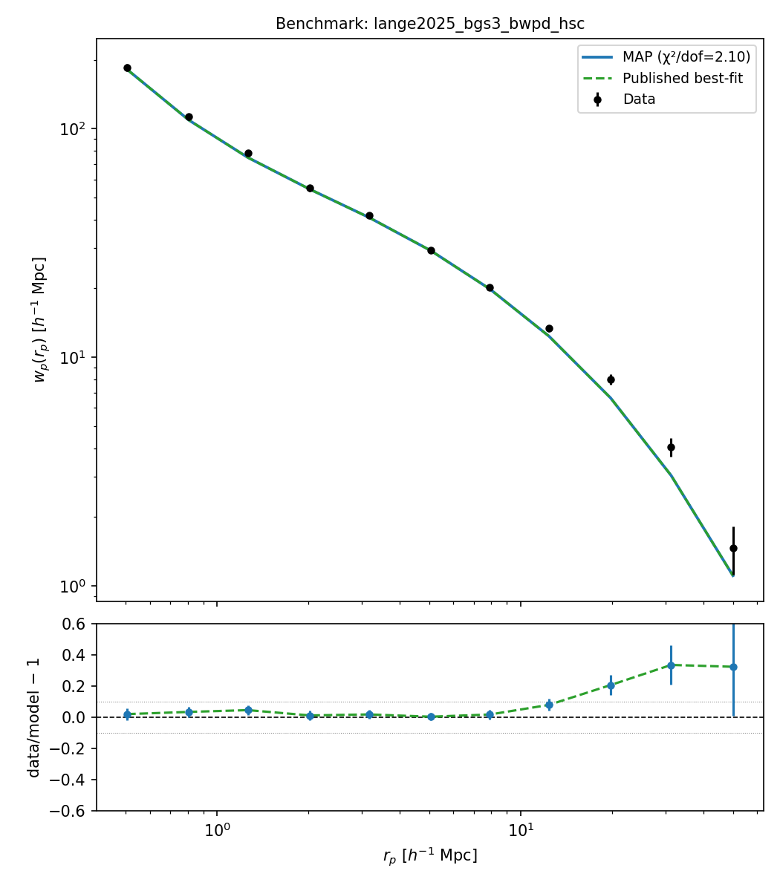

   MAP :math:`w_p(r_p)` vs BGS3 data.

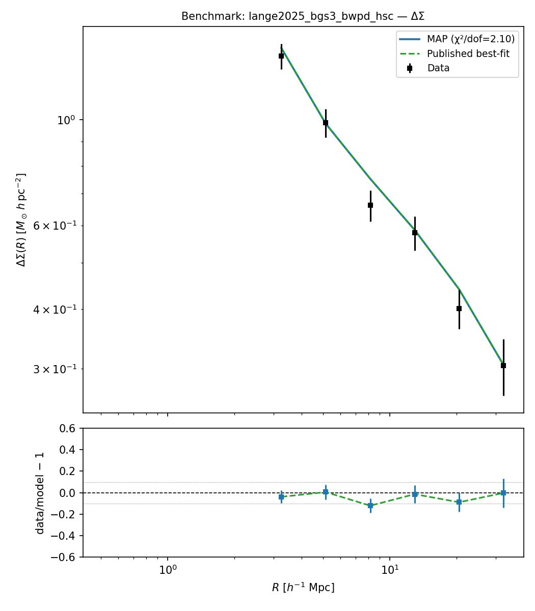

   MAP :math:`\Delta\Sigma(R)` vs BGS3 × HSC-Y3 data.

wp-only — LRG1
^^^^^^^^^^^^^^

:math:`\chi^2 = 15.96 / 1` — **FAIL**

.. list-table::
   :header-rows: 1
   :widths: 28 20 28

   * - Parameter
     - MAP value
     - Published
   * - S8
     - 0.833
     - 0.794
   * - Ω_m
     - 0.311
     - 0.295
   * - ``log10mmin``
     - 12.943
     - —
   * - ``log10m1``
     - 14.264
     - —

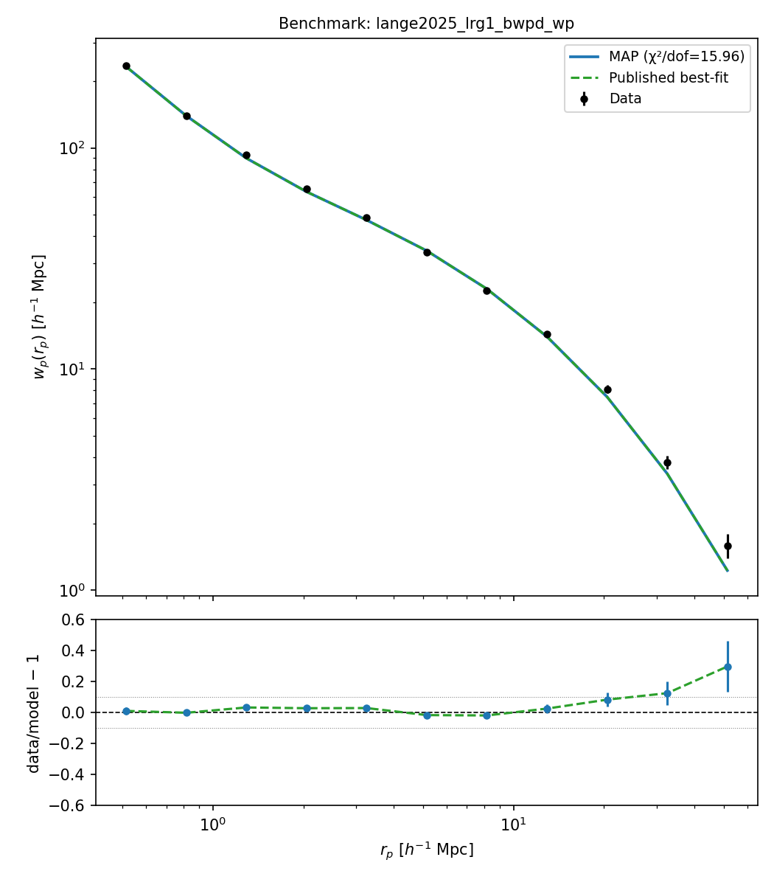

   MAP :math:`w_p(r_p)` vs LRG1 data.

ESD-only — LRG1 × HSC-Y3
^^^^^^^^^^^^^^^^^^^^^^^^^^

:math:`\chi^2 = 7.20`; ndof = −3 — **FAIL** (underdetermined)

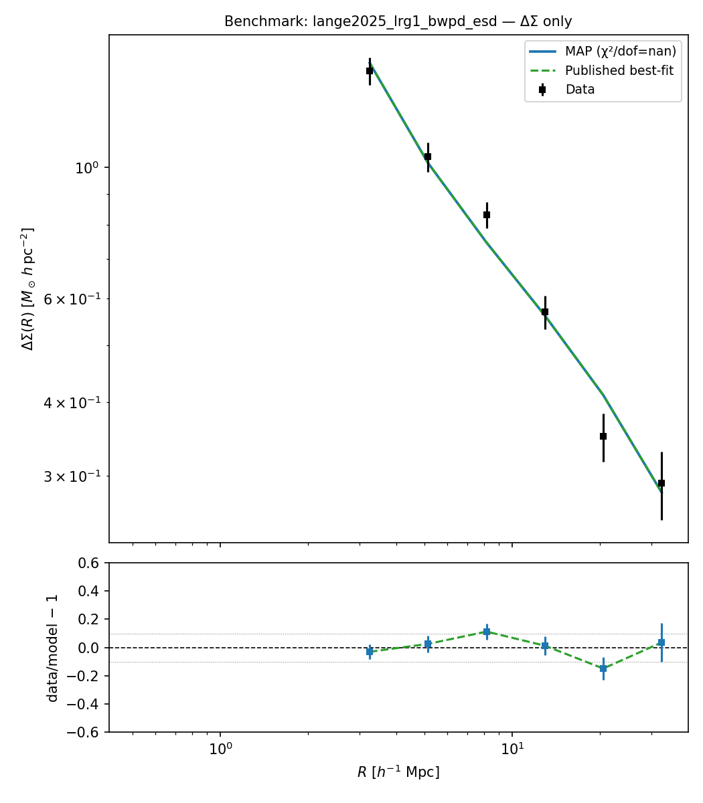

   MAP :math:`\Delta\Sigma(R)` vs LRG1 × HSC-Y3 data (ESD-only fit).

Joint wp+ESD — LRG1 × HSC-Y3
^^^^^^^^^^^^^^^^^^^^^^^^^^^^^^^

:math:`\chi^2/\text{dof} = 23.66 / 8 = 2.96` — **FAIL**

.. list-table::
   :header-rows: 1
   :widths: 28 20 28

   * - Parameter
     - MAP value
     - Published
   * - S8
     - 0.827
     - 0.793
   * - Ω_m
     - 0.305
     - 0.303
   * - ``log10mmin``
     - 12.643
     - —
   * - ``log10m1``
     - 14.002
     - —
   * - ``f_Gamma``
     - 0.550
     - —

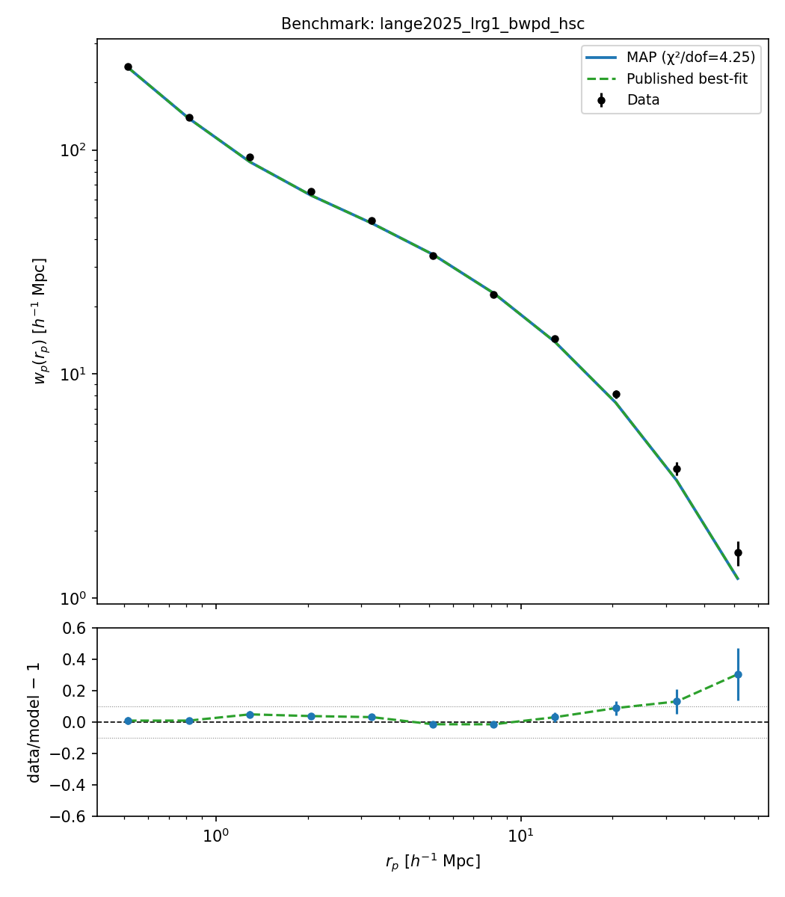

   MAP :math:`w_p(r_p)` vs LRG1 data.

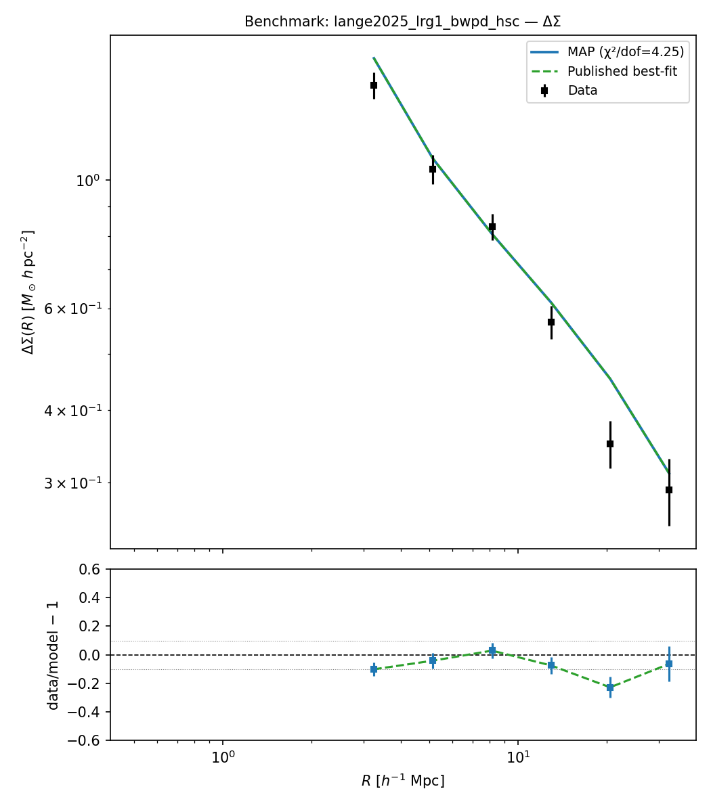

   MAP :math:`\Delta\Sigma(R)` vs LRG1 × HSC-Y3 data.

wp-only — LRG2
^^^^^^^^^^^^^^

:math:`\chi^2 = 24.73 / 1` — **FAIL**

.. list-table::
   :header-rows: 1
   :widths: 28 20 28

   * - Parameter
     - MAP value
     - Published
   * - S8
     - 0.839
     - 0.793
   * - Ω_m
     - 0.304
     - 0.303
   * - ``log10mmin``
     - 12.933
     - —
   * - ``log10m1``
     - 14.187
     - —

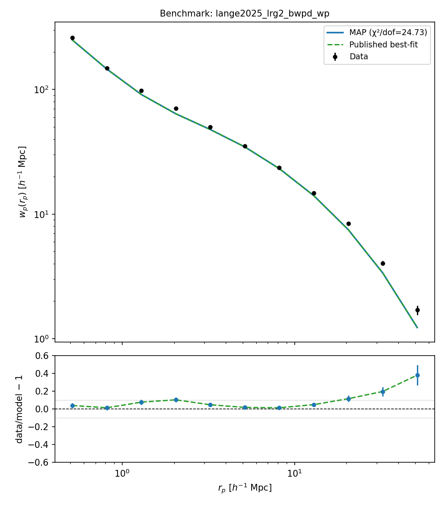

   MAP :math:`w_p(r_p)` vs LRG2 data.

ESD-only — LRG2 × HSC-Y3
^^^^^^^^^^^^^^^^^^^^^^^^^^

:math:`\chi^2 = 1.84`; ndof = −3 — **FAIL** (underdetermined)

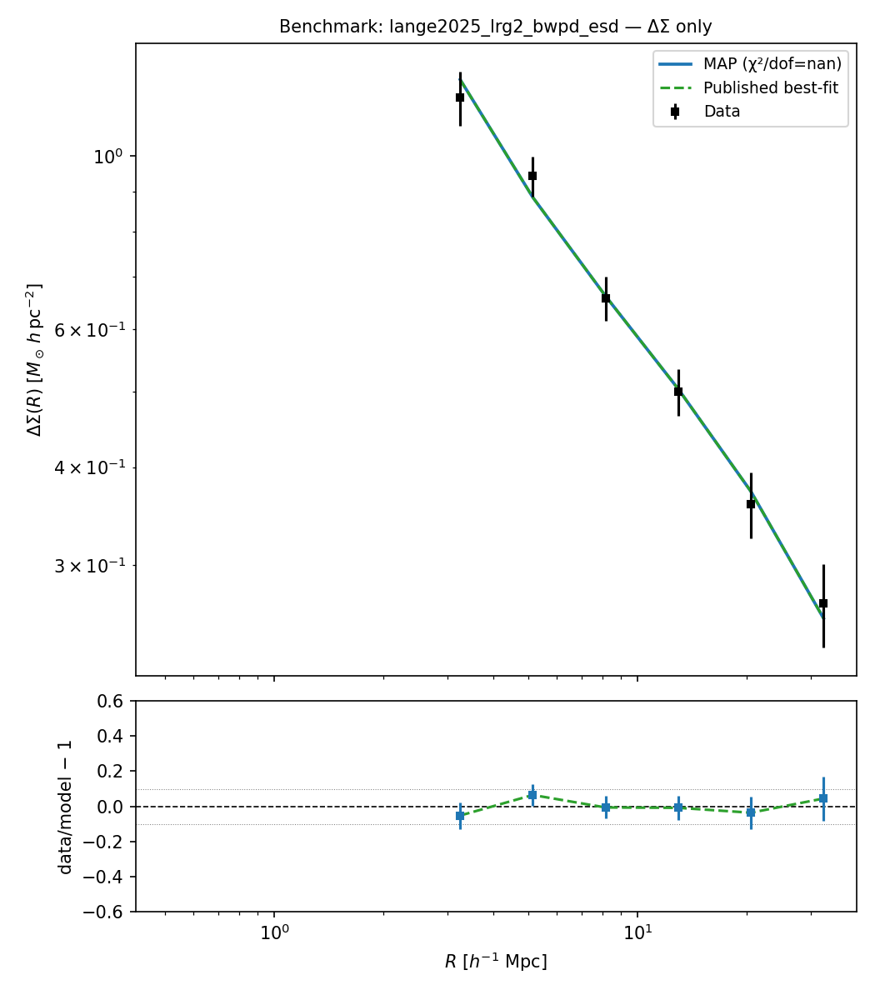

   MAP :math:`\Delta\Sigma(R)` vs LRG2 × HSC-Y3 data (ESD-only fit).

Joint wp+ESD — LRG2 × HSC-Y3
^^^^^^^^^^^^^^^^^^^^^^^^^^^^^^^

:math:`\chi^2/\text{dof} = 19.49 / 8 = 2.44` — **FAIL**

.. list-table::
   :header-rows: 1
   :widths: 28 20 28

   * - Parameter
     - MAP value
     - Published
   * - S8
     - 0.828
     - 0.793
   * - Ω_m
     - 0.298
     - 0.303
   * - ``log10mmin``
     - 12.594
     - —
   * - ``log10m1``
     - 13.874
     - —
   * - ``f_Gamma``
     - 0.541
     - —

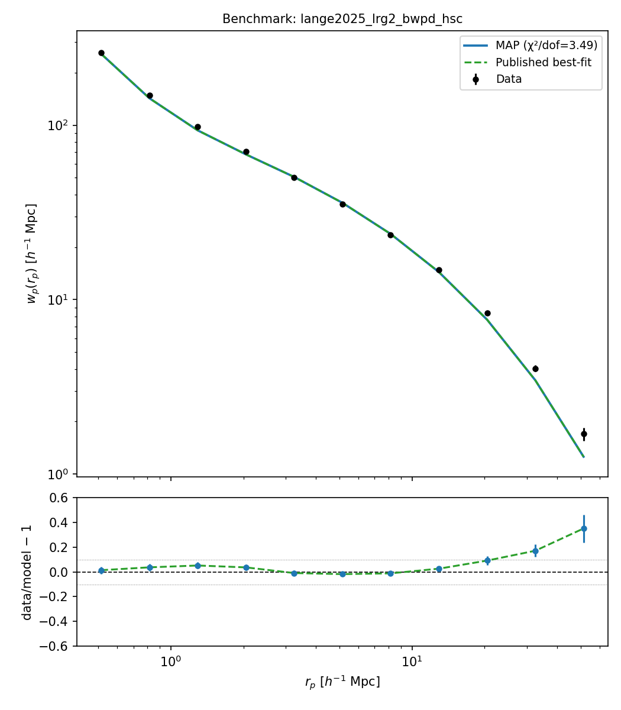

   MAP :math:`w_p(r_p)` vs LRG2 data.

   MAP :math:`\Delta\Sigma(R)` vs LRG2 × HSC-Y3 data.

Summary table (bwpd series)
^^^^^^^^^^^^^^^^^^^^^^^^^^^^

.. list-table::
   :header-rows: 1
   :widths: 38 12 8 14 12 12 12

   * - Benchmark key
     - Sample
     - ndof
     - :math:`\chi^2/\text{dof}`
     - S8 MAP
     - Ω_m MAP
     - Status
   * - ``lange2025_bgs2_bwpd_wp``
     - BGS2
     - 1
     - 9.25
     - 0.834
     - 0.312
     - FAIL
   * - ``lange2025_bgs2_bwpd_esd``
     - BGS2
     - −3
     - —
     - —
     - —
     - FAIL
   * - ``lange2025_bgs2_bwpd_hsc``
     - BGS2
     - 8
     - 2.20
     - 0.829
     - 0.302
     - FAIL
   * - ``lange2025_bgs3_bwpd_wp``
     - BGS3
     - 1
     - 13.54
     - 0.836
     - 0.310
     - FAIL
   * - ``lange2025_bgs3_bwpd_esd``
     - BGS3
     - −3
     - —
     - —
     - —
     - FAIL
   * - ``lange2025_bgs3_bwpd_hsc``
     - BGS3
     - 8
     - 1.64
     - 0.831
     - 0.301
     - **PASS**
   * - ``lange2025_lrg1_bwpd_wp``
     - LRG1
     - 1
     - 15.96
     - 0.833
     - 0.311
     - FAIL
   * - ``lange2025_lrg1_bwpd_esd``
     - LRG1
     - −3
     - —
     - —
     - —
     - FAIL
   * - ``lange2025_lrg1_bwpd_hsc``
     - LRG1
     - 8
     - 2.96
     - 0.827
     - 0.305
     - FAIL
   * - ``lange2025_lrg2_bwpd_wp``
     - LRG2
     - 1
     - 24.73
     - 0.839
     - 0.304
     - FAIL
   * - ``lange2025_lrg2_bwpd_esd``
     - LRG2
     - −3
     - —
     - —
     - —
     - FAIL
   * - ``lange2025_lrg2_bwpd_hsc``
     - LRG2
     - 8
     - 2.44
     - 0.828
     - 0.298
     - FAIL

Primary failure drivers:

1. **Digitized data** — accuracy ∼20–30% per point.  Replace with Zenodo tables (record 17831718)
   for a fair quantitative comparison.
2. **Model mismatch** — the analytical halo model cannot replicate per-halo-concentration
   occupation.  The decorated HOD used in the paper introduces halo-to-halo stochasticity
   that shifts wp and ΔΣ at ∼10% level in the 1-halo regime.
3. **S8/Ω_m prior tension** — the optimizer pulls toward Planck values (S8 ≈ 0.83) rather
   than the published DESI values (S8 ≈ 0.79); proper covariance matrices and a wider/uniform
   cosmological prior would be needed.

See :ref:`benchmarks` for the benchmark suite summary.
