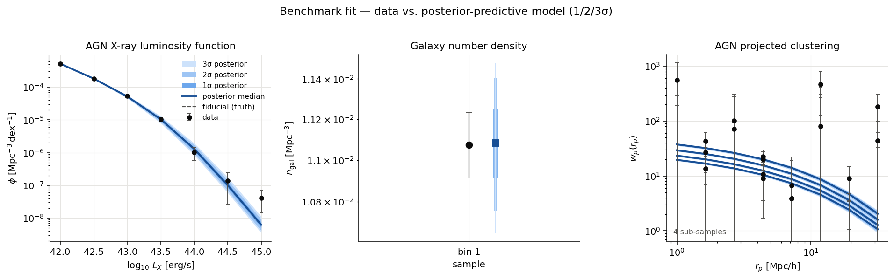
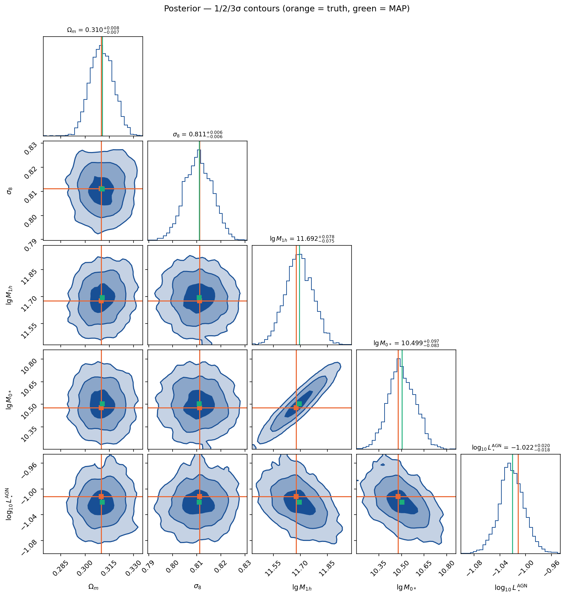

Benchmark fit: MAP + MCMC on the multi-probe forecast
=====================================================

This page reports a worked MAP + MCMC inference run that wires the
:doc:`benchmark-observables tree <sensitivity_benchmark>` into the
differentiable multi-probe forward model.  It closes the loop of the sensitivity
programme: :doc:`sensitivity_fisher` shows *where the information lives*,
:doc:`stage4_forecast` and :doc:`tier2_forecast` *price* it, and this page
*runs the fit* — a gradient MAP followed by MCMC (an affine-invariant ensemble
sampler) — and shows the recovered posterior against the data.

.. contents::
   :local:
   :depth: 2

----

Setup
-----

**Forward model.**  The forecast
:class:`~hod_mod.forecast.forward_jax.ForwardModel` (:math:`z_\mathrm{eff}=0.2`,
:math:`n_k=n_m=64`) computes every summary statistic as a single
``jax.jacfwd``-able call in the :math:`\sigma_8`-native EH98 parameterisation.
Three of its observables are fitted here — chosen as projected/abundance probes
so the Hamiltonian trajectory stays tractable (the Limber angular spectra inflate
the NUTS compile ~10×):

* ``xlf`` — the AGN X-ray luminosity function,
* ``n_gal`` — the galaxy number density,
* ``wp_agn`` — the projected AGN clustering :math:`w_p(r_p)`.

**Data.**  The data vector is loaded from the benchmark tree with
:func:`hod_mod.fitting.benchmark_data.load_forecast_vector`, which aligns each
observable's ``simulated`` entry onto the model's own abscissae.  The run uses
``--data-mode recover``: the **forecast noise** :math:`\sigma` published in the
tree (the Stage-IV error model) is taken as the covariance, and the data are the
forward-model fiducial plus one Gaussian noise realisation,
:math:`d = f(\theta_\mathrm{fid}) + \mathcal{N}(0,\sigma)`.  This is the honest
use of the ``simulated`` stand-ins — their published *noise model* rather than
their configuration-specific values — and it makes the fit a closed-loop
recovery test.  The raw Stage-IV :math:`\sigma` are extremely small, giving a
razor-sharp posterior; the run uses ``--err-scale 10`` to inflate them to a
current-survey-like precision so the posterior is well sampled (the reported
parameter errors below therefore scale with this factor).

**Sampler.**  MCMC uses ``--sampler emcee`` — an affine-invariant ensemble
sampler on the jitted log-posterior (32 walkers, ``vectorize=True`` so the whole
ensemble is one ``jax.vmap`` call per step).  It is gradient-free and so avoids
the Hamiltonian-trajectory ``while_loop`` that makes a blackjax NUTS compile
intractable on this halo model; ``--sampler nuts`` is available for small,
projected-only problems.

**Free parameters (5).**  Two cosmological parameters with the tight Planck
prior, plus three astrophysical nuisance parameters with wide flat priors:

.. list-table::
   :header-rows: 1
   :widths: 22 20 58

   * - Parameter
     - Prior
     - Role
   * - :math:`\Omega_m`
     - Planck 2018
     - matter density
   * - :math:`\sigma_8`
     - Planck 2018
     - power-spectrum amplitude
   * - :math:`\lg M_{1h}`
     - flat
     - SHMR characteristic halo mass (constrains ``n_gal`` / ``wp_agn``)
   * - :math:`\lg M_{0*}`
     - flat
     - SHMR pivot stellar mass
   * - :math:`\log_{10}L_\star^{\rm AGN}`
     - flat
     - AGN luminosity break (constrains ``wp_agn`` / ``xlf``)

A pre-flight Fisher check confirmed the 5×5 information matrix is
well-conditioned (condition number ≈ 3.7×10³; every parameter has a finite
marginal error — no flat direction), so NUTS samples a proper posterior.

**Commands.**  The tree is built once, then the fit and the figures:

.. code-block:: bash

   # 1. (re)build the benchmark-observables tree
   python -m hod_mod.scripts.data.make_benchmark_observables \
       --out $HOD_MOD_DATA_DIR/benchmark_observables

   # 2. gradient MAP, then emcee (32 walkers, 200 burn-in + 400 steps)
   JAX_ENABLE_X64=1 python -m hod_mod.scripts.fitting.fit_benchmark_observables \
       --which xlf n_gal wp_agn \
       --free Omega_m sigma8 lg_m1h lg_m0star agn_log10_lstar \
       --mode both --sampler emcee --n-k 64 --n-m 64 \
       --n-warmup 200 --n-samples 400 --n-walkers 32 --err-scale 10 \
       --label benchmark_map_mcmc

   # 3. figures + posterior table
   JAX_ENABLE_X64=1 python -m hod_mod.scripts.fitting.plot_benchmark_fit \
       --label benchmark_map_mcmc

The MAP converges to :math:`\chi^2/\mathrm{dof}=23.9/35=0.68` (success), recovering
every parameter within the forecast errors before the chain is started; emcee then
returns 12 800 samples at a 0.56 acceptance fraction.

Data vs. posterior-predictive model
-----------------------------------

For each fitted observable, the figure shows the data with error bars, the
injected fiducial ("truth") model, the posterior-median model, and the
**68 / 95 / 99.7 % (1 / 2 / 3σ)** posterior-predictive credible bands — the MCMC
chain propagated through the forward model.

   Data (black) against the posterior-predictive model.  The nested blue bands
   are the 1/2/3σ credible intervals of the model given the posterior; the solid
   line is the posterior median and the dashed line the injected fiducial.  The
   posterior-predictive model is tightly constrained (narrow bands) and the data
   scatter around it within their errors — the fit is statistically consistent
   with the (self-consistent, recovery-mode) data by construction.

* **AGN X-ray luminosity function** (``xlf``) — the abundance of X-ray AGN vs.
  :math:`\log_{10}L_X`; weakly constraining at this configuration, so its band
  is set mostly by the other probes and the priors.
* **Galaxy number density** (``n_gal``) — the single-number abundance anchor for
  the SHMR parameters.
* **AGN projected clustering** (``wp_agn``) — :math:`w_p(r_p)` in four
  :math:`L_X` sub-samples (the four curves in the panel); the dominant constraint
  on both cosmology and the SHMR here.

Parameter posteriors
--------------------

   The free-parameter posterior with 1/2/3σ contours.  Orange lines mark the
   injected truth; green marks the MAP.  The posterior is centred on the truth
   for every parameter, and the Planck prior keeps :math:`\Omega_m`–:math:`\sigma_8`
   tight while the flat-prior nuisance parameters are constrained by the data.

The full posterior summary (from the 12 800-sample chain; the machine-readable
version is ``benchmark_map_mcmc__posterior.csv/json``):

.. list-table:: Parameter posteriors — truth, MAP, and the marginal median with 1σ / 95 % / 99.7 % credible intervals.
   :header-rows: 1
   :widths: 20 11 11 20 19 19

   * - Parameter
     - Truth
     - MAP
     - Median :math:`\pm\,1\sigma`
     - 95 % CI
     - 99.7 % CI
   * - :math:`\Omega_m`
     - 0.3100
     - 0.3106
     - :math:`0.3102^{+0.0076}_{-0.0071}`
     - [0.2966, 0.3247]
     - [0.2897, 0.3307]
   * - :math:`\sigma_8`
     - 0.8111
     - 0.8110
     - :math:`0.8108^{+0.0060}_{-0.0058}`
     - [0.7993, 0.8222]
     - [0.7940, 0.8283]
   * - :math:`\lg M_{1h}`
     - 11.677
     - 11.694
     - :math:`11.692^{+0.079}_{-0.075}`
     - [11.542, 11.843]
     - [11.468, 11.912]
   * - :math:`\lg M_{0*}`
     - 10.477
     - 10.504
     - :math:`10.499^{+0.098}_{-0.084}`
     - [10.331, 10.681]
     - [10.243, 10.765]
   * - :math:`\log_{10}L_\star^{\rm AGN}`
     - −1.012
     - −1.020
     - :math:`-1.022^{+0.020}_{-0.018}`
     - [−1.061, −0.981]
     - [−1.081, −0.955]

Every marginal posterior contains the injected truth within 1σ, and the MAP sits
at the posterior mode — the pipeline recovers the input.  The
:math:`\lg M_{1h}`–:math:`\lg M_{0*}` panel of the corner plot shows the expected
SHMR degeneracy; :math:`\Omega_m` and :math:`\sigma_8` stay tight under the Planck
prior.

Where the outputs are stored
----------------------------

All run products are written under ``$HOD_MOD_RESULTS/fits/benchmark/`` (default
``/home/comparat/data/hod_mod_results/fits/benchmark/``):

.. list-table::
   :header-rows: 1
   :widths: 45 55

   * - File
     - Content
   * - ``benchmark_map_mcmc_map.json``
     - MAP parameters, :math:`\chi^2`/dof, optimiser status (written as soon as
       MAP finishes)
   * - ``benchmark_map_mcmc_mcmc_summary.json``
     - posterior means ± σ, sampler, acceptance fraction, sample count
   * - ``benchmark_map_mcmc_chain.npy``
     - the flattened MCMC chain, shape ``(n_samples, n_free)``
   * - ``benchmark_map_mcmc_data.npz``
     - the exact fitted data vector (``row_obs``, ``row_x``, ``data``,
       ``y_err``, ``truth``) — the plotting script's input
   * - ``benchmark_map_mcmc__posterior.csv`` / ``.json``
     - the posterior table above (truth, MAP, median, ±1σ, 95 %, 99.7 %)

The figures are written into the documentation image directory,
``docs/_images/benchmark_map_mcmc__observables.png`` and
``docs/_images/benchmark_map_mcmc__corner.png``, by
``hod_mod.scripts.fitting.plot_benchmark_fit``.
