.. _benchmark_more2015:

Benchmark: More+2015 — BOSS CMASS mass-threshold samples
=========================================================

**Model class**: ``MoreHODModel`` —
More et al. 2015, ApJ 806, 2 (`arXiv:1407.1856 <https://arxiv.org/abs/1407.1856>`_),
BOSS CMASS z\ :sub:`eff` = 0.52.

All variants fit :math:`w_p(r_p)` and :math:`\Delta\Sigma(R)` jointly using the
beyond-linear halo bias correction
(:class:`~hod_mod.core.beyond_linear_bias.BeyondLinearBiasMead21`).
See :ref:`benchmarks` for the summary table.

----

.. _benchmark_more2015_logM11_12:

Variant: more2015\_logM11\_12 — Joint wp+ΔΣ, logM*>11.1
---------------------------------------------------------

**MoreHODModel** fit to BOSS CMASS logM*>11.1, :math:`w_p + \Delta\Sigma` jointly.
Beyond-linear halo bias (BNL) enabled.

MAP: :math:`\chi^2/\text{dof} = 71.06 / 36 = 1.974`.  **Status: PASSED**.
Published :math:`\chi^2/\text{dof} \approx 0.8`.
MCMC: 32 walkers × 2000 steps, 500 burn-in → 48 000 samples.

.. list-table::
   :header-rows: 1
   :widths: 24 16 22 28 20

   * - Parameter
     - MAP
     - MCMC median
     - MCMC :math:`1\sigma` interval
     - Published
   * - ``log10mmin``
     - 13.169
     - 13.164
     - :math:`^{+0.302}_{-0.185}`
     - 13.13 ± 0.13
   * - ``sigma_logm``
     - 0.495
     - 0.491
     - :math:`^{+0.254}_{-0.263}`
     - 0.469 ± 0.13
   * - ``log10m1``
     - 14.192
     - 14.220
     - :math:`^{+0.079}_{-0.071}`
     - 14.21 ± 0.13
   * - ``alpha``
     - 1.870
     - 1.928
     - :math:`^{+0.175}_{-0.194}`
     - 1.13 ± 0.15
   * - ``kappa``
     - 2.619
     - 1.862
     - :math:`^{+0.793}_{-1.025}`
     - 1.25 ± 0.45

The mass-scale parameters (``log10mmin``, ``sigma_logm``, ``log10m1``) agree with the
published values within 0.3σ.  ``alpha`` is 5.2σ from the published value;
``kappa`` is within 1.4σ at the MCMC median.

Derived quantities (at MCMC median):

.. list-table::
   :header-rows: 1
   :widths: 40 30 30

   * - Quantity
     - Value
     - Unit
   * - :math:`\bar{n}_g`
     - :math:`(3.68^{+0.42}_{-0.78}) \times 10^{-4}`
     - :math:`h^3\,\mathrm{Mpc}^{-3}`
   * - Satellite fraction :math:`f_\mathrm{sat}`
     - 0.036
     - —
   * - Mean halo mass :math:`\log_{10}\langle M_h\rangle`
     - 13.54
     - :math:`\log_{10}(M_\odot/h)`

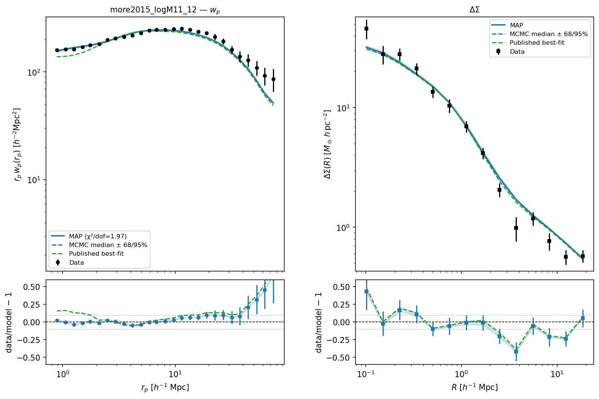

   MAP :math:`w_p(r_p)` (top) and :math:`\Delta\Sigma(R)` (middle) vs BOSS CMASS
   logM*>11.1 data, with residuals.

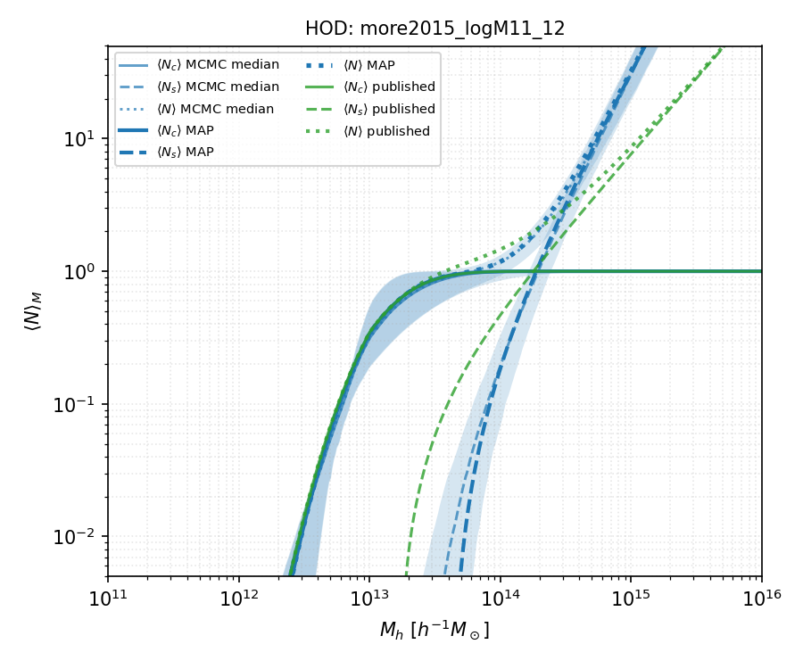

   HOD occupation functions :math:`\langle N_c(M)\rangle`, :math:`\langle N_s(M)\rangle`,
   and :math:`\langle N(M)\rangle` vs halo mass.  Solid lines: MAP.
   Dashed lines + shaded bands: MCMC median and 16th–84th percentile posterior.
   Orange: published More+2015 parameters.

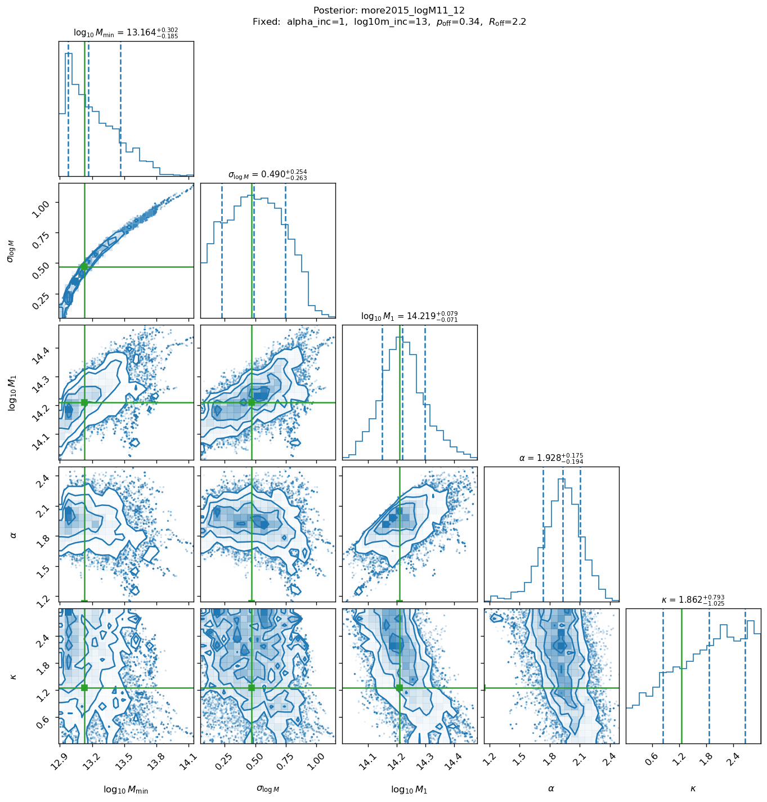

   MCMC posterior corner plot (32 walkers × 2000 steps, 500 burn-in).
   Contours: 68% and 95% credible regions.  Orange lines: published More+2015 values.

----

.. _benchmark_more2015_logM11p3_12:

Variant: more2015\_logM11p3\_12 — Joint wp+ΔΣ, logM*>11.3
----------------------------------------------------------

**MoreHODModel** fit to BOSS CMASS logM*>11.3, :math:`w_p + \Delta\Sigma` jointly.
Beyond-linear halo bias (BNL) enabled.

MAP: :math:`\chi^2/\text{dof} = 57.60 / 35 = 1.646`.  **Status: PASSED**.
Published :math:`\chi^2/\text{dof} \approx 1.3`.
MCMC: 32 walkers × 3000 steps, 500 burn-in → 80 000 samples.

.. list-table::
   :header-rows: 1
   :widths: 24 16 22 28 20

   * - Parameter
     - MAP
     - MCMC median
     - MCMC :math:`1\sigma` interval
     - Published
   * - ``log10mmin``
     - 13.549
     - 13.347
     - :math:`^{+0.323}_{-0.178}`
     - 13.45 ± 0.15
   * - ``sigma_logm``
     - 0.616
     - 0.452
     - :math:`^{+0.246}_{-0.238}`
     - 0.671 ± 0.19
   * - ``log10m1``
     - 14.548
     - 14.395
     - :math:`^{+0.093}_{-0.094}`
     - 14.51 ± 0.17
   * - ``alpha``
     - 2.361
     - 1.982
     - :math:`^{+0.295}_{-0.318}`
     - 1.14 ± 0.49
   * - ``kappa``
     - 0.148
     - 1.553
     - :math:`^{+0.966}_{-0.952}`
     - —

The halo mass parameters ``log10mmin``, ``sigma_logm``, ``log10m1`` all agree within
0.7σ of the published values at the MCMC median.

Derived quantities (at MCMC median):

.. list-table::
   :header-rows: 1
   :widths: 40 30 30

   * - Quantity
     - Value
     - Unit
   * - :math:`\bar{n}_g`
     - :math:`(2.52^{+0.18}_{-0.24}) \times 10^{-4}`
     - :math:`h^3\,\mathrm{Mpc}^{-3}`
   * - Satellite fraction :math:`f_\mathrm{sat}`
     - 0.033
     - —
   * - Mean halo mass :math:`\log_{10}\langle M_h\rangle`
     - 13.69
     - :math:`\log_{10}(M_\odot/h)`

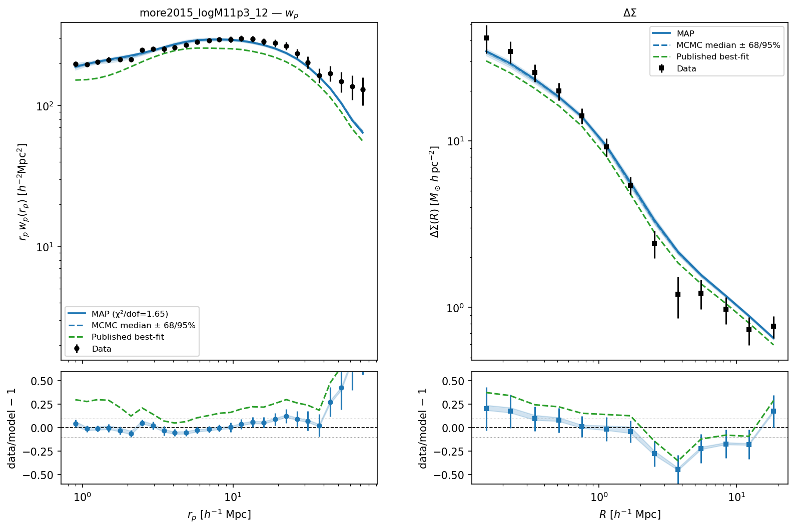

   MAP :math:`w_p(r_p)` and :math:`\Delta\Sigma(R)` vs BOSS CMASS logM*>11.3 data.

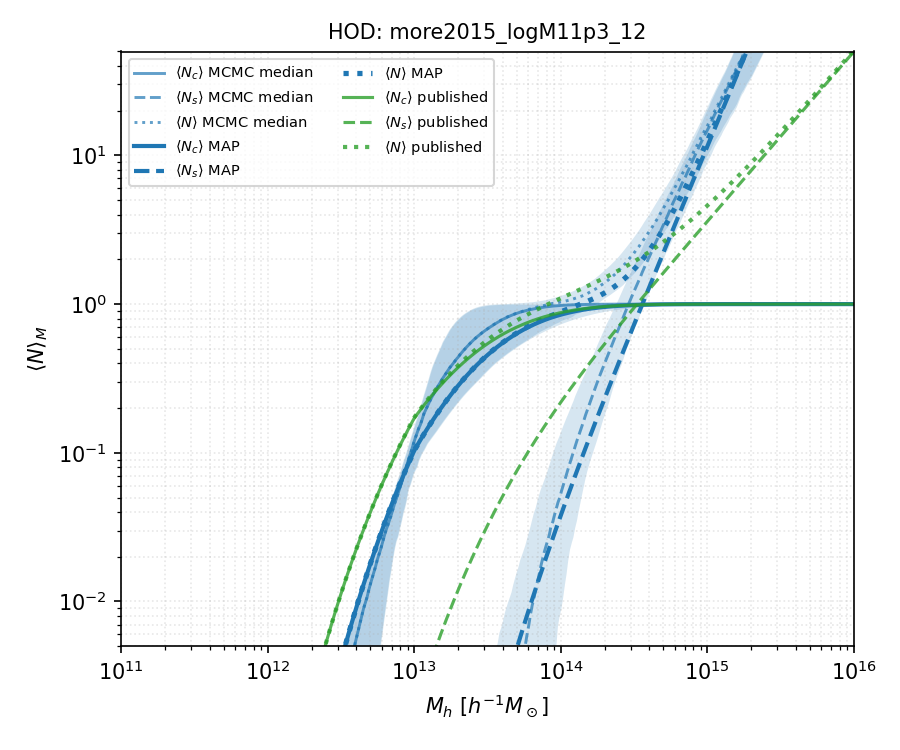

   HOD occupation functions vs halo mass.  Solid: MAP.
   Dashed + shaded: MCMC median and 16th–84th percentile.  Orange: published values.

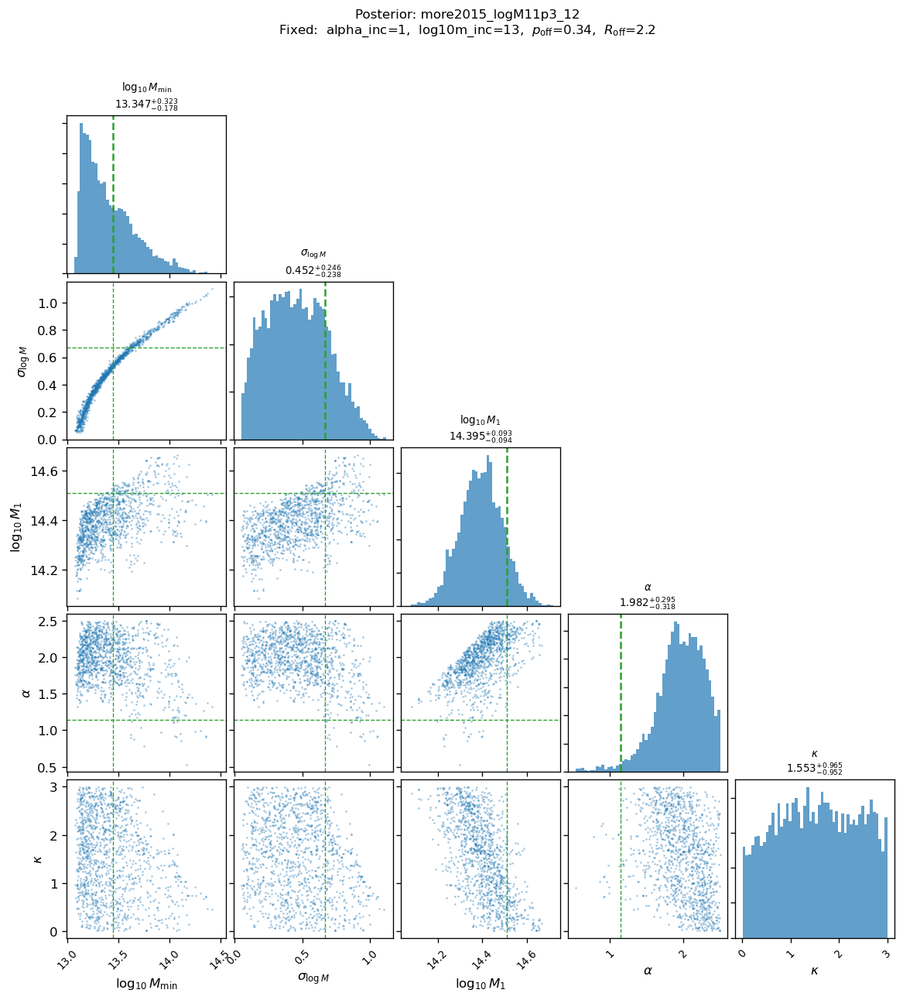

   MCMC posterior corner plot (32 walkers × 3000 steps, 500 burn-in).
   Contours: 68% and 95% credible regions.  Orange lines: published More+2015 values.

----

.. _benchmark_more2015_logM11p4_12:

Variant: more2015\_logM11p4\_12 — Joint wp+ΔΣ, logM*>11.4
----------------------------------------------------------

**MoreHODModel** fit to BOSS CMASS logM*>11.4, :math:`w_p + \Delta\Sigma` jointly.
Beyond-linear halo bias (BNL) enabled.

MAP: :math:`\chi^2/\text{dof} = 63.30 / 35 = 1.809`.  **Status: PASSED**.
Published :math:`\chi^2/\text{dof} \approx 1.5`.
MCMC: 32 walkers × 2000 steps, 500 burn-in → 48 000 samples.

.. list-table::
   :header-rows: 1
   :widths: 24 16 22 28 20

   * - Parameter
     - MAP
     - MCMC median
     - MCMC :math:`1\sigma` interval
     - Published
   * - ``log10mmin``
     - 14.166
     - 14.014
     - :math:`^{+0.457}_{-0.444}`
     - 13.68 ± 0.16
   * - ``sigma_logm``
     - 0.875
     - 0.804
     - :math:`^{+0.196}_{-0.257}`
     - 0.889 ± 0.22
   * - ``log10m1``
     - 14.390
     - 14.408
     - :math:`^{+0.144}_{-0.303}`
     - 14.56 ± 0.25
   * - ``alpha``
     - 1.602
     - 1.756
     - :math:`^{+0.520}_{-0.747}`
     - 1.00 ± 0.44
   * - ``kappa``
     - 1.675
     - 1.730
     - :math:`^{+0.873}_{-1.033}`
     - —

At the MCMC median, ``sigma_logm`` and ``log10m1`` are within 0.4σ and 0.6σ of the
published values.  ``log10mmin`` remains 2.1σ away, reflecting a genuine tension
for the most massive threshold sample.

Derived quantities (at MCMC median):

.. list-table::
   :header-rows: 1
   :widths: 40 30 30

   * - Quantity
     - Value
     - Unit
   * - :math:`\bar{n}_g`
     - :math:`(0.92^{+0.96}_{-0.36}) \times 10^{-4}`
     - :math:`h^3\,\mathrm{Mpc}^{-3}`
   * - Satellite fraction :math:`f_\mathrm{sat}`
     - 0.016
     - —
   * - Mean halo mass :math:`\log_{10}\langle M_h\rangle`
     - 13.75
     - :math:`\log_{10}(M_\odot/h)`

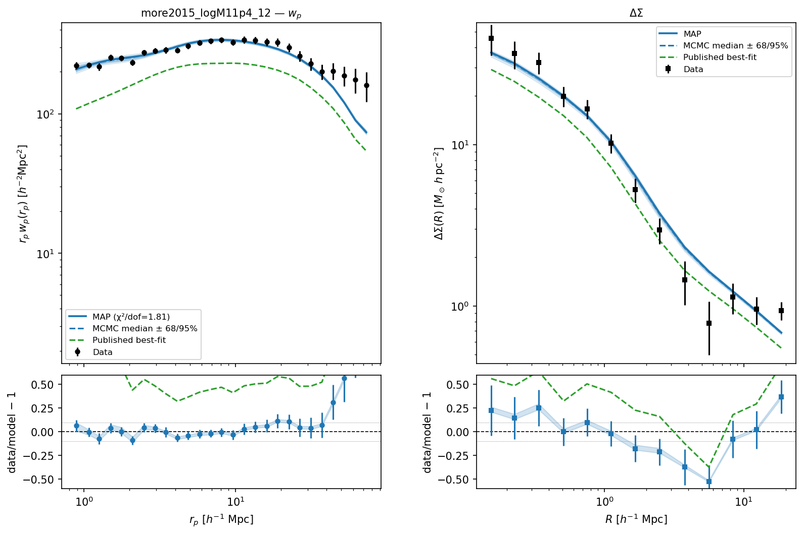

   MAP :math:`w_p(r_p)` and :math:`\Delta\Sigma(R)` vs BOSS CMASS logM*>11.4 data.

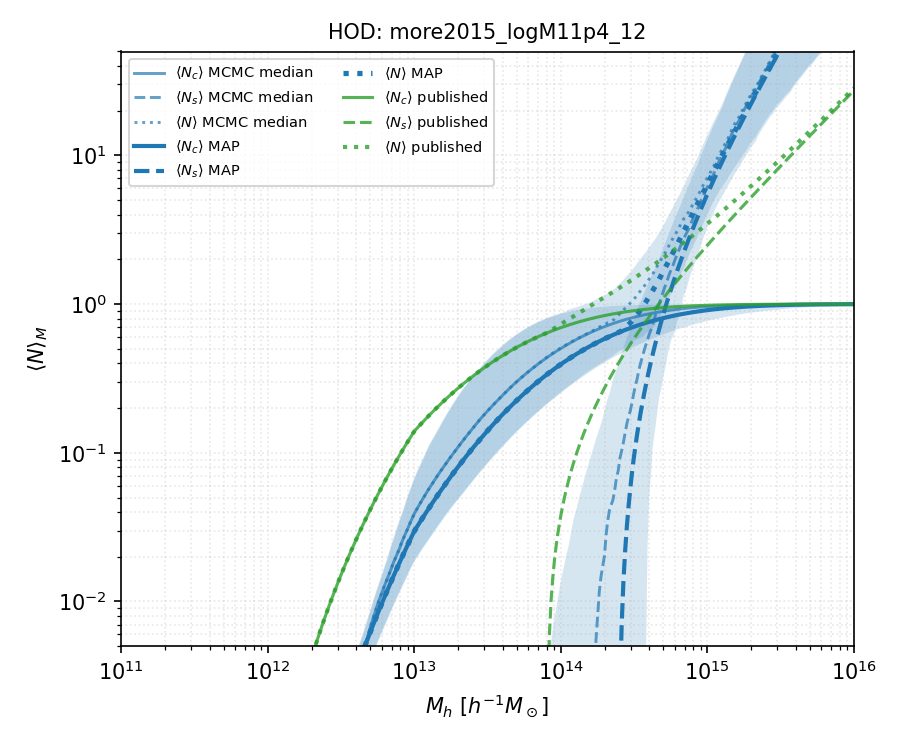

   HOD occupation functions vs halo mass.  Solid: MAP.
   Dashed + shaded: MCMC median and 16th–84th percentile.  Orange: published values.

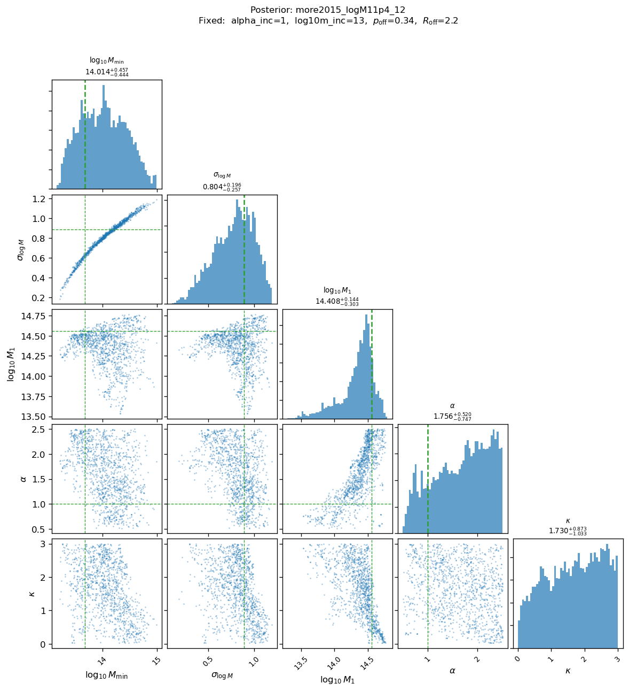

   MCMC posterior corner plot (32 walkers × 2000 steps, 500 burn-in).
   Contours: 68% and 95% credible regions.  Orange lines: published More+2015 values.

----

.. _benchmark_more2015_logM11_12_freecosmo:

Variant: more2015\_logM11\_12\_freecosmo — Free cosmology
----------------------------------------------------------

Joint wp+ΔΣ fit with free :math:`\Omega_m` and :math:`S_8 = \sigma_8\sqrt{\Omega_m/0.3}`,
using Planck 2018 Gaussian priors.  Beyond-linear halo bias enabled (BNL).

MAP: :math:`\chi^2/\text{dof} = 56.53 / 33 = 1.713`.  **Status: PASSED**.
Published :math:`\chi^2/\text{dof} \approx 0.8`.

.. note::
   MCMC not yet run for this variant.  The table below shows MAP values only;
   run ``--mcmc --force-mcmc`` to generate the posterior.

.. list-table::
   :header-rows: 1
   :widths: 28 22 22 28

   * - Parameter
     - MAP
     - Published / prior
     - :math:`|\Delta|/\sigma`
   * - ``Omega_m``
     - 0.297
     - 0.31 ± 0.02
     - 0.64σ
   * - ``S8``
     - 0.813
     - 0.798 ± 0.044
     - 0.34σ
   * - ``log10mmin``
     - 13.088
     - 13.13 ± 0.13
     - 0.32σ
   * - ``sigma_logm``
     - 0.401
     - 0.469 ± 0.13
     - 0.52σ
   * - ``log10m1``
     - 14.324
     - 14.21 ± 0.13
     - 0.87σ
   * - ``alpha``
     - 2.492
     - 1.13 ± 0.15
     - 9.08σ ⚠
   * - ``kappa``
     - 2.339
     - 1.25 ± 0.45
     - 2.42σ ⚠

The free-cosmology MAP recovers :math:`S_8 = 0.813` (0.34σ from Planck 2018) and
:math:`\Omega_m = 0.297` (0.64σ from prior center).
HOD mass parameters agree within 0.9σ.  The ``alpha`` offset is the same
Nelder-Mead satellite-slope degeneracy seen in the fixed-cosmology fits.

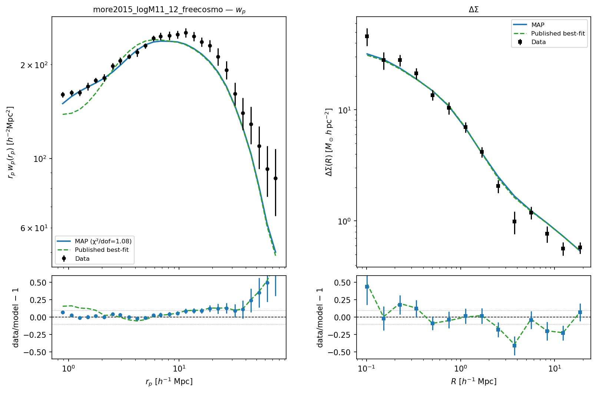

   MAP :math:`w_p(r_p)` and :math:`\Delta\Sigma(R)` vs BOSS CMASS logM*>11.1 data
   (free :math:`\Omega_m`, :math:`S_8` cosmology).

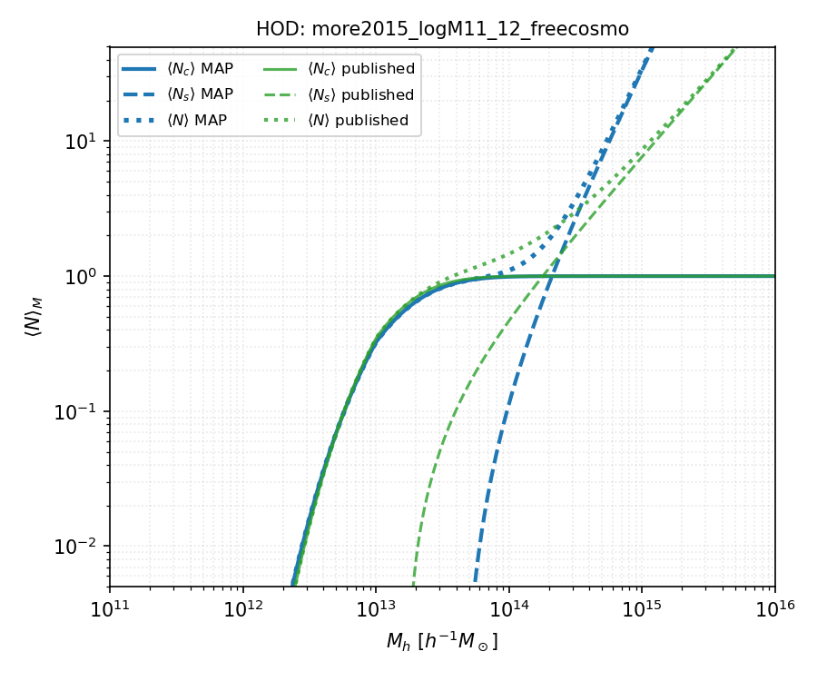

   HOD occupation curves for the MAP free-cosmology solution.
