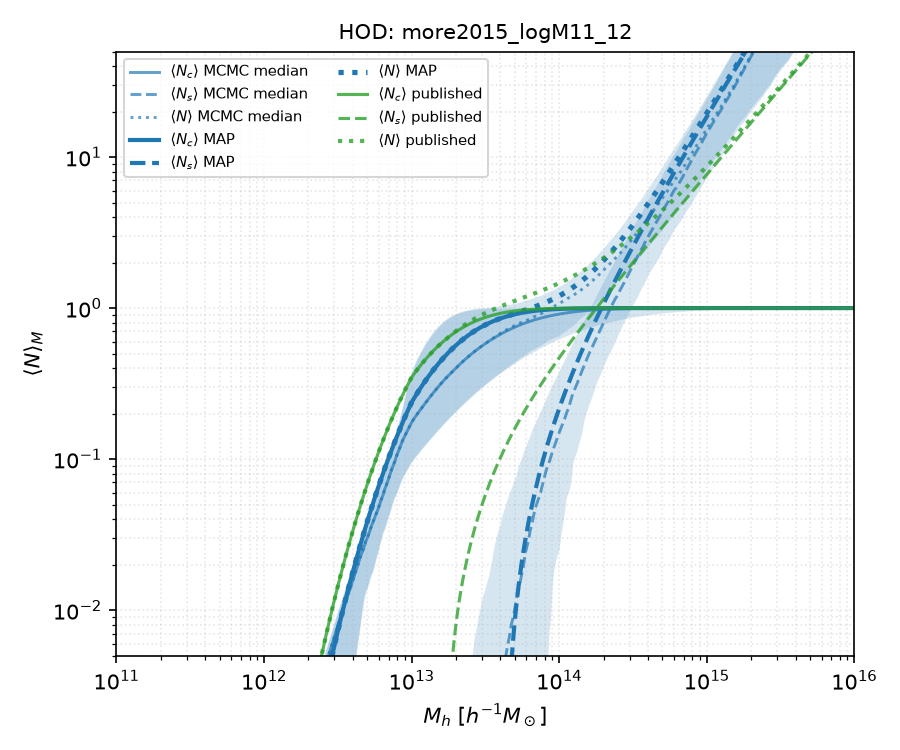
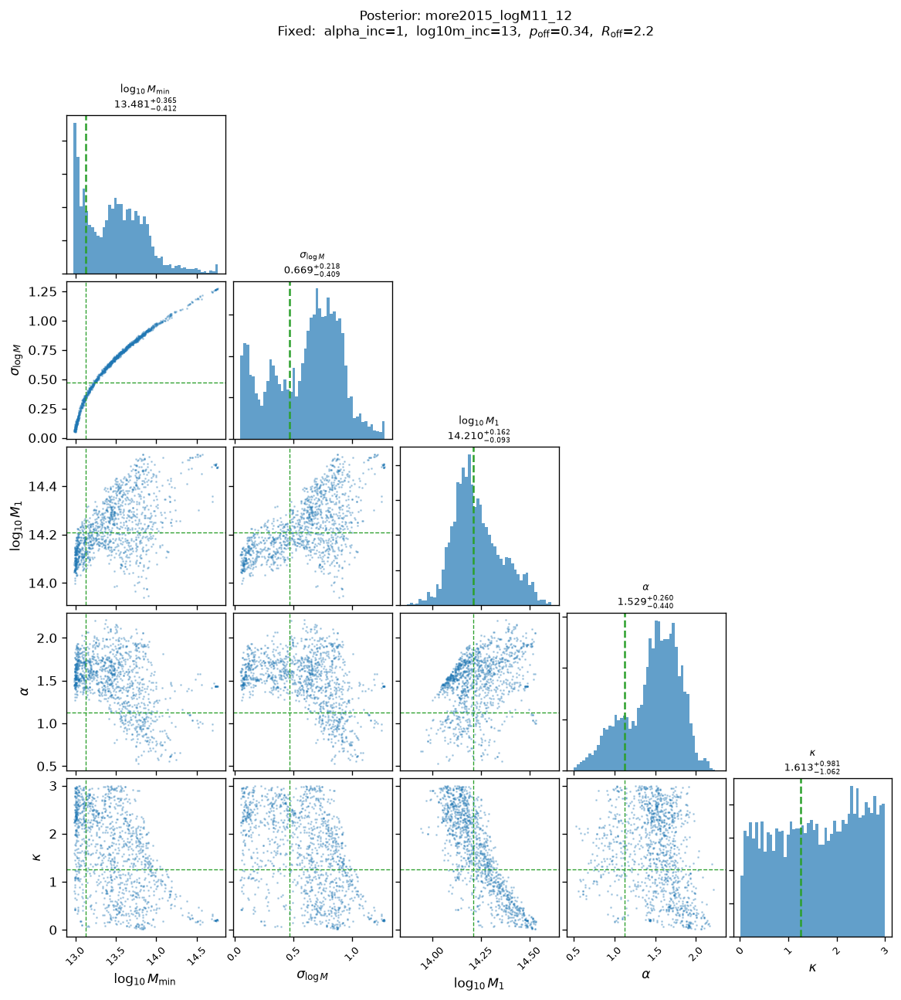
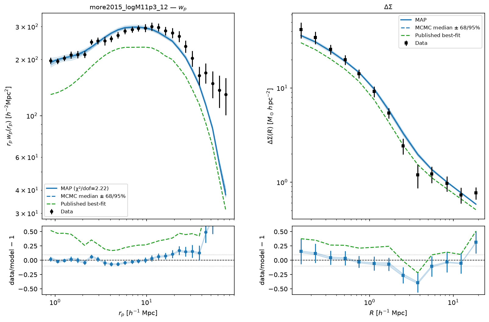
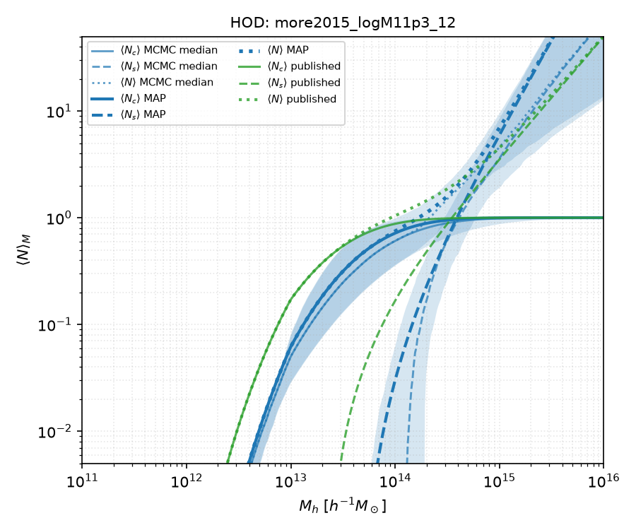
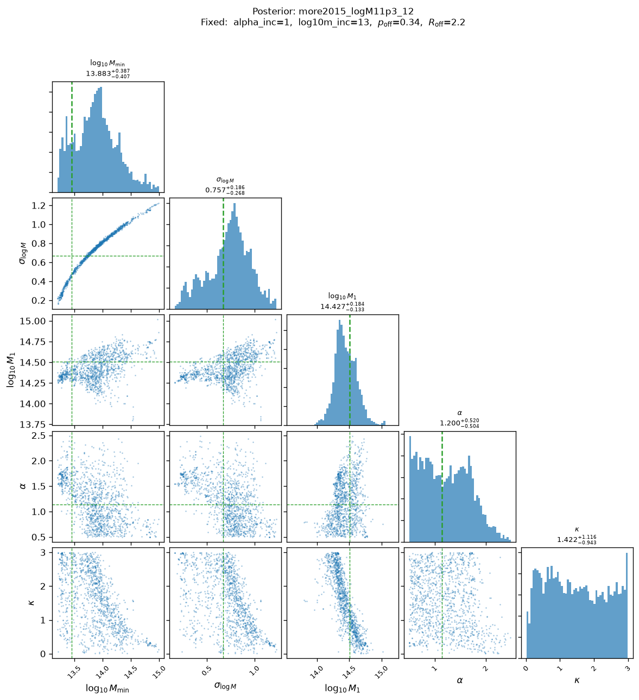
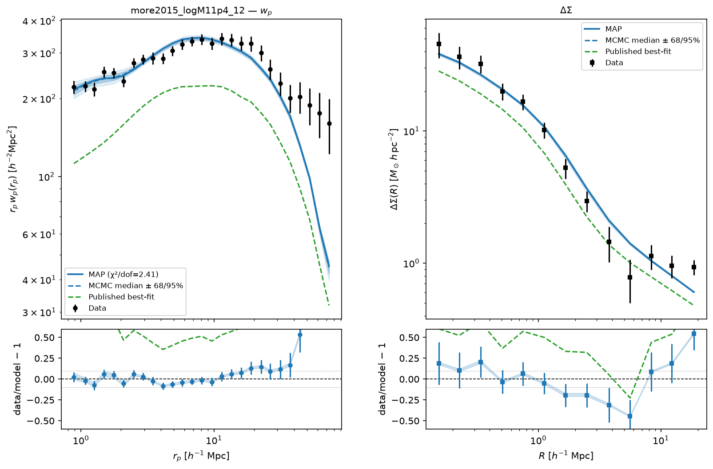
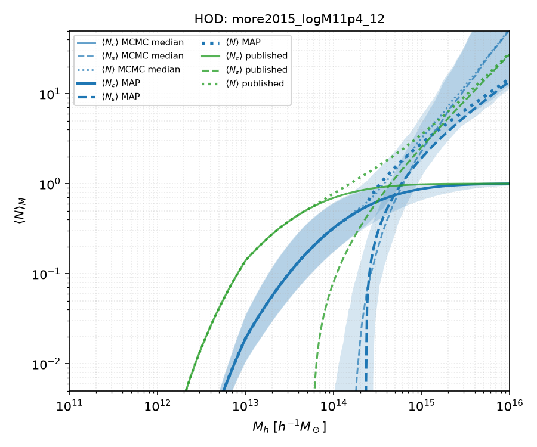
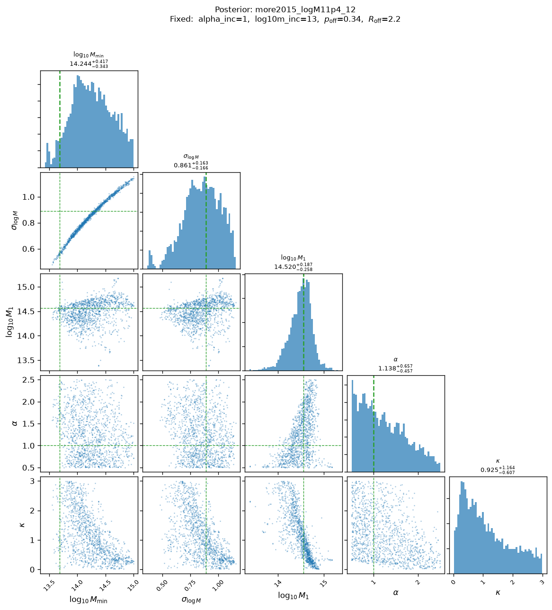
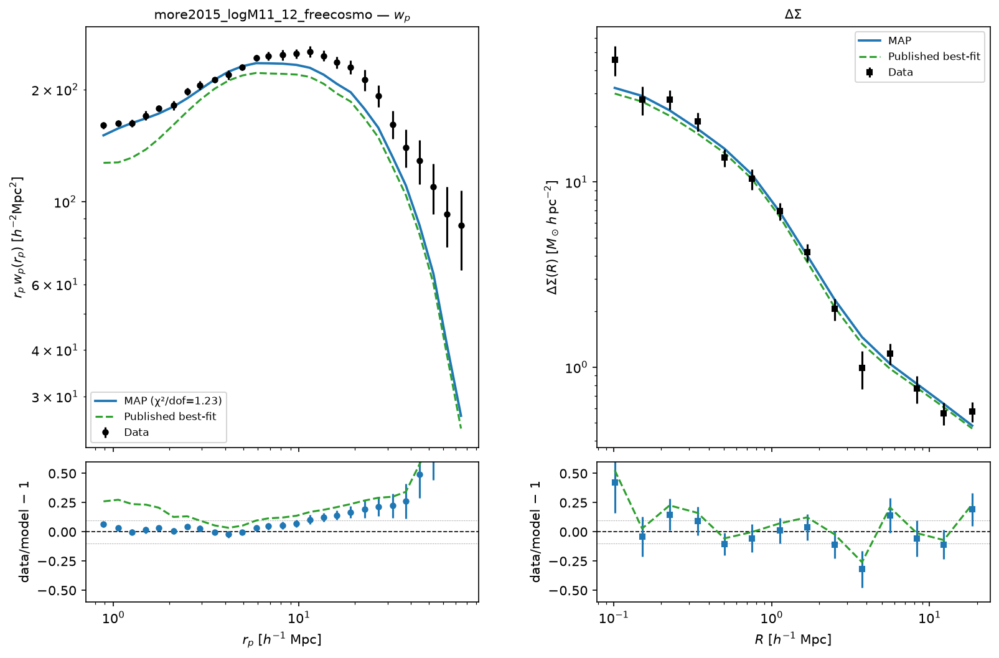
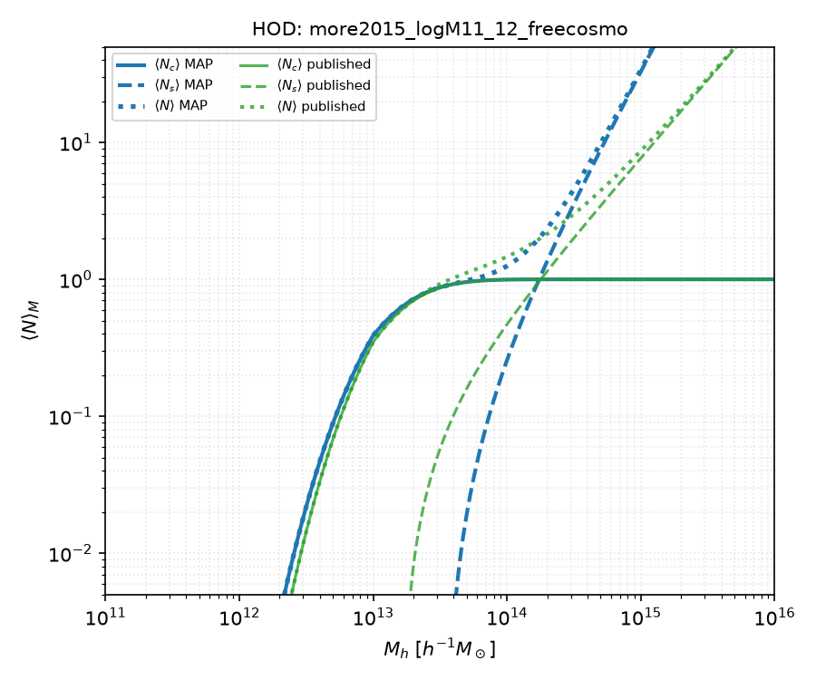

.. _benchmark_more2015:

Benchmark: More+2015 — BOSS CMASS mass-threshold samples
=========================================================

**Model class**: ``MoreHODModel`` —
More et al. 2015, ApJ 806, 2 (`arXiv:1407.1856 <https://arxiv.org/abs/1407.1856>`_),
BOSS CMASS z\ :sub:`eff` = 0.52.

All variants fit :math:`w_p(r_p)` and :math:`\Delta\Sigma(R)` jointly using the
beyond-linear halo bias correction
(:class:`~hod_mod.core.beyond_linear_bias.BeyondLinearBiasMead21`).
See the benchmark suite for the summary table.

.. admonition:: Provenance — campaign ``VTAG=v0.3``
   :class: note

   The figures and numbers on this page come from the ``VTAG=v0.3`` campaign:
   the 0.3.0 Hankel-transform fix with the linear :math:`P(k)` pinned to **CAMB**
   (``HOD_MOD_PK_BACKEND=camb``).  The package default since 0.3.1 is the
   CosmoPower-JAX emulator, so the version in the sidebar and the backend behind
   these numbers deliberately differ — see :doc:`oarsub_campaign` and
   :doc:`cosmology`.

Results
-------

.. warning:: **The Hankel fix moved these benchmarks, and three of them now fail.**

   The 0.3.0 correction to :func:`~hod_mod.core.power_spectrum._pk_to_xi`
   changed every real-space observable (:math:`w_p` by up to 19 %,
   :math:`\Delta\Sigma` by up to 20 %).  The three fixed-cosmology variants
   moved from :math:`\chi^2/\mathrm{dof} = 1.65\text{--}1.97` — reported as
   *PASSED* on this page before the re-run — to **2.22–2.72**, which
   ``run_benchmark``'s own :math:`\chi^2/\mathrm{dof} < 2` criterion scores as
   *FAILED*.  Only the free-cosmology variant still passes, at 1.225.
   The pre-fix range is given only to show the size of the shift; those values
   are superseded and must not be cited.

The tables below are generated from ``benchmark_result.json`` by
:mod:`hod_mod.scripts.benchmarks.make_benchmark_tables`, so this page and
:doc:`hod_more2015` cannot drift apart again (before the re-run they disagreed on
the primary :math:`\chi^2`/dof, on the free-cosmology :math:`\chi^2` and on the
recovered :math:`S_8`).

.. include:: _benchmark_more2015_auto.rst

----

.. _benchmark_more2015_logM11_12:

Variant: more2015\_logM11\_12 — Joint wp+ΔΣ, logM*>11.1
---------------------------------------------------------

**MoreHODModel** fit to BOSS CMASS logM*>11.1, :math:`w_p + \Delta\Sigma` jointly.
Beyond-linear halo bias (BNL) enabled.

The best-fit parameters, posterior medians and deviations for this variant
are in the generated tables under `Results`_ above.

   MAP :math:`w_p(r_p)` (top) and :math:`\Delta\Sigma(R)` (middle) vs BOSS CMASS
   logM*>11.1 data, with residuals.

   HOD occupation functions :math:`\langle N_c(M)\rangle`, :math:`\langle N_s(M)\rangle`,
   and :math:`\langle N(M)\rangle` vs halo mass.  Solid lines: MAP.
   Dashed lines + shaded bands: MCMC median and 16th–84th percentile posterior.
   Orange: published More+2015 parameters.

   MCMC posterior corner plot (32 walkers × 2000 production steps after 500 burn-in = 64 000 samples).
   Contours: 68% and 95% credible regions.  Orange lines: published More+2015 values.

----

.. _benchmark_more2015_logM11p3_12:

Variant: more2015\_logM11p3\_12 — Joint wp+ΔΣ, logM*>11.3
----------------------------------------------------------

**MoreHODModel** fit to BOSS CMASS logM*>11.3, :math:`w_p + \Delta\Sigma` jointly.
Beyond-linear halo bias (BNL) enabled.

The best-fit parameters, posterior medians and deviations for this variant
are in the generated tables under `Results`_ above.

   MAP :math:`w_p(r_p)` and :math:`\Delta\Sigma(R)` vs BOSS CMASS logM*>11.3 data.

   HOD occupation functions vs halo mass.  Solid: MAP.
   Dashed + shaded: MCMC median and 16th–84th percentile.  Orange: published values.

   MCMC posterior corner plot (32 walkers × 2000 production steps after 500 burn-in = 64 000 samples).
   Contours: 68% and 95% credible regions.  Orange lines: published More+2015 values.

----

.. _benchmark_more2015_logM11p4_12:

Variant: more2015\_logM11p4\_12 — Joint wp+ΔΣ, logM*>11.4
----------------------------------------------------------

**MoreHODModel** fit to BOSS CMASS logM*>11.4, :math:`w_p + \Delta\Sigma` jointly.
Beyond-linear halo bias (BNL) enabled.

The best-fit parameters, posterior medians and deviations for this variant
are in the generated tables under `Results`_ above.

   MAP :math:`w_p(r_p)` and :math:`\Delta\Sigma(R)` vs BOSS CMASS logM*>11.4 data.

   HOD occupation functions vs halo mass.  Solid: MAP.
   Dashed + shaded: MCMC median and 16th–84th percentile.  Orange: published values.

   MCMC posterior corner plot (32 walkers × 2000 production steps after 500 burn-in = 64 000 samples).
   Contours: 68% and 95% credible regions.  Orange lines: published More+2015 values.

----

.. _benchmark_more2015_logM11_12_freecosmo:

Variant: more2015\_logM11\_12\_freecosmo — Free cosmology
----------------------------------------------------------

Joint wp+ΔΣ fit with free :math:`\Omega_m` and :math:`S_8 = \sigma_8\sqrt{\Omega_m/0.3}`,
using Planck 2018 Gaussian priors.  Beyond-linear halo bias enabled (BNL).

.. note::
   No MCMC for this variant: the campaign ran the MAP only, so the generated
   table shows MAP values without a posterior column.  Run
   ``--mcmc --force-mcmc`` to add one.

The best-fit parameters, posterior medians and deviations for this variant
are in the generated tables under `Results`_ above.

   MAP :math:`w_p(r_p)` and :math:`\Delta\Sigma(R)` vs BOSS CMASS logM*>11.1 data
   (free :math:`\Omega_m`, :math:`S_8` cosmology).

   HOD occupation curves for the MAP free-cosmology solution.
