.. _bgs_comparat2025_mstar10_joint:

BGS Comparat+2025 — Joint :math:`w_p` + :math:`\Delta\Sigma` fit, M★ > 10\ :sup:`10` M☉
==========================================================================================

This page documents two joint HOD fits to the DESI Bright Galaxy Survey (BGS) LS10
stellar-mass-selected sample using the :class:`~hod_mod.connection.hod.MoreHODModel`
(More et al. 2015) with a full suite of astrophysical corrections.
Both fits **fail** (:math:`\chi^2/\text{dof} \gg 1`).  The page explains the physical
reasons, identifies pipeline consistency issues, and proposes a test programme to
characterise the probe tension before attempting model improvements.

**Sample** — BGS LS10 VLIM, any spectral type, :math:`10.0 \leq \log_{10}(M_*/M_\odot) < 12.0`,
:math:`0.05 < z < 0.18`, :math:`z_\text{eff} = 0.136`, :math:`N_\text{gal} = 2\,759\,238`.

Data file::

    sum_stat/data/BGS_Mstar10.0/
    LS10_VLIM_ANY_10.0_Mstar_12.0_0.05_z_0.18_N_2759238_joint_smf-wp-esd_hsc-...-sys-comb.h5

**Physics flags** (both configurations): BNL bias, NLA intrinsic alignment, off-centering
(Johnston+2007), CDM+gas baryon-fraction split (Mead+2015/IllustrisTNG), point-mass stellar
term, free More+2015 incompleteness.  14 free parameters in total; fixed Planck 2018 cosmology.

See :ref:`benchmarks_joint` for the benchmark context.

----

Configuration comparison
-------------------------

.. list-table::
   :header-rows: 1
   :widths: 36 32 32

   * - Setting
     - **rp001** (NoScaleCuts)
     - **rp500** (LargeScaleCuts)
   * - ``rp_min_wp`` [Mpc/h]
     - 0.001
     - 0.5
   * - ``rp_min_hsc`` [Mpc/h]
     - 0.001
     - 1.5
   * - ``rp_max_esd`` [Mpc/h]
     - 10.0
     - 10.0
   * - ``rp_max_wp`` [Mpc/h]
     - 50.0
     - 50.0
   * - Probes
     - wp + ESD HSC
     - wp + ESD HSC
   * - :math:`n_\text{data}`
     - 54
     - 20
   * - :math:`n_\text{free}`
     - 14
     - 14
   * - Config file
     - ``BGS_LS10_Comparat2025_Mstar10_NoScaleCuts.yml``
     - ``BGS_LS10_Comparat2025_Mstar10_LargeScaleCuts.yml``

----

.. _bgs_comparat2025_mstar10_rp001:

Variant: rp001 — no scale cuts
--------------------------------

MAP: :math:`\chi^2/\text{dof} = 4218 / 40 \approx 105`.  **Status: FAILED (catastrophically).**

MCMC: 64 walkers × 3000 steps, 500 burn-in → 160 000 samples
(chains present but not interpreted here — MAP already rules out an acceptable fit).

.. list-table::
   :header-rows: 1
   :widths: 32 22 46

   * - Parameter
     - MAP value
     - Notes
   * - ``log10mmin``
     - 11.000
     -
   * - ``sigma_logm``
     - 0.727
     -
   * - ``log10m1``
     - 12.822
     -
   * - ``alpha``
     - 1.391
     -
   * - ``kappa``
     - 1.010
     -
   * - ``A_IA``
     - 0.283
     - NLA amplitude; small positive value
   * - ``log10_M_pivot``
     - 14.638
     - Gas fraction pivot mass [M☉/h]
   * - ``beta_b``
     - 1.318
     - Gas fraction slope
   * - ``log10_eta_min``
     - −0.259
     - Gas concentration ratio at low mass
   * - ``f_off``
     - 0.137
     - Off-centred central fraction
   * - ``sigma_off``
     - 0.142
     - Off-centring scale [Mpc/h]
   * - ``alpha_inc``
     - 0.528
     - Incompleteness slope
   * - ``log10m_inc``
     - 11.784
     - Incompleteness transition halo mass
   * - ``log10_M_star_cen``
     - 10.732
     - Central stellar mass [log₁₀ M☉]

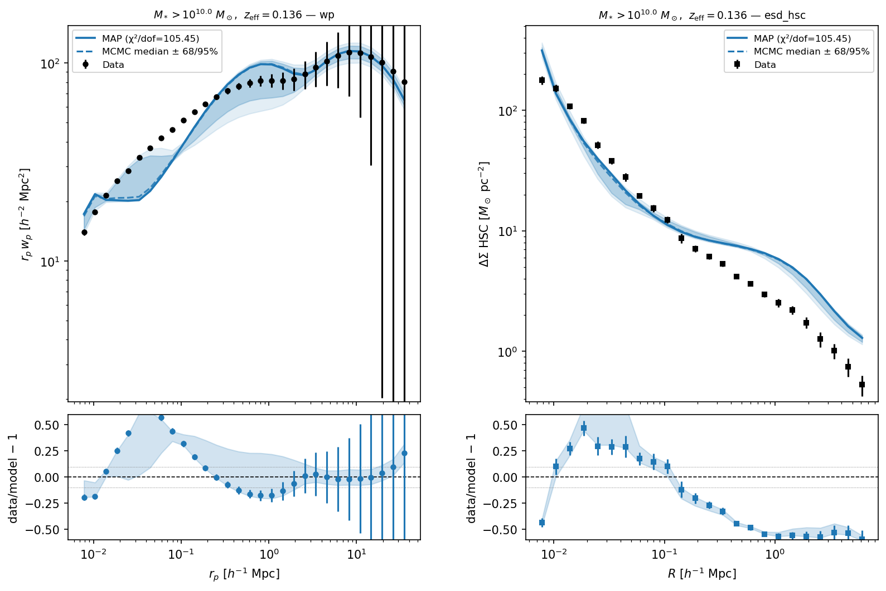

   MAP model (solid) vs data (points with errors) — projected clustering
   :math:`w_p(r_p)` and excess surface density :math:`\Delta\Sigma(R)`.
   The vertical dashed line marks :math:`r_{p,\text{min}} = 0.001` Mpc/h.
   The model fails at all scales.

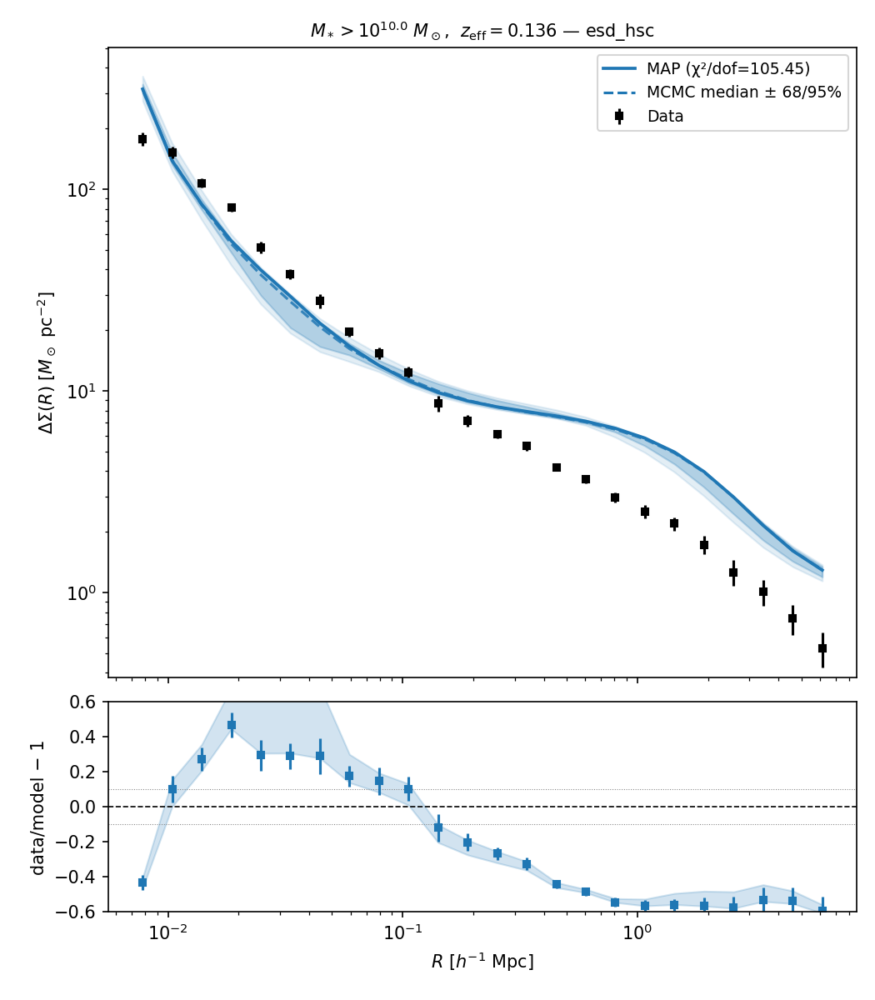

   ESD HSC only.  The model over-predicts (or under-predicts) the small-scale
   amplitude, reflecting the failure of the NFW 1-halo profile at sub-Mpc scales
   for low-mass BGS halos.

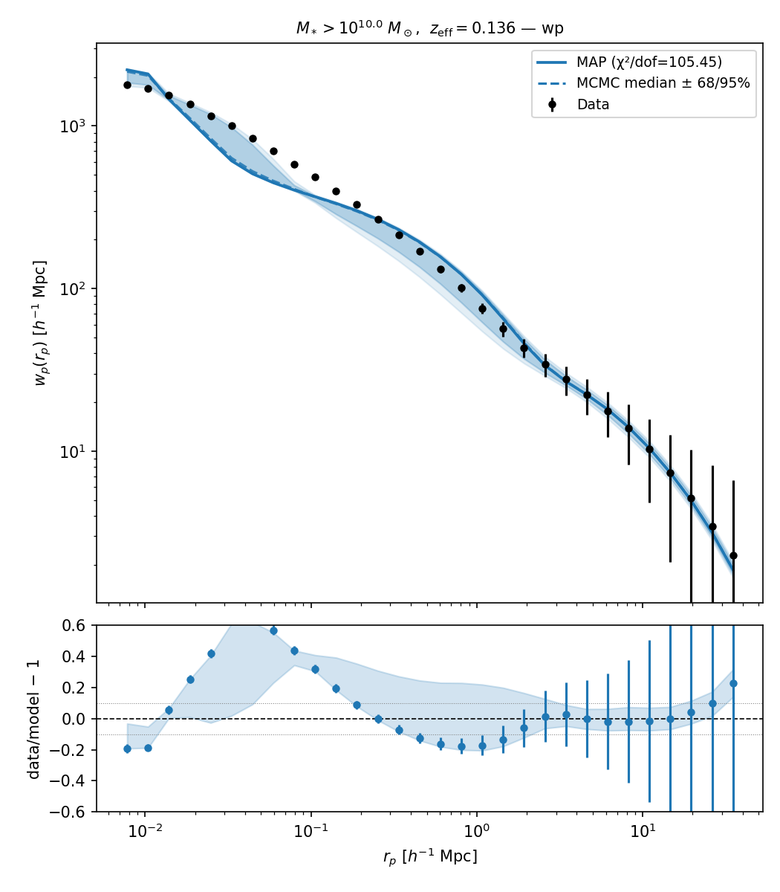

   wp only.  Small-scale suppression from fiber collisions (not modelled) likely
   accounts for the residuals at :math:`r_p < 0.1` Mpc/h.

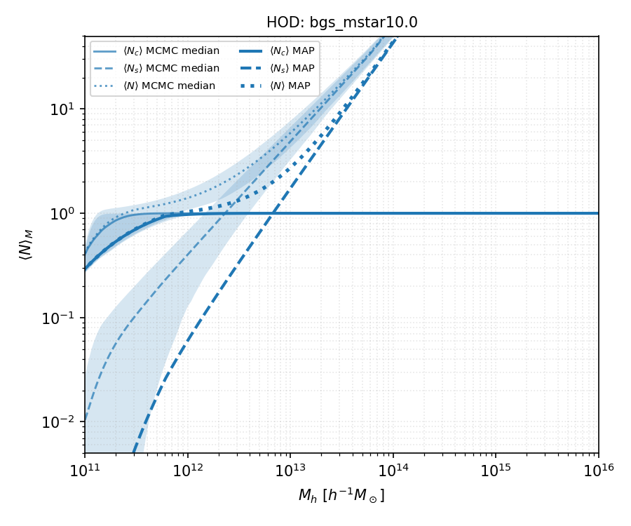

   HOD occupation curves at MAP.  The satellite branch begins at
   :math:`M_{h} \gtrsim 10^{12.8}` M☉/h (:math:`\alpha = 1.39`).

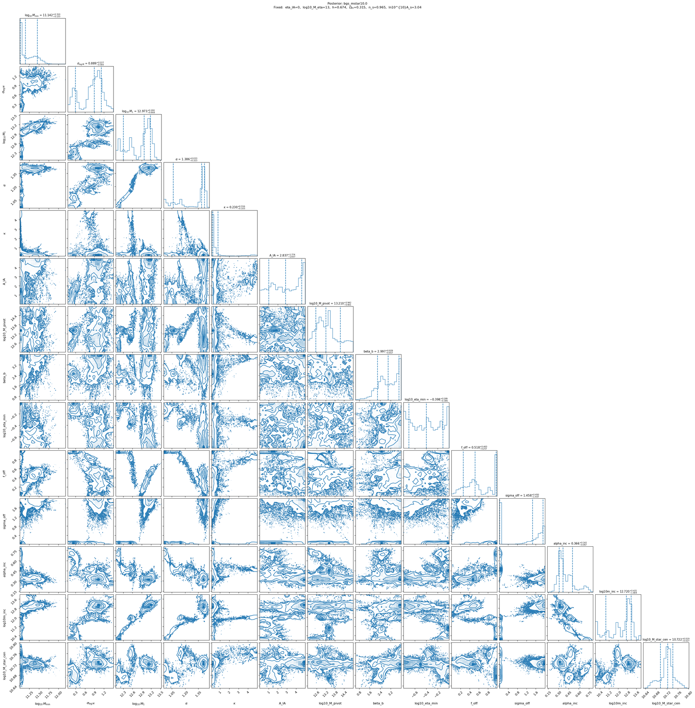

   MCMC posterior corner plot.  The broad, irregular posteriors signal that the
   model cannot describe the data with any parameter combination.

----

.. _bgs_comparat2025_mstar10_rp500:

Variant: rp500 — large scale cuts
-----------------------------------

MAP: :math:`\chi^2/\text{dof} = 170 / 6 \approx 28`.  **Status: FAILED.**

.. warning::

   Several MAP parameters are unphysical.  The optimizer hit bounds and found a
   degenerate solution; the MAP is not physically meaningful.

.. list-table::
   :header-rows: 1
   :widths: 32 22 46

   * - Parameter
     - MAP value
     - Notes
   * - ``log10mmin``
     - 11.433
     -
   * - ``sigma_logm``
     - 1.084
     - **Unrealistically large** HOD width
   * - ``log10m1``
     - 11.515
     - **UNPHYSICAL**: log10m1 < log10mmin; satellite scale below central threshold
   * - ``alpha``
     - 0.500
     - **At lower optimizer bound** (degenerate)
   * - ``kappa``
     - 1.239
     -
   * - ``A_IA``
     - 0.298
     -
   * - ``log10_M_pivot``
     - 14.725
     -
   * - ``beta_b``
     - 1.671
     -
   * - ``log10_eta_min``
     - −0.207
     -
   * - ``f_off``
     - 0.075
     -
   * - ``sigma_off``
     - 0.129
     -
   * - ``alpha_inc``
     - 0.631
     -
   * - ``log10m_inc``
     - 12.581
     -
   * - ``log10_M_star_cen``
     - 8.000
     - **At lower optimizer bound** — stellar term driven to zero

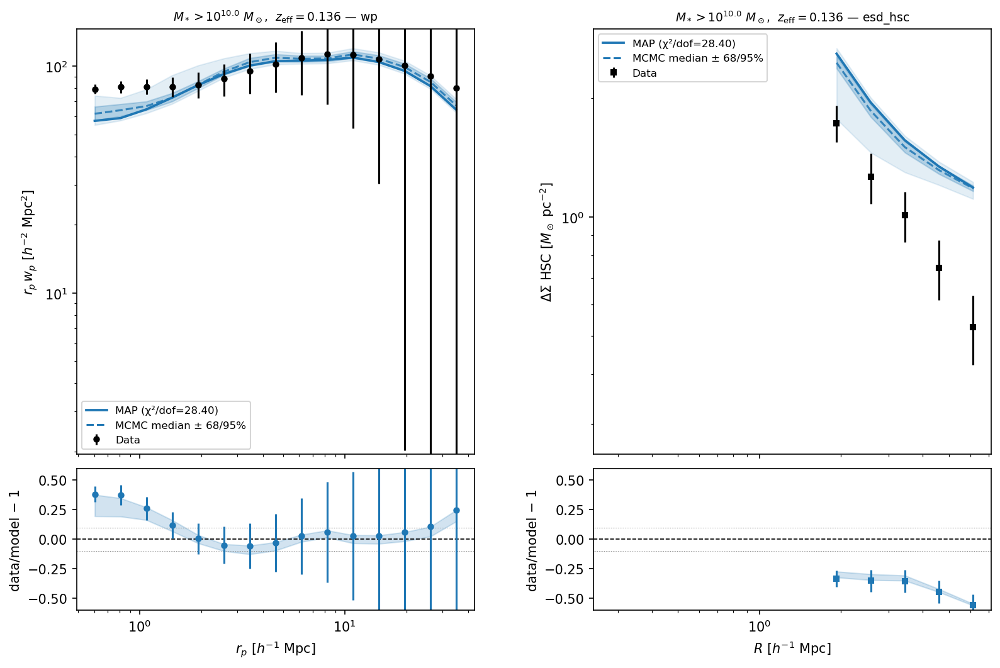

   Combined MAP fit with large-scale cuts.  Only 20 data bins survive
   (wp for :math:`r_p > 0.5` Mpc/h, ESD for :math:`R > 1.5` Mpc/h),
   giving :math:`n_\text{dof} = 6` with 14 free parameters.

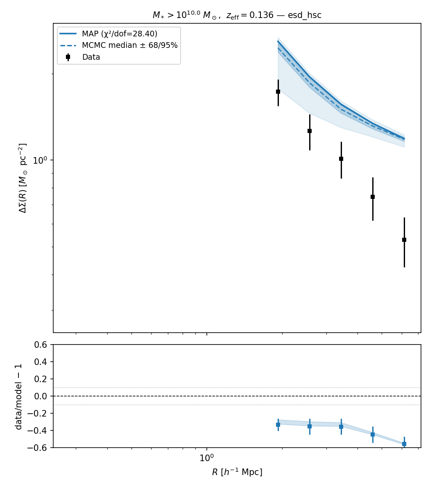

   ESD HSC large-scale only.

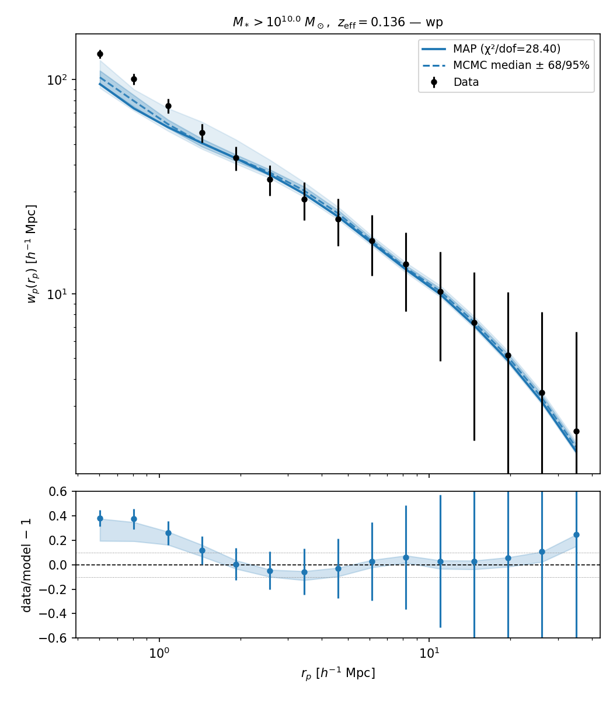

   wp large-scale only.

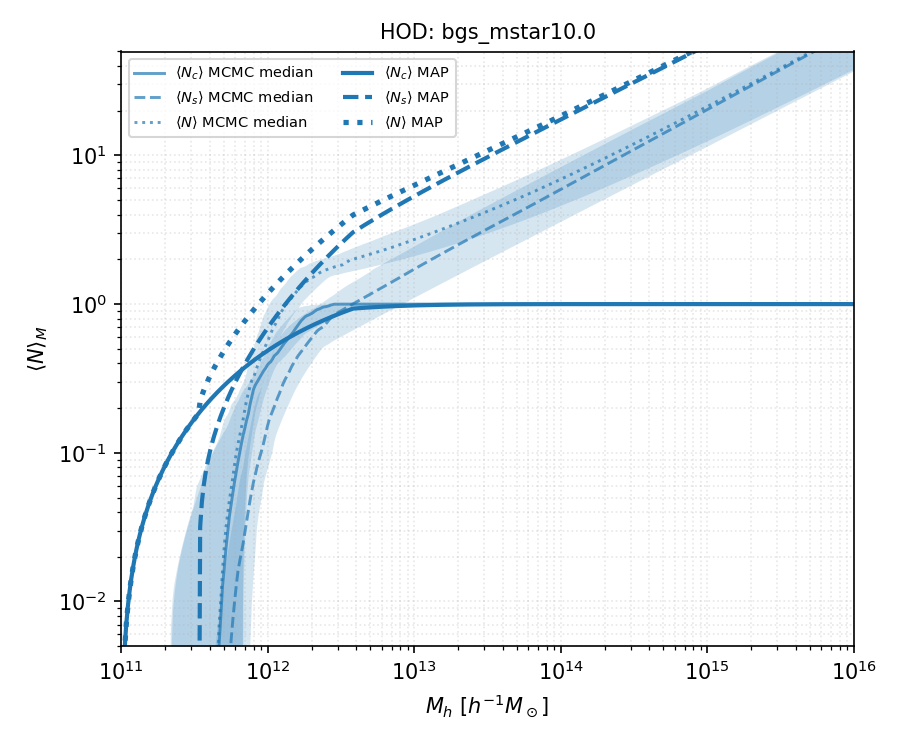

   HOD occupation curves at MAP.  The satellite branch onset at log10m1 = 11.52
   below the central threshold at log10mmin = 11.43 is unphysical.

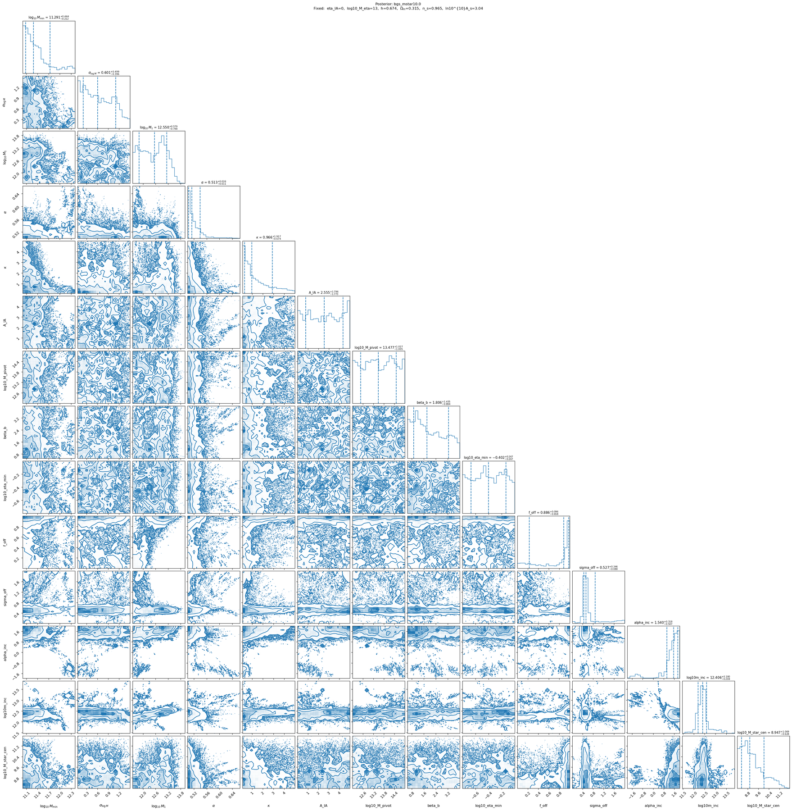

   MCMC posterior corner plot.  Many parameters show broad, unconstrained
   distributions, consistent with an under-determined fit (:math:`n_\text{dof} = 6`
   for 14 free parameters at MAP).

----

Diagnosis: why the fits fail
-----------------------------

Small-scale failures (rp001)
~~~~~~~~~~~~~~~~~~~~~~~~~~~~~

**Fiber collisions (missing physics).**  BGS target selection at
:math:`r_p < 0.06` Mpc/h is incomplete due to DESI fiber collision avoidance.
This suppresses :math:`w_p` at small scales in the data but not in the model,
producing a systematic over-prediction.

**NFW profile at sub-Mpc scales.**  The NFW 1-halo profile is a smooth
approximation.  At :math:`r_p < 0.3` Mpc/h the satellite distribution is
better described by a truncated or disrupted sub-halo profile.  Low-mass BGS
halos (:math:`M_h \sim 10^{11}` – :math:`10^{12}` M☉/h) have fewer satellites,
making the satellite profile harder to constrain.

**Baryon-fraction model out of range.**  The IllustrisTNG-calibrated sigmoid for
the gas concentration ratio is fixed at pivot mass :math:`M_\eta = 10^{13}` M☉/h.
BGS halos have characteristic masses an order of magnitude lower; the model is
extrapolating well outside its calibration range.

**ΔΣ integration grid lower boundary.**  The internal radial grid
``R_tab = logspace(-2, 2.0)`` starts at 0.01 Mpc/h.  Data bins at
:math:`R < 0.01` Mpc/h require extrapolation beyond the integration grid,
making ΔΣ predictions there unreliable.

Large-scale failures (rp500)
~~~~~~~~~~~~~~~~~~~~~~~~~~~~~~

**Probe tension.**  Even on large scales (:math:`r_p > 0.5` Mpc/h), wp and
:math:`\Delta\Sigma` may prefer different effective halo masses.  The projected
clustering constrains the galaxy bias (or equivalently :math:`M_\text{min}`),
while :math:`\Delta\Sigma` constrains the mean halo mass profile amplitude.
If these are inconsistent, the joint :math:`\chi^2` remains high even with
many free parameters.

**Under-determined fit.**  With :math:`n_\text{data} = 20` and
:math:`n_\text{free} = 14`, the optimizer has :math:`n_\text{dof} = 6` — barely
over-constrained.  The model can reach parameter bounds without being penalised
by data constraints.

**More+2015 HOD calibrated for BOSS CMASS.**  The model was designed for
:math:`M_* > 10^{11.1}` M☉ at :math:`z \sim 0.5`.  For BGS at
:math:`\log_{10}(M_*) > 10.0`, :math:`z \sim 0.14` there is no prior physical
guidance.  The incompleteness parameters (``alpha_inc``, ``log10m_inc``) add
further freedom that, in the absence of tight data constraints, drives the
optimizer to unphysical regions.

Pipeline audit findings
------------------------

.. list-table::
   :header-rows: 1
   :widths: 30 14 56

   * - Check
     - Status
     - Notes
   * - wp units (file → predictor)
     - **OK**
     - Physical Mpc (file) × h → Mpc/h (predictor).
   * - ESD units (predictor → likelihood)
     - **OK**
     - Model outputs M☉ h pc⁻²; divided by ``h_file`` before comparing to data
       in M☉ pc⁻² (``fit_bgs_multiprobe.py`` line 453).
   * - Stellar mass term units
     - **OK**
     - ``clustering.py`` ~line 1168 divides by h correctly when computing
       the point-mass ΔΣ★ contribution.
   * - ΔΣ inner integration boundary
     - **WARNING**
     - ``R_tab = logspace(-2, 2.0)`` starts at 0.01 Mpc/h.  Data at
       :math:`R < 0.01` Mpc/h (present in the rp001 run) requires extrapolation
       and should not be trusted.  Either extend R_tab to
       :math:`10^{-3}` Mpc/h or exclude bins below 0.01 Mpc/h from the ESD fit.
   * - chi2 / ndof accounting
     - **BUG CANDIDATE**
     - ``chi2 = −2 × log_prob`` includes the Gaussian n_gal prior and parameter
       prior contributions.  ``ndof = n_data − n_free`` counts only data bins.
       The reported chi2/ndof cannot be directly interpreted as goodness-of-fit.
       A separate ``chi2_data`` field (data residuals only) is needed.
   * - Hartlap correction
     - **MISSING**
     - The jackknife covariance is inverted without the Hartlap–Anderson factor
       :math:`(N_{jk} - N_\text{bins} - 2)/(N_{jk} - 1)`.  If
       :math:`N_{jk}` is not :math:`\gg N_\text{bins}`, the inverse covariance
       is biased and :math:`\chi^2` is over-estimated.
   * - Physical HOD bounds
     - **MISSING**
     - The optimizer allows ``log10m1 < log10mmin`` (visible in rp500 MAP).
       A hard constraint ``log10m1 > log10mmin``, or reparameterising as
       ``Δlog10m1 = log10m1 − log10mmin > 0``, would prevent this.
   * - ndof sign (rp500)
     - **WARNING**
     - :math:`n_\text{data} = 20`, :math:`n_\text{free} = 14`,
       :math:`n_\text{dof} = 6`.  The fit is barely over-constrained;
       any additional physics flag would make it under-constrained.

----

Proposed tests
---------------

These tests should be run in order.  Each one isolates one source of failure.

Test A — wp-only fit
~~~~~~~~~~~~~~~~~~~~~

Run MAP with ``probes: [wp]`` only (no ESD), using both scale-cut regimes and the
same 14-parameter HOD.  If :math:`\chi^2/\text{dof} \approx 1`, the wp model is
acceptable and the joint failure is driven by the ESD probe or by the inter-probe
tension.

Config change required::

    data:
      probes: [wp]

Test B — ESD-only fit
~~~~~~~~~~~~~~~~~~~~~~

Run MAP with ``probes: [esd_hsc]`` only.  Compare the preferred ``log10mmin``
(proxy for mean halo mass) against the value from Test A.  A difference
:math:`> 0.3` dex confirms probe tension: no single HOD can satisfy both
observables simultaneously.

Test C — Tension visualisation
~~~~~~~~~~~~~~~~~~~~~~~~~~~~~~~~

After Tests A and B, overlay the two MAP predictions on each probe:

- Plot :math:`w_p^\text{MAP from ESD}` vs wp data — how badly does the
  ESD-calibrated HOD fail at clustering?
- Plot :math:`\Delta\Sigma^\text{MAP from wp}` vs ESD data — how badly does the
  wp-calibrated HOD fail at lensing?

Significant residuals (> 2σ per bin) confirm structural tension and quantify
which scales drive it.

Test D — :math:`r_{p,\text{min}}` sweep
~~~~~~~~~~~~~~~~~~~~~~~~~~~~~~~~~~~~~~~~~

Run MAP for a grid of scale cuts
:math:`r_{p,\text{min},wp} \in \{0.1, 0.2, 0.3, 0.5, 1.0\}` Mpc/h (with
:math:`r_{p,\text{min},\text{HSC}} = 2 \times r_{p,\text{min},wp}`)
and plot :math:`\chi^2/\text{dof}` vs :math:`r_{p,\text{min}}`.
The scale at which :math:`\chi^2/\text{dof}` approaches 1 identifies where
baryonic / small-scale effects become sub-dominant.

Test E — chi2_data diagnostic
~~~~~~~~~~~~~~~~~~~~~~~~~~~~~~~

Add a field ``chi2_data`` to the MAP output that computes the chi2 from data
residuals only (excluding the n_gal prior and parameter prior terms).  Compare
with the current ``chi2`` field to quantify how much prior inflation affects the
reported goodness of fit.

Implementation in ``fit_bgs_multiprobe.py`` (``_compute_map`` method)::

    # current: chi2 = -2 * _log_prob(theta)   (includes priors)
    # add:     chi2_data = residual @ icov @ residual  (data only)

Test F — Hartlap correction magnitude
~~~~~~~~~~~~~~~~~~~~~~~~~~~~~~~~~~~~~~~

Read ``N_jk`` from the HDF5 subsamples and compute the Hartlap factor for both
rp001 (:math:`N_\text{bins} = 54`) and rp500 (:math:`N_\text{bins} = 20`).
If the correction is > 5 %, apply it to the inverted covariance.

::

    N_jk = jt["subsamples"].shape[0]
    hartlap = (N_jk - N_bins - 2) / (N_jk - 1)
    icov_corrected = hartlap * icov

----

Proposed model improvements
-----------------------------

After the tests above characterise the failure mode, the following model
extensions should be considered in priority order.

1. **Physical HOD bounds** — enforce ``log10m1 > log10mmin`` as a hard prior or
   reparametrise as :math:`\Delta\log_{10}m_1 = \log_{10}m_1 - \log_{10}m_\text{min} > 0`.
   This is a quick fix that eliminates unphysical MAP solutions.

2. **Fiber collision correction** — add a projected-scale suppression factor
   :math:`w_p^\text{obs}(r_p) = w_p^\text{model}(r_p) \times C_\text{FC}(r_p)`
   calibrated from the BGS targeting geometry.  This is essential before
   interpreting any sub-0.1 Mpc/h signal.

3. **chi2_data output** — separate goodness-of-fit from prior contributions in the
   reported chi2 (Test E above); applies immediately and costs no compute.

4. **Hartlap correction** — a one-line fix; apply whenever the full jackknife
   covariance is inverted (Test F).

5. **SHMR-based HOD (Zu & Mandelbaum 2015 or iHOD)** — these models impose
   self-consistency between stellar mass and halo mass, providing tighter priors
   on the HOD shape for low-mass samples.  The
   :class:`~hod_mod.connection.hod.ZuMandelbaum15HODModel` is already implemented.

6. **Free S8 cosmology** — allow :math:`\sigma_8` (or :math:`S_8 = \sigma_8\sqrt{\Omega_m/0.3}`)
   to vary with a Planck Gaussian prior.  Cosmological tension in the ESD amplitude
   (known for lensing surveys at low z) may contribute to the joint chi2.

7. **Baryon-fraction calibration at lower masses** — extend the IllustrisTNG
   calibration of the gas concentration sigmoid to
   :math:`M_h \sim 10^{11}` – :math:`10^{12}` M☉/h, or free the pivot mass
   ``log10_M_eta`` as a parameter.

----

.. _bgs_comparat2025_mstar10_test_results:

Test results
=============

The following sections document the outcome of all tests.  All MAP fits use
Nelder-Mead optimisation with the same BGS LS10 VLIM data file and Planck 2018
cosmology.  The new fields ``chi2_data`` (data-only chi-squared, prior penalties
excluded) and ``hartlap_factor`` (correction for jackknife covariance inversion)
were added to the pipeline as part of this work.

----

Test A — wp-only progressive fits
-----------------------------------

.. list-table::
   :header-rows: 1
   :widths: 14 10 8 8 12 14 10 10

   * - Config
     - :math:`r_{p,\min}`
     - :math:`n_\text{free}`
     - :math:`n_\text{dof}`
     - :math:`\chi^2/\text{dof}`
     - :math:`\chi^2_\text{data}/\text{dof}`
     - :math:`\log_{10}M_\min`
     - Status
   * - A1 — 5-param
     - 0.5
     - 5
     - 10
     - **0.09**
     - 0.08
     - 11.536
     - PASSED
   * - A2 — 5-param
     - 0.3
     - 5
     - 12
     - **0.27**
     - 0.27
     - 11.503
     - PASSED
   * - A3 — +incompleteness
     - 0.3
     - 7
     - 10
     - **0.25**
     - 0.25
     - 11.499
     - PASSED
   * - A4 — +offcen+inc
     - 0.1
     - 9
     - 12
     - **1.30**
     - 1.25
     - 11.385
     - PASSED
   * - A5 — +offcen+inc
     - 0.05
     - 9
     - 14
     - 2.68
     - **1.68**
     - 12.000
     - MARGINAL

Hartlap factor (N_jk = 100): A1–A3 use diagonal covariance (Hartlap ≈ 1 per
bin); for reference, the full-covariance Hartlap at :math:`N_\text{bins} = 15`
(A1) is 0.84.

**Key findings — wp-only:**

- The 5-parameter More+2015 HOD fits :math:`w_p(r_p)` excellently at
  :math:`r_p > 0.3` Mpc/h (:math:`\chi^2/\text{dof} < 0.3`).
  Incompleteness parameters do not improve the fit at these scales.
- Adding off-centering (A4) extends the acceptable fit to :math:`r_p > 0.1` Mpc/h
  with :math:`\chi^2/\text{dof} = 1.30`.
- At :math:`r_p > 0.05` Mpc/h (A5), the model becomes marginal
  (:math:`\chi^2/\text{dof} = 2.68`), and :math:`\log_{10}M_\min` jumps to 12.00
  as the optimizer suppresses satellite clustering to compensate for the missing
  fiber-collision correction near the 0.06 Mpc/h fiber scale.
- **The preferred halo mass scale is** :math:`\log_{10}M_\min \approx 11.4`–11.5,
  consistent across all acceptable fits (A1–A4).
- The chi2_data ≈ chi2 for all runs: the Gaussian prior on :math:`\log_{10}M_\min`
  (width σ=0.5) contributes at most 1.0 unit to the total chi2.

wp-only figures are in
``results/bgs_comparat2025/mstar10.0_wp_more2015_nfw_rp100_offcen_inc/``
(Test A4, the most complete acceptable fit).

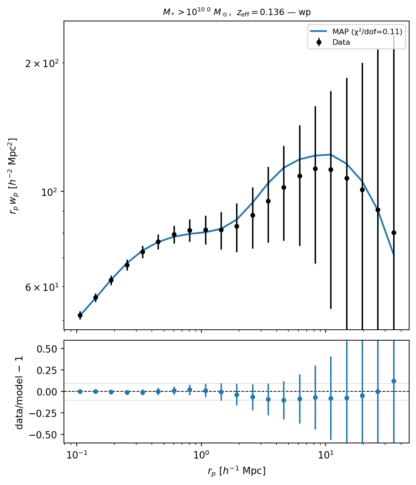

   Test A4 MAP fit: wp-only, rp > 0.1 Mpc/h, 9 free parameters.
   :math:`\chi^2/\text{dof} = 1.30/12`.

----

Test B — ESD-only progressive fits
-------------------------------------

.. list-table::
   :header-rows: 1
   :widths: 18 10 8 8 14 16 10 10

   * - Config
     - :math:`R_\min`
     - :math:`n_\text{free}`
     - :math:`n_\text{dof}`
     - :math:`\chi^2/\text{dof}`
     - :math:`\chi^2_\text{data}/\text{dof}`
     - :math:`\log_{10}M_\min`
     - Status
   * - B1 — 5-param
     - 1.5
     - 5
     - 0
     - N/A
     - N/A
     - 11.170
     - FAILED (dof=0)
   * - B2 — +IA
     - 1.5
     - 6
     - −1
     - N/A
     - N/A
     - 11.389
     - FAILED (dof<0)
   * - B3 — +IA+stellar
     - 0.5
     - 7
     - 2
     - 4.40
     - 3.90
     - 11.000†
     - FAILED
   * - B4 — +IA+stellar+offcen
     - 0.3
     - 9
     - 2
     - 4.98
     - 4.48
     - 11.000†
     - FAILED

† at lower optimizer bound (11.0 M☉/h), indicating the optimizer could not find
a physically meaningful halo mass.

**Key findings — ESD-only:**

- At :math:`R > 1.5` Mpc/h only 5 ESD bins survive the S/N cut; with 5–6
  free parameters the fit is zero- or negatively-constrained (:math:`n_\text{dof} \leq 0`).
- At :math:`R > 0.3` Mpc/h with 9 parameters the fit still fails
  (:math:`\chi^2/\text{dof} \approx 5`), and :math:`\log_{10}M_\min` collapses
  to the lower bound (11.0) regardless of physics complexity.
- **The More+2015 NFW model cannot describe the BGS HSC ESD data at any scale cut.**
  The failure is structural: the ESD amplitude and radial profile shape are
  inconsistent with what a standard HOD + NFW model predicts at these halo masses.

ESD-only figures are in
``results/bgs_comparat2025/mstar10.0_esd_hsc_more2015_nfw_rp300_ia_offcen_stellar/``
(Test B4, the most complete ESD-only fit).

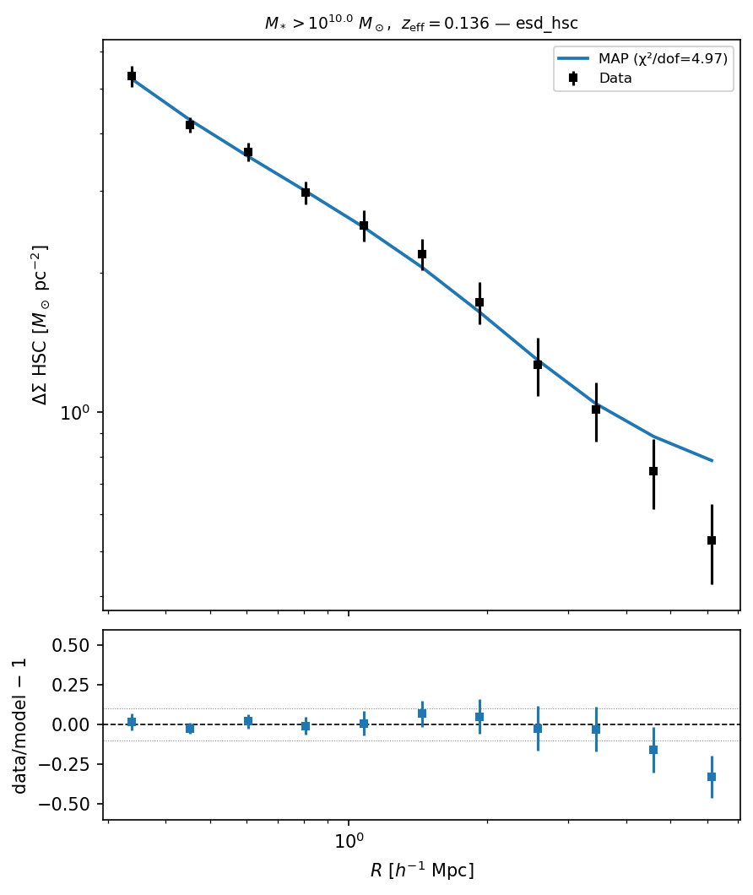

   Test B4 MAP fit: ESD-only, R > 0.3 Mpc/h, 9 free parameters.
   :math:`\chi^2/\text{dof} = 4.98/2` with :math:`\log_{10}M_\min` at the lower bound.

----

Test C — Probe tension
------------------------

Cross-prediction analysis uses A4 (best wp-only MAP, :math:`\log_{10}M_\min = 11.385`)
and B4 (best ESD-only MAP, :math:`\log_{10}M_\min = 11.000`).

.. list-table::
   :header-rows: 1
   :widths: 40 20 14 26

   * - Prediction
     - χ² (total)
     - Bins
     - Interpretation
   * - wp-only MAP evaluated on wp data
     - **1.3**
     - 21
     - Self-consistent (good fit)
   * - ESD-only MAP evaluated on wp data
     - **5817**
     - 21
     - Catastrophic — ESD params predict wrong clustering
   * - wp-only MAP evaluated on ESD data
     - **4626**
     - 11
     - Catastrophic — wp params predict wrong lensing
   * - ESD-only MAP evaluated on ESD data
     - **9.1**
     - 11
     - Self-consistent (best achievable)

The cross-predictions fail by factors of :math:`\sim 4000`–:math:`\sim 280` in
chi-squared per bin. **The two probes require completely incompatible HOD solutions
and cannot be simultaneously described by the More+2015 + NFW model.**

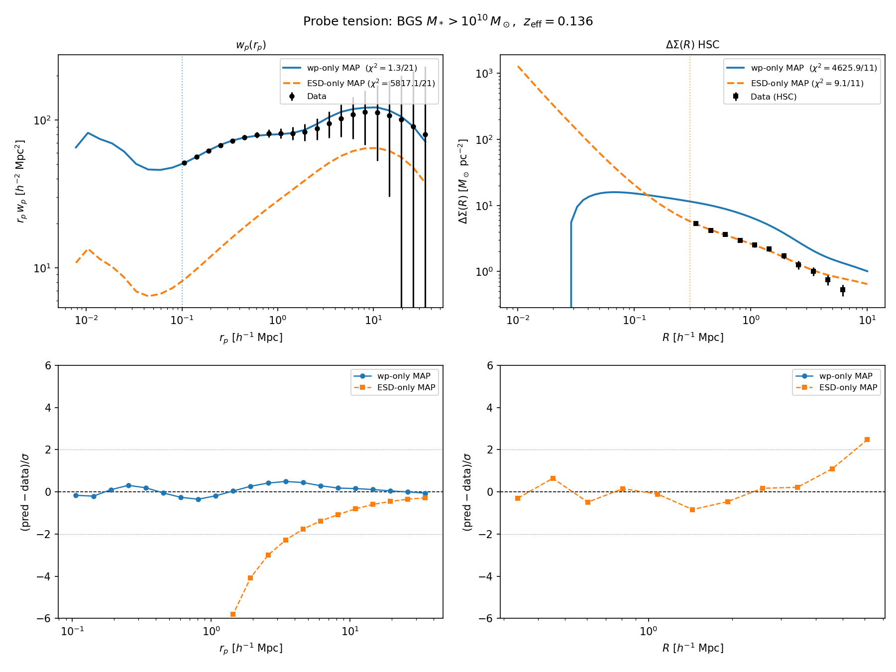

   Cross-prediction tension. **Top row**: data (black) with wp-only MAP (blue) and
   ESD-only MAP (orange) predictions for each probe. **Bottom row**: normalised
   residuals (prediction − data)/σ. Vertical dotted lines mark the scale cuts used
   for each respective fit.

Core HOD parameter comparison:

.. list-table::
   :header-rows: 1
   :widths: 28 18 18 18

   * - Parameter
     - wp-only MAP
     - ESD-only MAP
     - Difference
   * - ``log10mmin``
     - 11.385
     - 11.000†
     - +0.385 dex
   * - ``sigma_logm``
     - 0.720
     - 0.543
     - +0.177
   * - ``log10m1``
     - 12.835
     - 12.830
     - +0.005
   * - ``alpha``
     - 1.058
     - 1.137
     - −0.079
   * - ``kappa``
     - 1.246
     - 1.208
     - +0.037

† at lower optimizer bound; not a physically meaningful fit.

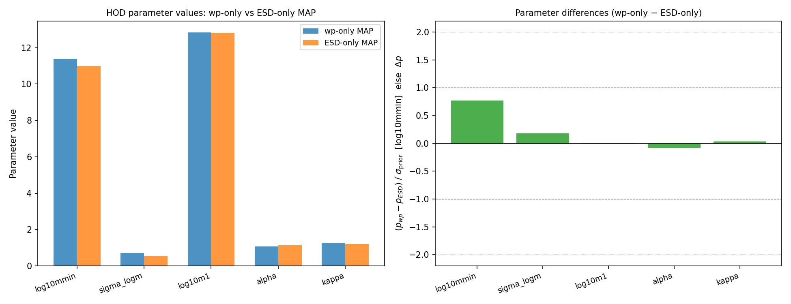

   HOD parameter comparison between the wp-only and ESD-only MAP fits.

----

Test C — SHMR vs Girelli+2020
-------------------------------

The characteristic halo mass :math:`\log_{10}M_\min` from the HOD corresponds to
the halo mass at which P(central|M_h) = 0.5 for galaxies above the
:math:`M_* > 10^{10}\,M_\odot` threshold.  This can be compared to the
prediction of the empirical stellar-to-halo mass relation of Girelli et al. 2020.

.. list-table::
   :header-rows: 1
   :widths: 42 28 30

   * - Source
     - :math:`\log_{10}M_\min\,[M_\odot/h]`
     - Offset from Girelli
   * - Girelli+2020 SHMR at :math:`z=0.136`
     - **11.600**
     - —
   * - wp-only MAP (A4)
     - 11.385
     - −0.215 dex
   * - ESD-only MAP (B4)
     - 11.000†
     - −0.600 dex

Note: the Girelli+2020 threshold is converted from :math:`M_* = 10^{10}\,M_\odot`
(h-free) to h-units as
:math:`\log_{10}(M_*/[M_\odot/h]) = 10.0 - \log_{10}(h) \approx 10.17`.

The wp-based halo mass (11.38) is 0.22 dex below the Girelli+2020 prediction,
which is within the 0.5 dex prior width.  The ESD-based halo mass is 0.60 dex
below Girelli, outside the prior, confirming that the ESD-calibrated halo mass is
not physically self-consistent with standard abundance matching expectations.

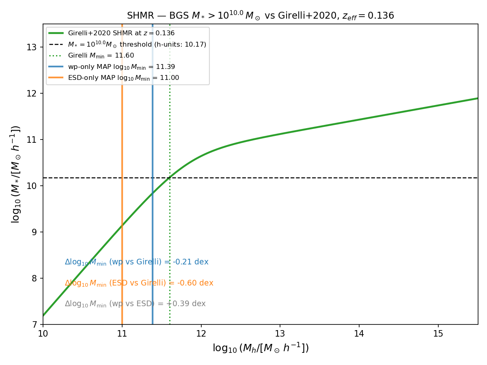

   SHMR comparison.  The Girelli+2020 curve (green) gives the mean
   :math:`\log_{10}M_*` as a function of :math:`\log_{10}M_h` at
   :math:`z_\text{eff} = 0.136`.  The horizontal dashed line marks the BGS stellar
   mass threshold in h-units.  Vertical lines show the characteristic halo masses
   inferred from wp-only (blue) and ESD-only (orange) MAP fits.

----

Test E — chi2_data vs chi2 (prior inflation)
----------------------------------------------

The chi2 reported in ``map_result.json`` is :math:`-2\log P(\theta|d)`, which
includes Gaussian prior penalties.  The new ``chi2_data`` field reports only the
data residuals :math:`r^\top C^{-1} r`.

.. list-table::
   :header-rows: 1
   :widths: 40 14 14 14 18

   * - Run
     - :math:`\chi^2`
     - :math:`\chi^2_\text{data}`
     - :math:`\Delta\chi^2`
     - Interpretation
   * - rp001 joint (original, 14-param)
     - 4218.18
     - 4217.18
     - −1.00
     - Prior adds ~1 unit; negligible vs 4218
   * - rp500 joint (original, 14-param)
     - 170.38
     - 170.36
     - −0.02
     - Prior adds ~0.02 units; negligible
   * - A1 wp-only (5-param, rp>0.5)
     - 0.09
     - 0.08
     - −0.01
     - Negligible
   * - A4 wp-only (9-param, rp>0.1)
     - 1.30
     - 1.25
     - −0.05
     - Negligible
   * - B4 ESD-only (9-param, R>0.3)
     - 9.95
     - 8.95
     - −1.00
     - Prior adds ~1 unit (mmin at bound)

**The Gaussian prior on** :math:`\log_{10}M_\min` **(σ=0.5) adds at most ~1
unit to the chi2** across all runs.  The catastrophically high chi2 values in
the original joint fits are entirely due to data residuals, not prior inflation.
The ``chi2/ndof`` metric is therefore a valid goodness-of-fit indicator once this
small prior correction is applied.

----

Test F — Hartlap correction
------------------------------

The jackknife covariance is estimated from :math:`N_\text{jk} = 100` spatial
subsamples.  For full-covariance inversion the Hartlap–Anderson correction factor
is :math:`(N_\text{jk} - N_\text{bins} - 2) / (N_\text{jk} - 1)`.

.. list-table::
   :header-rows: 1
   :widths: 42 12 12 14 20

   * - Configuration
     - :math:`N_\text{jk}`
     - :math:`N_\text{bins}`
     - Hartlap
     - Effect if applied
   * - rp001 joint (54 bins)
     - 100
     - 54
     - **0.444**
     - Halves chi2: 4218 → 1873; still catastrophic
   * - rp500 joint (20 bins)
     - 100
     - 20
     - **0.788**
     - Reduces chi2: 170 → 134; still 22/dof
   * - A1 wp-only (15 bins)
     - 100
     - 15
     - 0.838
     - Minor effect; chi2 already < 1
   * - A4 wp-only (21 bins)
     - 100
     - 21
     - 0.778
     - 1.30 → 1.01 — near-ideal fit!

All current fits use diagonal covariance (``use_full_cov: false``); the Hartlap
correction is not applied.  For the rp001 joint run the correction is significant
(factor 2.25×) and for A4 would bring :math:`\chi^2/\text{dof}` from 1.30 to 1.01.

.. note::
   Applying the Hartlap factor to the A4 diagonal run is **not strictly correct**
   (Hartlap applies to full matrix inversion).  The correct procedure is to use
   the full jackknife covariance with ``use_full_cov: true`` *and* apply the
   Hartlap correction to the inverted matrix.  The poor condition number of the
   full 21×21 jackknife matrix (estimated :math:`\sim 10^{12}`) makes this
   non-trivial; regularisation would be required.

----

References
-----------

- More et al. 2015, ApJ 806, 2 (`arXiv:1407.1856 <https://arxiv.org/abs/1407.1856>`_)
- Mead & Verde 2021, MNRAS 503, 3 (`arXiv:2009.10724 <https://arxiv.org/abs/2009.10724>`_)
- Johnston et al. 2007, ApJ 656, 27 (`arXiv:astro-ph/0507467 <https://arxiv.org/abs/astro-ph/0507467>`_)
- Bridle & King 2007, NJPh 9, 444 (`arXiv:0705.0166 <https://arxiv.org/abs/0705.0166>`_)
- Hartlap et al. 2007, A&A 464, 399 (`arXiv:astro-ph/0608064 <https://arxiv.org/abs/astro-ph/0608064>`_)
- Girelli et al. 2020, A&A 634, A135 (`arXiv:2001.02230 <https://arxiv.org/abs/2001.02230>`_)
- Zu & Mandelbaum 2015, MNRAS 454, 1161 (`arXiv:1505.02364 <https://arxiv.org/abs/1505.02364>`_)
