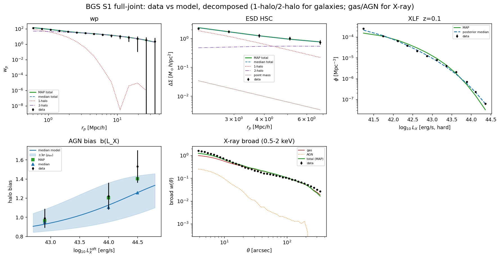
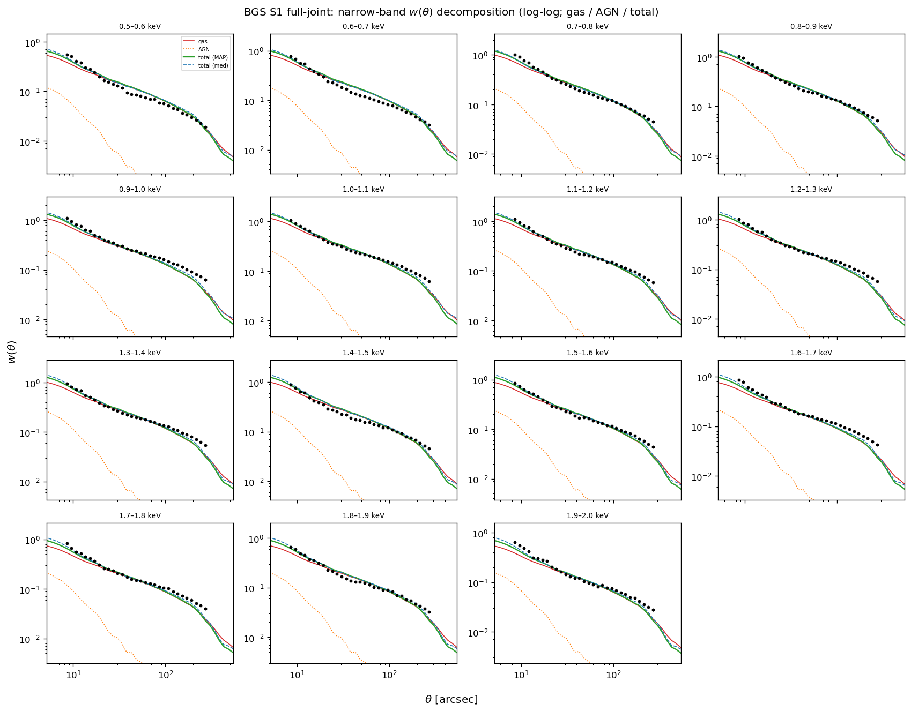
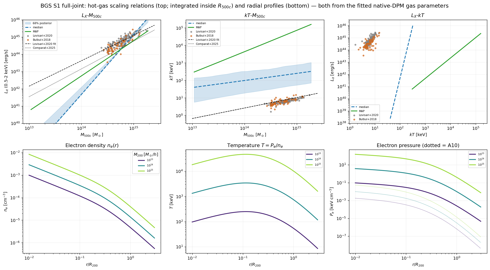
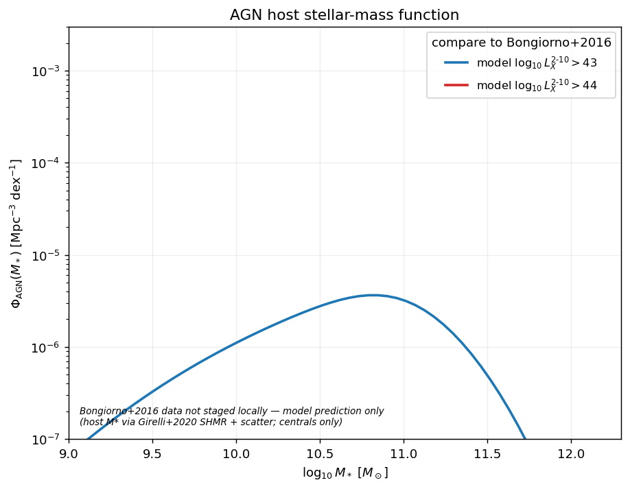
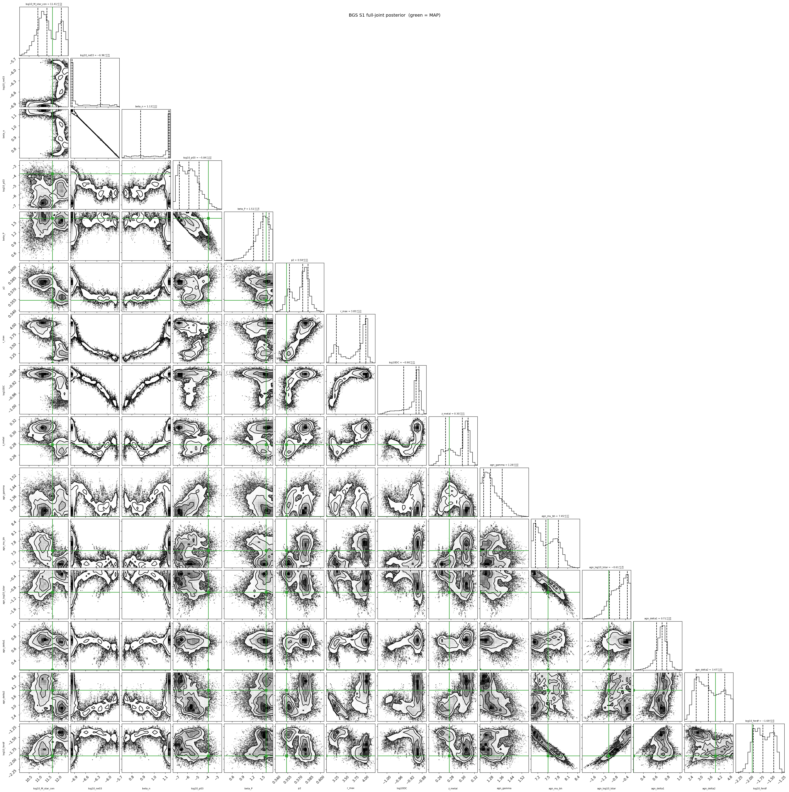

BGS S1 full-model joint fit: galaxies + hot gas + AGN
=====================================================

This page documents the **full-model joint fit** for the BGS :math:`M_\star>10`
(``S1``) sample: a single Gaussian likelihood that ties together the galaxy
clustering/lensing sector, the hot-gas soft-X-ray cross sector, and the AGN
X-ray sector, and samples it with a resumable MCMC on GRICAD/dahu.  It sits on
top of the galaxy-only fit of :doc:`bgs_zm15_joint_mcmc` — that fit's posterior
*anchors* the galaxy sector here — and folds in the X-ray band model of
:doc:`xray_joint_fit` and the Powell AGN model (:doc:`sensitivity_fisher`).

.. contents::
   :local:
   :depth: 2

----

Setup
-----

**Model sectors.**  One log-likelihood assembles three forward models on the
shared halo-model engine (linear :math:`P(k)` from
:func:`~hod_mod.core.power_spectrum.default_pk_linear` — the fits shown here
ran on the CAMB backend; since 0.3.1 the package default is the CosmoPower-JAX
emulator, see :doc:`cosmology` — + Tinker08 HMF + Zu & Mandelbaum
2015 occupation):

* **Galaxies (ZM15).**  :math:`n_\mathrm{gal}` (SMF integral), projected
  clustering :math:`w_p(r_p)`, and excess surface density
  :math:`\Delta\Sigma(r_p)` (with a free central point mass).
* **Hot gas (X-ray).**  The 15 narrow 0.1-keV bands (0.5–2 keV) and the broad
  band of the galaxy × soft-X-ray cross-correlation (Comparat 2025), via the
  precomputed transfer-grid band model of :doc:`xray_joint_fit`.
* **AGN (Powell).**  The X-ray luminosity function :math:`\phi(L_X)` (Roster
  2026) and the AGN halo bias :math:`b(L_X)`, forward-modelled by
  :class:`~hod_mod.agn.powell.PowellAGNModel`.

**Data selection.**  The fitted data are trimmed to the most-robust points (all
selections are ``fit_bgs_full_joint`` CLI options, recorded per run in
``fit_config.json``):

* lensing: only the **HSC** :math:`\Delta\Sigma` on :math:`2<r_p<8\,\mathrm{Mpc}/h`
  (DES and KIDS dropped);
* XLF: only the :math:`z=0.1` slice with :math:`\log_{10}L_X>41`;
* AGN halo bias: only the **Comparat+2023** and **Krumpe+2015** points;
* X-ray: the broad band **and** all 15 narrow bands are kept.

**Two steps.**  The galaxy sector is expensive, so the ZM15 parameters are
handled two ways (each has its own OAR job):

* **Step 2 — fixed ZM15** (this page).  The 13 ZM15 parameters are held at the
  :doc:`mass-bin posterior <bgs_zm15_joint_mcmc>` median, so the galaxy
  predictions that do not depend on the point mass are precomputed **once**; each
  likelihood evaluation is then :math:`\sim0.01\,\mathrm{s}` and the MCMC is fast.
  **15 free parameters.**
* **Step 3 — free ZM15**.  The 13 ZM15 parameters are additionally free with
  Gaussian priors from the mass-bin posterior (mean = median,
  :math:`\sigma=(p_{84}-p_{16})/2`).  **28 free parameters**; the galaxy sector is
  recomputed every evaluation, so this is the heavier run.

**Free parameters (Step 2, 15).**

.. list-table::
   :header-rows: 1
   :widths: 26 16 58

   * - Parameter
     - Prior
     - Role
   * - ``log10_M_star_cen``
     - :math:`\mathcal N(11.3, 0.3)`
     - ESD central point mass (:math:`\Delta\Sigma` inner boundary)
   * - ``log10_ne03`` / ``beta_n``
     - flat
     - DPM electron-density normalisation at :math:`0.3\,r_{500c}` and its mass slope
   * - ``log10_p03`` / ``beta_P``
     - tight :math:`\mathcal N` (:math:`\sigma=0.05/0.04`)
     - DPM electron-pressure normalisation at :math:`0.3\,r_{500c}` and its mass
       slope.  :math:`L_X` and :math:`k_BT` are no longer free power laws: since
       the native-DPM re-base they are *derived* by integrating the profiles, so
       the scaling relations shown below are predictions, not fitted lines.
   * - ``p2`` / ``r_max``
     - flat
     - hot-gas density-profile shape (transfer grid)
   * - ``log10DC``
     - flat
     - AGN duty cycle
   * - ``z_metal``
     - :math:`\mathcal N`
     - gas metallicity
   * - ``agn_gamma``
     - :math:`\mathcal N(1.8, 0.3)`
     - AGN/continuum photon index — frees the band spectral shape (new)
   * - ``agn_mu_bh``
     - flat
     - :math:`M_{\rm BH}`–:math:`M_\star` normalisation
   * - ``agn_log10_lstar``
     - flat
     - ERDF break luminosity
   * - ``agn_delta1`` / ``agn_delta2``
     - flat
     - ERDF faint / bright slopes
   * - ``log10_ferdf``
     - flat
     - AGN / ERDF normalisation

**Sampler.**  A local gradient-free MAP (scipy Nelder-Mead) seeds a resumable
`emcee <https://emcee.readthedocs.io>`_ ensemble sampler with an HDF backend
(``chain.h5``, flushed every step), so a besteffort/idempotent OAR job continues
exactly where it left off.  The production Step-2 job uses 48 walkers,
500 burn-in + 2000 steps.

**Commands.**  Stage the inputs to dahu, submit, then make the figures locally:

.. code-block:: bash

   # 1. stage data + the ZM15 posterior + the apec cache to dahu (run locally)
   bash oarsub/rsync_data_to_dahu.sh

   # 2. submit the fixed-ZM15 job (MAP then MCMC; a re-submit resumes the chain).
   #    The job script applies the data selection + tight kT prior via CLI flags:
   #      --esd-surveys HSC --esd-rp-max 8.0 --xlf-z 0.1 --xlf-lx-min 41.0
   #      --agn-bias-refs Comparat23 Krumpe15 --kt-prior-sig 0.05 0.04
   oarsub --project your-oar-project -S ./oarsub/fit_bgs_full_joint_fixedzm15_mcmc.sh

   # 3. pull the run back, then plot (MAP + posterior-median overlays; --docs
   #    writes the figures embedded below).  The plotter reads fit_config.json so
   #    the plotted data match the fit's selection automatically.
   rsync -avz DAHU:data/hod_mod_results/bgs_full_joint_fixedzm15/ \
       $HOD_MOD_RESULTS/bgs_full_joint_fixedzm15/
   JAX_PLATFORMS=cpu python -m hod_mod.scripts.fitting.plot_bgs_full_joint --docs

Data vs. MAP / posterior-median model
-------------------------------------

For every fitted observable, the figure shows the data with error bars, the
**MAP** model (green) and the **posterior-median** model (blue dashed), each
panel decomposed into its physical components.

   Galaxy, AGN and broad-X-ray observables.  ``wp`` and the HSC ``ESD``
   (:math:`2<r_p<8`) are split into **1-halo / 2-halo** (ESD also the central
   point mass); ``XLF`` (:math:`z=0.1`, :math:`\log_{10}L_X>41`) and ``AGN bias``
   (Comparat+2023, Krumpe+2015) constrain the Powell AGN sector — the bias panel
   shows the model :math:`\pm3\sigma` response in the host-mass normalisation
   :math:`\mu_{\rm BH}`; the broad :math:`w(\theta)` (log-log) is split into
   **gas** and **AGN**.

   The 15 narrow 0.1-keV bands of the galaxy × soft-X-ray cross-correlation
   (0.5–2.0 keV), in **log-log** with each panel decomposed into **gas / AGN /
   total**.  The energy dependence of :math:`w(\theta)` is a gas-temperature
   tracer (via the band-resolved cooling function); the AGN dominates
   :math:`\theta\lesssim20''` and the gas the outer profile.  The 9 X-ray
   parameters are fit jointly across all bands.

.. admonition:: Resolved in v0.4 (2026-08-23) — the gas sector has been re-fitted
   :class: note

   The 2026-08-21 correction on this page withdrew every gas-sector number.
   Three defects in :mod:`hod_mod.fitting.full_joint` meant the v0.3 posterior
   constrained nothing: the full-covariance gas prior was never applied
   (``pri_sig`` is diagonal and carried ``inf`` for the four native-DPM gas
   parameters, so a prior whose information lives almost entirely in its
   correlations — :math:`\rho` from :math:`-0.95` to :math:`+0.84` —
   contributed nothing, and the sector ran on its uniform bounds); the seed was
   the *scaling-relation* prior centre used where the *induced* centre belongs,
   474 units of prior :math:`\chi^2` away and clipped onto three bounds; and
   ``--kt-prior-sig`` wrote onto ``log10_p03`` / ``beta_P`` rather than
   ``kt_norm`` / ``kt_slope``.

   All three are fixed in 0.4.0, and every number below is the **re-run**:
   campaign ``VTAG=v0.4``, package 0.5.0, chain of 2026-08-23.
   ``--kt-prior-sig`` is replaced by ``--gas-prior-widen``, a scalar inflation
   of the whole :math:`4\times4`; this run used its default.  The diagnostic
   that forced the withdrawal has changed sign:

   .. list-table::
      :header-rows: 1
      :widths: 42 29 29

      * - diagnostic
        - v0.3 (withdrawn)
        - v0.4
      * - :math:`\beta_P - \beta_n`, posterior median
        - :math:`-0.41` — **inverted**
        - :math:`+0.46^{+0.20}_{-0.34}`
      * - MAP :math:`\chi^2/\mathrm{dof}`
        - 186.4
        - **9.26**
      * - largest pile-up on a bound
        - MAP clipped on three
        - 0.3 % of samples

   The induced prior is centred on :math:`+0.6`, so the recovered
   :math:`k_BT`–:math:`M` slope is now consistent with it rather than of the
   opposite sign.  Quoted as a difference of medians for exact comparability
   with the withdrawn figure, v0.3 gives :math:`-0.414` and v0.4
   :math:`+0.377`; the :math:`+0.46` above is the median of the per-sample
   difference, which is the correct statistic for a derived quantity.

Goodness of fit (campaign ``VTAG=v0.4``)
----------------------------------------

.. list-table:: Step-2 MAP, ``bgs_full_joint_fixedzm15_v0.4``, against the withdrawn v0.3 run
   :header-rows: 1
   :widths: 32 17 17 34

   * - Sector
     - v0.3 :math:`\chi^2`
     - v0.4 :math:`\chi^2`
     - note
   * - galaxies (:math:`n_{\rm gal}, w_p, \Delta\Sigma`)
     - 2.11
     - 5.52
     - ZM15 held fixed in both
   * - AGN (XLF + bias)
     - 53.55
     - 103.82
     - —
   * - X-ray (broad + 15 bands)
     - 97 985.73
     - **4 762.11**
     - :math:`20.6\times` smaller
   * - **total** (526 dof)
     - **98 041.40**
     - **4 871.44**
     - —
   * - :math:`\chi^2/\mathrm{dof}`
     - 186.39
     - **9.26**
     - —

Three things follow.

* **The X-ray sector is now being fitted.**  It still carries 97.8 % of the
  :math:`\chi^2`, but the absolute misfit fell by a factor 20.6 and
  :math:`\chi^2/\mathrm{dof} = 9.26` describes a model that fits badly rather
  than one that is not fitting at all.  The galaxy and AGN sectors got slightly
  *worse* (2.11 → 5.52 and 53.55 → 103.82), which is the expected sign: the gas
  sector no longer absorbs arbitrary amounts of misfit by running free on its
  bounds, so the other sectors have to carry their share.

* **The chain samples a basin.**  Across the second half of the chain the 68 %
  spread of :math:`-2\log P` is :math:`\approx110` units in v0.4
  (3 164 → 3 274) against :math:`\approx7\,000` in v0.3 (55 100 → 62 098).  The
  v0.3 text had to warn that "the chain is not sampling a basin around the MAP";
  that warning no longer applies.  (:math:`-2\log P` is the stored log-posterior
  and includes the prior term, so it is a mixing diagnostic, not a
  :math:`\chi^2`.)

* **Nothing rails.**  The largest pile-up at any bound is 0.3 % of samples
  (``log10_ne03`` at its :math:`-7` floor), against v0.3 where the MAP was
  clipped on three bounds and ``p2`` sat on its 0.1 floor in the posterior
  (median 0.101; now 0.576).  Two v0.4 *MAP* coordinates do still land on an
  edge — ``r_max`` at 3.000 and ``agn_gamma`` at 1.200 — but the posterior
  keeps clear of both (medians 3.85 and 1.28), so the MAP is the less
  representative of the two summaries here.

Why the AGN photon index is free
--------------------------------

A per-band spectral diagnostic (``bandmodel_diagnostic.py``, staged with the run
products) shows the observed cross-correlation band spectrum is **flat and
featureless** — it lacks the Fe-L line peak at 0.7–1.2 keV that :math:`\sim1`-keV
thermal gas would imprint, and it is nearly identical at all angular scales.
Because APEC only reproduces a flat spectrum at :math:`k_BT\gtrsim8\,\mathrm{keV}`,
a thermal-gas-only model is driven to an unphysically hot :math:`k_BT`, and even a
tight :math:`k_BT`-:math:`M` prior cannot hold it (the band likelihood overrides
it at :math:`\sim3.6\sigma`).

The fix is to give the **continuum** its own spectral degree of freedom: the AGN
photon index ``agn_gamma`` (fixed at :math:`\Gamma=1.8`) is freed.  The AGN then
absorbs the flat spectral shape (:math:`\Gamma` settles hard, :math:`\approx1.5`),
the band :math:`\chi^2` drops by :math:`\sim210` — *these two numbers come from the
2026-07 free-vs-fixed diagnostic pair, not from the v0.3 run archived here, which
stores only the* :math:`\Gamma`-*free fit* — and with the tight
:math:`k_BT`-prior the **posterior** :math:`k_BT`-:math:`M` relation tracks the
resolved-cluster scaling instead of soaring an order of magnitude above it.  A
residual remains: even :math:`\Gamma`-free, the bands cannot fully pin the
:math:`k_BT` *normalisation* (the density–temperature–continuum degeneracy is not
fully broken by soft-X-ray emission alone) — the tSZ (pressure-weighted) cross is
the natural next constraint.

Hot-gas scaling relations and radial profiles
---------------------------------------------

Since the 0.3.1 native-DPM re-base the X-ray sector is parametrised by the DPM
gas parameters themselves — :math:`\log_{10}n_{e,0.3}`, :math:`\beta_n`,
:math:`\log_{10}P_{0.3}`, :math:`\beta_P`, plus the density-profile shape
(:math:`p_2`, :math:`r_{\max}`) — so there are no fitted
:math:`L_X`–:math:`M_{500c}` or :math:`k_BT`–:math:`M_{500c}` coefficients left
in the chain to read off.  The relations in the top row are therefore
**predictions, not fitted lines**: 0.4.0 rewrote ``fig_gas`` to derive them by
integrating each posterior draw's own DPM profiles out to :math:`R_{500c}` with
:math:`n_e^2` weighting and the :math:`T>0.3` keV hot-phase cut, reusing the
likelihood's own factorisation from :mod:`hod_mod.fitting.dpm_bands`; the 68 %
band is 400 draws pushed through that same integrator.  The bottom row shows
the DPM radial profiles directly.

   **Top:** :math:`L_X`–:math:`M_{500c}`, :math:`k_BT`–:math:`M_{500c}` and
   :math:`L_X`–:math:`k_BT` — the MAP (green) and posterior-median (blue)
   relations with the 68 % posterior band, over-plotted with Lovisari+2020 and
   Bulbul+2018 cluster/group samples and the Lovisari+2020 / Comparat+2025
   (GAS.py) relations.  Read this panel with the caveat below: the v0.4 fit
   fixes the *slope* and not the *normalisation*.  :math:`k_BT` now rises with
   mass, as :math:`\beta_P - \beta_n = +0.46 > 0` requires, but the posterior
   median sits at :math:`k_BT \approx 40`–:math:`350` keV where the cluster
   samples are at 2–10 keV — roughly 1.5–2 dex high — and the MAP is higher
   still.  :math:`L_X`–:math:`M_{500c}` is the better-behaved of the two: the
   posterior median crosses the cluster cloud near
   :math:`M_{500c}\sim5\times10^{14}\,M_\odot`, though with a steeper slope
   than Lovisari+2020.
   **Bottom:** electron density :math:`n_e(r)`, temperature :math:`T(r)=P_e/n_e`
   and electron pressure :math:`P_e(r)` at
   :math:`M_{200}=10^{13,14,15}\,M_\odot/h` (dotted = Arnaud+2010 pressure), with
   :math:`n_e` calibrated to the fit's :math:`L_X`–:math:`M`.

.. admonition:: What v0.4 fixed here, and what it did not
   :class: warning

   The 0.4.0 gas-sector fix removed the **inversion** — the sign of
   :math:`\beta_P - \beta_n` — and that is all it claimed to do.  It did not
   make the gas sector physical.  The recovered temperatures are 1.5–2 orders
   of magnitude above the cluster samples, and the :math:`T(r)` panel below
   peaks at :math:`10^2`–:math:`10^4` keV rather than the few keV a group or
   cluster halo should show.  Consistently, the MAP
   :math:`\chi^2/\mathrm{dof}` is 9.26: the band model is fitting, but it is
   not fitting *well*.

   So the scaling relations here are a **diagnostic of the fit, not a
   measurement of hot-gas physics**.  Soft-X-ray :math:`w(\theta)` alone does
   not break the density–temperature–continuum degeneracy (see the previous
   section), which is exactly the argument for the tSZ leg: a
   pressure-weighted cross-correlation constrains :math:`P_e` independently and
   should pull the normalisation down.  Until that lands, quote the
   :math:`L_X`–:math:`M` relation with care and do not quote
   :math:`k_BT`–:math:`M` as a result.

AGN host stellar-mass function
------------------------------

A derived prediction: the stellar-mass function of AGN host galaxies above a
hard-X-ray luminosity threshold, built from the Powell central-AGN occupation
:math:`N_{\rm AGN}(>L_X\,|\,M_{\rm halo})` weighted by the HMF and mapped into
stellar mass through the Girelli+2020 SHMR (with scatter).

   AGN host stellar-mass function for two hard-band luminosity thresholds
   (model, centrals only).  Intended for comparison with Bongiorno+2016 — those
   data are not yet staged locally, so this is currently the model prediction.

Parameter posteriors
--------------------

   The 15-parameter posterior (green lines = MAP).  The X-ray relation
   parameters (incl. the free ``agn_gamma``), the AGN ERDF parameters and the ESD
   point mass are recovered jointly; the ``lx_norm``–``log10DC`` and
   ``agn_gamma``–``kt_norm`` directions show the expected gas-vs-AGN /
   continuum-vs-temperature degeneracies.

Where the outputs are stored
----------------------------

The job writes into ``$HOD_MOD_RESULTS/bgs_full_joint_fixedzm15/`` (the
all-params Step-3 run uses ``bgs_full_joint_allparams/``):

.. list-table::
   :header-rows: 1
   :widths: 32 68

   * - File
     - Content
   * - ``fit_config.json``
     - the exact data selection (surveys, cuts, references) — read back by the
       plotter so the figures match the fit
   * - ``map_result.json``
     - MAP parameters, :math:`\chi^2`/dof, per-sector breakdown, optimiser status
       (written as soon as MAP finishes; its presence makes a re-submit skip MAP)
   * - ``chain.h5``
     - the resumable emcee HDF backend (continue by re-submitting)
   * - ``flatchain.npz``
     - the flattened post-burn-in chain (``flatchain``, ``param_names``) — the
       plotter's input
   * - ``posterior_summary.json``
     - per-parameter median and :math:`\pm1\sigma` (16/50/84)

The figures above are produced by
:mod:`hod_mod.scripts.fitting.plot_bgs_full_joint`; ``--docs`` writes them into
``docs/_images/bgs_full_joint_fixedzm15__{observables,xray_bands,gas,agn_host_smf,corner}.png``.
