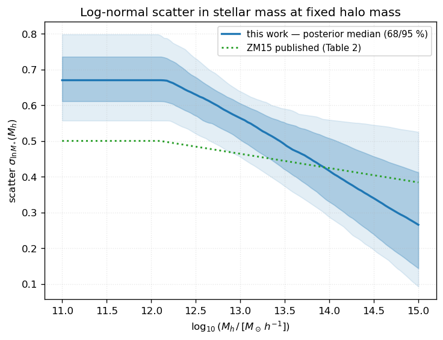
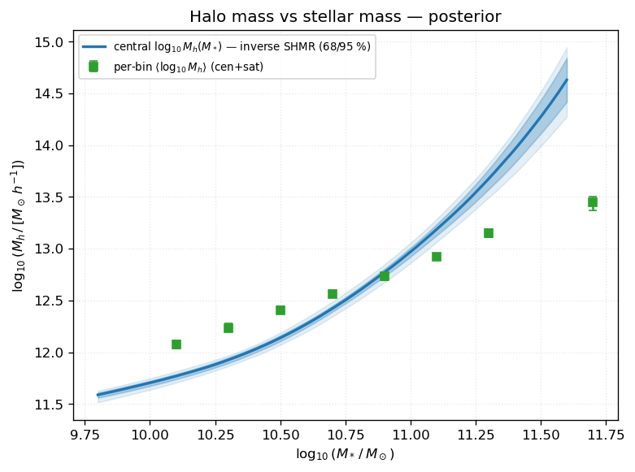
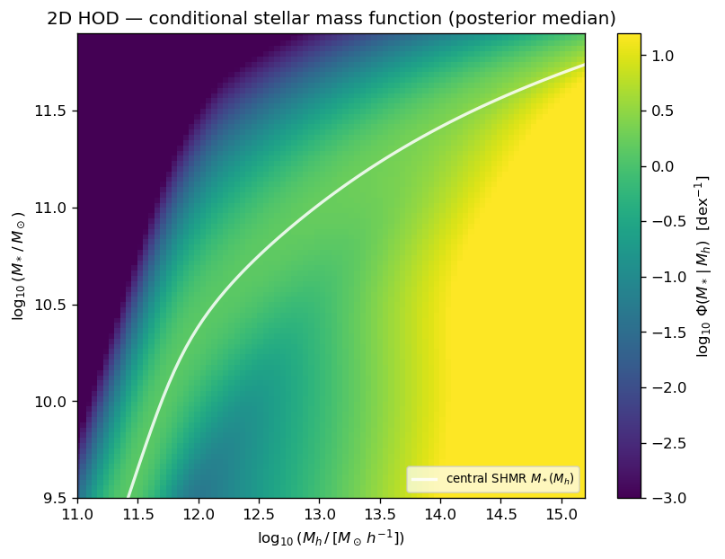

.. _bgs_zm15_joint_mcmc:

BGS × LS10 — Zu & Mandelbaum 2015 joint :math:`w_p` + :math:`n_{\rm gal}` MCMC
==============================================================================================

.. admonition:: Provenance — campaign ``VTAG=v0.3``
   :class: note

   Refreshed 2026-08-21 from the completed v0.3 chain
   (``bgs_zm15_joint_wp_ngal_v0.3``, 2500/2500 steps, 64 000 samples,
   2026-08-20).  The numbers here supersede the previous version of this page,
   which was built on a **hod_mod 0.2.1** chain — i.e. before the 0.3.0
   Hankel-transform fix — and quoted :math:`\chi^2/\mathrm{dof} = 44.0/99 =
   0.44`.  Physics is the 0.3.0 Hankel fix with the linear :math:`P(k)` pinned
   to CAMB; the 0.3.1+ package default is the CosmoPower-JAX emulator, see
   :doc:`oarsub_campaign` and :doc:`cosmology`.

This page exploits the finished MCMC posterior of the global inverse-HOD fit of
:class:`~hod_mod.connection.hod.ZuMandelbaum15HODModel` (Zu & Mandelbaum 2015) to the
DESI Bright Galaxy Survey (BGS) LS10 stellar-mass-binned campaign.  A **single** set of
thirteen SHMR + scatter + satellite parameters is fit **simultaneously** to all eight
stellar-mass bins, using the projected clustering :math:`w_p(r_p)` and the galaxy number
density :math:`n_{\rm gal}` of every bin (**no lensing** in this run).

The chain was produced by the ``production`` family of the ``VTAG=v0.3``
campaign (``oarsub/params/production_mcmc.txt``) running
:mod:`hod_mod.scripts.fitting.bgs_ls10.fit_bgs_zm15_joint` (``--mode both --surveys``,
i.e. ``wp`` + ``n_gal`` only): 32 walkers, 500 burn-in + 2000 production steps.  The figures on this page are
regenerated from ``flatchain.npz`` + ``map_result.json`` by
:mod:`hod_mod.scripts.fitting.bgs_ls10.plot_bgs_zm15_joint_posterior`.  They show the
**posterior** — median and 68 / 95 % credible bands — throughout; the MAP point estimate is
used only as a reference in the constraint table.

**Sample** — BGS LS10 VLIM, any spectral type,
:math:`10.0 \leq \log_{10}(M_*/M_\odot) < 12.0`, :math:`0.05 < z < 0.18`,
:math:`N_{\rm gal} = 2\,759\,238`, :math:`h = 0.674`.  Eight bins in
:math:`\log_{10}(M_*/M_\odot)` of width 0.2 dex (the top bin, 11.4–12.0, is wider), each
with its own measured effective redshift :math:`z_{\rm mean}`.

The fit is **excellent**: :math:`\chi^2/\mathrm{dof} = 59.70/99 = 0.603` at the MAP.

----

Data and likelihood
--------------------

Each bin contributes its clustering and abundance to one summed Gaussian log-likelihood
with shared parameters:

.. math::

   \log P(\theta) = \log \pi(\theta)
                  - \tfrac12 \sum_{\rm bins} \Big[ \chi^2_{w_p} + \chi^2_{n_g} \Big].

- :math:`w_p(r_p)` over :math:`0.5 \leq r_p \leq 20` Mpc/:math:`h` (13 radial bins/bin),
  compared in native Mpc/:math:`h`; the inverse jackknife covariance carries a 1 % diagonal
  ridge (:func:`~hod_mod.scripts.fitting.bgs_ls10.fit_bgs_zm15_joint._regularised_icov`).
- :math:`n_{\rm gal}` (one point per bin) in :math:`h^3\,{\rm Mpc}^{-3}`, with a 5 %
  fractional-error floor.

Data vector: :math:`n_{\rm data} = 8\times(13+1) = 112`; :math:`n_{\rm free} = 13`;
:math:`n_{\rm dof} = 99`.  The observables are read via
:class:`~hod_mod.data_io.sum_stat_reader.SumStatReader` from the ``sum_stat``
``BGS_Mstar10_massbins`` joint HDF5 files.

Sampler configuration and convergence
~~~~~~~~~~~~~~~~~~~~~~~~~~~~~~~~~~~~~~~~

``emcee`` ``EnsembleSampler``, 32 walkers, 500 burn-in + 2000 production steps
(one continuous, resumable HDF5-backed chain).  Walkers are seeded in a tight ball around
the MAP best fit (Powell).  Discarding burn-in leaves
:math:`32 \times 2000 = 64\,000` posterior samples.

**Convergence.**  Reshaping the flat chain into its 32 walkers, the integrated
autocorrelation time is :math:`\tau \approx 145` steps (maximum 162, for
:math:`\delta`, across the 13 parameters).  The 2000 production steps per walker
therefore contain :math:`\approx 14` independent samples each, for
:math:`N_{\rm eff} \approx 441` effectively independent samples across the ensemble
— ample for the credible intervals and 2D contours below.

----

Goodness of fit
---------------

Per-bin MAP :math:`\chi^2` breakdown (from ``map_result.json``).  The fit quality is
uniform across the stellar-mass range and clustering-dominated; the abundance
contributes negligibly.

.. list-table::
   :header-rows: 1
   :widths: 22 20 20 20

   * - :math:`\log_{10} M_*` bin
     - :math:`\chi^2_{w_p}`
     - :math:`\chi^2_{n_g}`
     - :math:`\chi^2_{\rm total}`
   * - 10.0 – 10.2
     - 7.26
     - 1.979
     - 9.24
   * - 10.2 – 10.4
     - 8.14
     - 1.501
     - 9.64
   * - 10.4 – 10.6
     - 5.12
     - 0.073
     - 5.19
   * - 10.6 – 10.8
     - 8.79
     - 0.029
     - 8.81
   * - 10.8 – 11.0
     - 8.95
     - 0.264
     - 9.21
   * - 11.0 – 11.2
     - 6.81
     - 0.000
     - 6.81
   * - 11.2 – 11.4
     - 5.26
     - 0.364
     - 5.62
   * - 11.4 – 12.0
     - 5.08
     - 0.092
     - 5.17
   * - **Total**
     - **55.40**
     - **4.30**
     - **59.70**

:math:`\chi^2/\mathrm{dof} = 0.603 < 1` indicates the reported errors are conservative:
the 5 % :math:`n_{\rm gal}` floor and the 1 % covariance ridge both inflate the effective
uncertainties.  The parameter **credible intervals below should therefore be read as
upper bounds on the true statistical precision**.

**Posterior** :math:`\chi^2` **distribution.**  Propagating 150 chain samples through the
full halo model, the total :math:`\chi^2` has a posterior median of
:math:`\chi^2 = 60.6^{+11.9}_{-7.8}` (68 %), i.e.
:math:`\chi^2/\mathrm{dof} = 0.612\,[0.533,\,0.733]` over :math:`n_{\rm dof}=99`.  The
posterior median sits just above the MAP value (0.603); the whole distribution stays well
below unity, so *no* region of the sampled parameter space over- or mis-fits the data.

----

Posterior parameter constraints
-------------------------------

Marginalised posterior (median with 68 % credible interval) against the MAP best fit and
the published ZU & Mandelbaum 2015 global iHOD values (their Table 2, an SDSS Main-sample
fit *with* lensing — a different selection, so exact agreement is not expected).

.. list-table::
   :header-rows: 1
   :widths: 20 12 26 14 14

   * - Parameter
     - Symbol
     - Posterior (median :math:`\pm 68\%`)
     - MAP
     - ZM15 pub.
   * - ``lg_m1h``
     - :math:`\log_{10} M_1`
     - :math:`12.175^{+0.072}_{-0.065}`
     - 12.075
     - 12.10
   * - ``lg_m0star``
     - :math:`\log_{10} M_{*,0}`
     - :math:`10.534^{+0.053}_{-0.053}`
     - 10.404
     - 10.31
   * - ``beta``
     - :math:`\beta`
     - :math:`0.523^{+0.046}_{-0.047}`
     - 0.376
     - 0.33
   * - ``delta``
     - :math:`\delta`
     - :math:`0.650^{+0.046}_{-0.046}`
     - 0.613
     - 0.42
   * - ``gamma``
     - :math:`\gamma`
     - :math:`1.846^{+0.191}_{-0.204}`
     - 1.831
     - 1.21
   * - ``sigma_lnmstar``
     - :math:`\sigma_{\ln M_*}`
     - :math:`0.674^{+0.058}_{-0.061}`
     - 0.772
     - 0.50
   * - ``eta``
     - :math:`\eta`
     - :math:`-0.145^{+0.058}_{-0.047}`
     - −0.215
     - −0.04
   * - ``fc``
     - :math:`f_c`
     - :math:`0.969^{+0.022}_{-0.052}`
     - 1.000
     - 0.86
   * - ``bsat``
     - :math:`B_{\rm sat}`
     - :math:`20.449^{+2.376}_{-2.206}`
     - 13.020
     - 8.98
   * - ``beta_sat``
     - :math:`\beta_{\rm sat}`
     - :math:`0.556^{+0.026}_{-0.027}`
     - 0.580
     - 0.90
   * - ``bcut``
     - :math:`B_{\rm cut}`
     - :math:`4.471^{+3.446}_{-2.654}`
     - 7.664
     - 0.86
   * - ``beta_cut``
     - :math:`\beta_{\rm cut}`
     - :math:`0.884^{+0.227}_{-0.402}`
     - 0.891
     - 0.41
   * - ``alpha_sat``
     - :math:`\alpha_{\rm sat}`
     - :math:`1.269^{+0.043}_{-0.044}`
     - 1.104
     - 1.00

**Reading the posterior:**

- The SHMR parameters (:math:`\log_{10} M_1, \log_{10} M_{*,0}, \delta, \sigma_{\ln M_*}`)
  and the satellite power-law index :math:`\alpha_{\rm sat}` are **tightly constrained**.
- :math:`B_{\rm cut}` and :math:`\beta_{\rm cut}` — the satellite low-mass cut-off — are
  **poorly constrained / prior-dominated**: :math:`w_p` + :math:`n_{\rm gal}` alone carry
  little information about the exact cut-off shape.  This is why the MAP
  (:math:`B_{\rm cut}=7.7`) sits far from the posterior median (4.5): the total
  :math:`\chi^2` is nearly flat in :math:`B_{\rm cut}`, so the point estimate is not
  meaningful for this parameter.
- Several parameters are offset from the SDSS ZM15 values.  This is **expected**: the BGS
  :math:`M_*>10^{10}\,M_\odot` selection at :math:`z\approx0.13` differs from the SDSS
  Main sample, and this run uses no lensing.  Notably the satellite normalisation
  :math:`B_{\rm sat}\approx 20` is roughly twice the SDSS value.

**Posterior degeneracies.**  The strongest linear correlations in the chain are

.. list-table::
   :header-rows: 1
   :widths: 40 20 40

   * - Parameter pair
     - :math:`r`
     - Interpretation
   * - :math:`B_{\rm sat}` – :math:`\alpha_{\rm sat}`
     - **+0.98**
     - satellite amplitude vs power-law slope — the dominant degeneracy
   * - :math:`\log_{10}M_1` – :math:`\log_{10}M_{*,0}`
     - +0.89
     - the two SHMR mass scales
   * - :math:`\log_{10}M_1` – :math:`\beta`
     - +0.83
     - SHMR characteristic mass vs low-mass slope
   * - :math:`\log_{10}M_{*,0}` – :math:`\beta`
     - +0.80
     - SHMR pivot vs low-mass slope
   * - :math:`\delta` – :math:`\beta_{\rm cut}`
     - −0.77
     - SHMR transition vs satellite cut-off slope

The :math:`B_{\rm sat}`–:math:`\alpha_{\rm sat}` ridge (:math:`r=+0.98`) is why neither is
constrained as tightly as its 1D interval suggests: the data fix the *satellite abundance*
in the probed halo-mass range, leaving an amplitude–slope direction nearly free.

.. figure:: _images/bgs_zm15_joint__corner.png
   :width: 100%

   Full 13-parameter posterior (median and 16/84 % quantiles in the panel titles).  The
   :math:`B_{\rm sat}`–:math:`\alpha_{\rm sat}` correlation and the
   :math:`\log_{10}M_1`–:math:`\log_{10}M_{*,0}` correlation are the tightest ridges; the
   :math:`B_{\rm cut}` and :math:`f_c` posteriors pile up against their prior edges.

.. figure:: _images/bgs_zm15_joint__constraints.png
   :width: 90%

   Forest plot: this-work posterior (blue, median :math:`\pm 68\%`) vs published ZM15
   Table 2 (green), each parameter normalised to its uniform prior range.  A marker near the
   left/right edge with a wide bar (e.g. :math:`B_{\rm cut}`) flags a prior-dominated
   parameter; a tight marker well inside the range (e.g. :math:`\delta`,
   :math:`\alpha_{\rm sat}`) flags a data-dominated one.  Values printed at right are the
   this-work medians.

----

Posterior-predictive observables
--------------------------------

The following figures propagate a random subsample of the chain through the full halo
model, giving 68 %/95 % credible bands on each **fitted** observable.

.. figure:: _images/bgs_zm15_joint__wp_bins.png
   :width: 100%

   Projected clustering :math:`w_p(r_p)` for all eight bins.  Black points are the data; the
   blue line and shaded regions are the posterior-predictive median and 68 %/95 % credible
   bands (the band is narrow because the fit is well constrained).  Lower strips show
   ``data / (posterior median) − 1``: residuals are within :math:`\pm10\%` across the fitted
   range, consistent with :math:`\chi^2/\mathrm{dof}<1`.  The highest-mass bin (11.4–12.0)
   carries the largest residual (:math:`\sim25\%` at intermediate scales).

.. figure:: _images/bgs_zm15_joint__ngal.png
   :width: 78%

   Galaxy number density per stellar-mass bin — **point-by-point** comparison of the
   observed value (black) and the posterior-predictive 68 / 95 % interval (blue), with the
   fractional difference below.  The abundance is reproduced to within a few percent — well
   inside its 5 % error floor — in every bin.

.. figure:: _images/bgs_zm15_joint__smf.png
   :width: 75%

   Model stellar mass function (posterior band, derived from the cumulative
   :math:`n_{\rm gal}` of the fitted HOD) compared to the **independent, not-fitted**
   ``sum_stat`` SMF.  Agreement here is a genuine consistency check.

----

Derived relations
-----------------

Physical quantities implied by the posterior, each propagated through the halo model with
68 % credible intervals.

Per-bin halo occupation
~~~~~~~~~~~~~~~~~~~~~~~~~

For every fitted stellar-mass bin, the posterior of the mean host halo mass
:math:`\langle M_h\rangle`, effective large-scale bias :math:`b_{\rm eff}`, and satellite
fraction :math:`f_{\rm sat}` (occupation-weighted over the halo mass function):

.. list-table::
   :header-rows: 1
   :widths: 22 26 26 26

   * - :math:`\log_{10} M_*` bin
     - :math:`\langle\log_{10} M_h\rangle\,[M_\odot/h]`
     - :math:`b_{\rm eff}`
     - :math:`f_{\rm sat}`
   * - 10.0 – 10.2
     - :math:`12.09\pm0.03`
     - :math:`1.06\pm0.01`
     - :math:`0.173\pm0.020`
   * - 10.2 – 10.4
     - :math:`12.25\pm0.03`
     - :math:`1.11\pm0.01`
     - :math:`0.190\pm0.023`
   * - 10.4 – 10.6
     - :math:`12.42\pm0.03`
     - :math:`1.18\pm0.01`
     - :math:`0.206\pm0.022`
   * - 10.6 – 10.8
     - :math:`12.58\pm0.03`
     - :math:`1.23\pm0.01`
     - :math:`0.203\pm0.021`
   * - 10.8 – 11.0
     - :math:`12.74^{+0.02}_{-0.03}`
     - :math:`1.29\pm0.01`
     - :math:`0.181\pm0.021`
   * - 11.0 – 11.2
     - :math:`12.94^{+0.02}_{-0.03}`
     - :math:`1.38\pm0.01`
     - :math:`0.155\pm0.023`
   * - 11.2 – 11.4
     - :math:`13.16\pm0.03`
     - :math:`1.54^{+0.02}_{-0.02}`
     - :math:`0.115^{+0.028}_{-0.019}`
   * - 11.4 – 12.0
     - :math:`13.46^{+0.07}_{-0.09}`
     - :math:`1.83^{+0.07}_{-0.07}`
     - :math:`0.056^{+0.028}_{-0.017}`

The occupation-weighted mean host halo mass climbs steadily from
:math:`10^{12.1}` to :math:`10^{13.5}\,M_\odot/h`, the effective bias grows from
:math:`1.06` to :math:`1.83`, and the satellite fraction falls from :math:`\sim0.21` at the
low-mass peak to :math:`0.06` as the sample becomes central-dominated at high :math:`M_*`.
:math:`\langle\log_{10}M_h\rangle` is the mean over centrals *and* satellites, so it sits
above the central-only inverse-SHMR curve (figure below) by the satellite contribution.

Stellar-to-halo mass relation and scatter
~~~~~~~~~~~~~~~~~~~~~~~~~~~~~~~~~~~~~~~~~~~

The posterior SHMR peaks in star-formation efficiency at
:math:`\log_{10}(M_h/[M_\odot h^{-1}]) = 11.99^{+0.03}_{-0.05}` with a peak ratio
:math:`M_*/M_h \approx 0.024`, and the cumulative satellite fraction is
:math:`f_{\rm sat}(>10^{10}\,M_\odot)\approx0.18`, dropping to
:math:`\approx0.14` above :math:`10^{11}\,M_\odot`.

.. figure:: _images/bgs_zm15_joint__shmr.png
   :width: 78%

   Stellar-to-halo mass relation :math:`M_*(M_h)`.  Blue: this-work posterior median and
   68 / 95 % band; green dotted: ZM15 published; dash-dot: Moster+2013 and Behroozi+2013 at
   the sample effective redshift :math:`z\approx0.14`.  The BGS-constrained SHMR sits
   slightly above the abundance-matching relations at the pivot, reflecting the larger
   fitted scatter :math:`\sigma_{\ln M_*}`.

   Log-normal scatter :math:`\sigma_{\ln M_*}(M_h)` (ZM15 Eq. 20).  The fit prefers a
   larger low-mass scatter (:math:`\approx0.72` vs ZM15's :math:`0.50`) and a steeper
   decline with halo mass (more negative :math:`\eta`) — a direct consequence of the higher
   abundance and shallower clustering of the BGS sample.

   Halo mass vs stellar mass (ZM15 Fig. 11 analogue).  The blue band is the inverted
   *central* SHMR :math:`\log_{10}M_h(M_*)`; the green points are the per-bin
   occupation-weighted mean :math:`\langle\log_{10}M_h\rangle` of all galaxies (centrals +
   satellites), which sit above the central curve because the satellite fraction adds
   galaxies in more massive haloes.

Occupation and conditional stellar mass function
~~~~~~~~~~~~~~~~~~~~~~~~~~~~~~~~~~~~~~~~~~~~~~~~~~

.. figure:: _images/bgs_zm15_joint__hod_occupation.png
   :width: 78%

   Central (solid) and satellite (dashed) occupation :math:`\langle N\rangle(M_h)` with
   68 % posterior bands, for three representative stellar-mass thresholds.  The satellite
   branch is well localised in amplitude; its low-mass turn-over (governed by
   :math:`B_{\rm cut},\beta_{\rm cut}`) is the least-constrained feature.

   Two-dimensional HOD / conditional stellar mass function (ZM15 Fig. 3 analogue) at the
   posterior median: colour is :math:`\log_{10}\Phi(M_*|M_h)`, the mean number of galaxies
   per dex in :math:`M_*` within haloes of mass :math:`M_h`.  The white curve is the central
   SHMR ridge :math:`M_*(M_h)`.

.. figure:: _images/bgs_zm15_joint__satellite_fraction.png
   :width: 72%

   Satellite fraction :math:`f_{\rm sat}(>M_*)` as a function of the stellar-mass threshold,
   with posterior median and 68 / 95 % band.  :math:`f_{\rm sat}` decreases with increasing
   :math:`M_*` as expected, and is constrained at the few-percent level over most of the
   range.

----

Relation to the Zu & Mandelbaum figure set
-------------------------------------------

This page reproduces, for the BGS :math:`w_p+n_{\rm gal}` fit, the model-side figures of the
iHOD paper (Zu & Mandelbaum 2015): the confidence regions (their Fig. 7 → corner), the
SHMR and its scatter (Figs. 8, 10), the inverse :math:`\langle M_h|M_*\rangle` relation
(Fig. 11), the 2D HOD / conditional SMF (Fig. 3), the satellite HODs (Fig. 8, right), the
stellar mass function (Fig. 9) and the clustering (Fig. 6, clustering panels).  The
lensing panels of ZM15 are not reproduced here because this run fits
:math:`w_p+n_{\rm gal}` only.

The follow-up papers **Zu & Mandelbaum 2016** (iHOD galaxy quenching, arXiv:1509.06758) and
**Zu & Mandelbaum 2018** (halo quenching / colour, arXiv:1703.09219) split the sample by
colour and add a quenching sector.  Their central figures (colour-dependent SHMRs, red/blue
satellite HODs, quenched fractions, conformity) require that colour/quenching extension,
which the present 13-parameter fit does **not** include, so they are outside the scope of
this page.

----

Reproduce
---------

Regenerate every figure on this page from the finished chain::

    JAX_PLATFORMS=cpu HOD_MOD_SUMSTAT=/home/comparat/software/sum_stat/data \
      python -m hod_mod.scripts.fitting.bgs_ls10.plot_bgs_zm15_joint_posterior \
        --out-dir $HOD_MOD_RESULTS/bgs_zm15_joint_wp_ngal

The expensive :math:`w_p`/:math:`n_{\rm gal}` bands re-run the halo model per draw
(:math:`\sim 7`\ s/draw after a one-time JAX compile); ``--n-draws`` /
``--n-draws-analytic`` / ``--n-draws-derived`` tune the sampling budgets, and
``--figures`` restricts which panels are produced.

The chain itself is regenerated (or resumed) with::

    oarsub -S ./oarsub/fit_bgs_zm15_joint_mcmc.sh          # GRICAD/OAR
    # or locally:
    python -m hod_mod.scripts.fitting.bgs_ls10.fit_bgs_zm15_joint \
        --surveys --mode mcmc --rp-min 0.5 --rp-max 20 \
        --n-walkers 32 --n-burnin 500 --n-steps 2000 \
        --out-dir $HOD_MOD_RESULTS/bgs_zm15_joint_wp_ngal

----

References
----------

- Zu & Mandelbaum 2015, MNRAS 454, 1161 — iHOD
  (`arXiv:1505.02781 <https://arxiv.org/abs/1505.02781>`_)
- Zu & Mandelbaum 2016, MNRAS 457, 4360 — iHOD galaxy quenching
  (`arXiv:1509.06758 <https://arxiv.org/abs/1509.06758>`_)
- Zu & Mandelbaum 2018, MNRAS 476, 1637 — halo quenching / colour
  (`arXiv:1703.09219 <https://arxiv.org/abs/1703.09219>`_)
- Moster, Naab & White 2013, MNRAS 428, 3121
  (`arXiv:1205.5807 <https://arxiv.org/abs/1205.5807>`_)
- Behroozi, Wechsler & Conroy 2013, ApJ 770, 57
  (`arXiv:1207.6105 <https://arxiv.org/abs/1207.6105>`_)
