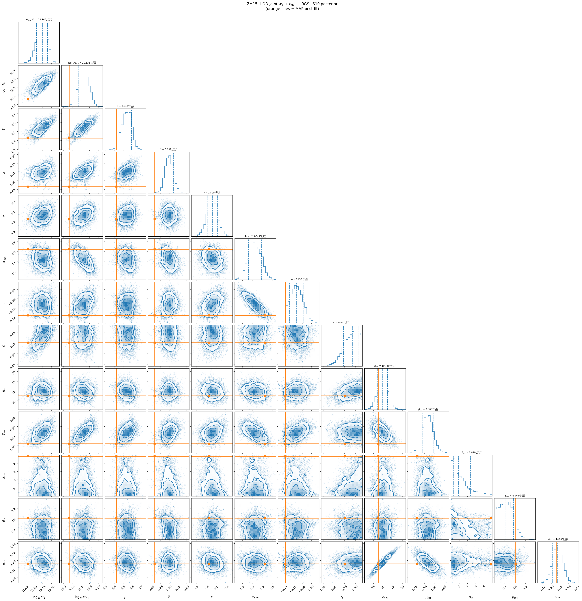
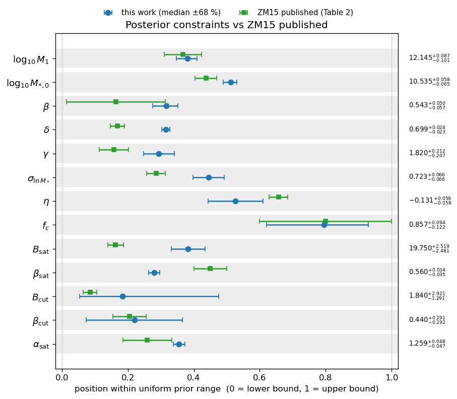
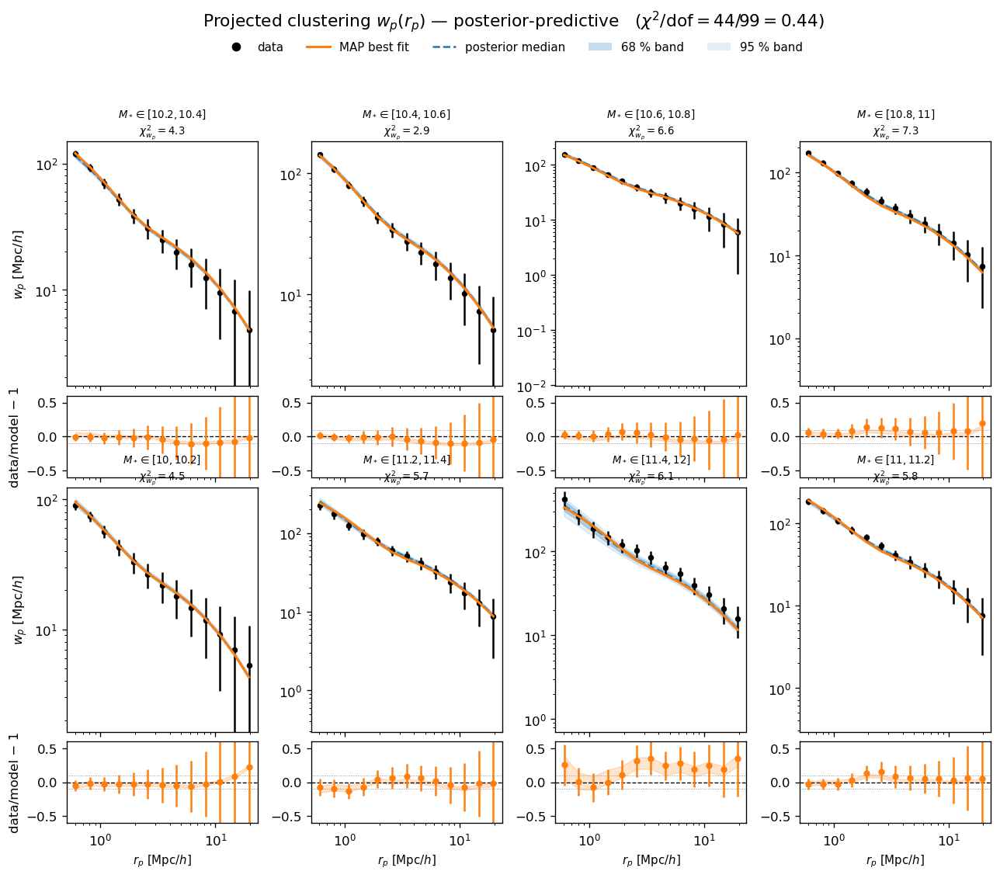
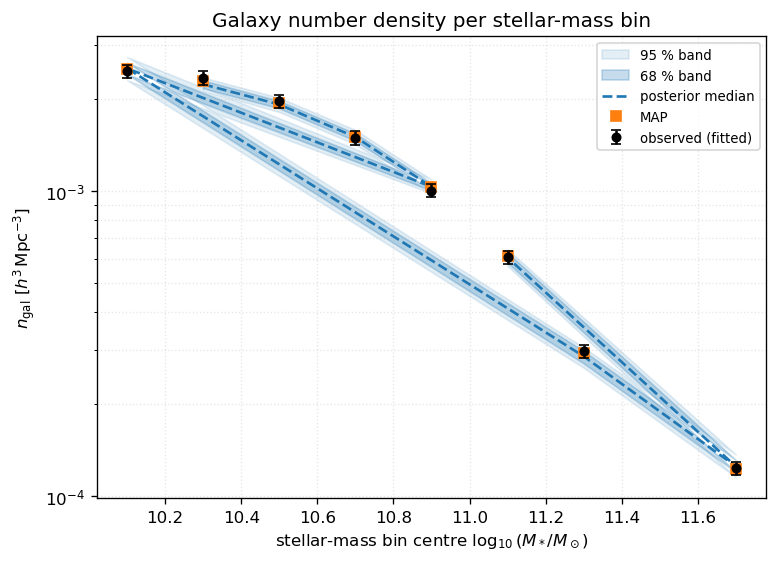
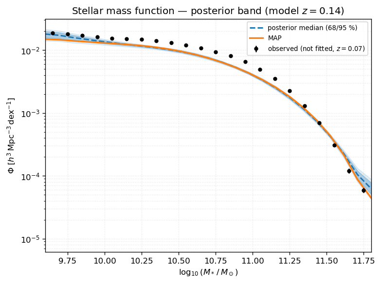
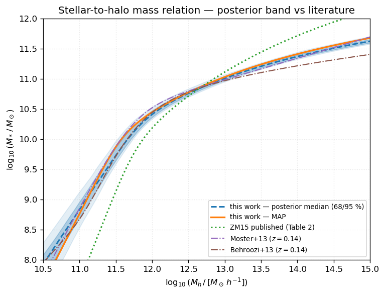
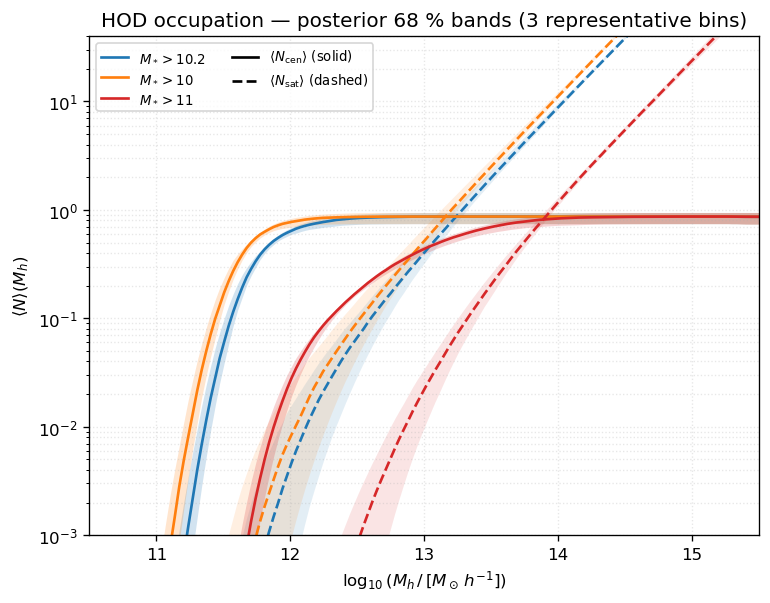
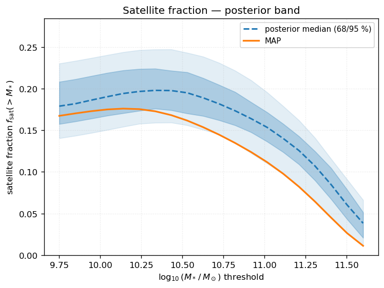

.. _bgs_zm15_joint_mcmc:

BGS × LS10 — Zu & Mandelbaum 2015 joint :math:`w_p` + :math:`n_{\rm gal}` MCMC
==============================================================================================

This page exploits the finished MCMC posterior of the global inverse-HOD fit of
:class:`~hod_mod.connection.hod.ZuMandelbaum15HODModel` (Zu & Mandelbaum 2015) to the
DESI Bright Galaxy Survey (BGS) LS10 stellar-mass-binned campaign.  A **single** set of
thirteen SHMR + scatter + satellite parameters is fit **simultaneously** to all eight
stellar-mass bins, using the projected clustering :math:`w_p(r_p)` and the galaxy number
density :math:`n_{\rm gal}` of every bin (**no lensing** in this run).

The chain was produced by ``oarsub/fit_bgs_zm15_joint_mcmc.sh`` running
:mod:`hod_mod.scripts.fitting.bgs_ls10.fit_bgs_zm15_joint` (``--mode mcmc --surveys``,
i.e. ``wp`` + ``n_gal`` only) with **hod_mod 0.2.1**.  The figures on this page are
regenerated from ``flatchain.npz`` + ``map_result.json`` by
:mod:`hod_mod.scripts.fitting.bgs_ls10.plot_bgs_zm15_joint_posterior`.

**Sample** — BGS LS10 VLIM, any spectral type,
:math:`10.0 \leq \log_{10}(M_*/M_\odot) < 12.0`, :math:`0.05 < z < 0.18`,
:math:`N_{\rm gal} = 2\,759\,238`, :math:`h = 0.674`.  Eight bins in
:math:`\log_{10}(M_*/M_\odot)` of width 0.2 dex (the top bin, 11.4–12.0, is wider), each
with its own measured effective redshift :math:`z_{\rm mean}`.

The fit is **excellent**: :math:`\chi^2/\mathrm{dof} = 44.0/99 = 0.44` at the MAP.

----

Data and likelihood
--------------------

Each bin contributes its clustering and abundance to one summed Gaussian log-likelihood
with shared parameters:

.. math::

   \log P(\theta) = \log \pi(\theta)
                  - \tfrac12 \sum_{\rm bins} \Big[ \chi^2_{w_p} + \chi^2_{n_g} \Big].

- :math:`w_p(r_p)` over :math:`0.5 \leq r_p \leq 20` Mpc/:math:`h` (13 radial bins/bin),
  compared in native Mpc/:math:`h`; the inverse jackknife covariance carries a 1 % diagonal
  ridge (:func:`~hod_mod.scripts.fitting.bgs_ls10.fit_bgs_zm15_joint._regularised_icov`).
- :math:`n_{\rm gal}` (one point per bin) in :math:`h^3\,{\rm Mpc}^{-3}`, with a 5 %
  fractional-error floor.

Data vector: :math:`n_{\rm data} = 8\times(13+1) = 112`; :math:`n_{\rm free} = 13`;
:math:`n_{\rm dof} = 99`.  The observables are read via
:class:`~hod_mod.data_io.sum_stat_reader.SumStatReader` from the ``sum_stat``
``BGS_Mstar10_massbins`` joint HDF5 files.

Sampler configuration
~~~~~~~~~~~~~~~~~~~~~~~

``emcee`` ``EnsembleSampler``, 32 walkers, 500 burn-in + 2000 production steps
(one continuous, resumable HDF5-backed chain).  Walkers are seeded in a tight ball around
the MAP best fit (Powell).  Discarding burn-in leaves
:math:`32 \times 2000 = 64\,000` posterior samples.

----

Goodness of fit
---------------

Per-bin MAP :math:`\chi^2` breakdown (from ``map_result.json``).  The fit quality is
uniform across the stellar-mass range and clustering-dominated; the abundance
contributes negligibly.

.. list-table::
   :header-rows: 1
   :widths: 22 20 20 20

   * - :math:`\log_{10} M_*` bin
     - :math:`\chi^2_{w_p}`
     - :math:`\chi^2_{n_g}`
     - :math:`\chi^2_{\rm total}`
   * - 10.0 – 10.2
     - 4.49
     - 0.124
     - 4.61
   * - 10.2 – 10.4
     - 4.29
     - 0.272
     - 4.56
   * - 10.4 – 10.6
     - 2.94
     - 0.044
     - 2.99
   * - 10.6 – 10.8
     - 6.58
     - 0.005
     - 6.58
   * - 10.8 – 11.0
     - 7.27
     - 0.284
     - 7.56
   * - 11.0 – 11.2
     - 5.84
     - 0.039
     - 5.88
   * - 11.2 – 11.4
     - 5.70
     - 0.053
     - 5.76
   * - 11.4 – 12.0
     - 6.09
     - 0.000
     - 6.09
   * - **Total**
     - **43.20**
     - **0.82**
     - **44.03**

:math:`\chi^2/\mathrm{dof} = 0.44 < 1` indicates the reported errors are conservative:
the 5 % :math:`n_{\rm gal}` floor and the 1 % covariance ridge both inflate the effective
uncertainties.  The parameter **credible intervals below should therefore be read as
upper bounds on the true statistical precision**.

----

Posterior parameter constraints
-------------------------------

Marginalised posterior (median with 68 % credible interval) against the MAP best fit and
the published ZU & Mandelbaum 2015 global iHOD values (their Table 2, an SDSS Main-sample
fit *with* lensing — a different selection, so exact agreement is not expected).

.. list-table::
   :header-rows: 1
   :widths: 20 12 26 14 14

   * - Parameter
     - Symbol
     - Posterior (median :math:`\pm 68\%`)
     - MAP
     - ZM15 pub.
   * - ``lg_m1h``
     - :math:`\log_{10} M_1`
     - :math:`12.145^{+0.087}_{-0.101}`
     - 11.900
     - 12.10
   * - ``lg_m0star``
     - :math:`\log_{10} M_{*,0}`
     - :math:`10.535^{+0.058}_{-0.065}`
     - 10.367
     - 10.31
   * - ``beta``
     - :math:`\beta`
     - :math:`0.543^{+0.050}_{-0.057}`
     - 0.426
     - 0.33
   * - ``delta``
     - :math:`\delta`
     - :math:`0.699^{+0.024}_{-0.023}`
     - 0.616
     - 0.42
   * - ``gamma``
     - :math:`\gamma`
     - :math:`1.820^{+0.212}_{-0.207}`
     - 1.686
     - 1.21
   * - ``sigma_lnmstar``
     - :math:`\sigma_{\ln M_*}`
     - :math:`0.723^{+0.066}_{-0.066}`
     - 0.823
     - 0.50
   * - ``eta``
     - :math:`\eta`
     - :math:`-0.131^{+0.059}_{-0.058}`
     - −0.227
     - −0.04
   * - ``fc``
     - :math:`f_c`
     - :math:`0.857^{+0.094}_{-0.122}`
     - 0.754
     - 0.86
   * - ``bsat``
     - :math:`B_{\rm sat}`
     - :math:`19.75^{+2.52}_{-2.48}`
     - 17.544
     - 8.98
   * - ``beta_sat``
     - :math:`\beta_{\rm sat}`
     - :math:`0.560^{+0.034}_{-0.035}`
     - 0.493
     - 0.90
   * - ``bcut``
     - :math:`B_{\rm cut}`
     - :math:`1.84^{+2.92}_{-1.29}`
     - 9.634
     - 0.86
   * - ``beta_cut``
     - :math:`\beta_{\rm cut}`
     - :math:`0.440^{+0.292}_{-0.292}`
     - 0.820
     - 0.41
   * - ``alpha_sat``
     - :math:`\alpha_{\rm sat}`
     - :math:`1.259^{+0.048}_{-0.047}`
     - 1.250
     - 1.00

**Reading the posterior:**

- The SHMR parameters (:math:`\log_{10} M_1, \log_{10} M_{*,0}, \delta, \sigma_{\ln M_*}`)
  and the satellite power-law index :math:`\alpha_{\rm sat}` are **tightly constrained**.
- :math:`B_{\rm cut}` and :math:`\beta_{\rm cut}` — the satellite low-mass cut-off — are
  **poorly constrained / prior-dominated**: :math:`w_p` + :math:`n_{\rm gal}` alone carry
  little information about the exact cut-off shape.  This is why the MAP
  (:math:`B_{\rm cut}=9.6`) sits far from the posterior median (1.84): the total
  :math:`\chi^2` is nearly flat in :math:`B_{\rm cut}`, so the point estimate is not
  meaningful for this parameter.
- Several parameters are offset from the SDSS ZM15 values.  This is **expected**: the BGS
  :math:`M_*>10^{10}\,M_\odot` selection at :math:`z\approx0.13` differs from the SDSS
  Main sample, and this run uses no lensing.  Notably the satellite normalisation
  :math:`B_{\rm sat}\approx 20` is roughly twice the SDSS value.

   Full 13-parameter posterior.  Orange lines mark the MAP best fit — it lies inside every
   contour.  Clear degeneracies are visible, most strikingly the tight
   :math:`B_{\rm sat}`–:math:`\alpha_{\rm sat}` anticorrelation (satellite amplitude vs
   slope) and the :math:`\log_{10}M_1`–:math:`\log_{10}M_{*,0}` correlation.  The
   :math:`B_{\rm cut}` and :math:`f_c` posteriors pile up against their prior edges.

   Forest plot: this-work posterior (blue, median :math:`\pm 68\%`) vs published ZM15
   Table 2 (green), each parameter normalised to its uniform prior range.  Values printed at
   right are the this-work medians.

----

Posterior-predictive observables
--------------------------------

The following figures propagate a random subsample of the chain through the full halo
model, giving 68 %/95 % credible bands on each **fitted** observable.

   Projected clustering :math:`w_p(r_p)` for all eight bins.  Black points are the data,
   the orange line is the MAP, and the blue band is the posterior-predictive 68 %/95 %
   interval.  Lower strips show ``data/model − 1``: residuals are within :math:`\pm10\%`
   across the fitted range, consistent with :math:`\chi^2/\mathrm{dof}<1`.

   Galaxy number density per stellar-mass bin: observed (black, fitted) vs
   posterior-predictive band and MAP.  The abundance is reproduced to well within its 5 %
   error floor in every bin.

   Model stellar mass function (posterior band, derived from the cumulative
   :math:`n_{\rm gal}` of the fitted HOD) compared to the **independent, not-fitted**
   ``sum_stat`` SMF.  Agreement here is a genuine consistency check.

----

Derived relations
-----------------

Analytic quantities implied by the posterior (fast to sample, so these use a larger draw
budget than the observables above).

   Stellar-to-halo mass relation :math:`M_*(M_h)`.  Blue: this-work posterior band and MAP;
   green dotted: ZM15 published; dash-dot: Moster+2013 and Behroozi+2013 at the sample
   effective redshift.  The BGS-constrained SHMR sits slightly above the abundance-matching
   relations at the pivot, reflecting the larger fitted scatter :math:`\sigma_{\ln M_*}`.

   Central (solid) and satellite (dashed) occupation :math:`\langle N\rangle(M_h)` with
   68 % posterior bands, for three representative stellar-mass thresholds.  The satellite
   branch is well localised in amplitude; its low-mass turn-over (governed by
   :math:`B_{\rm cut},\beta_{\rm cut}`) is the least-constrained feature.

   Satellite fraction :math:`f_{\rm sat}(>M_*)` as a function of the stellar-mass
   threshold, with posterior band and MAP.  :math:`f_{\rm sat}` decreases with increasing
   :math:`M_*` as expected, and is constrained at the few-percent level over most of the
   range.

----

Reproduce
---------

Regenerate every figure on this page from the finished chain::

    JAX_PLATFORMS=cpu HOD_MOD_SUMSTAT=/home/comparat/software/sum_stat/data \
      python -m hod_mod.scripts.fitting.bgs_ls10.plot_bgs_zm15_joint_posterior \
        --out-dir $HOD_MOD_RESULTS/bgs_zm15_joint_wp_ngal

The expensive :math:`w_p`/:math:`n_{\rm gal}` bands re-run the halo model per draw
(:math:`\sim 7`\ s/draw after a one-time JAX compile); ``--n-draws`` /
``--n-draws-analytic`` / ``--n-draws-derived`` tune the sampling budgets, and
``--figures`` restricts which panels are produced.

The chain itself is regenerated (or resumed) with::

    oarsub -S ./oarsub/fit_bgs_zm15_joint_mcmc.sh          # GRICAD/OAR
    # or locally:
    python -m hod_mod.scripts.fitting.bgs_ls10.fit_bgs_zm15_joint \
        --surveys --mode mcmc --rp-min 0.5 --rp-max 20 \
        --n-walkers 32 --n-burnin 500 --n-steps 2000 \
        --out-dir $HOD_MOD_RESULTS/bgs_zm15_joint_wp_ngal

----

References
----------

- Zu & Mandelbaum 2015, MNRAS 454, 1161
  (`arXiv:1505.02781 <https://arxiv.org/abs/1505.02781>`_)
- Moster, Naab & White 2013, MNRAS 428, 3121
  (`arXiv:1205.5807 <https://arxiv.org/abs/1205.5807>`_)
- Behroozi, Wechsler & Conroy 2013, ApJ 770, 57
  (`arXiv:1207.6105 <https://arxiv.org/abs/1207.6105>`_)
