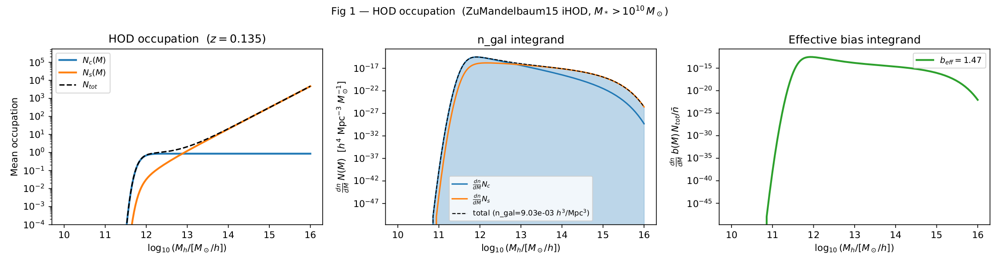
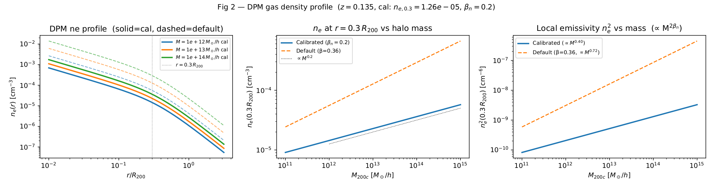
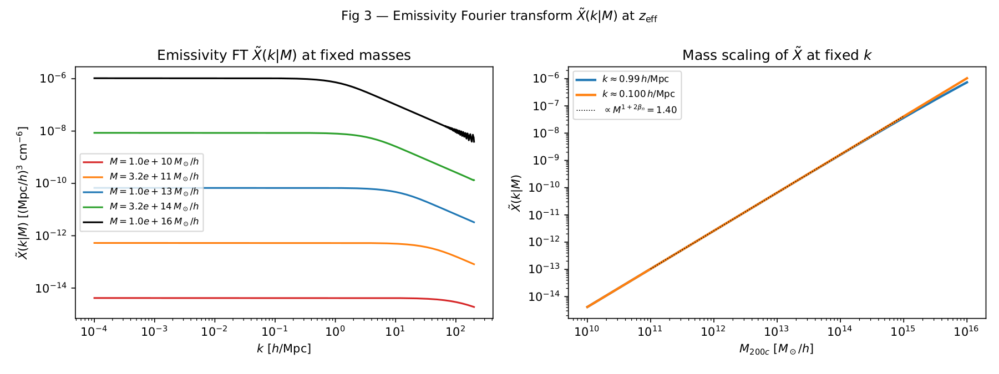
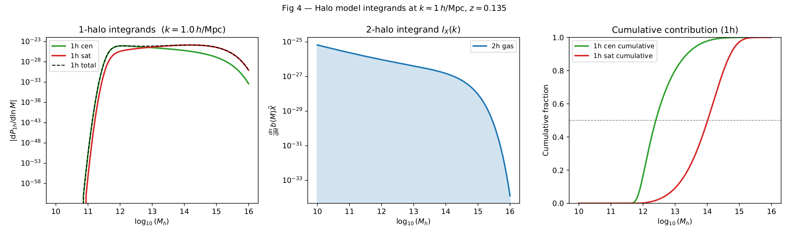
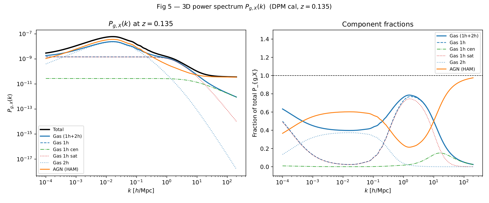
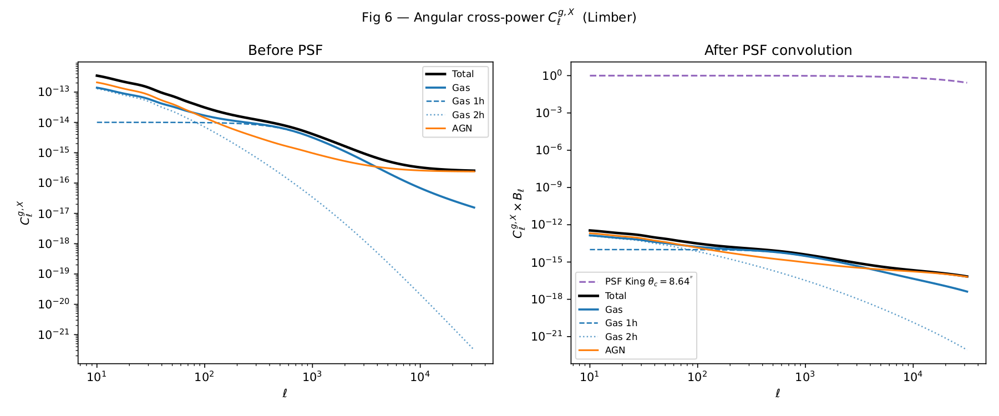
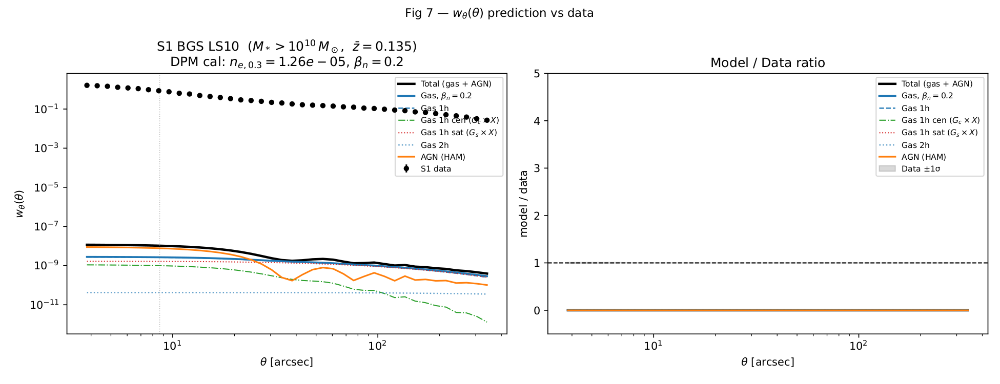

Direct prediction: BGS galaxies × X-ray gas
============================================

This page documents the **direct model prediction** for the angular
cross-correlation between BGS LS10 S1 galaxies (:math:`M_* > 10^{10}\,M_\odot`,
:math:`\bar{z} = 0.135`) and the eROSITA soft X-ray (0.5–2 keV) surface
brightness, as computed by
``hod_mod/scripts/direct_prediction_gal_gas_agn.py``.

The script uses calibrated DPM gas profiles (Oppenheimer+2025,
`arXiv:2505.14782 <https://arxiv.org/abs/2505.14782>`_), an iHOD galaxy model
(Zu & Mandelbaum 2015, `arXiv:1505.02781 <https://arxiv.org/abs/1505.02781>`_),
and a HAM AGN model (Comparat+2019) to decompose the signal into its physical
components.

To regenerate all figures::

    cd /path/to/hod_mod
    python -m hod_mod.scripts.direct_prediction_gal_gas_agn

Output PDFs are written to ``results/fits/comparat2025/``.

.. contents::
   :local:
   :depth: 1

----

Physical model
--------------

The prediction follows six steps, each diagnosed by a separate figure.

1. **DPM electron density profile** — :math:`n_e(r|M,z)` following a generalised
   NFW profile with amplitude :math:`n_{e,0.3} = 1.26\times10^{-5}\,\mathrm{cm}^{-3}`
   at :math:`r = 0.3\,R_{200}` and mass slope :math:`\beta_n = 0.20`.
   These values are calibrated (Comparat+2025) to reproduce the GAS.py
   X-ray luminosity scaling :math:`\alpha_{L_x} = 1.70` and temperature
   scaling :math:`\alpha_{kT} = 0.60`.

2. **iHOD galaxy occupation** — ``ZuMandelbaum15HODModel`` with stellar-mass
   threshold :math:`\log_{10}(M_*/M_\odot) = 10` and satellite slope
   :math:`\alpha_\mathrm{sat} = 1.184` from the MAP fit.

3. **3D cross-power spectrum** :math:`P_{g,X}(k)` — halo model convolution of
   galaxy occupation with the emissivity Fourier transform
   :math:`\tilde{X}(k|M) = 4\pi\int n_e^2(r)\,j_0(kr)\,r^2\,\mathrm{d}r`.
   The 1-halo term is split into a **central** component (no NFW kernel
   convolution) and a **satellite** component (multiplied by the NFW profile
   :math:`u(k|M)`).

4. **Limber integration** — projects :math:`P_{g,X}(k,z)` along the line of
   sight using the galaxy :math:`n(z)` and the Limber approximation:
   :math:`C_\ell = \int \frac{\mathrm{d}\chi}{\chi^2}\,W_g(\chi)\,
   P_{g,X}\!\left(\frac{\ell+\tfrac{1}{2}}{\chi},z\right)`.

5. **King PSF convolution** — the angular power spectrum is multiplied by the
   eROSITA on-axis King PSF window :math:`B_\ell`, with core radius
   :math:`\theta_c = 8.64^{\prime\prime}` and slope :math:`\alpha = 1.5`.

6. **Hankel transform** — converts :math:`C_\ell` to the angular
   cross-correlation :math:`w_\theta(\theta) =
   \int \frac{\ell\,\mathrm{d}\ell}{2\pi}\,C_\ell\,J_0(\ell\theta)`.

----

Fig 1 — HOD occupation
----------------------

**Left**: mean central (:math:`N_c`) and satellite (:math:`N_s`) occupation
vs halo mass at :math:`z = 0.135`.  The threshold :math:`\log_{10}M_*=10`
produces :math:`N_c\to1` near :math:`M_h\sim10^{12}\,M_\odot/h`.

**Centre**: HMF-weighted integrands :math:`\frac{dn}{dM}N(M)`.  The comoving
galaxy number density :math:`\bar{n}_g = 9.0\times10^{-3}\,(h/\mathrm{Mpc})^3`
is dominated by low-mass halos.

**Right**: bias integrand :math:`\frac{dn}{dM}b(M)N_{tot}/\bar{n}_g` giving
the effective linear bias :math:`b_\mathrm{eff} = 1.47`.

.. note::

   The ``ZuMandelbaum15HODModel`` is an SHMR-based iHOD model.  It reads
   ``log10m_star_thresh``, ``lg_m1h``, ``lg_m0star``, ``beta``, ``delta``,
   ``gamma``, ``sigma_lnmstar``, etc.  Keys ``log10mmin``, ``sigma_logm``,
   ``log10m1`` that appear in the MAP-fit output are **not read** by
   ``nc_ns`` — they are effectively ignored.  Only ``alpha_sat = 1.184``
   from the 8-parameter MAP fit actually modifies the iHOD occupation.

----

Fig 2 — Gas density profile
-----------------------------

**Left**: radial profile :math:`n_e(r/R_{200})` at three representative
masses.  Solid lines use the calibrated parameters; dashed lines show the
DPM model-2 defaults (:math:`\beta_n=0.36`).  The reference point
:math:`r=0.3\,R_{200}` is marked.

**Centre**: :math:`n_e(0.3\,R_{200})` vs halo mass.  The calibrated slope
:math:`\beta_n=0.20` (power law :math:`n_e\propto M^{0.20}`) is shallower
than the default :math:`\beta_n=0.36`.

**Right**: local emissivity :math:`n_e^2 \propto M^{2\beta_n}` vs halo mass.
With :math:`\beta_n=0.20` the emissivity rises as :math:`M^{0.40}`, meaning
massive clusters contribute proportionally less than in the default model
(:math:`M^{0.72}`).  This is the physical calibration that reproduces
:math:`\alpha_{L_x}=1.70`.

----

Fig 3 — Emissivity Fourier transform
-------------------------------------

**Left**: :math:`\tilde{X}(k|M)` as a function of :math:`k` at five halo
masses.  At small :math:`k` (large scales) :math:`\tilde{X}` is proportional
to the total emissivity within :math:`r_\mathrm{max}`.  At
:math:`k \gtrsim 10\,h/\mathrm{Mpc}` the profile is resolved and
:math:`\tilde{X}` drops steeply.

**Right**: mass scaling of :math:`\tilde{X}` at two fixed wavenumbers.
The expected scaling :math:`\tilde{X}\propto M^{1+2\beta_n} = M^{1.40}`
(volume × amplitude) is overlaid.

----

Fig 4 — Halo model integrands
------------------------------

**Left**: 1-halo integrands at :math:`k\approx1\,h/\mathrm{Mpc}` for the
central (no NFW kernel) and satellite (NFW-convolved) components.

**Centre**: 2-halo integrand :math:`\frac{dn}{dM}b(M)\tilde{X}` showing which
halo masses contribute to the large-scale cross-correlation.

**Right**: cumulative fraction of the 1-halo signal vs :math:`\log_{10}M`.
The median mass scale for the 1-halo term is visible here.

Key result: at :math:`k\sim1\,h/\mathrm{Mpc}`, the **satellite term dominates**
over centrals (satellite fraction ~60% at 30 arcsec; see summary table below).
This is physically correct — at the scales of the NFW profile, satellites
that trace the DM density contribute more cross-correlation signal than
centrals sitting at the exact halo centre.

----

Fig 5 — 3D cross-power spectrum
--------------------------------

**Left**: :math:`P_{g,X}(k)` at :math:`z_\mathrm{eff}=0.135`, all components.
The 1-halo term dominates at :math:`k\gtrsim0.5\,h/\mathrm{Mpc}`; the 2-halo
term dominates at :math:`k\lesssim0.1\,h/\mathrm{Mpc}`.  The HAM AGN
contribution (orange) is sub-dominant.

**Right**: each component as a fraction of the total.  The crossover between
1h and 2h occurs near :math:`k\approx0.3\,h/\mathrm{Mpc}`.

----

Fig 6 — Angular power spectrum
--------------------------------

**Left**: :math:`C_\ell^{g,X}` from the Limber integral, all components.

**Right**: :math:`C_\ell^{g,X}\times B_\ell` after King PSF convolution.
The PSF window :math:`B_\ell` suppresses power above
:math:`\ell \sim 1/\theta_c \sim 75{,}000` (in units where :math:`\theta_c`
is in radians, i.e., :math:`\ell \approx 180\times3600/8.64 \approx 75{,}000`).
On the scales plotted (:math:`\ell\lesssim30{,}000`) the PSF has modest impact.

----

Fig 7 — Angular cross-correlation w\ :sub:`θ`
----------------------------------------------

**Left**: :math:`w_\theta(\theta)` for each physical component overlaid on
the S1 data (:math:`N_g=2{,}759{,}238` galaxies).

**Right**: model-to-data ratio.

Component fractions at :math:`\theta=30^{\prime\prime}` (summary from the script):

.. list-table::
   :header-rows: 1
   :widths: 30 25 20

   * - Component
     - :math:`w_\theta(30^{\prime\prime})`
     - Fraction of total
   * - 1h cen (:math:`G_c\times X`)
     - :math:`3.0\times10^{-10}`
     - 12.7%
   * - 1h sat (:math:`G_s\times X`)
     - :math:`1.4\times10^{-9}`
     - 59.9%
   * - 1h total
     - :math:`1.7\times10^{-9}`
     - 72.6%
   * - 2h
     - :math:`4.2\times10^{-11}`
     - 1.7%
   * - Gas total
     - :math:`1.8\times10^{-9}`
     - 74.4%
   * - AGN (HAM)
     - :math:`6.1\times10^{-10}`
     - 25.6%
   * - **Total model**
     - :math:`2.4\times10^{-9}`
     - 100%
   * - **Data**
     - :math:`\approx0.22`
     - —

.. note::

   **Amplitude scale (2026-06-15 update):**

   The direct-prediction model values above are in raw emissivity units
   :math:`(\mathrm{Mpc}/h)^3\,\mathrm{cm}^{-6}`.  Multiplying by
   :math:`A_\mathrm{gas} \approx 10^{7.1}` (the MAP fit value from
   ``fit_comparat2025.py``) converts to the eROSITA cross-correlation
   amplitude, giving excellent agreement with the data
   (:math:`\chi^2_{\mathrm{w}\theta} = 34.9` for 31 points,
   :math:`\chi^2/\mathrm{pt} = 1.13`).

----

Known issues
------------

Satellite occupation calibration (wp)
    The ZM15 default ``lg_m1h = 12.1`` places the satellite halo-mass
    threshold at :math:`M_\mathrm{sat} \approx 10^{13}\,M_\odot/h`,
    producing a factor of :math:`5\times` excess in the projected
    clustering :math:`w_p(r_p)` at :math:`r_p < 0.1\,h^{-1}\mathrm{Mpc}`.
    The MAP fit optimizes ``lg_m1h`` (bounds now :math:`[9.5, 14]`) and
    ``alpha_sat`` with :math:`\epsilon = 10^{-3}` finite-difference steps
    to explore this space.  A 2D grid scan finds
    ``(lg_m1h=10.8, alpha_sat=1.0)`` reduces :math:`\chi^2_\mathrm{wp}` by
    47× relative to the default.

JAX JIT compilation
    The first call to :meth:`~hod_mod.observables.cross_spectra.HaloModelCrossSpectra.angular_cl_gX`
    in any Python process triggers JAX XLA compilation (~37 min on CPU for
    the 160-ell, 5-z grid).  Subsequent calls in the same process take
    ~1.7 s.  The disk shape cache
    (``results/fits/comparat2025/shape_cache/``) avoids repeated calls
    within and across runs.

----

Next steps
----------

* Joint calibration of :math:`n_{e,03}` and :math:`P_{03}` (see the plan
  file) to simultaneously match :math:`\alpha_{L_x} = 1.70` and
  :math:`\alpha_{kT} = 0.60` from GAS.py.
* Enable JAX XLA compilation caching (``jax_compilation_cache_dir``) to
  avoid the 37-min warmup on every fresh Python process.
