Forward Model Showcase
======================

This page illustrates the full HOD forward-model pipeline for a fiducial
Planck 2018 cosmology (`arXiv:1807.06209 <https://arxiv.org/abs/1807.06209>`_)
using the Tinker+2008 HMF (`arXiv:0803.2706 <https://arxiv.org/abs/0803.2706>`_),
the More+2015 HOD (`arXiv:1407.1856 <https://arxiv.org/abs/1407.1856>`_),
the **beyond-linear halo bias** correction of Mead & Verde 2021
(`arXiv:2011.08858 <https://arxiv.org/abs/2011.08858>`_, implemented in
:class:`~hod_mod.core.beyond_linear_bias.BeyondLinearBiasMead21`),
and the NLA intrinsic-alignment model
(`arXiv:0705.0166 <https://arxiv.org/abs/0705.0166>`_).

These figures are pre-generated by a sensitivity-study driver that exercises the
public API documented on this page, and ship with the documentation under
``docs/_images/``.

.. contents::
   :local:
   :depth: 1

----

Pipeline Summary
----------------

The table below identifies which pipeline feature each HOD model variant
supports. ✓ = supported; — = not applicable / uses a different mechanism.
Abbreviations: Zh07 = Zheng+2007, K04 = Kravtsov+2004,
Mo15 = More+2015, ZM15 = Zu & Mandelbaum 2015,
VU16 = van Uitert+2016, Za25 = Zacharegkas+2025,
Gu18 = Guo+2018 ICSMF, Gu19 = Guo+2019 ICSMF,
ZM16Q = ZuMandelbaum16Quenching.

.. list-table:: HOD model feature matrix
   :header-rows: 1
   :widths: 38 7 7 7 7 7 7 7 7 7

   * - Feature / pipeline step
     - Zh07
     - K04
     - Mo15
     - ZM15
     - VU16
     - Za25
     - Gu18
     - Gu19
     - ZM16Q
   * - :math:`P_{\rm lin}` → HMF → :math:`b(M)` → :math:`c(M)` → :math:`\tilde{u}(k|M)`
     - ✓
     - ✓
     - ✓
     - ✓
     - ✓
     - ✓
     - ✓
     - ✓
     - ✓
   * - :math:`N_c` via erfc threshold on halo mass
     - ✓
     - ✓
     - ✓
     - —
     - —
     - —
     - —
     - —
     - —
   * - :math:`N_c` via SHMR + stellar-mass threshold
     - —
     - —
     - —
     - ✓
     - —
     - ✓
     - —
     - —
     - —
   * - :math:`N_c` via SHMR + stellar-mass bin (CSMF)
     - —
     - —
     - —
     - —
     - ✓
     - —
     - ✓
     - ✓
     - —
   * - :math:`N_s` via power law :math:`(M-M_0)/M_1`
     - ✓
     - —
     - ✓
     - —
     - —
     - —
     - —
     - —
     - —
   * - :math:`N_s` via :math:`N_c\,(M/M_1)^\alpha\exp(-M_0/M)`
     - —
     - ✓
     - —
     - ✓
     - —
     - ✓
     - ✓
     - ✓
     - —
   * - :math:`N_s` via CSMF Schechter integral
     - —
     - —
     - —
     - —
     - ✓
     - —
     - ✓
     - ✓
     - —
   * - Satellite cut-off :math:`\kappa M_{\min}`
     - —
     - —
     - ✓
     - —
     - —
     - —
     - —
     - —
     - —
   * - Incompleteness correction :math:`f_{\rm inc}(M)`
     - —
     - —
     - ✓
     - —
     - —
     - —
     - ✓
     - ✓
     - —
   * - Mass-dependent scatter :math:`\sigma_{\ln M_*}(M)`
     - —
     - —
     - —
     - ✓
     - —
     - —
     - —
     - —
     - —
   * - Red/blue quenching fractions :math:`f_{\rm red}(M)`
     - —
     - —
     - —
     - —
     - —
     - —
     - —
     - ✓
     - ✓
   * - Off-centering :math:`W_{\rm off}(k)` (Johnston+2007)
     - ✓
     - ✓
     - ✓
     - ✓
     - ✓
     - ✓
     - ✓
     - ✓
     - ✓
   * - NLA intrinsic-alignment correction
     - ✓
     - ✓
     - ✓
     - ✓
     - ✓
     - ✓
     - ✓
     - ✓
     - ✓
   * - Beyond-linear bias :math:`\beta^{\rm NL}(k,\nu_1,\nu_2)` (Mead & Verde 2021)
     - ✓
     - ✓
     - ✓
     - ✓
     - ✓
     - ✓
     - ✓
     - ✓
     - ✓
   * - :math:`P_{gg},\,P_{gm}` → :math:`w_p(r_p),\,\Delta\Sigma(R)`
     - ✓
     - ✓
     - ✓
     - ✓
     - ✓
     - ✓
     - ✓
     - ✓
     - ✓

The cosmological steps shared by all models are:
:class:`~hod_mod.core.power_spectrum.LinearPowerSpectrum` ``.pk_linear()`` (CAMB) →
:class:`~hod_mod.core.halo_mass_function.HaloMassFunction` ``.dndm()`` / ``.bias()`` →
:class:`~hod_mod.core.beyond_linear_bias.BeyondLinearBiasMead21` (beyond-linear :math:`\beta^{\rm NL}`) →
:class:`~hod_mod.core.halo_profiles.HaloProfile` ``.concentration()`` / ``nfw_uk()`` / ``einasto_uk()`` →
:mod:`hod_mod.connection.hod` ``.nc_ns()`` →
:meth:`~hod_mod.observables.clustering.FullHaloModelPrediction.wp` /
:meth:`~hod_mod.observables.clustering.FullHaloModelPrediction.delta_sigma`.

----

1. Linear Matter Power Spectrum
--------------------------------

The linear matter power spectrum :math:`P_{\rm lin}(k,z)` is computed via
CAMB (`arXiv:astro-ph/9911177 <https://arxiv.org/abs/astro-ph/9911177>`_)
at the BGS effective redshift :math:`z = 0.14`.  Two additional curves show
the :math:`\pm 3\sigma` S8 variation from Planck 2018 (S8 = 0.832 ± 0.013):

.. math::

    P_{\rm lin}^{{\rm S8}\pm 3\sigma}(k) = P_{\rm lin}^{\rm fid}(k)
    \times \left(\frac{\sigma_{8,\pm}}{\sigma_{8,{\rm fid}}}\right)^2

since :math:`P_{\rm lin} \propto A_s \propto \sigma_8^2` at fixed shape.

.. math::

    P_{\rm lin}(k, z) \propto k^{n_s} T^2(k)\, D^2(z)
    \quad [(h^{-1}\,{\rm Mpc})^3]

where :math:`T(k)` is the matter transfer function (Lewis, Challinor & Lasenby 2000)
and :math:`D(z)` the linear growth factor.  The fiducial parameters are the
Planck 2018 best-fit: :math:`h=0.6736`, :math:`\Omega_m=0.3100`,
:math:`n_s=0.9649`, :math:`\ln(10^{10}A_s)=3.044`.

**References:** Lewis, Challinor & Lasenby 2000 (`arXiv:astro-ph/9911177
<https://arxiv.org/abs/astro-ph/9911177>`_); Planck 2018
(`arXiv:1807.06209 <https://arxiv.org/abs/1807.06209>`_).

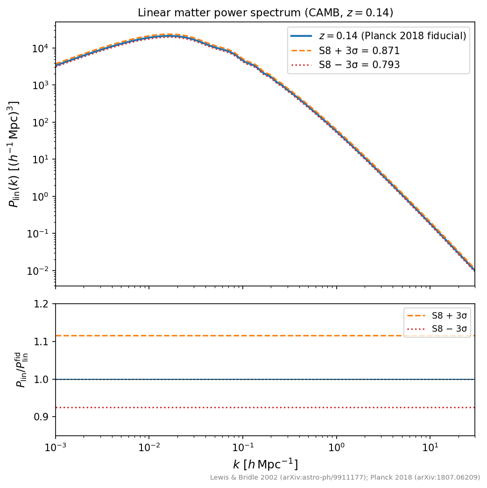

   Linear matter power spectrum :math:`P_{\rm lin}(k)` at :math:`z=0.14` with
   :math:`\pm 3\sigma` S8 variation (Planck 2018).

----

2. Non-Linear Matter Power Spectrum
-------------------------------------

On scales :math:`k \gtrsim 0.1\,h\,{\rm Mpc}^{-1}` gravitational collapse drives
the power spectrum above the linear prediction.
The ratio :math:`P_{\rm nl}/P_{\rm lin}` captures the 1-halo boost, mode coupling,
and quasi-linear BAO damping.  The 1-halo + 2-halo decomposition in
:class:`~hod_mod.observables.clustering.FullHaloModelPrediction` uses
:math:`P_{\rm lin}` for the 2-halo term and mass-integrated NFW profiles for the
1-halo term — the total galaxy power spectrum does **not** directly use
:math:`P_{\rm nl}`, but it is available for diagnostic comparisons and as an
optional non-linear 2-halo term (``nl_2halo=True``).

Four backends are implemented in :mod:`hod_mod.core.nonlinear`:

.. list-table:: Non-linear P(k) backends
   :header-rows: 1
   :widths: 22 18 20 40

   * - Class
     - Reference
     - Valid range
     - Notes
   * - :class:`~hod_mod.core.nonlinear.NonLinearPowerSpectrum`
       ``(backend='aletheia')``
     - Sanchez 2025 (`arXiv:2511.13826 <https://arxiv.org/abs/2511.13826>`_)
     - :math:`k \in [0.006, 2]\,{\rm Mpc}^{-1}`
     - Emulator; JAX-native ``pk_nonlinear_jax()`` available for autodiff
   * - :class:`~hod_mod.core.nonlinear.NonLinearPowerSpectrum`
       ``(backend='csst')``
     - Chen et al. 2025 CEmulator v2.0
     - :math:`k \in [0.005, 10]\,h\,{\rm Mpc}^{-1}`,  :math:`z \in [0, 3]`
     - Requires ``CEmulator`` package; supports CPL dark energy and :math:`m_\nu`
   * - :class:`~hod_mod.core.nonlinear.HALOFITSpectrum`
       ``(halofit_version='mead2020')``
     - Mead et al. 2020 (`arXiv:2009.01858 <https://arxiv.org/abs/2009.01858>`_)
     - :math:`k \in [10^{-4}, 20]\,h\,{\rm Mpc}^{-1}`
     - CAMB HMcode-2020 (default); also ``'takahashi'``, ``'original'``,
       ``'mead2020_feedback'``
   * - :class:`~hod_mod.core.nonlinear.WHMSpectrum`
       ``(whm_version='brieden2023')``
     - Brieden et al. 2025 (`arXiv:2508.10902 <https://arxiv.org/abs/2508.10902>`_)
     - :math:`k \in [10^{-2}, 10]\,h\,{\rm Mpc}^{-1}`
     - Web-Halo Model; **zero free parameters**; requires WHM-CAMB fork
       (``pip install -e WHM/WHM-CAMB``); variants: ``brieden2023_feedback``,
       ``brieden2023_halo``, ``brieden2023_fila``, ``brieden2023_sheet``

All backends share the same interface and can be wrapped with
:class:`~hod_mod.core.nonlinear.CachedPkNonlinear` for MCMC hot loops::

    from hod_mod.core.nonlinear import HALOFITSpectrum, WHMSpectrum, CachedPkNonlinear

    # Standard CAMB HMcode-2020
    pk_nl = CachedPkNonlinear(HALOFITSpectrum(halofit_version="mead2020"))

    # WHM (requires WHM-CAMB fork)
    pk_nl = CachedPkNonlinear(WHMSpectrum(whm_version="brieden2023"))

    # Pass to FullHaloModelPrediction for a non-linear 2-halo term
    pred = FullHaloModelPrediction(pk_lin, hod, profile, pk_nl=pk_nl, nl_2halo=True)

Figure generated by
``hod_mod/scripts/cosmology/plot_nonlinear_power_spectrum.py``.

**References:** Aletheia (`arXiv:2511.13826 <https://arxiv.org/abs/2511.13826>`_);
Mead et al. 2020 HMcode (`arXiv:2009.01858 <https://arxiv.org/abs/2009.01858>`_);
Takahashi et al. 2012 (`arXiv:1208.2701 <https://arxiv.org/abs/1208.2701>`_);
Smith et al. 2003 HALOFIT (`arXiv:astro-ph/0207664 <https://arxiv.org/abs/astro-ph/0207664>`_);
Brieden et al. 2025 WHM (`arXiv:2508.10902 <https://arxiv.org/abs/2508.10902>`_).

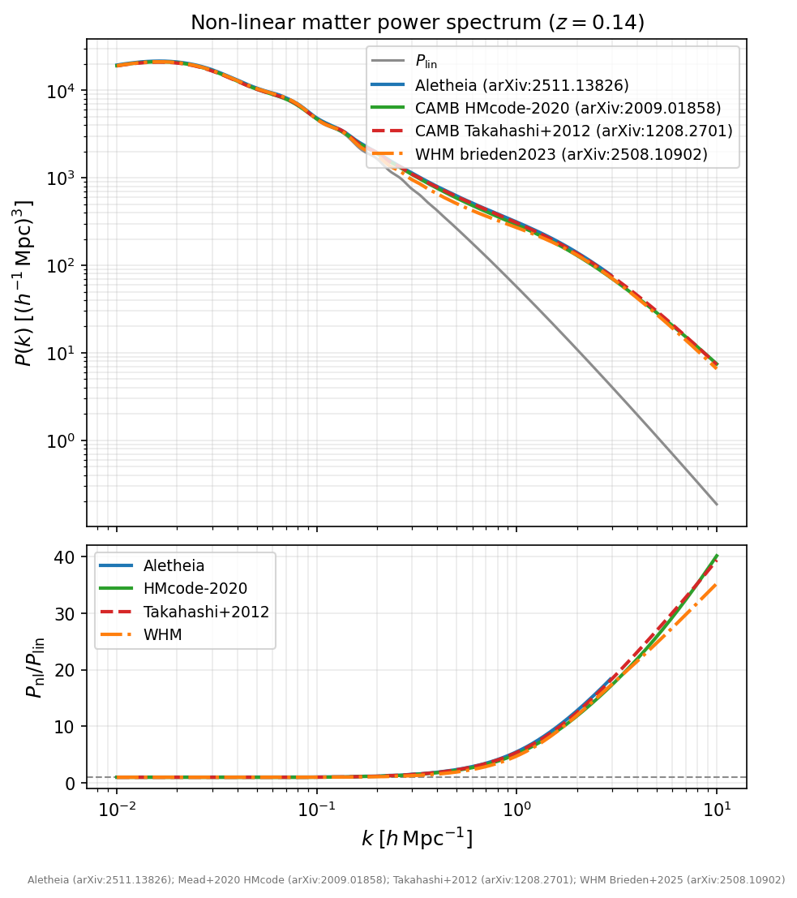

   Non-linear matter power spectrum :math:`P_{\rm nl}(k)` at :math:`z=0.14`
   (top) and boost ratio :math:`P_{\rm nl}/P_{\rm lin}` (bottom):
   Aletheia emulator, CAMB HMcode-2020, and CAMB Takahashi+2012 backends.
   WHM (Brieden+2025) shown once WHM-CAMB is installed.

----

3. Halo Mass Function and Linear Bias
--------------------------------------

The comoving number density of halos per unit mass interval is computed by
:meth:`~hod_mod.core.halo_mass_function.HaloMassFunction.dndm`:

.. math::

    \frac{\mathrm{d}n}{\mathrm{d}M}(M, z)
    = \frac{\bar{\rho}_m}{M}\,f(\sigma)\,
      \left|\frac{\mathrm{d}\ln\sigma}{\mathrm{d}M}\right|
    \quad [h^4\,M_\odot^{-1}\,{\rm Mpc}^{-3}]

where :math:`\sigma^2(M)` is the variance of the linear density field smoothed
on scale :math:`R = (3M/4\pi\bar{\rho}_m)^{1/3}`, evaluated by
:meth:`~hod_mod.core.halo_mass_function.HaloMassFunction.sigma`.
The multiplicity function :math:`f(\sigma)` follows Tinker et al. 2008
(calibrated to :math:`\Delta=200m`):

.. math::

    f(\sigma) = A\left[1 + \left(\frac{\sigma}{b}\right)^{-a}\right]
               \exp\!\left(-\frac{c}{\sigma^2}\right)

The large-scale linear bias :math:`b(M)` is returned by
:meth:`~hod_mod.core.halo_mass_function.HaloMassFunction.bias`
using the peak-background split (Tinker et al. 2010,
`arXiv:1001.3162 <https://arxiv.org/abs/1001.3162>`_).

**Class:**
:class:`~hod_mod.core.halo_mass_function.HaloMassFunction`
(``hod_mod/core/halo_mass_function.py``)::

    from hod_mod.core import HaloMassFunction
    from hod_mod.core.power_spectrum import LinearPowerSpectrum, rho_critical_0

    pklin  = LinearPowerSpectrum()
    rho_m  = rho_critical_0() * theta["Omega_m"]
    hmf    = HaloMassFunction(pklin.pk_linear, rho_mean=rho_m, model="tinker08")

    dndm   = hmf.dndm(m_h, z, theta)   # [h⁴ M⊙⁻¹ Mpc⁻³]
    bias   = hmf.bias(m_h, z, theta)   # dimensionless large-scale bias
    sigma  = hmf.sigma(m_h, z, theta)  # RMS density fluctuation σ(M,z)

:class:`~hod_mod.core.halo_mass_function.HaloMassFunction` is constructed
with the ``model`` keyword selecting the multiplicity function.  The 17
implemented models are listed in the table below.

.. list-table:: HMF multiplicity functions in :mod:`hod_mod.core.halo_mass_function`
   :header-rows: 1
   :widths: 30 35 35

   * - ``model=`` keyword
     - Function
     - Reference
   * - ``'tinker08'`` (library default; fitting pipelines use ``'csst'`` instead, see :doc:`cosmology`)
     - :func:`~hod_mod.core.halo_mass_function.fsigma_tinker08`
     - Tinker et al. 2008 (`arXiv:0803.2706 <https://arxiv.org/abs/0803.2706>`_)
   * - ``'press74'``
     - :func:`~hod_mod.core.halo_mass_function.fsigma_press74`
     - Press & Schechter 1974 (ApJ 187, 425)
   * - ``'sheth99'``
     - :func:`~hod_mod.core.halo_mass_function.fsigma_sheth99`
     - Sheth & Tormen 1999 (`arXiv:astro-ph/9901122 <https://arxiv.org/abs/astro-ph/9901122>`_)
   * - ``'jenkins01'``
     - :func:`~hod_mod.core.halo_mass_function.fsigma_jenkins01`
     - Jenkins et al. 2001 (`arXiv:astro-ph/0005260 <https://arxiv.org/abs/astro-ph/0005260>`_)
   * - ``'warren06'``
     - :func:`~hod_mod.core.halo_mass_function.fsigma_warren06`
     - Warren et al. 2006 (`arXiv:astro-ph/0506395 <https://arxiv.org/abs/astro-ph/0506395>`_)
   * - ``'bhattacharya11'``
     - :func:`~hod_mod.core.halo_mass_function.fsigma_bhattacharya11`
     - Bhattacharya et al. 2011 (`arXiv:1005.2239 <https://arxiv.org/abs/1005.2239>`_)
   * - ``'crocce10'``
     - :func:`~hod_mod.core.halo_mass_function.fsigma_crocce10`
     - Crocce et al. 2010 (`arXiv:0907.0019 <https://arxiv.org/abs/0907.0019>`_)
   * - ``'courtin11'``
     - :func:`~hod_mod.core.halo_mass_function.fsigma_courtin11`
     - Courtin et al. 2011 (`arXiv:1001.3425 <https://arxiv.org/abs/1001.3425>`_)
   * - ``'angulo12'``
     - :func:`~hod_mod.core.halo_mass_function.fsigma_angulo12`
     - Angulo et al. 2012 (`arXiv:1203.3216 <https://arxiv.org/abs/1203.3216>`_)
   * - ``'watson13'``
     - :func:`~hod_mod.core.halo_mass_function.fsigma_watson13`
     - Watson et al. 2013 (`arXiv:1212.0095 <https://arxiv.org/abs/1212.0095>`_)
   * - ``'bocquet16'``
     - :func:`~hod_mod.core.halo_mass_function.fsigma_bocquet16`
     - Bocquet et al. 2016 (`arXiv:1502.07357 <https://arxiv.org/abs/1502.07357>`_)
   * - ``'despali16'``
     - :func:`~hod_mod.core.halo_mass_function.fsigma_despali16`
     - Despali et al. 2016 (`arXiv:1507.05627 <https://arxiv.org/abs/1507.05627>`_)
   * - ``'rodriguezpuebla16'``
     - :func:`~hod_mod.core.halo_mass_function.fsigma_rodriguezpuebla16`
     - Rodríguez-Puebla et al. 2016 (`arXiv:1602.04813 <https://arxiv.org/abs/1602.04813>`_)
   * - ``'comparat17'``
     - :func:`~hod_mod.core.halo_mass_function.fsigma_comparat17`
     - Comparat et al. 2017 (`arXiv:1702.01628 <https://arxiv.org/abs/1702.01628>`_)
   * - ``'seppi20'``
     - :func:`~hod_mod.core.halo_mass_function.fsigma_seppi20`
     - Seppi et al. 2020 (`arXiv:2006.00818 <https://arxiv.org/abs/2006.00818>`_)
   * - ``'yung24'``
     - :func:`~hod_mod.core.halo_mass_function.fsigma_yung24`
     - Yung et al. 2024
   * - ``'yung25'``
     - :func:`~hod_mod.core.halo_mass_function.fsigma_yung25`
     - Yung et al. 2025

Figures generated by ``hod_mod/scripts/cosmology/plot_hmf_bias.py``.

**References:** Tinker et al. 2008 (`arXiv:0803.2706
<https://arxiv.org/abs/0803.2706>`_); Tinker et al. 2010
(`arXiv:1001.3162 <https://arxiv.org/abs/1001.3162>`_).

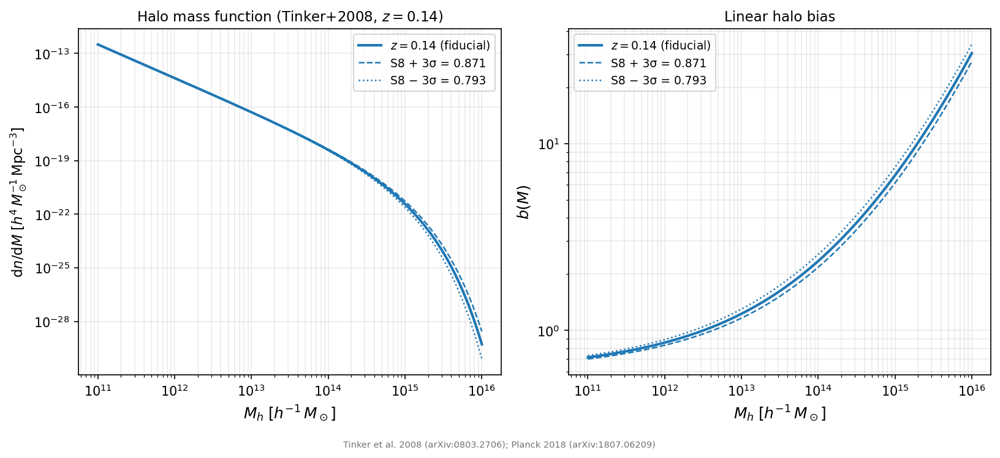

   :meth:`~hod_mod.core.halo_mass_function.HaloMassFunction.dndm`
   and :meth:`~hod_mod.core.halo_mass_function.HaloMassFunction.bias`
   at :math:`z=0.14` with :math:`\pm 3\sigma` S8 variation (Tinker+2008/2010).

``hod_mod`` implements 17 analytic multiplicity functions
(``fsigma_*`` in :mod:`hod_mod.core.halo_mass_function`);
the figure below compares six.

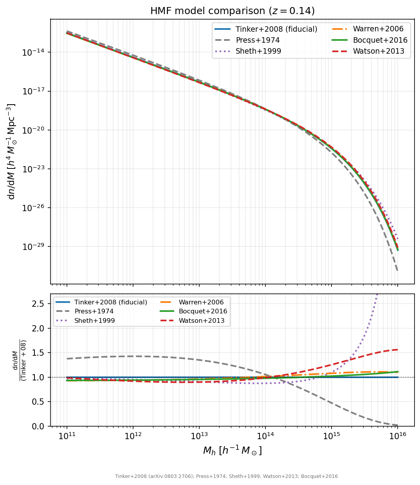

   :func:`~hod_mod.core.halo_mass_function.fsigma_tinker08` (fiducial)
   vs five alternative multiplicity functions: Press+1974, Sheth+1999,
   Warren+2006, Bocquet+2016, Watson+2013.
   Bottom panel shows ratio to Tinker+2008.

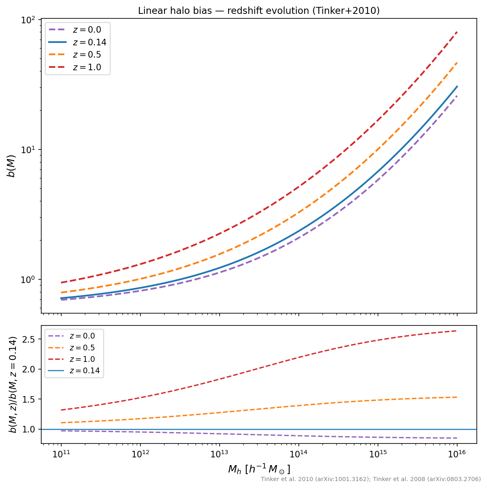

   Redshift evolution of
   :meth:`~hod_mod.core.halo_mass_function.HaloMassFunction.bias`
   (Tinker+2010 peak-background split) at :math:`z = 0, 0.14, 0.5, 1.0`.
   Bottom panel shows ratio to :math:`z=0.14`.

----

.. _beyond-linear-halo-bias:

4. Beyond-Linear Halo Bias
---------------------------

At intermediate scales :math:`k \sim 0.05{-}0.8\,h\,{\rm Mpc}^{-1}` the
large-scale bias approximation
:math:`P_{hh}^{\rm 2h}(k) = b(M)^2 P_{\rm lin}(k)`
underestimates halo–halo clustering relative to N-body simulations.
The **beyond-linear halo bias** (BNL; Mead & Verde 2021,
`arXiv:2011.08858 <https://arxiv.org/abs/2011.08858>`_) quantifies this
deviation empirically:

.. math::

    P_{hh}(M_1, M_2, k)
    = b(M_1)\,b(M_2)\,P_{\rm lin}(k)
      \,\bigl[1 + \beta^{\rm NL}(k,\,\nu_1,\,\nu_2)\bigr]

where :math:`\nu_i = \delta_c/\sigma(M_i)` is the peak height and
:math:`\beta^{\rm NL}` is measured from the MultiDark MDR1 N-body simulation
(2048³ particles, :math:`1\,h^{-1}{\rm Gpc}` box).  The data span
8 logarithmically-spaced peak-height bins
(:math:`\nu \in [0.85,\,3.71]`) and 25 wavenumbers
(:math:`k \in [6.3\times10^{-3},\,0.74]\,h\,{\rm Mpc}^{-1}`).

Key properties:

* :math:`\beta^{\rm NL}(k\to0,\,\nu_1,\nu_2) = 0` — recovers linear bias
  at large scales (:math:`\beta^{\rm NL} = 0` for :math:`k < 6.3\times10^{-3}\,h\,{\rm Mpc}^{-1}`).
* The peak-height parameterisation makes the table approximately
  cosmology-independent; the same :math:`z=0` data applies at any redshift
  when :math:`\nu(M,z)` is computed consistently.
* :math:`\beta^{\rm NL}` can be positive or negative depending on scale
  and mass bin.

The additive BNL corrections to the two-halo power spectra are:

.. math::

    \Delta I_{\rm gg}^{\rm BNL}(k)
    = \iint \frac{{\rm d}n}{{\rm d}M_1}\frac{{\rm d}n}{{\rm d}M_2}
      \frac{N(M_1)\,N(M_2)}{\bar{n}_g^2}\,
      b(M_1)\,b(M_2)\,
      \beta^{\rm NL}(k,\nu_1,\nu_2)\,{\rm d}M_1\,{\rm d}M_2

.. math::

    \Delta I_{\rm gm}^{\rm BNL}(k)
    = \iint \frac{{\rm d}n}{{\rm d}M_1}\frac{{\rm d}n}{{\rm d}M_2}
      \frac{N(M_1)}{\bar{n}_g}\,\frac{M_2}{\bar{\rho}_m}\,
      b(M_1)\,b(M_2)\,
      \beta^{\rm NL}(k,\nu_1,\nu_2)\,{\rm d}M_1\,{\rm d}M_2

These double mass-integrals are evaluated efficiently by projecting the
mass-function weights onto the 8-bin :math:`\nu` grid and contracting with the
cached :math:`(N_k \times 8 \times 8)` :math:`\beta^{\rm NL}` table — only an
:math:`\mathcal{O}(N_k \times N_M \times 8)` projection per HOD evaluation
is required (see
:class:`~hod_mod.core.beyond_linear_bias.BeyondLinearBiasMead21`).

**BNL is the fiducial prescription** for the two-halo term in all
``hod_mod`` HOD models.  Usage::

    from hod_mod.core import BeyondLinearBiasMead21
    from hod_mod.observables.clustering import FullHaloModelPrediction

    bnl = BeyondLinearBiasMead21()        # loads bundled MDR1 z=0 tables
    pred = FullHaloModelPrediction(pk_lin, hod, hp, bnl_model=bnl)
    wp = pred.wp(rp, pi_max, z, theta, hod_params)

Passing ``bnl_model=None`` reverts to the scale-independent
:math:`b_{\rm eff}^2\,P_{\rm lin}` approximation.

**Data:** Tabulated :math:`\beta^{\rm NL}` (snapshot 85 = :math:`z=0`)
are bundled in ``hod_mod/data/bnl/``; additional snapshots at
:math:`z = 0.01{-}10` are available from the BNL repository.

**References:** Mead & Verde 2021 (`arXiv:2011.08858
<https://arxiv.org/abs/2011.08858>`_); BNL simulation data:
`github.com/alexander-mead/BNL <https://github.com/alexander-mead/BNL>`_.

----

5. NFW Concentration–Mass Relation
------------------------------------

The NFW concentration is defined as

.. math::

    c_{200m}(M, z) = \frac{r_{200m}}{r_s}

where :math:`r_{200m}` is the radius enclosing a mean density 200 times the
mean matter density and :math:`r_s` is the NFW scale radius.  The
concentration–mass relation is evaluated via colossus using the
Diemer & Joyce 2019 fitting function:

.. math::

    c(M, z) \propto \left(\frac{M}{M_\star(z)}\right)^\nu
              \left[1 + \left(\frac{M}{M_\star(z)}\right)^\mu\right]

(schematic; see Diemer & Joyce 2019 for the full parametrisation.)

**References:** Navarro, Frenk & White 1997 (`arXiv:astro-ph/9611107
<https://arxiv.org/abs/astro-ph/9611107>`_); Diemer & Joyce 2019
(`arXiv:1809.07326 <https://arxiv.org/abs/1809.07326>`_).

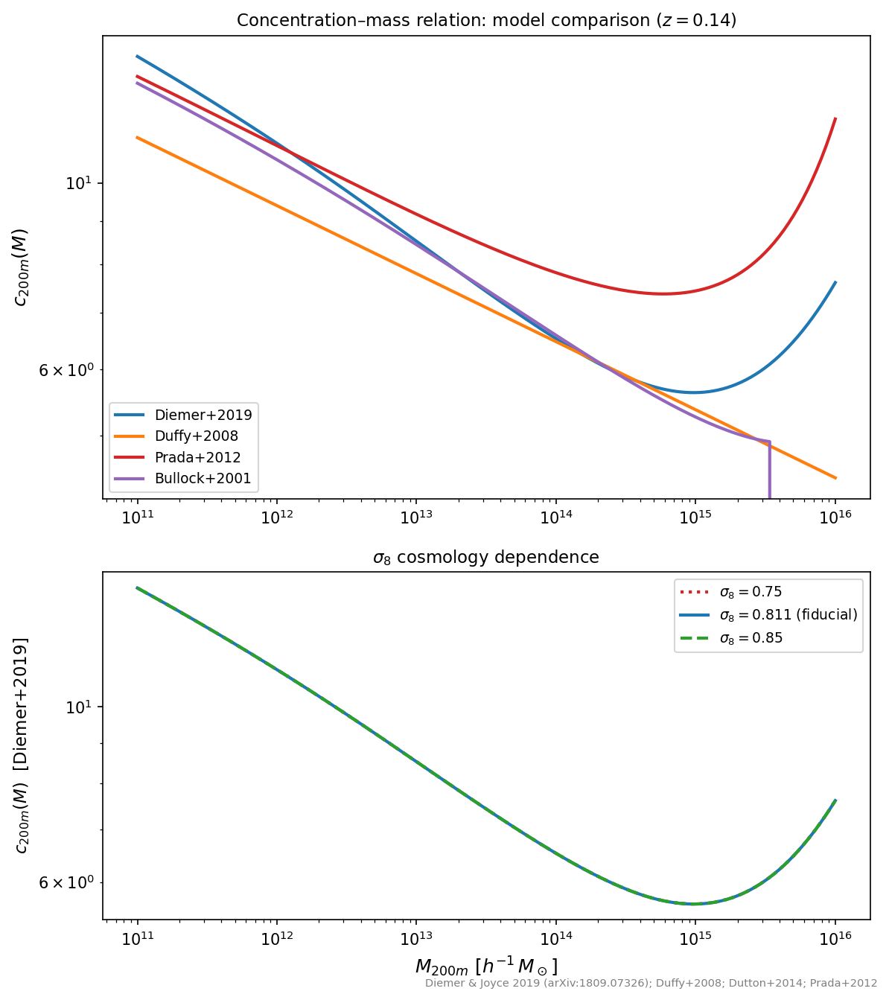

   NFW concentration–mass relation :math:`c_{200m}(M, z)` from multiple colossus models,
   including Diemer & Joyce 2019.

----

6. Halo Profile Fourier Transforms
------------------------------------

Two density profile families are implemented: NFW (analytic Fourier transform)
and Einasto (numerical transform via Gauss-Legendre quadrature).

**NFW profile** (Navarro, Frenk & White 1997):

.. math::

    \rho_{\rm NFW}(r) = \frac{\rho_s}{(r/r_s)(1+r/r_s)^2}

Its Fourier transform normalised to unity at :math:`k=0` is (Cooray & Sheth 2002
`arXiv:astro-ph/0206508 <https://arxiv.org/abs/astro-ph/0206508>`_ Eq. 11):

.. math::

    \tilde{u}_{\rm NFW}(k|M)
    = \frac{4\pi r_s^3}{M}
      \Bigl[\cos(kr_s)\bigl(\mathrm{Ci}(c\,kr_s) - \mathrm{Ci}(kr_s)\bigr)
      + \sin(kr_s)\bigl(\mathrm{Si}(c\,kr_s) - \mathrm{Si}(kr_s)\bigr)
      - \frac{\sin(c\,kr_s)}{(1+c)\,kr_s}\Bigr]

where :math:`r_s = r_{200m}/c` is the scale radius, :math:`c` the
concentration, and Ci/Si the cosine/sine integrals.

**Einasto profile** (Einasto 1965):

.. math::

    \rho_{\rm Ein}(r)
    = \rho_s\,\exp\!\left[-\frac{2}{\alpha}
      \left(\left(\frac{r}{r_s}\right)^\alpha - 1\right)\right]

with shape parameter :math:`\alpha = 0.18` (mean value for galaxy-mass halos,
Klypin et al. 2016 `arXiv:1711.01744 <https://arxiv.org/abs/1711.01744>`_).
Unlike NFW, the Einasto profile has no central density cusp, producing a
steeper roll-off at high :math:`k`. Its normalised Fourier transform is
evaluated numerically:

.. math::

    \tilde{u}_{\rm Ein}(k|M)
    = \frac{\displaystyle\int_0^{c\,r_s}
              \rho_{\rm Ein}(r)\,j_0(kr)\,r^2\,\mathrm{d}r}
           {\displaystyle\int_0^{c\,r_s}
              \rho_{\rm Ein}(r)\,r^2\,\mathrm{d}r}

where :math:`j_0(x) = \sin(x)/x`.

Both profiles use the same Diemer & Joyce 2019 concentration–mass relation and
are available in :class:`~hod_mod.observables.clustering.FullHaloModelPrediction`
via ``profile="nfw"`` (default) or ``profile="einasto"``.

**References:** Navarro, Frenk & White 1997 (`arXiv:astro-ph/9611107
<https://arxiv.org/abs/astro-ph/9611107>`_); Cooray & Sheth 2002
(`arXiv:astro-ph/0206508 <https://arxiv.org/abs/astro-ph/0206508>`_) Eq. 11;
Einasto 1965; Klypin et al. 2016 (`arXiv:1711.01744
<https://arxiv.org/abs/1711.01744>`_).

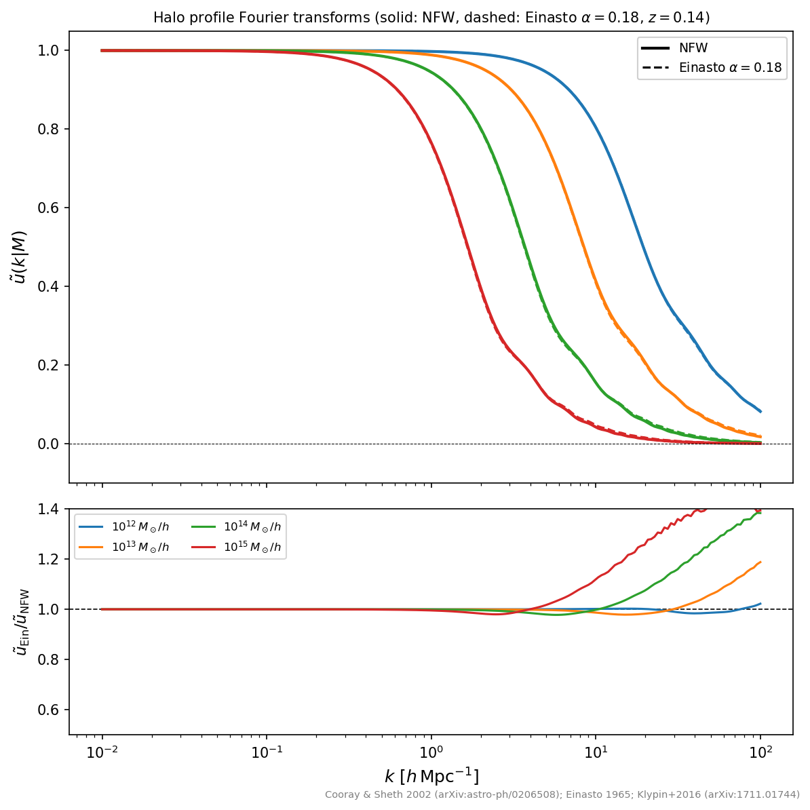

   Normalised Fourier transforms :math:`\tilde{u}(k|M)` of the NFW and Einasto
   profiles for several halo masses.

----

7. HOD Occupation Functions
-----------------------------

The HOD specifies the mean number of central and satellite galaxies per halo
of mass :math:`M`.  All nine models in ``hod_mod`` share the same interface::

    N_cen, N_sat = hod.nc_ns(log10m_h, hod_params)

The galaxy number density and effective bias follow from:

.. math::

    \bar{n}_g = \int_0^\infty \mathrm{d}M\,n(M)\,\bigl[\langle N_c\rangle + \langle N_s\rangle\bigr](M)

    b_{\rm eff} = \frac{1}{\bar{n}_g}\int_0^\infty \mathrm{d}M\,n(M)\,b(M)\,
                  \bigl[\langle N_c\rangle + \langle N_s\rangle\bigr](M)

Equations for each of the nine models follow.

**Zheng+2007** (``HODModel``, `arXiv:astro-ph/0703457
<https://arxiv.org/abs/astro-ph/0703457>`_):

.. math::

    \langle N_c \rangle(M)
    = \tfrac{1}{2}\,\mathrm{erfc}\!\left[
      \frac{\log_{10}M_{\min} - \log_{10}M}{\sqrt{2}\,\sigma_{\log m}}\right]

.. math::

    \langle N_s \rangle(M)
    = \langle N_c \rangle(M)
      \left(\frac{M - M_0}{M_1}\right)^\alpha \Theta(M - M_0)

*Free params:* log10mmin, σ_logm, log10m0, log10m1, α.

**Kravtsov+2004** (``Kravtsov04HODModel``, `ApJ 609, 35 <https://arxiv.org/abs/astro-ph/0308519>`_):

.. math::

    \langle N_c \rangle(M)
    = \tfrac{1}{2}\,\mathrm{erfc}\!\left[
      \frac{\log_{10}M_{\min} - \log_{10}M}{\sqrt{2}\,\sigma_{\log m}}\right]

.. math::

    \langle N_s \rangle(M)
    = \langle N_c \rangle(M)\,\left(\frac{M}{M_1}\right)^\alpha
      \exp\!\left(-\frac{M_0}{M}\right)

Same parameter names as ``HODModel``; validated against the ``surhudm/aum`` code.

**More+2015** (``MoreHODModel``, `arXiv:1407.1856
<https://arxiv.org/abs/1407.1856>`_) — fiducial model for this showcase:

.. math::

    \langle N_c \rangle(M)
    = \frac{\alpha_{\rm inc}}{2}\,\mathrm{erfc}\!\left[
      \frac{\log_{10}M_{\min} - \log_{10}M}{\sqrt{2}\,\sigma_{\log m}}\right]

.. math::

    \langle N_s \rangle(M)
    = \langle N_c \rangle(M)
      \left(\frac{M - \kappa M_{\min}}{M_1}\right)^\alpha
      \Theta(M - \kappa M_{\min})

Incompleteness :math:`\alpha_{\rm inc} = \mathrm{clip}(1 + \alpha_{\rm inc,0}
(\log_{10}M - \log_{10}M_{\rm inc}),\,0,\,1)`.  For BGS, :math:`\alpha_{\rm inc}=1`.

*Free params:* log10mmin, σ_logm, log10m1, α, κ, α_inc, log10m_inc.

**Zu & Mandelbaum 2015 iHOD** (``ZuMandelbaum15HODModel``, `arXiv:1505.02781
<https://arxiv.org/abs/1505.02781>`_):

The central SHMR maps halo mass to stellar mass via a 5-parameter model
(ZM15 Eq. 19):

.. math::

    \log_{10}M_h = \log_{10}M_1 + \beta\log_{10}\!\left(\frac{M_*}{M_{*,0}}\right)
    + \frac{(M_*/M_{*,0})^\delta}{1+(M_*/M_{*,0})^{-\gamma}} - \tfrac{1}{2}

The central occupation for a stellar-mass threshold :math:`M_{*,{\rm thresh}}`:

.. math::

    \langle N_c \rangle(M_h)
    = \tfrac{1}{2}\,\mathrm{erfc}\!\left[
      \frac{\ln M_{*,{\rm thresh}} - \ln M_*^c(M_h)}{\sqrt{2}\,\sigma_{\ln M_*}(M_h)}\right]

with mass-dependent scatter
:math:`\sigma_{\ln M_*}(M_h) = \sigma_{\ln M_*}(1 + \eta\log_{10}M_h)`.
Satellites follow an exponential-cutoff power law.

*Free params (with threshold):* log10m_star_thresh, lg_m1h, lg_m0star, β, δ, γ,
σ_lnM*, η, b_sat, α_sat (+2 more for M_cut, M_sat).

**van Uitert+2016 CSMF** (``VanUitert16CSMFModel``, `arXiv:1601.06791
<https://arxiv.org/abs/1601.06791>`_):

Centrals selected in a stellar-mass bin
:math:`[M_{*,\rm lo},\,M_{*,\rm hi}]` via a double power-law SHMR
:math:`\mu(M_h)`:

.. math::

    \langle N_c \rangle(M_h) = \tfrac{1}{2}\!\left[
      \mathrm{erf}\!\left(\frac{\log_{10}M_{*,\rm hi} - \mu(M_h)}{\sqrt{2}\,\sigma_c}\right)
      - \mathrm{erf}\!\left(\frac{\log_{10}M_{*,\rm lo} - \mu(M_h)}{\sqrt{2}\,\sigma_c}\right)
      \right]

Satellites follow a modified Schechter conditional stellar mass function
:math:`\Phi_s(M_*|M_h)` integrated over the stellar-mass bin.

*Free params:* log10m_h1, log10m_star0, β₁, log10_β₂, σ_c, α_s, b₀, b₁.

**Zacharegkas+2025** (``Zacharegkas25HODModel``):

Uses the Kravtsov+2004 SHMR to invert a stellar-mass threshold into a
halo-mass occupation function with Gaussian scatter in :math:`\log M_*`:

.. math::

    \langle N_c \rangle(M_h) = \tfrac{1}{2}\,\mathrm{erfc}\!\left[
      \frac{\log_{10}M_{*,{\rm thresh}} - \mu_{\rm SHMR}(M_h)}
           {\sqrt{2}\,\sigma_{\log M_*}}\right]

Satellites: :math:`\langle N_s \rangle = \langle N_c \rangle\,(M/M_{\rm sat})^{\beta_{\rm sat}}`.

*Free params:* log10m1_shmr, log10eps, α_shmr, γ_shmr, δ_shmr, σ_logm_star,
α_sat, f_cen.

**Guo+2018 ICSMF** (``Guo18ICSMFModel``, `arXiv:1804.01993
<https://arxiv.org/abs/1804.01993>`_):

Integrated conditional stellar mass function (ICSMF) — both centrals and
satellites are derived from the CSMF :math:`\Phi(M_*|M_h)`, which combines
a Gaussian central term and a Schechter satellite term.  A mass-dependent
incompleteness correction :math:`f_{\rm inc}(M)` models survey selection.

*Free params (14):* 4 broken-PL SHMR + Gaussian width, 4 Schechter satellite
+ 2 incompleteness + 3 amplitude normalisation.

**Guo+2019 ICSMF + quenching** (``Guo19ICSMFModel``, `arXiv:1810.05318
<https://arxiv.org/abs/1810.05318>`_):

Extends Guo+2018 with a quenched fraction for eBOSS ELGs: a critical mass
:math:`\log_{10}M_q` above which galaxies are quenched and therefore **absent**
from the ELG selection.

*Free params (15):* all 14 from Guo+2018 + log10m_q.

**Zu & Mandelbaum 2016/17 quenching** (``ZuMandelbaum16QuenchingModel``,
`arXiv:1509.06374 <https://arxiv.org/abs/1509.06374>`_):

Used on top of ``ZuMandelbaum15HODModel`` to split galaxies into red and blue.
The red fraction follows a Weibull (cumulative extreme-value) distribution:

.. math::

    f_{\rm red,cen}(M_h)
    = 1 - \exp\!\left[-\left(\frac{M_h}{M_{q,c}}\right)^{\mu_c}\right]

.. math::

    f_{\rm red,sat}(M_h)
    = 1 - \exp\!\left[-\left(\frac{M_h}{M_{q,s}}\right)^{\mu_s}\right]

*Free params:* lg_mqc_h, μ_c (centrals), lg_mqs_h, μ_s (satellites).

For BGS the incompleteness :math:`\alpha_{\rm inc}` is fixed to 1 (the sample
is >95% complete above the stellar mass threshold, `arXiv:2512.15960
<https://arxiv.org/abs/2512.15960>`_).

.. _hod_models_table:

.. list-table:: HOD models implemented in :mod:`hod_mod.connection.hod`
   :header-rows: 1
   :widths: 26 20 8 14 32

   * - Class
     - Reference
     - Free params
     - Occupation type
     - Key features / parametrisation
   * - ``HODModel``
     - Zheng+2007 (`arXiv:astro-ph/0703457 <https://arxiv.org/abs/astro-ph/0703457>`_)
     - 5
     - Halo mass
     - Baseline erfc :math:`N_c`, power-law :math:`N_s`;
       params: log10mmin, σ_logm, log10m0, log10m1, α
   * - ``MoreHODModel``
     - More+2015 (`arXiv:1407.1856 <https://arxiv.org/abs/1407.1856>`_)
     - 7
     - Halo mass
     - Adds incompleteness α_inc and cut-off scale κ to Zheng+2007
   * - ``Kravtsov04HODModel``
     - Kravtsov+2004 (`arXiv:astro-ph/0308519 <https://arxiv.org/abs/astro-ph/0308519>`_)
     - 5
     - Halo mass
     - :math:`N_{\rm sat} = N_{\rm cen}(M/M_1)^\alpha \exp(-M_0/M)`;
       same param names as ``HODModel``; validated against ``surhudm/aum`` code
   * - ``Guo18ICSMFModel``
     - Guo+2018 (`arXiv:1804.01993 <https://arxiv.org/abs/1804.01993>`_)
     - 14
     - Stellar mass
     - Broken power-law SHMR + mass-dependent completeness correction
   * - ``Guo19ICSMFModel``
     - Guo+2019 (`arXiv:1810.05318 <https://arxiv.org/abs/1810.05318>`_)
     - 15
     - Stellar mass
     - Extends Guo+2018 with quenched fraction log10m_q for eBOSS ELGs
   * - ``ZuMandelbaum15HODModel``
     - Zu & Mandelbaum 2015 (`arXiv:1505.02781 <https://arxiv.org/abs/1505.02781>`_)
     - 6
     - Stellar mass (iHOD)
     - Inverse SHMR with log-normal scatter; :math:`N_c` derived via JAX
       bisection inversion of the stellar-mass–halo-mass relation
   * - ``ZuMandelbaum16QuenchingModel``
     - Zu & Mandelbaum 2016/17
     - —
     - Stellar mass
     - Weibull CDF red fractions for centrals and satellites; used on top
       of ``ZuMandelbaum15HODModel``
   * - ``VanUitert16CSMFModel``
     - van Uitert+2016 (`arXiv:1601.06791 <https://arxiv.org/abs/1601.06791>`_)
     - 8
     - Stellar mass
     - Gaussian conditional stellar mass function (CSMF) with flexible
       scatter and mass-dependent completeness
   * - ``Zacharegkas25HODModel``
     - Zacharegkas+2025
     - 8
     - Stellar mass
     - Kravtsov SHMR with threshold scatter; :math:`N_c` via error function
       of the SHMR-inverted threshold

**References:** More et al. 2015 (`arXiv:1407.1856
<https://arxiv.org/abs/1407.1856>`_); Zheng et al. 2007
(`arXiv:astro-ph/0703457 <https://arxiv.org/abs/astro-ph/0703457>`_);
Zu & Mandelbaum 2015 (`arXiv:1505.02781 <https://arxiv.org/abs/1505.02781>`_);
van Uitert et al. 2016 (`arXiv:1601.06791 <https://arxiv.org/abs/1601.06791>`_);
Guo et al. 2018/19 (`arXiv:1804.01993 <https://arxiv.org/abs/1804.01993>`_,
`arXiv:1810.05318 <https://arxiv.org/abs/1810.05318>`_).

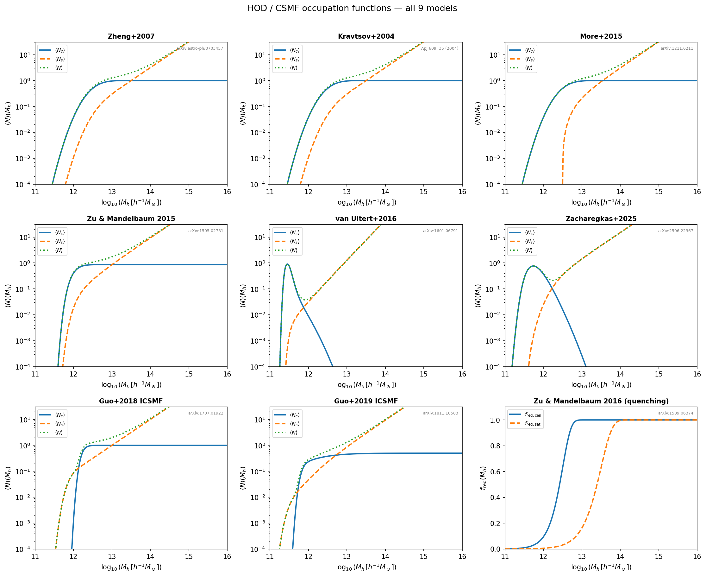

   Mean central and satellite occupation functions
   :math:`\langle N_c\rangle(M)` and :math:`\langle N_s\rangle(M)`
   for all nine HOD models (3×3 panel).

HOD parameters in ``hod_mod`` are redshift-independent by default.  The figure
below shows how the HOD-integrated observables :math:`\bar{n}_g` and
:math:`b_{\rm eff}` evolve purely because the HMF :math:`{\rm d}n/{\rm d}M(M,z)`
and halo bias :math:`b(M,z)` change with redshift:

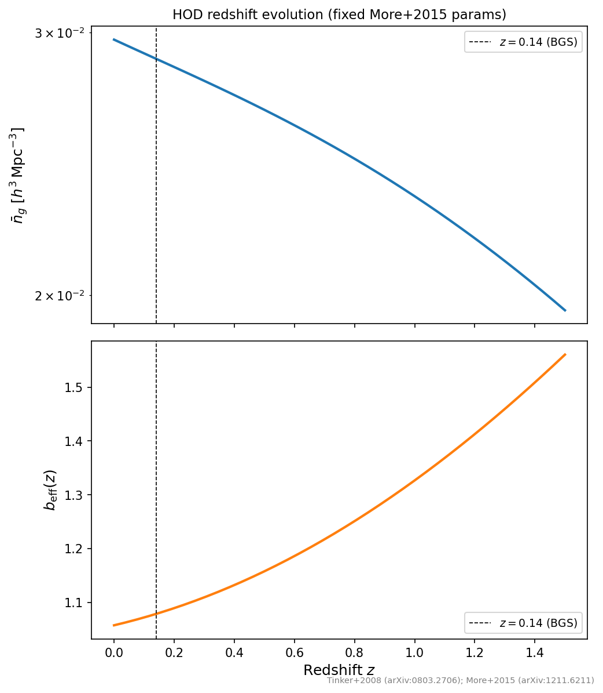

   Galaxy number density :math:`\bar{n}_g(z)` and effective bias :math:`b_{\rm eff}(z)`
   for fixed HOD parameters, driven by HMF and :math:`b(M,z)` evolution.

----

8. Off-centering Correction
-----------------------------

Central galaxies are not always located at the potential minimum of their host
halo. A fraction :math:`f_{\rm off}` of centrals are displaced by a 2D
projected offset drawn from a Rayleigh distribution with scale
:math:`\sigma_{\rm off}` [Mpc/:math:`h`].  In Fourier space this averaging
produces an isotropic damping factor for the central-galaxy contribution to the
1-halo power spectra (Johnston+2007 `arXiv:0709.4193
<https://arxiv.org/abs/0709.4193>`_ Eq. A2; More+2015
`arXiv:1407.1856 <https://arxiv.org/abs/1407.1856>`_ §3.3):

.. math::

    W_{\rm off}(k) = \exp\!\left(-\tfrac{1}{2}\,k^2\sigma_{\rm off}^2\right)

The effective central occupation entering both :math:`P_{gg}^{\rm 1h}` and
:math:`P_{gm}^{\rm 1h}` becomes:

.. math::

    N_c^{\rm eff}(k, M)
    = N_c(M)\,\bigl[(1 - f_{\rm off}) + f_{\rm off}\,W_{\rm off}(k)\bigr]

* :math:`f_{\rm off} = 0` (default): reduces exactly to the standard formula.
* :math:`f_{\rm off} = 1`: all centrals are off-centered with scale
  :math:`\sigma_{\rm off}`.
* At :math:`k \to 0` (large scales): :math:`W_{\rm off} \to 1` — the 2-halo
  regime is unaffected.
* At :math:`k \gg 1/\sigma_{\rm off}`: the 1-halo contribution of centrals is
  exponentially suppressed, reducing :math:`\Delta\Sigma(R)` and
  :math:`w_p(r_p)` at :math:`R \lesssim \sigma_{\rm off}`.

Fits to BGS M★ > 10^10 at :math:`z_{\rm eff}=0.136` recover
:math:`f_{\rm off}\sim 0.13{-}0.15`, :math:`\sigma_{\rm off}\sim 0.2` Mpc/:math:`h`,
consistent with Leauthaud et al. 2012 (`arXiv:1104.0928
<https://arxiv.org/abs/1104.0928>`_) group lensing results.  The correction
extends the usable WP scale from :math:`r_p > 0.3` Mpc/:math:`h` (without
off-centering) to :math:`r_p > 0.1` Mpc/:math:`h` while maintaining
:math:`\chi^2/{\rm dof} \lesssim 1.5`.

Enable with ``--use-offcentering``; free parameters ``f_off`` ∈ [0, 1] and
``sigma_off`` ∈ [0.01, 2.0] Mpc/:math:`h` are added to the fit automatically.

**References:** Johnston et al. 2007 (`arXiv:0709.4193
<https://arxiv.org/abs/0709.4193>`_); More et al. 2015 (`arXiv:1407.1856
<https://arxiv.org/abs/1407.1856>`_) §3.3 + App. A; Leauthaud et al. 2012
(`arXiv:1104.0928 <https://arxiv.org/abs/1104.0928>`_);
Siegel et al. 2025 (`arXiv:2209.07392 <https://arxiv.org/abs/2209.07392>`_).

----

9. Projected Correlation Function :math:`w_p(r_p)`
---------------------------------------------------

The projected galaxy auto-correlation function integrates the 3D correlation
function along the line of sight up to :math:`\pi_{\max}`:

.. math::

    w_p(r_p) = 2\int_0^{\pi_{\max}} \xi_{gg}(r_p, \pi)\,\mathrm{d}\pi

The 3D correlation :math:`\xi_{gg}(r)` is obtained from :math:`P_{gg}(k)`
via the Ogata (2005) Hankel transform.  The power spectrum decomposes into:

.. math::

    P_{gg}^{\rm 1h}(k)
    = \frac{1}{\bar{n}_g^2}\int\!\mathrm{d}M\,n(M)
      \bigl[N_s^2\,\tilde{u}^2(k|M) + 2N_cN_s\,\tilde{u}(k|M)\bigr]

.. math::

    P_{gg}^{\rm 2h}(k)
    = b_{\rm eff}^2\,P_{\rm lin}(k)
      + P_{\rm lin}(k)\,\Delta I_{\rm gg}^{\rm BNL}(k)
    \qquad b_{\rm eff} = \frac{1}{\bar{n}_g}\int\!\mathrm{d}M\,n(M)\,b(M)
                  \langle N\rangle(M)

where :math:`\Delta I_{\rm gg}^{\rm BNL}(k)` is the beyond-linear bias correction
from :class:`~hod_mod.core.beyond_linear_bias.BeyondLinearBiasMead21`
(see :ref:`section 4 <beyond-linear-halo-bias>` for the full formula).
The BNL term boosts the 2-halo power at :math:`k \sim 0.05{-}0.8\,h\,{\rm Mpc}^{-1}`;
it vanishes at large scales (:math:`k < 6\times10^{-3}\,h\,{\rm Mpc}^{-1}`).

The k-grid spans :math:`[10^{-4}, 200]\,h/{\rm Mpc}` (1024 points, log-spaced)
to ensure accuracy of the Hankel transform down to
:math:`r_p \approx 0.02\,h^{-1}{\rm Mpc}`.

**References:** More et al. 2015 (`arXiv:1407.1856
<https://arxiv.org/abs/1407.1856>`_) Eqs. 9–10; Mead & Verde 2021
(`arXiv:2011.08858 <https://arxiv.org/abs/2011.08858>`_) — BNL beyond-linear bias;
Ogata 2005 Hankel transform.

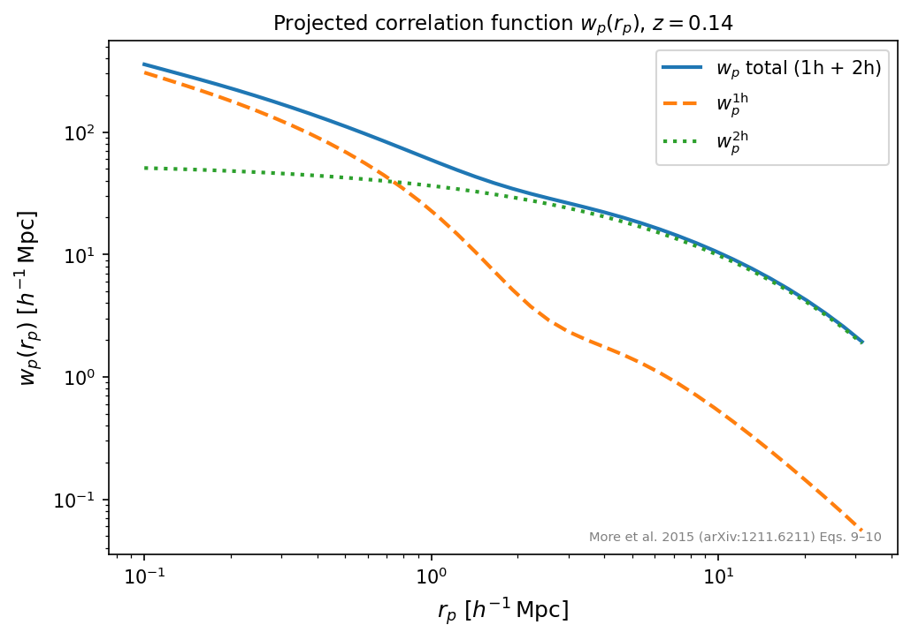

   Projected correlation function :math:`w_p(r_p)` with 1-halo and 2-halo
   decomposition for the fiducial More+2015 HOD.

----

10. Excess Surface Mass Density :math:`\Delta\Sigma(R)`
-------------------------------------------------------

The weak-lensing excess surface mass density is:

.. math::

    \Delta\Sigma(R) = \bar{\Sigma}(R) - \Sigma(R)
    \quad [M_\odot\,h\,{\rm pc}^{-2}]

.. math::

    \Sigma(R) = \bar{\rho}_m\int_{-\infty}^{+\infty}
      \xi_{gm}\!\left(\sqrt{R^2+\chi^2}\right)\mathrm{d}\chi

.. math::

    \bar{\Sigma}(R) = \frac{2}{R^2}\int_0^R R'\,\Sigma(R')\,\mathrm{d}R'

The galaxy–matter cross-correlation :math:`\xi_{gm}(r)` is the Hankel
transform of :math:`P_{gm}(k)`.  The 1-halo term (More et al. 2015
`arXiv:1407.1856 <https://arxiv.org/abs/1407.1856>`_ Eq. 13) reads:

.. math::

    P_{gm}^{\rm 1h}(k)
    = \frac{1}{\bar{n}_g}\int\!\mathrm{d}M\,n(M)
      \bigl[N_c + N_s\,\tilde{u}_{\rm DM}(k|M)\bigr]
      \frac{M}{\bar{\rho}_m}\,\tilde{u}_{\rm DM}(k|M)

.. math::

    P_{gm}^{\rm 2h}(k)
    = b_{\rm eff}\,P_{\rm lin}(k)
      + P_{\rm lin}(k)\,\Delta I_{\rm gm}^{\rm BNL}(k)

where :math:`\Delta I_{\rm gm}^{\rm BNL}(k)` is the asymmetric BNL correction
defined in :ref:`section 4 <beyond-linear-halo-bias>`.

The line-of-sight :math:`\chi`-integral uses a log-linear hybrid grid (dense
logarithmically at small :math:`\chi`, uniform at large :math:`\chi`) for
accurate convergence at both small and large :math:`R`.

**References:** More et al. 2015 (`arXiv:1407.1856
<https://arxiv.org/abs/1407.1856>`_) Eq. 13; Mead & Verde 2021
(`arXiv:2011.08858 <https://arxiv.org/abs/2011.08858>`_) — BNL beyond-linear bias;
Bartelmann & Schneider 2001
(`arXiv:astro-ph/9912508 <https://arxiv.org/abs/astro-ph/9912508>`_).

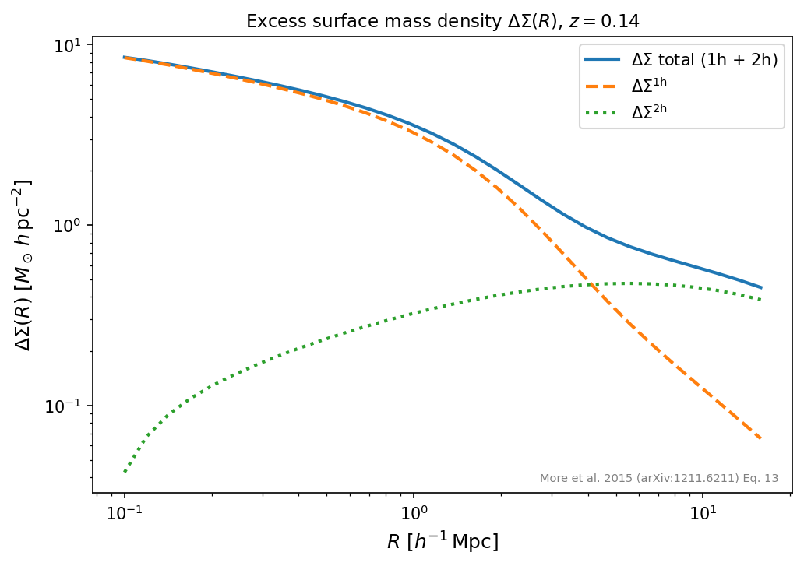

   Excess surface mass density :math:`\Delta\Sigma(R)` with 1-halo and 2-halo
   decomposition for the fiducial More+2015 HOD.

----

11. NLA Intrinsic-Alignment Correction to :math:`\Delta\Sigma`
--------------------------------------------------------------

Lens galaxies are intrinsically aligned with the local tidal field, biasing
the measured weak-lensing signal.  The non-linear alignment (NLA) model
(Bridle & King 2007 `arXiv:0705.0166 <https://arxiv.org/abs/0705.0166>`_
§2) gives an additive correction:

.. math::

    \Delta\Sigma^{\rm total}(R)
    = \Delta\Sigma^{\rm grav}(R) + \Delta\Sigma^{\rm IA}(R)

.. math::

    \Delta\Sigma^{\rm IA}(R)
    = -F_{\rm IA}(z)\,\Delta\Sigma[P_{\rm lin}](R)

.. math::

    F_{\rm IA}(z)
    = A_{\rm IA}\,C_1\rho_{\rm crit,0}\,\frac{\Omega_m}{D(z)^2}

with :math:`C_1\rho_{\rm crit,0} = 0.0134` (Brown et al. 2002
`arXiv:astro-ph/0208084 <https://arxiv.org/abs/astro-ph/0208084>`_) and
:math:`D(z)` the linear growth factor normalised to unity today.

.. note::

   "Non-Linear Alignment" describes the physical mechanism (tidal alignment),
   **not** the use of a non-linear power spectrum.  The input :math:`P_{\rm lin}`
   is the physically correct choice (Bridle & King 2007 §2).

DESI KP6 finds :math:`A_{\rm IA} \sim 0.3{-}1.5` for BGS-like lens samples
(`arXiv:2512.02954 <https://arxiv.org/abs/2512.02954>`_).

**References:** Bridle & King 2007 (`arXiv:0705.0166
<https://arxiv.org/abs/0705.0166>`_); Brown et al. 2002
(`arXiv:astro-ph/0208084 <https://arxiv.org/abs/astro-ph/0208084>`_);
DESI KP6 (`arXiv:2512.02954 <https://arxiv.org/abs/2512.02954>`_,
`arXiv:2509.04552 <https://arxiv.org/abs/2509.04552>`_).

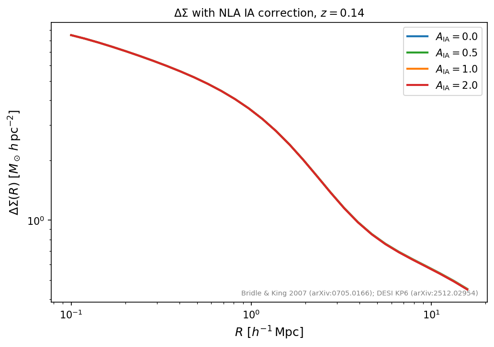

   :math:`\Delta\Sigma(R)` with the NLA intrinsic-alignment correction for
   :math:`A_{\rm IA} = 0,\,0.5,\,1,\,2`.

----

12. Summary: :math:`w_p` — All Corrections
-------------------------------------------

The figure below overlays the main physical effects on :math:`w_p(r_p)`:

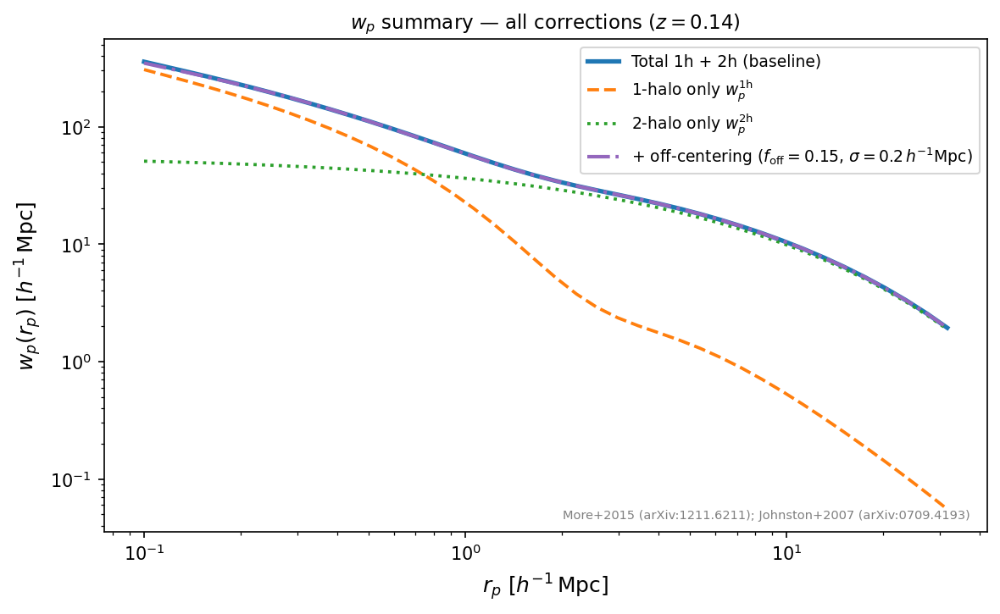

   Summary of physical effects on :math:`w_p(r_p)`: total, 1-halo, 2-halo,
   and off-centering correction.

----

13. Summary: :math:`\Delta\Sigma` — All Corrections
----------------------------------------------------

The figure below overlays the main physical effects on :math:`\Delta\Sigma(R)`:

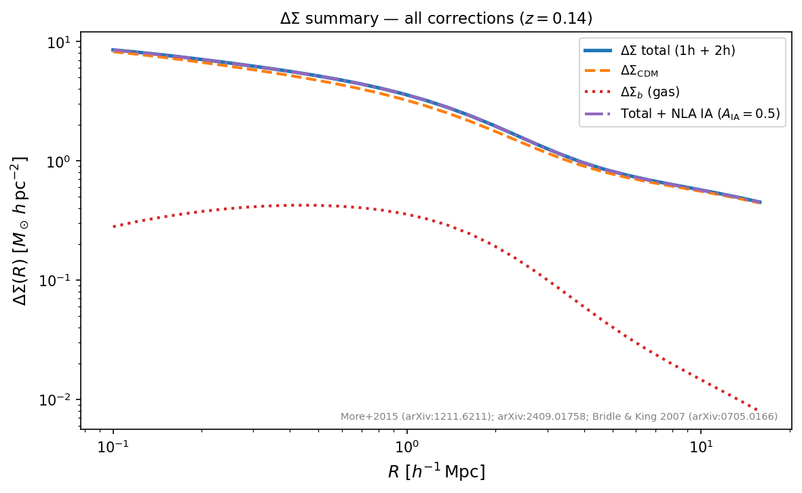

   Summary of physical effects on :math:`\Delta\Sigma(R)`: total, 1-halo, 2-halo,
   and NLA intrinsic-alignment correction.

----

Galaxy × Gas Cross-Correlations
---------------------------------

Beyond the standard :math:`w_p(r_p)` and :math:`\Delta\Sigma(R)` observables,
**hod_mod** provides a complete halo model for cross-correlations between the
galaxy overdensity field and diffuse gas signals:

* **Galaxy × tSZ Compton-y** — :math:`P_{g,y}(k)`, the projected tSZ stack
  :math:`\Sigma_y(r_p)`, and the angular power spectrum :math:`C_\ell^{g,y}`.
  Uses the `Arnaud et al. 2010 <https://arxiv.org/abs/0910.1234>`_ universal
  pressure profile.
* **Galaxy × soft X-ray (0.5–2 keV)** — :math:`P_{g,X}(k)` and the projected
  correlation :math:`w_{g,X}(r_p)`.  Uses the DPM electron density profile of
  `Oppenheimer et al. 2025 <https://arxiv.org/abs/2505.14782>`_.

Both signals are benchmarked against the eROSITA × Legacy Survey measurements of
`Comparat et al. 2025 <https://arxiv.org/abs/2503.19796>`_
(A&A 697, A173) for seven stellar-mass-selected galaxy samples
(:math:`\log_{10}(M_*/M_\odot) > 10.0`, :math:`\ldots`, :math:`> 11.5`).

Implementation classes
~~~~~~~~~~~~~~~~~~~~~~

* :class:`~hod_mod.gas.PressureProfileA10` — A10 gNFW
  pressure profile; computes :math:`P_e(r|M,z)` [keV/cm³] and
  :math:`\tilde{y}(k|M,z)` [(Mpc/h)²].
* :class:`~hod_mod.gas.GasDensityDPM` — DPM electron density
  profile; computes :math:`n_e(r|M,z)` [cm⁻³],
  :math:`\tilde{n}_e(k|M,z)` [(Mpc/h)³ cm⁻³],
  and :math:`\tilde\varepsilon(k|M,z)` [(Mpc/h)³ cm⁻⁶].
* :func:`~hod_mod.gas.m200_to_m500c` — NFW bisection to
  convert M\ :sub:`200m` → M\ :sub:`500c`.
* :class:`~hod_mod.observables.cross_spectra.HaloModelCrossSpectra` — wraps an
  existing :class:`~hod_mod.observables.clustering.FullHaloModelPrediction` and
  reuses its static cache to compute 1-halo + 2-halo cross-spectra and all
  projected observables.

Gas profile and cross-spectrum figures
~~~~~~~~~~~~~~~~~~~~~~~~~~~~~~~~~~~~~~~

Run the validation script to reproduce all seven diagnostic panels::

    cd $HOD_MOD_REPO
    python -m hod_mod.scripts.validate_sz_xray

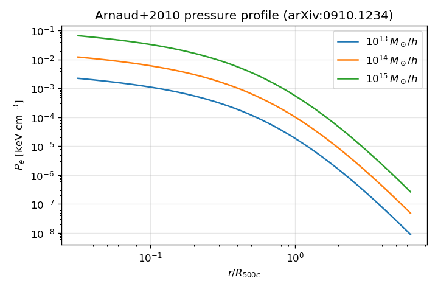

   **Figure SZ-1.** Arnaud+2010 universal pressure profile
   :math:`P_e(r/R_{500c})` [keV cm\ :sup:`-3`] for three halo masses
   (:math:`10^{13}`, :math:`10^{14}`, :math:`10^{15}\,M_\odot/h`) at :math:`z=0.3`.
   Profile shape from arXiv:0910.1234, Eq. 11.

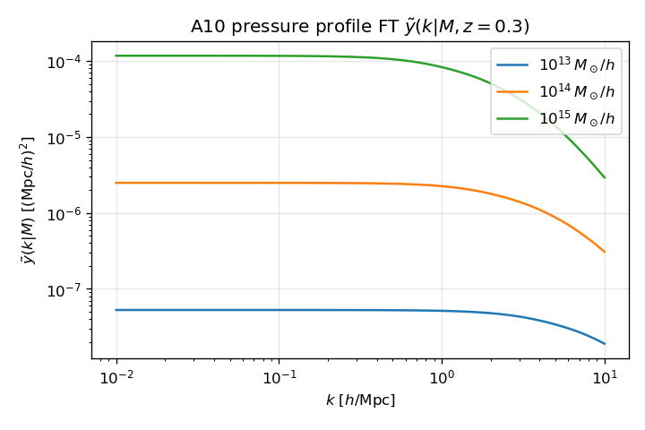

   **Figure SZ-2.** Fourier transform :math:`\tilde{y}(k|M)` [(Mpc/h)\ :sup:`2`]
   of the A10 pressure profile for the same three masses.
   The signal is flat at :math:`k \to 0` and falls off at
   :math:`k \gtrsim 1/R_{500c}`.

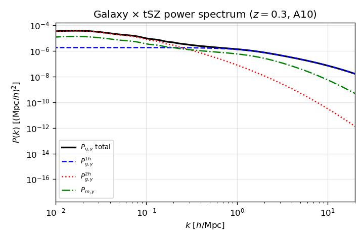

   **Figure SZ-3.** Galaxy x tSZ cross-spectrum :math:`P_{g,y}(k)` decomposed into
   1-halo (dashed) and 2-halo (dotted) contributions, plus the total (solid)
   and the matter x tSZ term :math:`P_{m,y}(k)`.
   Computed with the More+2015 HOD and Planck 2018 cosmology at :math:`z=0.3`.

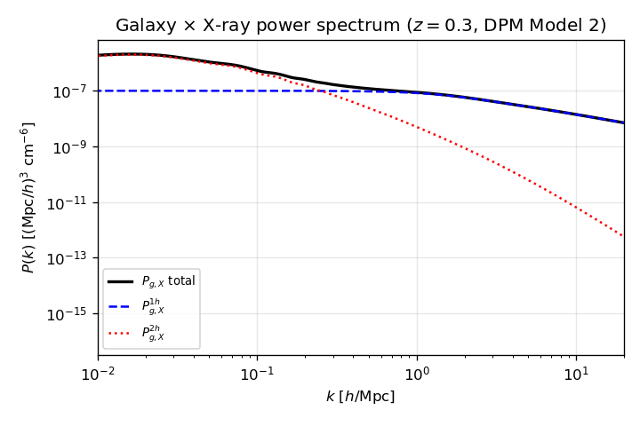

   **Figure SZ-4.** Galaxy x soft X-ray cross-spectrum :math:`P_{g,X}(k)`
   [(Mpc/h)\ :sup:`3` cm\ :sup:`-6`] with 1-halo / 2-halo decomposition.
   Uses the DPM electron density profile (Model 2, arXiv:2505.14782) at :math:`z=0.3`.

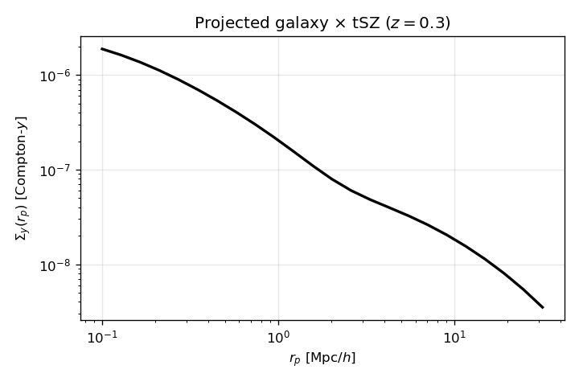

   **Figure SZ-5.** Projected tSZ stacking signal :math:`\Sigma_y(r_p)`
   [dimensionless Compton-y] vs projected radius :math:`r_p` [Mpc/h].
   Relevant for stacked ACT/SPT x BOSS measurements (cf. Amodeo+2021, arXiv:2009.05557).

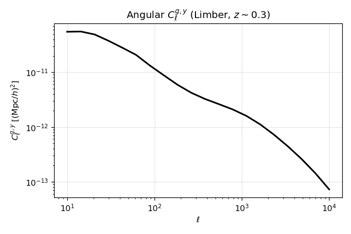

   **Figure SZ-6.** Angular cross-power spectrum :math:`C_\ell^{g,y}`
   via the Limber approximation for a BOSS CMASS-like :math:`n(z)` at
   :math:`z_{\rm eff}=0.5`.
   Relevant for DES x ACT comparisons (cf. Pandey+2025, arXiv:2506.07432).

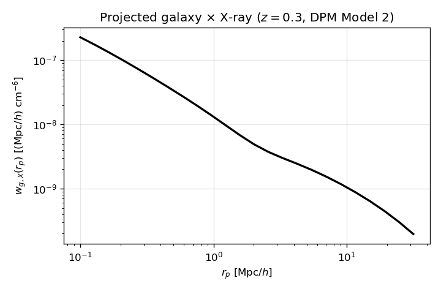

   **Figure SZ-7.** Projected galaxy x soft X-ray correlation
   :math:`w_{g,X}(r_p)` [(Mpc/h) cm\ :sup:`-6`] vs projected radius.
   Benchmarked against the eROSITA x Legacy Survey measurements of
   Comparat+2025 (arXiv:2503.19796, A&A 697, A173).

----

14. X-ray AGN Contribution to :math:`P_{g,X}(k)`
-------------------------------------------------

AGN hosted in dark-matter halos contribute an X-ray surface brightness
component to the galaxy × soft X-ray cross-correlation in addition to
the diffuse thermal emission from the intra-group medium.  Unlike thermal
gas, AGN are unresolved point sources: their 3D density profile is a
Dirac delta function, giving a **flat Fourier transform**
:math:`\tilde{X}^{\rm AGN}(k|M) \propto \langle L_X(M,z)\rangle`.

The mean soft-band (0.5–2 keV) luminosity per halo is computed via
abundance-matching against the Aird+2015 LADE hard XLF
(see :doc:`galaxies` § HAM AGN Model and :class:`~hod_mod.agn.ham.HamAGNModel`):

1. At each :math:`(M_h, z)` the cumulative AGN number density from the
   Aird+2015 LADE hard XLF is matched to the cumulative galaxy number density
   from the Girelli+2020 SHMR, giving :math:`\langle L_X^{\rm hard}(M_h, z)\rangle`.
2. Hard-to-soft conversion and obscuration are applied via a precomputed
   K-correction table integrating an absorbed power-law over
   :math:`(z, \log N_H)` (Comparat+2019 obscuration fractions).

The AGN component is added via the ``agn_model`` keyword of
:class:`~hod_mod.observables.cross_spectra.HaloModelCrossSpectra`::

    from hod_mod.agn.ham import HamAGNModel
    from hod_mod.observables.cross_spectra import HaloModelCrossSpectra

    agn   = HamAGNModel(xlf="aird15")
    cross = HaloModelCrossSpectra(fhmp, density_profile=dp, agn_model=agn)

    # Retrieve gas and AGN contributions separately:
    cl = cross.angular_cl_gX(ell, z_arr, nz_g, theta_cosmo, hod_params,
                              return_components=True)
    cl_gas = cl["gas"]
    cl_agn = cl["agn"]

At :math:`z_{\rm eff}=0.135` with :math:`\log_{10}(M_*/M_\odot) > 10`:

* The **gas 1-halo term** dominates at small angular scales
  (:math:`\ell \gtrsim 500`).
* The **AGN 1-halo term** is flat in :math:`\ell` and becomes comparable
  at :math:`\ell \lesssim 100`.
* The **AGN 2-halo term** (:math:`\propto b_{\rm eff}^2\,P_{\rm lin}`)
  dominates at :math:`\ell \lesssim 50`.

Thread-safety note: ``angular_cl_gX`` calls CAMB at each redshift slice.
Always pass ``n_workers=1`` to avoid non-deterministic NaN values in the
AGN 2-halo term when running from a multi-threaded context::

    cl = cross.angular_cl_gX(..., n_workers=1)

**References:** Aird et al. 2015 (`arXiv:1503.01120
<https://arxiv.org/abs/1503.01120>`_) — LADE hard XLF;
Comparat et al. 2019 (`arXiv:1901.10866
<https://arxiv.org/abs/1901.10866>`_) — HAM method and obscuration model;
Girelli et al. 2020 (`arXiv:2007.06220 <https://arxiv.org/abs/2007.06220>`_);
Comparat et al. 2025 (`arXiv:2503.19796 <https://arxiv.org/abs/2503.19796>`_).

----

Bibliography
------------

See :doc:`references` for the full consolidated bibliography.

Key references for this showcase:

* Planck 2018 (`arXiv:1807.06209 <https://arxiv.org/abs/1807.06209>`_) — fiducial cosmology
* Lewis, Challinor & Lasenby 2000 (`arXiv:astro-ph/9911177 <https://arxiv.org/abs/astro-ph/9911177>`_) — CAMB
* Aletheia 2025 (`arXiv:2511.13826 <https://arxiv.org/abs/2511.13826>`_) — non-linear P(k) emulator
* Brieden et al. 2025 WHM (`arXiv:2508.10902 <https://arxiv.org/abs/2508.10902>`_) — Web-Halo Model non-linear P(k)
* Tinker et al. 2008 (`arXiv:0803.2706 <https://arxiv.org/abs/0803.2706>`_) — HMF
* Tinker et al. 2010 (`arXiv:1001.3162 <https://arxiv.org/abs/1001.3162>`_) — halo bias
* Mead & Verde 2021 (`arXiv:2011.08858 <https://arxiv.org/abs/2011.08858>`_) — beyond-linear halo bias :math:`\beta^{\rm NL}` (BNL)
* Navarro, Frenk & White 1997 (`arXiv:astro-ph/9611107 <https://arxiv.org/abs/astro-ph/9611107>`_) — NFW profile
* Diemer & Joyce 2019 (`arXiv:1809.07326 <https://arxiv.org/abs/1809.07326>`_) — c–M relation
* Cooray & Sheth 2002 (`arXiv:astro-ph/0206508 <https://arxiv.org/abs/astro-ph/0206508>`_) — NFW Fourier transform
* More et al. 2015 (`arXiv:1407.1856 <https://arxiv.org/abs/1407.1856>`_) — HOD, P_gm, w_p, ΔΣ
* Zheng et al. 2007 (`arXiv:astro-ph/0703457 <https://arxiv.org/abs/astro-ph/0703457>`_) — HOD
* Guo et al. 2018 (`arXiv:1804.01993 <https://arxiv.org/abs/1804.01993>`_) — ICSMF HOD
* Zu & Mandelbaum 2015 (`arXiv:1505.02781 <https://arxiv.org/abs/1505.02781>`_) — iHOD
* Bartelmann & Schneider 2001 (`arXiv:astro-ph/9912508 <https://arxiv.org/abs/astro-ph/9912508>`_) — weak lensing
* Bridle & King 2007 (`arXiv:0705.0166 <https://arxiv.org/abs/0705.0166>`_) — NLA IA
* Brown et al. 2002 (`arXiv:astro-ph/0208084 <https://arxiv.org/abs/astro-ph/0208084>`_) — C1 normalisation
* DESI KP6 (`arXiv:2512.02954 <https://arxiv.org/abs/2512.02954>`_) — A_IA for BGS lenses
* BGS HOD analysis (`arXiv:2512.15960 <https://arxiv.org/abs/2512.15960>`_) — log10mmin priors
* Einasto 1965 (Trudy Astrofiz. Inst. Alma-Ata 5, 87) — Einasto density profile
* Klypin et al. 2016 (`arXiv:1711.01744 <https://arxiv.org/abs/1711.01744>`_) — Einasto α=0.18 calibration
* Johnston et al. 2007 (`arXiv:0709.4193 <https://arxiv.org/abs/0709.4193>`_) — off-centering Fourier damping
* Leauthaud et al. 2012 (`arXiv:1104.0928 <https://arxiv.org/abs/1104.0928>`_) — group lensing f_off calibration
* Zacharegkas et al. 2025 — Kravtsov SHMR HOD for DES galaxy groups
* van Uitert et al. 2016 (`arXiv:1601.06791 <https://arxiv.org/abs/1601.06791>`_) — CSMF HOD
* Zu & Mandelbaum 2016 (`arXiv:1509.06374 <https://arxiv.org/abs/1509.06374>`_) — Weibull quenching fractions
* Mead et al. 2020 HMcode-2020 (`arXiv:2009.01858 <https://arxiv.org/abs/2009.01858>`_) — CAMB non-linear P(k)
* Takahashi et al. 2012 (`arXiv:1208.2701 <https://arxiv.org/abs/1208.2701>`_) — CAMB HALOFIT revised
* Duffy et al. 2008 (`arXiv:0804.2486 <https://arxiv.org/abs/0804.2486>`_) — NFW concentration–mass relation
* Dutton & Macciò 2014 (`arXiv:1402.7073 <https://arxiv.org/abs/1402.7073>`_) — concentration–mass relation
* Prada et al. 2012 (`arXiv:1104.5130 <https://arxiv.org/abs/1104.5130>`_) — concentration–mass relation
* Press & Schechter 1974 (ApJ 187, 425) — original HMF
* Sheth & Tormen 1999 (`arXiv:astro-ph/9901122 <https://arxiv.org/abs/astro-ph/9901122>`_) — ellipsoidal collapse HMF
* Warren et al. 2006 (`arXiv:astro-ph/0506395 <https://arxiv.org/abs/astro-ph/0506395>`_) — N-body-calibrated HMF
* Watson et al. 2013 (`arXiv:1212.0095 <https://arxiv.org/abs/1212.0095>`_) — FoF HMF
* Bocquet et al. 2016 (`arXiv:1502.07357 <https://arxiv.org/abs/1502.07357>`_) — DM-only HMF
* Arnaud et al. 2010 (`arXiv:0910.1234 <https://arxiv.org/abs/0910.1234>`_) — A10 universal pressure profile
* Oppenheimer et al. 2025 (`arXiv:2505.14782 <https://arxiv.org/abs/2505.14782>`_) — DPM electron density profile
* Comparat et al. 2025, A&A 697, A173 (`arXiv:2503.19796 <https://arxiv.org/abs/2503.19796>`_) — galaxy × eROSITA benchmark
* Amodeo et al. 2021 (`arXiv:2009.05557 <https://arxiv.org/abs/2009.05557>`_) — ACT × BOSS CMASS/LOWZ stacked tSZ
* Pandey et al. 2025 (`arXiv:2506.07432 <https://arxiv.org/abs/2506.07432>`_) — DES × ACT DR6 lensing × tSZ
* Comparat et al. 2019 (`arXiv:1901.10866 <https://arxiv.org/abs/1901.10866>`_) — AGN X-ray luminosity–stellar mass abundance matching framework
* Hasinger, Miyaji & Schmidt 2005 (`arXiv:astro-ph/0506118 <https://arxiv.org/abs/astro-ph/0506118>`_) — LDDE soft XLF used to calibrate :math:`a`, :math:`b`, and the duty cycle evolution
* Girelli et al. 2020 (`arXiv:2007.06220 <https://arxiv.org/abs/2007.06220>`_) — stellar-to-halo mass relation (SHMR) used by :class:`~hod_mod.agn.xray.XrayAGNModel`
