Galaxies Module
===============

The ``hod_mod.galaxies`` sub-package implements the galaxy–halo connection: how many
galaxies of a given type reside in halos of mass :math:`M`, and what clustering and
lensing signals they produce.

---

HOD Models
----------

(`hod_mod.galaxies.hod`)

A Halo Occupation Distribution (HOD) specifies the probability :math:`P(N|M)` that a
halo of mass :math:`M` contains :math:`N` galaxies of a given type.  The mean occupation
factorises into centrals and satellites:

.. math::

   \langle N(M) \rangle = \langle N_{\rm cen}(M) \rangle
                        + \langle N_{\rm sat}(M) \rangle

Because a halo can only host a central if :math:`N_{\rm cen} \geq 1`, one assumes
:math:`\langle N_{\rm sat}(M) \rangle \propto \langle N_{\rm cen}(M) \rangle` at the
low-mass end.

Zheng+2007
~~~~~~~~~~

`Zheng et al. 2007 <https://arxiv.org/abs/astro-ph/0703457>`_ [Zheng2007]_ introduced the standard
parametrisation used for luminosity-selected galaxies:

.. math::

   \langle N_{\rm cen}(M) \rangle = \frac{1}{2}\left[1 + {\rm erf}
   \left(\frac{\log_{10}M - \log_{10}M_{\rm min}}{\sigma_{\log M}}\right)\right]

.. math::

   \langle N_{\rm sat}(M) \rangle = \langle N_{\rm cen}(M) \rangle
   \left(\frac{M - M_0}{M_1}\right)^\alpha

Free parameters: :math:`\log_{10}M_{\rm min}`, :math:`\sigma_{\log M}`,
:math:`\log_{10}M_0`, :math:`\log_{10}M_1`, :math:`\alpha`.

More+2015 (BOSS CMASS)
~~~~~~~~~~~~~~~~~~~~~~

`More et al. 2015 <https://arxiv.org/abs/1407.1856>`_ [More2015]_ extended Zheng+2007 with a linear
incompleteness function to model the colour-selected BOSS CMASS sample:

.. math::

   \langle N_{\rm cen}(M) \rangle = \frac{\alpha_{\rm inc}}{2}
   \left[1 + {\rm erf}\left(\frac{\log_{10}M - \log_{10}M_{\rm min}}
   {\sigma_{\log M}}\right)\right]

.. math::

   \langle N_{\rm sat}(M) \rangle = \langle N_{\rm cen}(M) \rangle
   \left(\frac{M - \kappa M_{\rm min}}{M_1}\right)^\alpha

Additional free parameters: :math:`\alpha_{\rm inc}` (incompleteness amplitude),
:math:`\kappa` (satellite-mass threshold as fraction of :math:`M_{\rm min}`).

Zu & Mandelbaum 2015 iHOD
~~~~~~~~~~~~~~~~~~~~~~~~~

`Zu & Mandelbaum 2015 <https://arxiv.org/abs/1505.02781>`_ [ZuMandelbaum2015]_ (Paper I) inverted the
standard HOD: instead of assigning galaxies to halos, they specify the
stellar-to-halo mass relation (SHMR) and derive the occupation from it.

The inverse SHMR (Eq. 19 of ZM15) gives halo mass as a function of stellar mass:

.. math::

   \log_{10} M_h(M_*) = \log_{10} M_1 + \beta \log_{10}\left(\frac{M_*}{M_{*,0}}\right)
   + \frac{(M_*/M_{*,0})^\delta}{1 + (M_*/M_{*,0})^{-\gamma}} - \frac{1}{2}

The forward SHMR :math:`M_*(M_h)` is obtained by bisection inversion.

The mass-dependent scatter (Eq. 20) is

.. math::

   \sigma_{\ln M_*}(M_h) = \sigma_0 + (\sigma_\infty - \sigma_0)
   \left[1 - \frac{2}{\pi}\arctan\left(\frac{\log_{10}M_h - \log_{10}M_\eta}
   {\eta}\right)\right]

The threshold central occupation (Eq. 21) is

.. math::

   \langle N_{\rm cen}(M_h | M_{*,{\rm th}}) \rangle =
   \frac{1}{2}{\rm erfc}\left[
   \frac{\ln M_{*,{\rm th}} - \ln M_*(M_h)}{\sqrt{2}\,\sigma_{\ln M_*}(M_h)}
   \right]

See also: `Zu & Mandelbaum 2016 <https://arxiv.org/abs/1509.06374>`_ [ZuMandelbaum2016]_ (Paper II,
galaxy quenching) and `2017 <https://arxiv.org/abs/1703.09219>`_ (Paper III, red/blue
fractions).

.. automodule:: hod_mod.galaxies.hod
   :members:
   :undoc-members:
   :show-inheritance:

---

Stellar-to-Halo Mass Relations
--------------------------------

(`hod_mod.galaxies.sham`)

Sub-halo abundance matching (SHAM) assumes a monotonic mapping between stellar mass
:math:`M_*` and halo peak circular velocity (or mass) :math:`M_h`.

Moster+2013
~~~~~~~~~~~

`Moster et al. 2013 <https://ui.adsabs.harvard.edu/abs/2013ApJ...770...57M>`_ [Moster2013]_ fitted a
double power-law SHMR with redshift-evolving parameters to abundance matching in the
Millennium and Millennium II simulations:

.. math::

   \frac{M_*(M_h, z)}{M_h} =
   2A(z)\left[\left(\frac{M_h}{M_1(z)}\right)^{-\beta(z)}
   + \left(\frac{M_h}{M_1(z)}\right)^{\gamma(z)}\right]^{-1}

with redshift evolution:
:math:`\log_{10} M_1(z) = M_{10} + M_{11} z/(1+z)`,
:math:`A(z) = A_{10} + A_{11} z/(1+z)`,
:math:`\beta(z) = \beta_{10} + \beta_{11} z/(1+z)`,
:math:`\gamma(z) = \gamma_{10} + \gamma_{11} z/(1+z)`.

Girelli+2020
~~~~~~~~~~~~~

`Girelli et al. 2020 <https://doi.org/10.1051/0004-6361/201936329>`_ [Girelli2020]_ (A&A 634, A135)
fitted a similar double power-law SHMR to COSMOS photometric data up to :math:`z=4`:

.. math::

   \frac{M_*(M_h, z)}{M_h} =
   \frac{2A(z)}{(M_h/M_A)^{-\beta(z)} + (M_h/M_A)^{\gamma(z)}}

with :math:`\log_{10}M_A = B + z\mu`, :math:`A = C(1+z)^\nu`,
:math:`\gamma = D(1+z)^\eta`, :math:`\beta = Fz + E`.

.. automodule:: hod_mod.galaxies.sham
   :members:
   :undoc-members:

---

Clustering
----------

(`hod_mod.galaxies.clustering`)

Projected correlation function
~~~~~~~~~~~~~~~~~~~~~~~~~~~~~~~

The projected correlation function is the line-of-sight projection of the 3D
galaxy–galaxy correlation function :math:`\xi_{gg}(r)`:

.. math::

   w_p(r_p) = 2\int_0^{\pi_{\rm max}} \xi_{gg}(r_p, \pi)\,d\pi
            = 2\int_0^{\pi_{\rm max}} \xi_{gg}\!\left(\sqrt{r_p^2 + \pi^2}\right)d\pi

In Fourier space (Limber approximation for the power spectrum):

.. math::

   \xi_{gg}(r) = \frac{1}{2\pi^2}\int_0^\infty P_{gg}(k)\,\frac{\sin(kr)}{kr}\,k^2\,dk

The galaxy power spectrum in the halo model (see :doc:`cosmology`) is

.. math::

   P_{gg}(k) = P^{1h}_{gg}(k) + P^{2h}_{gg}(k)

with:

.. math::

   P^{1h}_{gg}(k) = \frac{1}{n_g^2}\int \frac{dn}{dM}
   \left[\langle N_{\rm cen} N_{\rm sat}\rangle u(k|M)
   + \langle N_{\rm sat}(N_{\rm sat}-1)\rangle u^2(k|M)\right]dM

.. math::

   P^{2h}_{gg}(k) = \frac{P_{\rm lin}(k)}{n_g^2}
   \left[\int \frac{dn}{dM}\,b(M)\,\langle N(M)\rangle\,u(k|M)\,dM\right]^2

The galaxy number density is

.. math::

   n_g = \int \langle N(M)\rangle \frac{dn}{dM}\,dM.

Excess surface density
~~~~~~~~~~~~~~~~~~~~~~

The galaxy–matter power spectrum is

.. math::

   P_{gm}(k) = P^{1h}_{gm}(k) + P^{2h}_{gm}(k)

with

.. math::

   P^{1h}_{gm}(k) = \frac{1}{n_g \bar{\rho}_m}\int \frac{dn}{dM}\, M\,
   \langle N(M)\rangle\, u^2(k|M)\,dM

The projected galaxy–matter correlation is

.. math::

   \Sigma_{gm}(R) = \bar{\rho}_m \int \xi_{gm}\!\left(\sqrt{R^2+\ell^2}\right)d\ell

and the weak-lensing excess surface density is

.. math::

   \Delta\Sigma(R) = \bar{\Sigma}_{gm}(<R) - \Sigma_{gm}(R)
   = \frac{2}{R^2}\int_0^R R'\,\Sigma_{gm}(R')\,dR' - \Sigma_{gm}(R).

Usage example:

.. code-block:: python

    from hod_mod.galaxies.clustering import FullHaloModelPrediction

    pred = FullHaloModelPrediction(pk_lin, hod, halo_profile, profile='nfw')
    wp   = pred.wp(rp, pi_max=60., z=0.1, theta_cosmo=theta, hod_params=p)
    ds   = pred.delta_sigma(R, z=0.1, theta_cosmo=theta, hod_params=p)

.. automodule:: hod_mod.galaxies.clustering
   :members:
   :undoc-members:

---

.. rubric:: Key references

[BerlindWeinberg2002]_, [Zheng2005]_, [vanUitert2016]_, [Guo2018]_, [Guo2019]_,
[Zacharegkas2025]_, [Behroozi2013]_, [DavisPeebles1983]_, [Hamilton1992]_.

---

Baryon Fraction
---------------

(`hod_mod.galaxies.baryon_fraction`)

Mass-dependent baryon fraction and gas concentration models for baryonic
suppression of the matter power spectrum and halo profiles.

.. automodule:: hod_mod.galaxies.baryon_fraction
   :members:
   :undoc-members:

---

Cross-Clustering
----------------

(`hod_mod.galaxies.cross_clustering`)

Galaxy–galaxy and galaxy–matter cross-clustering predictions for multi-tracer
analyses.

.. automodule:: hod_mod.galaxies.cross_clustering
   :members:
   :undoc-members:

---

Intrinsic Alignments
--------------------

(`hod_mod.galaxies.intrinsic_alignment`)

Non-linear alignment (NLA) model for intrinsic alignments of galaxy shapes
with the tidal field, used in joint :math:`w_p + \Delta\Sigma` analyses.

.. automodule:: hod_mod.galaxies.intrinsic_alignment
   :members:
   :undoc-members:

---

Galaxy × Gas Cross-Spectra
---------------------------

(`hod_mod.galaxies.cross_spectra`)

:class:`~hod_mod.galaxies.cross_spectra.HaloModelCrossSpectra` computes the
**galaxy × tSZ** and **galaxy × soft X-ray** cross-power spectra within the
same halo model framework as :class:`~hod_mod.galaxies.clustering.FullHaloModelPrediction`.
It wraps an existing ``FullHaloModelPrediction`` instance and reuses its static
cache (HMF, bias, NFW FT, :math:`P_{\rm lin}`, galaxy HOD integrals) — no
re-computation of cosmological quantities is required.

Supported gas profiles: :class:`~hod_mod.cosmology.gas_profiles.PressureProfileA10`
(Arnaud+2010, for tSZ) and :class:`~hod_mod.cosmology.gas_profiles.GasDensityDPM`
(Oppenheimer+2025, for X-ray).  See :doc:`cosmology` (§ Gas Profiles) for
the physical definitions.

Galaxy × tSZ: :math:`P_{g,y}(k)`
~~~~~~~~~~~~~~~~~~~~~~~~~~~~~~~~~

Halo-model decomposition (`Cooray & Sheth 2002
<https://arxiv.org/abs/astro-ph/0206508>`_):

.. math::

   P_{g,y}^{1h}(k) = \frac{1}{n_g}
   \int \frac{dn}{dM}\,
   \bigl[\langle N_c(M)\rangle + \langle N_s(M)\rangle\,\tilde{u}_s(k,M)\bigr]\,
   \tilde{y}(k|M)\,dM

.. math::

   P_{g,y}^{2h}(k) = b_{\rm eff}\,P_{\rm lin}(k)
   \int \frac{dn}{dM}\,b(M)\,\tilde{y}(k|M)\,dM

where :math:`n_g` is the mean galaxy number density, :math:`b_{\rm eff}` is the
effective linear bias, :math:`\tilde{u}_s` is the satellite NFW FT normalised to
unity, and :math:`\tilde{y}(k|M)` is the A10 pressure FT
(units: :math:`({\rm Mpc}/h)^2`).

The matter × tSZ spectrum replaces galaxy weights with
:math:`M/\bar\rho_m\,\tilde{u}_m(k,M)`.

Galaxy × soft X-ray: :math:`P_{g,X}(k)`
~~~~~~~~~~~~~~~~~~~~~~~~~~~~~~~~~~~~~~~~~

.. math::

   P_{g,X}^{1h}(k) = \frac{1}{n_g}
   \int \frac{dn}{dM}\,
   \bigl[\langle N_c(M)\rangle + \langle N_s(M)\rangle\,\tilde{u}_s(k,M)\bigr]\,
   \tilde\varepsilon(k|M)\,dM

.. math::

   P_{g,X}^{2h}(k) = b_{\rm eff}\,P_{\rm lin}(k)
   \int \frac{dn}{dM}\,b(M)\,\tilde\varepsilon(k|M)\,dM

where :math:`\tilde\varepsilon(k|M)` is the DPM emissivity FT
(units: :math:`({\rm Mpc}/h)^3\,{\rm cm}^{-6}`).

X-ray auto-power: :math:`P_{X,X}(k)`
~~~~~~~~~~~~~~~~~~~~~~~~~~~~~~~~~~~~~

:math:`P_{g,X} = P_{g,{\rm gas}} + P_{g,{\rm agn}}` is exact: cross-spectra
are linear in the second field, so no gas–AGN cross-term can appear.  The
**X-ray auto-power spectrum** :math:`P_{X,X} = \langle\delta_X\delta_X^*\rangle`
is different: expanding the *squared* total emissivity
:math:`\delta_X = \delta_{\rm gas} + \delta_{\rm agn}` produces a genuine
1-halo and 2-halo gas×AGN cross-term (AGN embedded in the same hot-gas
halo, and AGN/gas halos correlated through large-scale structure).
Computed by :meth:`~hod_mod.galaxies.cross_spectra.HaloModelCrossSpectra._pk_tables_XX`:

.. math::

   P_{X,X}^{1h}(k) = \int \frac{dn}{dM}\,
   \Bigl[\tilde\varepsilon_{\rm gas}^2(k|M) + 2\,\tilde\varepsilon_{\rm gas}(k|M)\,
   \tilde\varepsilon_{\rm agn}(k|M) + \tilde\varepsilon_{\rm agn}^2(k|M)\Bigr]\,dM

.. math::

   P_{X,X}^{2h}(k) = P_{\rm lin}(k)\,
   \bigl[I_{\rm gas}(k) + I_{\rm agn}(k)\bigr]^2,
   \qquad
   I_X(k) = \int \frac{dn}{dM}\,b(M)\,\tilde\varepsilon_X(k|M)\,dM

so that, written as gas-gas / cross / AGN-AGN components (the
``return_components=True`` output of
:meth:`~hod_mod.galaxies.cross_spectra.HaloModelCrossSpectra.angular_cl_XX`):

.. math::

   P_{X,X} = \underbrace{P_{X,X}^{\rm gas\times gas}}_{\tilde\varepsilon_{\rm gas}^2\ {\rm terms}}
   \;+\; \underbrace{P_{X,X}^{\rm gas\times agn}}_{2\,\tilde\varepsilon_{\rm gas}\tilde\varepsilon_{\rm agn}\ {\rm terms}}
   \;+\; \underbrace{P_{X,X}^{\rm agn\times agn}}_{\tilde\varepsilon_{\rm agn}^2\ {\rm terms}}

The AGN emissivity :math:`\tilde\varepsilon_{\rm agn}` (HAM-derived,
initially in units of :math:`L_X/10^{43}\,{\rm erg\,s^{-1}}`) is converted to
the same physical units as the DPM gas emissivity
(:math:`({\rm Mpc}/h)^3\,{\rm cm}^{-6}`) via
:math:`\tilde\varepsilon_{\rm agn} \to \tilde\varepsilon_{\rm agn}\times
{\rm agn\_conv}`, with
:math:`{\rm agn\_conv} = 10^{43}/(\Lambda_{\rm APEC,ref}\,[{\rm cm/(Mpc}/h)]^3)`,
applied **before** any gas×AGN product is formed.

The corresponding angular power spectrum uses the Limber approximation with
the X-ray window **squared** (both legs of the auto-correlation trace the
same field), via
:meth:`~hod_mod.galaxies.cross_spectra.HaloModelCrossSpectra.angular_cl_XX`:

.. math::

   C_\ell^{X,X} = \int \frac{d\chi}{\chi^2}\,W_X(\chi)^2\,
   P_{X,X}\!\left(k=\frac{\ell+\tfrac12}{\chi},\,z(\chi)\right)

where :math:`W_X(\chi)` is the (normalised) X-ray source window function
along the line of sight — analogous to :math:`W_g(\chi)` in
:math:`C_\ell^{g,y}`/:math:`C_\ell^{g,X}` above, but appearing squared.  In
the absence of a dedicated eROSITA survey window, the galaxy redshift kernel
:math:`n(z)` of the cross-correlated sample is used as a proxy for
:math:`W_X`, so this is a forward-model prediction with no associated data
(see :ref:`benchmark_comparat2025`, § *Diagnostic predictions*).

Observable projections
~~~~~~~~~~~~~~~~~~~~~~

**Projected tSZ** :math:`\Sigma_y(r_p)` — two-step Abel projection:

.. math::

   \xi_{g,y}(r) = \frac{1}{2\pi^2}\int_0^\infty k^2\,P_{g,y}(k)\,
   \frac{\sin(kr)}{kr}\,dk

.. math::

   \Sigma_y(r_p) = 2\int_0^{\pi_{\rm max}} \xi_{g,y}\!\left(\sqrt{r_p^2+\pi^2}\right)d\pi

**Angular power spectrum** :math:`C_\ell^{g,y}` via the Limber approximation:

.. math::

   C_\ell^{g,y} = \int \frac{d\chi}{\chi^2}\,
   W_g(\chi)\,P_{g,y}\!\left(k=\ell/\chi,\,z(\chi)\right)

where :math:`W_g(\chi) = dn_g/d\chi` is the normalised galaxy redshift kernel
evaluated along the line of sight.

**Projected X-ray cross-correlation** :math:`w_{g,X}(r_p)` — same two-step
Abel projection applied to :math:`P_{g,X}(k)`.

Usage example:

.. code-block:: python

   from hod_mod.cosmology import PressureProfileA10, GasDensityDPM
   from hod_mod.galaxies.cross_spectra import HaloModelCrossSpectra

   pp    = PressureProfileA10(r_max_over_r500c=5.0, n_gl=200)
   dp    = GasDensityDPM(model=2, r_max_over_r200=3.0, n_gl=200)
   cross = HaloModelCrossSpectra(fhmp, pressure_profile=pp, density_profile=dp)

   tables  = cross._pk_tables_gy(z, theta_cosmo, hod_params)
   sigma_y = cross.projected_gy(rp, z, theta_cosmo, hod_params)
   cl_gy   = cross.angular_cl_gy(ell, z_arr, nz_g, theta_cosmo, hod_params)
   wgX     = cross.projected_gX(rp, z, theta_cosmo, hod_params)

eROSITA PSF window functions
~~~~~~~~~~~~~~~~~~~~~~~~~~~~~

Two PSF window functions are provided for multiplying :math:`C_\ell^{g,X}` before the
Hankel transform to :math:`w_\theta(\theta)`:

**Gaussian** (:func:`~hod_mod.galaxies.cross_spectra.psf_window_ell`):

.. math::

   B_\ell^{\rm Gauss} = \exp\!\left(-\tfrac{1}{2}\ell^2\sigma^2\right),
   \qquad \sigma = \frac{\rm FWHM}{2.355}\,[\text{rad}]

**King profile** (:func:`~hod_mod.galaxies.cross_spectra.psf_king_window_ell`) —
the exact analytic Hankel transform of
:math:`{\rm PSF}(\theta)\propto(1+(\theta/\theta_c)^2)^{-\alpha}`:

.. math::

   B_\ell^{\rm King} = \frac{2^{2-\alpha}}{\Gamma(\alpha-1)}
   (\ell\,\theta_c)^{\alpha-1}\,K_{\alpha-1}(\ell\,\theta_c)

For the special case :math:`\alpha = 3/2` (fitted to the eROSITA TM CalDB):

.. math::

   B_\ell^{\rm King}\big|_{\alpha=3/2} = \exp(-\ell\,\theta_c)

A fit to the eROSITA TM CalDB on-axis PSF (0.5–2 keV, TM1–TM7 average,
``caldb_221121v03``) gives :math:`\theta_c = 8.64''`, :math:`\alpha = 1.502`,
FWHM = 13.2''.  The analytic King profile avoids the truncation ringing that
arises when a tabulated PSF (finite support at ±240'') is Fourier-transformed
numerically.

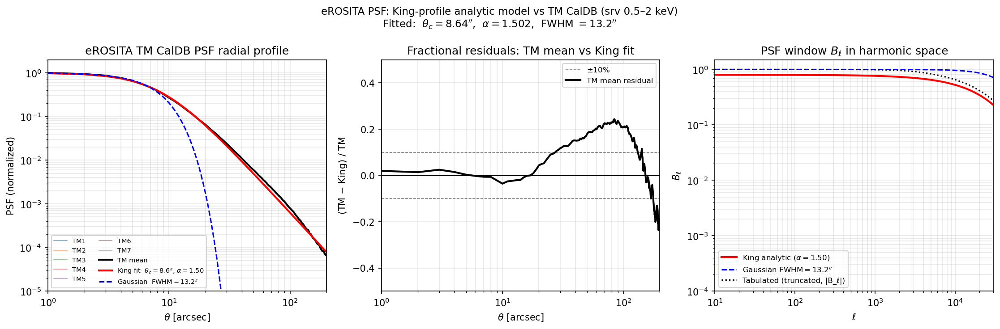

   **Figure PSF-1.** *Left:* eROSITA TM1–TM7 radial PSF profiles (0.5–2 keV,
   CalDB ``srv-0500-2000``) with King profile fit (:math:`\theta_c=8.64''`,
   :math:`\alpha=1.50`, red) and same-FWHM Gaussian (blue dashed).  The King
   profile follows the power-law wings accurately while the Gaussian underestimates
   the PSF by orders of magnitude beyond :math:`\sim15''`.
   *Centre:* Fractional residuals (TM mean − King) / TM mean; within ±5% for
   :math:`\theta < 60''`, rising near the image boundary (240'') where the
   tabulated CalDB data is truncated.
   *Right:* PSF window :math:`B_\ell` in harmonic space.  The Gaussian
   (blue) falls super-exponentially, suppressing all power above
   :math:`\ell\sim 200`; the King model (red) decays only as :math:`e^{-\ell\theta_c}`,
   preserving signal at high :math:`\ell`.  The tabulated :math:`|B_\ell|` (dotted)
   agrees with the analytic King at low :math:`\ell`; at high :math:`\ell` the
   truncation causes numerical divergence that the analytic form avoids.

Validation figure generated by::

   python -m hod_mod.scripts.galaxies.plot_erosita_psf
   # Output: results/psf/erosita_psf_king_fit.png

.. automodule:: hod_mod.galaxies.cross_spectra
   :members:
   :undoc-members:

---

X-ray AGN Model
----------------

(`hod_mod.galaxies.agn`)

:class:`~hod_mod.galaxies.agn.XrayAGNModel` models the mean soft X-ray
(0.5–2 keV) AGN luminosity per dark-matter halo via an abundance-matching
pipeline (Comparat et al. 2019,
`arXiv:1901.10866 <https://arxiv.org/abs/1901.10866>`_):

1. **SHMR** — maps :math:`M_h` to :math:`\log_{10}M_*` via
   :func:`~hod_mod.galaxies.sham.smhm_girelli20` (Girelli et al. 2020).
   The double power-law relation is:

   .. math::

       \frac{M_*}{M_h}(z) = \frac{2A(z)}{(M_h/M_A)^{-\beta} + (M_h/M_A)^\gamma}

   with :math:`\log_{10}M_A = B + z\mu`, :math:`A(z) = C(1+z)^\nu`,
   :math:`\gamma(z) = D(1+z)^\eta`, :math:`\beta(z) = Fz + E`.

   The eight parameters (Girelli+2020 Table 3, best-fit without intrinsic scatter):

   .. list-table::
      :header-rows: 1
      :widths: 10 12 30 18

      * - Param
        - Default
        - Physical role
        - Evolution
      * - :math:`B`
        - 11.79
        - :math:`\log_{10}(M_A/M_\odot)` at :math:`z=0` — pivot halo mass where
          :math:`M_*/M_h` peaks
        - :math:`\log_{10} M_A = B + z\mu`
      * - :math:`\mu`
        - 0.20
        - Linear-:math:`z` slope of pivot mass
        - —
      * - :math:`C`
        - 0.046
        - Peak :math:`M_*/M_h` at :math:`z=0` ≈ 4.6%
        - :math:`A(z) = C(1+z)^\nu`
      * - :math:`\nu`
        - −0.38
        - Redshift power-law of peak amplitude
        - —
      * - :math:`D`
        - 0.709
        - High-mass slope :math:`\gamma` at :math:`z=0`
        - :math:`\gamma(z) = D(1+z)^\eta`
      * - :math:`\eta`
        - −0.18
        - Redshift power-law of high-mass slope
        - —
      * - :math:`F`
        - 0.043
        - Linear-:math:`z` coefficient of low-mass slope :math:`\beta`
        - :math:`\beta(z) = Fz + E`
      * - :math:`E`
        - 0.96
        - Low-mass slope at :math:`z=0`
        - —

   A variant with 0.2 dex intrinsic scatter in :math:`M_*` is available as
   ``hod_mod.galaxies.sham._GIRELLI20_SCATTER`` (Table 4 of Girelli+2020;
   pass ``B=11.83, mu=0.18, ...`` to :func:`~hod_mod.galaxies.sham.smhm_girelli20`).

2. **LX–M* polynomial** — parametric fit to the hard-band (2–10 keV) XLF
   abundance-matching result:

   .. math::

       \log_{10} L_X^{\rm hard} = a + b\,(\log_{10}M_* - 10)
       + c\,(\log_{10}M_* - 10)^2

   Default: :math:`a=41.04,\ b=1.22,\ c=0` (units: erg/s).
   Calibrated against the Hasinger+2005 LDDE soft XLF at :math:`z=0.1, 0.5, 1.0`
   (joint 4-parameter fit; residuals :math:`<0.025` dex at all three redshifts).

3. **Band conversion** — hard-to-soft (0.5–2 / 2–10 keV) flux ratio
   :math:`f_{h\to s}=0.35` for a power-law SED with :math:`\Gamma=1.7`,
   :math:`N_H=10^{21}\,{\rm cm}^{-2}` (Comparat+2019 §3.2 / Table 2).
4. **Log-normal scatter** — 0.8 dex scatter in :math:`\log_{10}L_X` at fixed
   :math:`M_*` boosts the ensemble mean by
   :math:`\exp(\sigma_{\rm dex}^2\,\ln^2 10\,/\,2)`.
5. **Duty cycle** :math:`f_{\rm DC}(z)` — redshift-dependent active fraction,
   calibrated against the Hasinger+2005 LDDE evolution (:math:`p_1=3.97`)
   and interpolated from six nodes:

   .. list-table::
      :header-rows: 1
      :widths: 20 30

      * - :math:`z`
        - :math:`\log_{10} f_{\rm DC}`
      * - 0.00
        - −1.416
      * - 0.25
        - −1.012
      * - 0.75
        - −0.402
      * - 1.75
        - −0.301
      * - 3.50
        - −0.301
      * - 10.1
        - −0.301

   The :math:`z\leq 0.75` nodes follow a best-fit power-law
   :math:`10^{-1.416+4.171\log_{10}(1+z)}`; the higher-:math:`z` nodes are
   capped at :math:`\log_{10}f_{\rm DC}=-0.301` (:math:`f_{\rm DC}=0.50`)
   because the unconstrained power-law extrapolation exceeds unity beyond
   :math:`z\approx 1.2` (outside the Hasinger calibration range).

The combined mean luminosity per halo is:

.. math::

    \langle L_X^{\rm soft}(M_h, z)\rangle
    = f_{\rm DC}(z)\times 10^{\log_{10}L_X^{\rm hard}(M_*)}\times f_{h\to s}
      \times \exp\!\left(\frac{\sigma_{\rm dex}^2\,\ln^2 10}{2}\right)

**Point-source profile**: AGN are unresolved, so their real-space profile is
a delta function and their Fourier transform is flat in :math:`k`:

.. math::

    \tilde{X}^{\rm AGN}(k|M) = \frac{\langle L_X^{\rm soft}(M,z)\rangle}{10^{43}}

This allows :class:`~hod_mod.galaxies.cross_spectra.HaloModelCrossSpectra` to
include the AGN contribution alongside the thermal gas emission from
:class:`~hod_mod.cosmology.gas_profiles.GasDensityDPM`.

Usage example:

.. code-block:: python

   import numpy as np
   from hod_mod.galaxies.agn import XrayAGNModel

   agn = XrayAGNModel()                            # Girelli+2020 SHMR, 0.8 dex scatter
   m_halo = np.logspace(11, 15, 100)               # [Msun/h]
   lx = agn.mean_agn_lx(m_halo, z=0.135)          # [erg/s]
   log10_lx = agn.mean_agn_log10lx(m_halo, z=0.135)

   # Pass to HaloModelCrossSpectra via the agn_model keyword:
   from hod_mod.galaxies.cross_spectra import HaloModelCrossSpectra
   from hod_mod.cosmology import GasDensityDPM

   dp    = GasDensityDPM(model=2)
   cross = HaloModelCrossSpectra(fhmp, density_profile=dp, agn_model=agn)
   wgX   = cross.projected_gX(rp, z, theta_cosmo, hod_params)

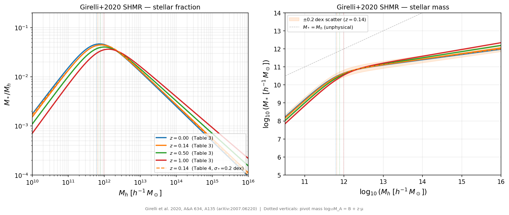

   **Figure AGN-1.** Girelli+2020 SHMR: :math:`M_*/M_h` ratio (left) and
   :math:`\log_{10}M_*` (right) vs :math:`\log_{10}M_h` at :math:`z=0,
   0.14, 0.5, 1.0`.  Dashed line shows the scatter-fit variant (Table 4).
   Shaded band: ±0.2 dex intrinsic scatter at :math:`z=0.14`.
   Dotted verticals: pivot halo mass :math:`M_A(z)`.

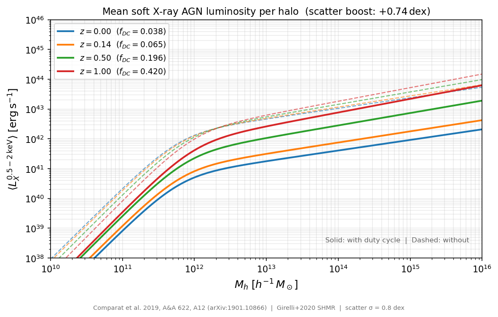

   **Figure AGN-2.** Mean soft X-ray AGN luminosity
   :math:`\langle L_X^{0.5-2\,{\rm keV}}\rangle` vs :math:`\log_{10}M_h`
   at four redshifts.  Solid curves include the duty cycle :math:`f_{\rm DC}(z)`;
   dashed curves show the pre-duty-cycle luminosity, illustrating the
   redshift-dependent suppression and the +0.74 dex scatter boost.

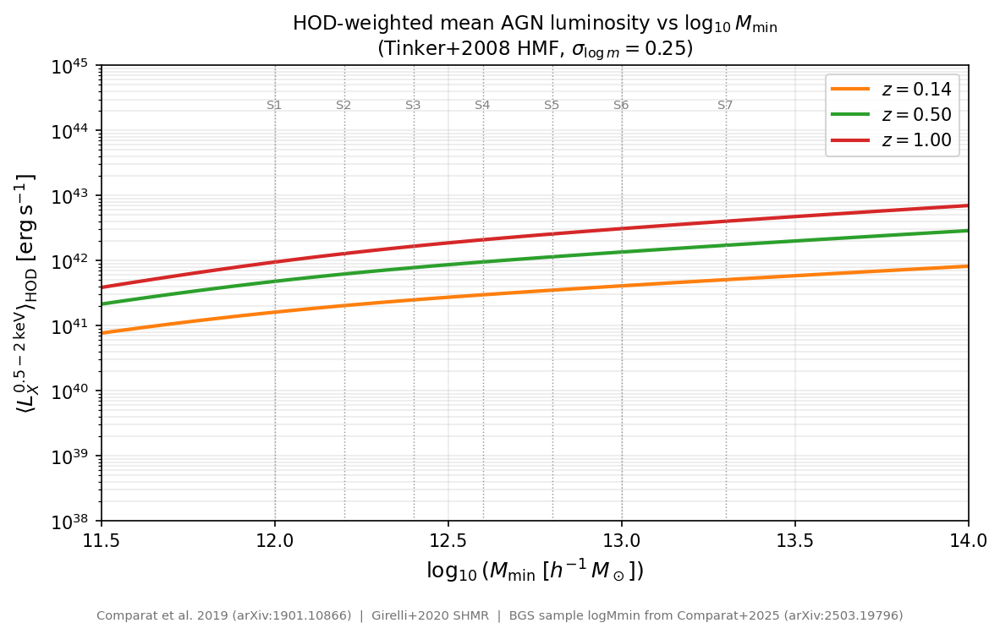

   **Figure AGN-3.** HOD-weighted mean AGN luminosity
   :math:`\langle L_X\rangle_{\rm HOD}` vs HOD threshold
   :math:`\log_{10}M_{\min}` at :math:`z=0.14, 0.5, 1.0`
   (Tinker+2008 HMF, :math:`\sigma_{\log m}=0.25`).
   Dotted verticals label the seven BGS stellar-mass samples (S1–S7) of
   Comparat+2025.

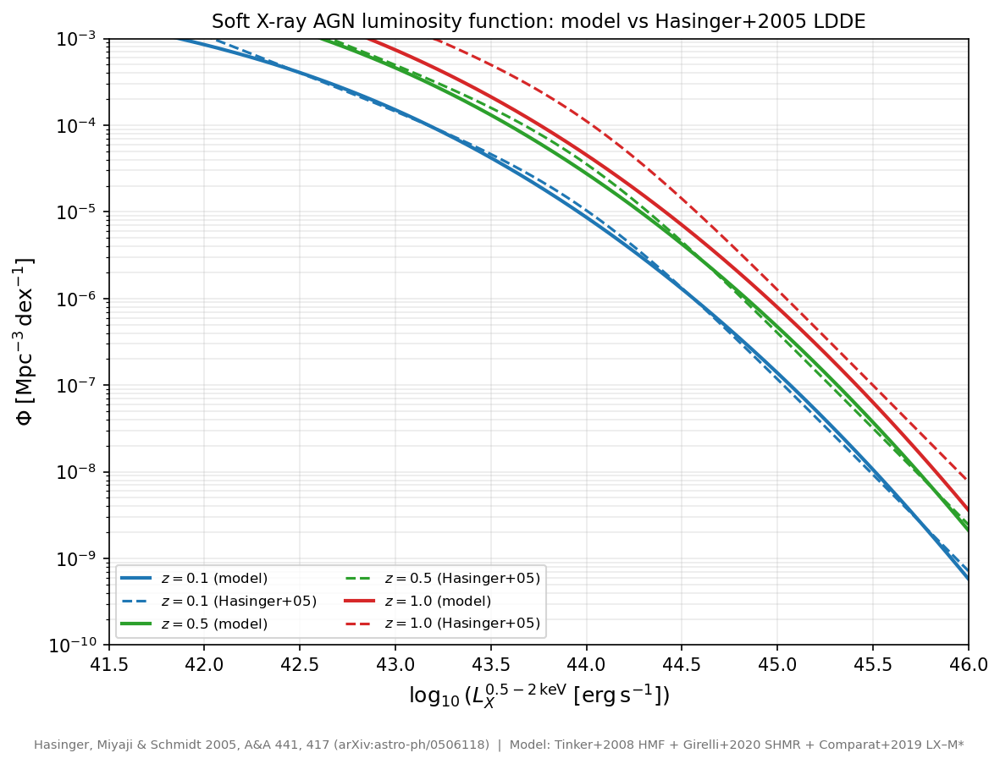

   **Figure AGN-4.** Predicted soft X-ray (0.5–2 keV) AGN luminosity function
   (solid) vs the Hasinger+2005 LDDE reference (dashed,
   `arXiv:astro-ph/0506118 <https://arxiv.org/abs/astro-ph/0506118>`_)
   at :math:`z=0.1, 0.5, 1.0`.
   Predicted curves integrate the Tinker+2008 HMF with the Girelli+2020 SHMR,
   LX–M* relation, 0.8 dex log-normal scatter, and the calibrated
   redshift-dependent duty cycle.  Both parameters and duty cycle were
   jointly fitted to match this reference; residuals are :math:`<0.025` dex
   at all three redshifts.

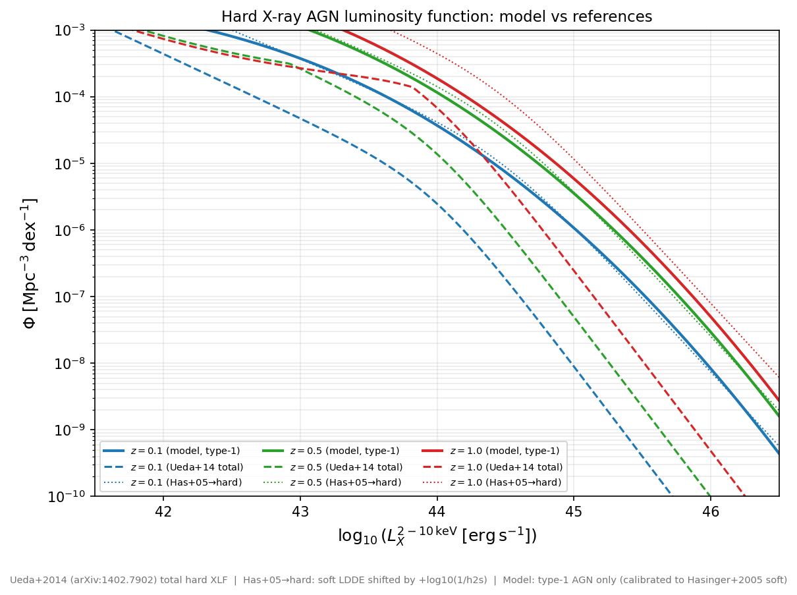

   **Figure AGN-5.** Predicted hard X-ray (2–10 keV) AGN luminosity function
   (solid, type-1 AGN only) at :math:`z=0.1, 0.5, 1.0`, with two references:
   **Ueda+2014 LDDE** (dashed,
   `arXiv:1402.7902 <https://arxiv.org/abs/1402.7902>`_) — total hard XLF
   including obscured (type 2) and Compton-thick AGN;
   **Hasinger+2005 → hard** (dotted) — the soft LDDE shifted to the hard band
   via :math:`\log_{10}L_{\rm hard}=\log_{10}L_{\rm soft}-\log_{10}f_{h\to s}`,
   representing type-1-only AGN.
   The model lies between the two references: calibrated to the soft (type-1)
   XLF, it reproduces the type-1-only hard XLF and sits :math:`\sim 3`–:math:`5\times`
   below Ueda+2014 at :math:`L<10^{44}` — consistent with the observed
   :math:`\sim 70\%` obscured fraction at these luminosities.

**References:** Comparat et al. 2019 (`arXiv:1901.10866
<https://arxiv.org/abs/1901.10866>`_);
Girelli et al. 2020 (`arXiv:2007.06220
<https://arxiv.org/abs/2007.06220>`_);
Hasinger, Miyaji & Schmidt 2005 (`arXiv:astro-ph/0506118
<https://arxiv.org/abs/astro-ph/0506118>`_) — soft XLF LDDE reference;
Ueda et al. 2014 (`arXiv:1402.7902
<https://arxiv.org/abs/1402.7902>`_) — total hard XLF LDDE reference.

.. automodule:: hod_mod.galaxies.agn
   :members:
   :undoc-members:

HAM AGN Model
--------------

(`hod_mod.galaxies.agn_ham`)

:class:`~hod_mod.galaxies.agn_ham.HamAGNModel` implements the
Comparat et al. 2019 abundance-matching (HAM) AGN model.  Unlike
:class:`~hod_mod.galaxies.agn.XrayAGNModel`, which uses a parametric
:math:`L_X`–:math:`M_*` relation, this model matches the cumulative
galaxy number density to the hard X-ray luminosity function directly,
so the **hard XLF is reproduced by construction**.  The soft XLF is
then predicted via the obscuration model and K-corrections.

Pipeline
~~~~~~~~~~

1. **SHMR** — Zu & Mandelbaum (2015) Eq. 19 maps each halo mass
   :math:`M_h \to M_*` (bisection inversion, 60 iterations).

2. **HAM** — Cumulative densities are matched:

   .. math::

      f_{\rm DC}(z)\,n_{\rm gal}(>M_*) = n_{\rm AGN}(>L_X^{\rm hard})

   using either the Aird et al. 2015 LADE or the Ueda et al. 2014
   LDDE hard XLF.  A 2D lookup table :math:`(z, \log M_h) \to
   \log L_X^{\rm hard}` is precomputed at instantiation (~12 s).

3. **Obscuration model** — Comparat+2019 eqs. 4–11 assign type-1,
   type-2, and Compton-thick fractions as a function of
   :math:`L_X^{\rm hard}` and :math:`z`.

4. **K-correction** — The tabulated
   :math:`f_{\rm obs}(z, \log N_H)` converts rest-frame 2–10 keV to
   observed 0.5–2 keV luminosity.  The table is bundled in the package
   at ``hod_mod/data/agn/`` and loaded automatically (no environment
   variables required).

K-correction table
^^^^^^^^^^^^^^^^^^

The table encodes

.. math::

   f_{\rm obs}(z,\log N_H)
   = \frac{L_X^{0.5\text{–}2\,\mathrm{keV},\,\mathrm{obs}}}
          {L_X^{2\text{–}10\,\mathrm{keV},\,\mathrm{RF,\,intrinsic}}}

computed with **XSPEC** using the spectral model
``TBabs(plcabs + zgauss + constant×powerlaw + pexrav×constant)``
with photon index :math:`\Gamma = 1.9`, scattered fraction
:math:`f_{\rm scat} = 0.02`, and Galactic column
:math:`N_H^{\rm gal} = 3\times10^{20}\ \mathrm{cm}^{-2}` (solar
abundances; Wilms, Allen & McCray 2000).  The model includes
photoelectric absorption (`TBabs`), Compton-thick transmission
(`plcabs`), an iron-K emission line (`zgauss`), reflection
(`pexrav`), and a scattered power-law component.  The grid covers
13 redshifts (:math:`z = 0\text{–}6`, step 0.5) and
13 column densities (:math:`\log N_H = 20\text{–}26`, step 0.5).
Key normalisation values: :math:`f_{\rm obs}(z=0, \log N_H=20) = 0.607`
(unobscured; includes Galactic absorption and reflection) and
:math:`f_{\rm obs}(z=0, \log N_H\geq24) = 0.0133`
(Compton-thick floor; scattered component only).

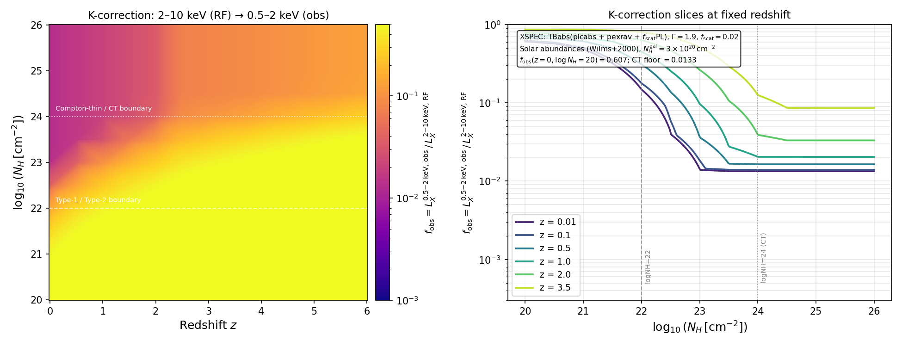

   **Figure HAM-0.** X-ray K-correction grid computed with XSPEC.
   *Left:* :math:`f_{\rm obs}` in the :math:`(z, \log N_H)` plane
   (logarithmic colour scale).  The dashed line marks the
   type-1/type-2 boundary at :math:`\log N_H = 22`; the dotted line
   marks the Compton-thin/Compton-thick boundary at
   :math:`\log N_H = 24`.
   *Right:* Slices at fixed redshift.  The plateau above
   :math:`\log N_H = 24` at :math:`f_{\rm obs} \approx 0.0133` is the
   scattered-light component that passes through the absorbing column.

HAM mapping and XLF reproduction
^^^^^^^^^^^^^^^^^^^^^^^^^^^^^^^^^

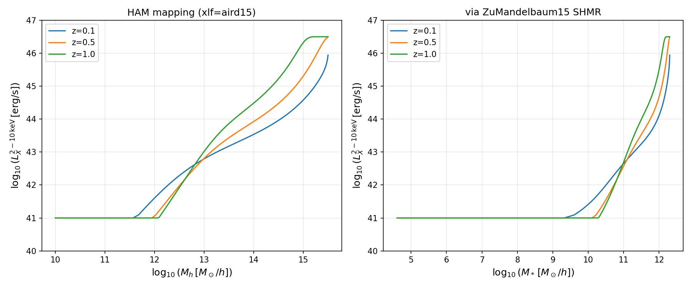

   **Figure HAM-1.** HAM luminosity mapping.
   *Left:* :math:`\log L_X^{\rm hard}` vs. halo mass at :math:`z =
   0.1, 0.5, 1.0`.  Halos below :math:`\log M_h \approx 12` are
   assigned the grid lower boundary (:math:`10^{41}` erg/s); at those
   masses the galaxy occupation is negligible so the value does not
   affect cross-correlation predictions.
   *Right:* Same mapped through the Zu & Mandelbaum (2015) SHMR to
   stellar mass.

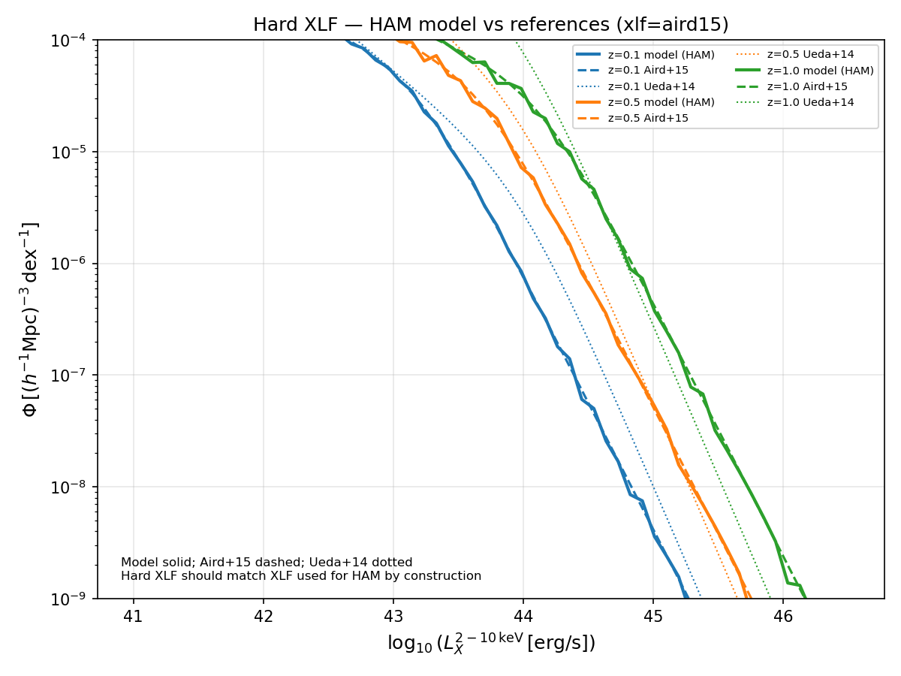

   **Figure HAM-2.** Hard (2–10 keV) XLF check.  Solid lines show the
   HAM-predicted XLF (recovered by binning the HAM table against the
   halo mass function); dashed lines show the input Aird+2015 LADE;
   dotted lines show Ueda+2014 LDDE.  The model reproduces the input
   XLF by construction over the range :math:`10^{43}` –
   :math:`10^{45.5}` erg/s.

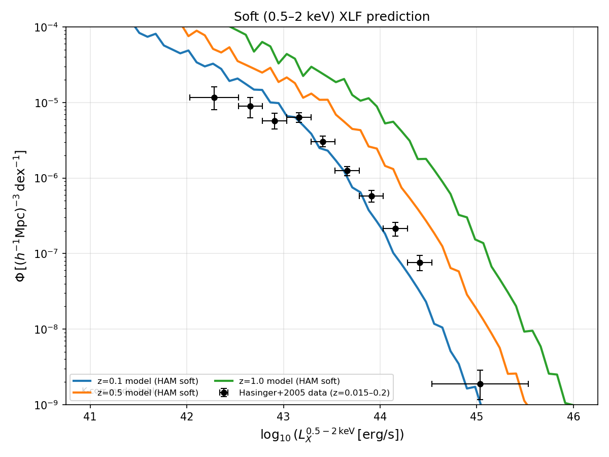

   **Figure HAM-3.** Predicted soft (0.5–2 keV) XLF (solid) compared
   with Hasinger, Miyaji & Schmidt (2005) LDDE (dashed) at
   :math:`z = 0.1, 0.5, 1.0`.  The model lies ~0.5–1 dex below
   Hasinger at the bright end because obscured sources are
   redistributed to fainter apparent soft luminosities.

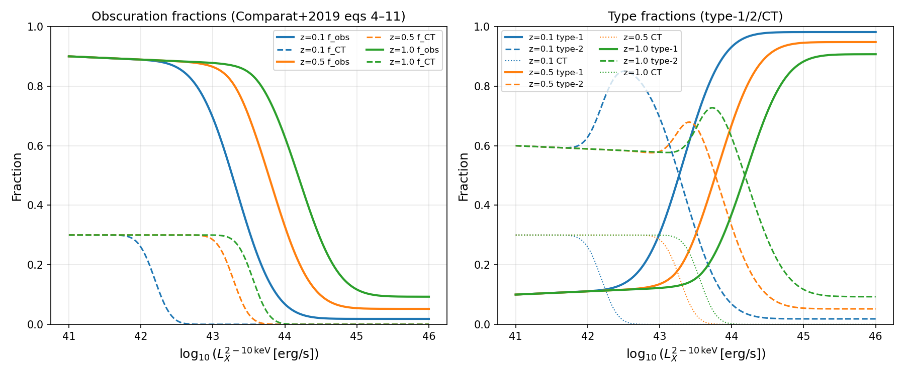

   **Figure HAM-4.** Obscuration fractions (Comparat+2019 eqs. 4–11).
   *Left:* Total obscured (:math:`\log N_H > 22`) and Compton-thick
   fractions as a function of :math:`L_X^{\rm hard}`.
   *Right:* Type-1, type-2, and CT fractions.

AGN model validation
^^^^^^^^^^^^^^^^^^^^

The following figures compare model predictions against literature data for
three complementary AGN statistics.  All predictions are derived analytically
from the HAM table: the Tinker+2008 HMF is weighted by the HAM
:math:`L_X(M_h, z)` mapping and the Zu & Mandelbaum (2015) SHMR, convolved
with a 0.8 dex log-normal scatter in :math:`L_X` at fixed :math:`M_h`.
Only halos with a genuine HAM assignment (:math:`\log L_X > 41.05`) are
included; lower-mass halos are clamped to the XLF floor and excluded.

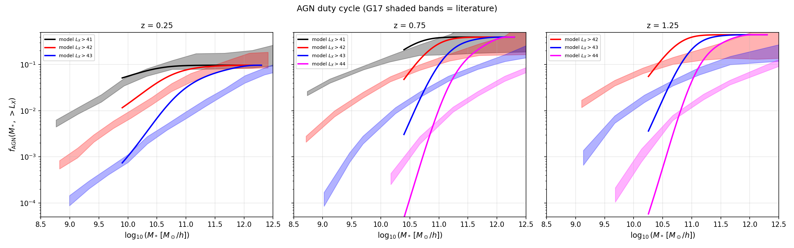

   **Figure HAM-5.** AGN duty cycle :math:`f_{\rm AGN}(M_*, > L_X)`
   at :math:`z = 0.25, 0.75, 1.25` for hard-band luminosity thresholds
   :math:`\log L_X > 41, 42, 43` (and 44 at :math:`z \geq 0.75`).
   Shaded bands show Georgakakis et al. (2017, G17) observational
   constraints; stellar masses are shifted by
   :math:`\Delta\log M_* = \log_{10}(0.6777^2)` to convert from the
   :math:`h = 0.6777` convention used by G17.

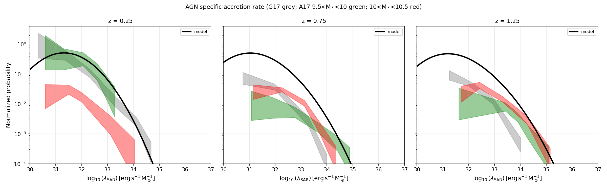

   **Figure HAM-6.** Specific black-hole accretion rate (LSAR) distribution
   :math:`p(\log\lambda_{\rm SAR})` at :math:`z = 0.25, 0.75, 1.25`.
   The model curve (black) is a Gaussian-kernel-smoothed sum over the HMF,
   with :math:`\lambda_{\rm SAR} = L_X^{\rm hard}/M_*` (erg s\ :sup:`−1`
   M\ :sub:`⊙`\ :sup:`−1`).  Grey shading: Georgakakis et al. (2017)
   constraints for all stellar masses.  Green and red shading:
   Aird et al. (2018, A18) mass bins
   :math:`9.5 < \log M_* < 10` and :math:`10 < \log M_* < 10.5`,
   respectively.

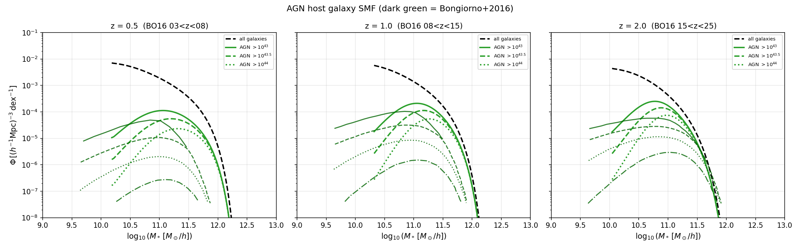

   **Figure HAM-7.** AGN host galaxy stellar mass function
   :math:`\Phi(M_*)` at :math:`z \approx 0.5, 1.0, 2.0` for three
   hard-band luminosity thresholds (:math:`\log L_X > 43, 43.5, 44`).
   Dashed black: total galaxy SMF from the Zu & Mandelbaum (2015) SHMR
   Jacobian.  Dark-green curves: Bongiorno et al. (2016, BO16) AGN host
   galaxy SMF from COSMOS.

**Validation references:**
Georgakakis et al. 2017, MNRAS 471, 1976 — AGN duty cycle and LSAR;
Aird et al. 2018, MNRAS 474, 1225 — specific accretion rate distributions;
Bongiorno et al. 2016, A&A 586, A78 — AGN host galaxy SMF.

Usage
^^^^^

.. code-block:: python

   from hod_mod.galaxies.agn_ham import HamAGNModel
   import numpy as np

   # Instantiate — K-correction table loaded from package data automatically
   agn = HamAGNModel(xlf="aird15")          # or xlf="ueda14"

   m_halo = np.array([1e12, 1e13, 1e14])    # M_sun/h
   lx_soft = agn.mean_agn_lx(m_halo, z=0.5)        # erg/s, 0.5-2 keV
   log10lx = agn.mean_agn_log10lx(m_halo, z=0.5)

   # Pass to HaloModelCrossSpectra
   from hod_mod.galaxies.clustering import HaloModelCrossSpectra
   cross = HaloModelCrossSpectra(fhmp, density_profile=dp, agn_model=agn)

**References:**
Comparat et al. 2019 (`arXiv:1901.10866 <https://arxiv.org/abs/1901.10866>`_);
Aird et al. 2015 (`arXiv:1503.01120 <https://arxiv.org/abs/1503.01120>`_) —
LADE hard XLF;
Ueda et al. 2014 (`arXiv:1402.7902 <https://arxiv.org/abs/1402.7902>`_) —
LDDE hard XLF;
Zu & Mandelbaum 2015 (`arXiv:1505.02781 <https://arxiv.org/abs/1505.02781>`_) —
iHOD SHMR;
Hasinger, Miyaji & Schmidt 2005 (`arXiv:astro-ph/0506118
<https://arxiv.org/abs/astro-ph/0506118>`_) — soft XLF LDDE reference;
Wilms, Allen & McCray 2000, ApJ 542, 914 — X-ray absorption cross-sections.

.. automodule:: hod_mod.galaxies.agn_ham
   :members:
   :undoc-members:

---

HOD AGN Model
-------------

(`hod_mod.galaxies.agn_hod`)

:class:`~hod_mod.galaxies.agn_hod.HODAgnModel` is a third AGN model that places
AGN with an explicit halo occupation distribution (a constant-duty-cycle
More+2015 form, :class:`~hod_mod.galaxies.hod.MoreConstFincHODModel`), maps host
halo masses to stellar masses with the Zu & Mandelbaum 2015 SHMR, and assigns
:math:`L_X` by a flux/optically-selected abundance match against the Aird+2015
XLF.  Unlike :class:`~hod_mod.galaxies.agn.XrayAGNModel` and
:class:`~hod_mod.galaxies.agn_ham.HamAGNModel`, it exposes its own AGN
occupation ``nc_ns_agn`` which drives an occupation-weighted X-ray auto/cross
power spectrum (Lau et al. 2024,
`arXiv:2410.22397 <https://arxiv.org/abs/2410.22397>`_, App. A).  See
:ref:`hod_zumandelbaum2015` (*HOD AGN model* rubric) for the full description and
the LS10-BGS S1…S7 sample configuration.

.. automodule:: hod_mod.galaxies.agn_hod
   :members:
   :undoc-members:
