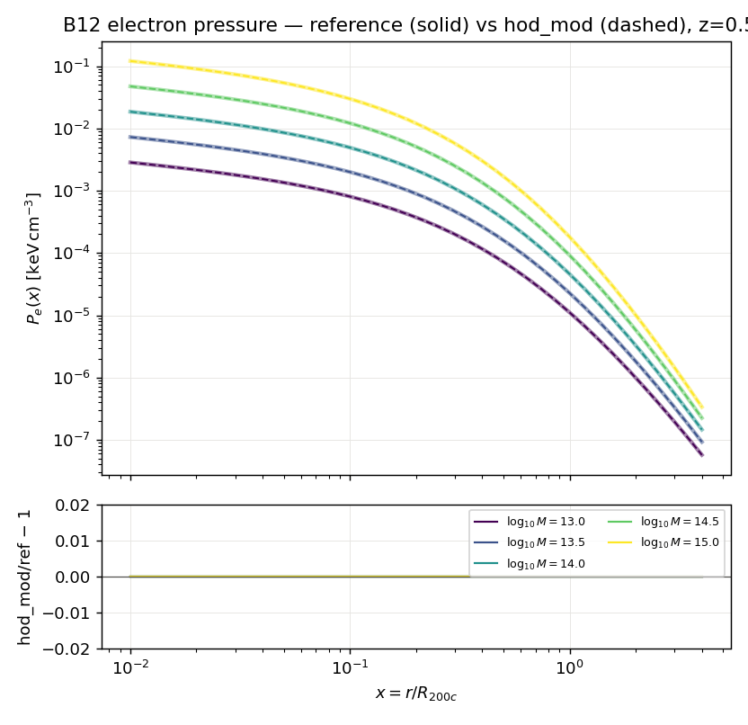
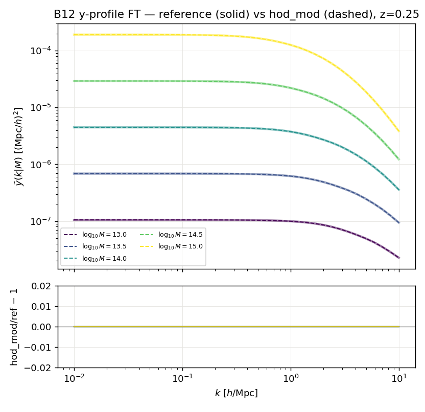
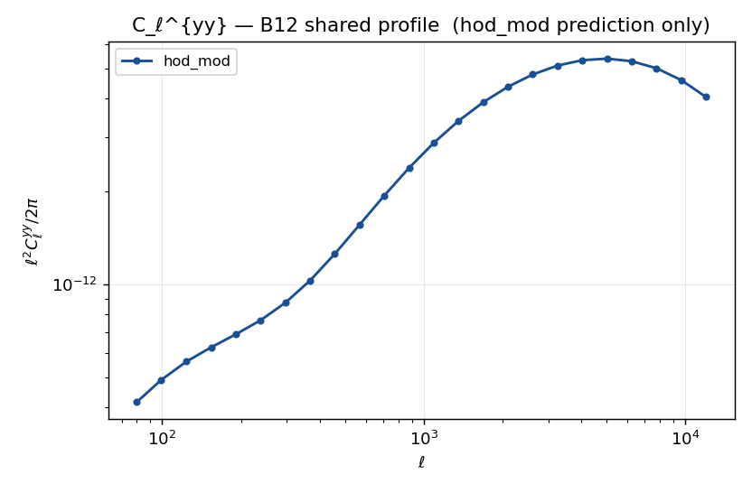
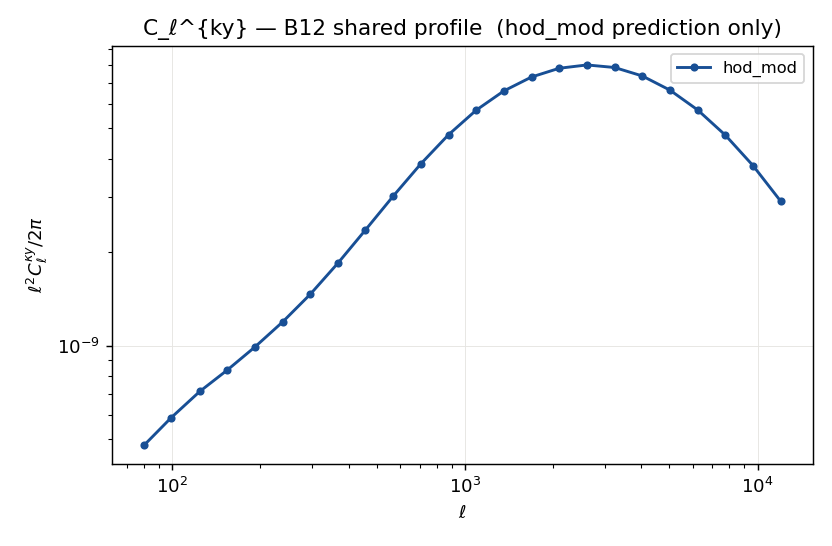

GODMAX independent SZ cross-check
=================================

This page documents an **independent cross-check** of hod_mod's thermal-SZ
sector against `GODMAX <https://github.com/shivampcosmo/GODMAX>`_ ([Pandey2024]_),
a fully differentiable JAX halo model for gas thermodynamics.  It complements the
tSZ pipeline of :doc:`pipeline_gal_tsz`: where that page *builds* the galaxy × y
signal, this one *validates the machinery* against a second, independently-coded
implementation — the tSZ analogue of the AUM galaxy-clustering cross-check in
``tests/test_aum_comparison.py``.

.. contents::
   :local:
   :depth: 2

----

Why a *shared-profile* check
----------------------------

hod_mod and GODMAX use **different gas physics**: hod_mod's default electron
pressure is the empirical, X-ray-calibrated Arnaud+2010 GNFW
(:class:`~hod_mod.gas.PressureProfileA10`), while GODMAX solves the exact
hydrostatic-equilibrium equation with a flexible non-thermal pressure fraction,
calibrated on the ANTILLES hydrodynamic suite.  A raw comparison of the two would
conflate a *modelling* difference with a *machinery* difference.

To isolate the machinery, both codes are driven through the **identical
Battaglia+2012** electron pressure profile ([Battaglia2012]_, Table 1, AGN
feedback, Δ=200) — the analytic model GODMAX already implements
(``src/get_B12_profile.py``) and which was added to hod_mod as
:class:`~hod_mod.gas.PressureProfileBattaglia12`.  With the gas physics held
fixed, any residual measures only the projection stack: the spherical Fourier
transform, the halo-model mass integrals, the Ogata-Hankel / Limber projection,
and the σ_T/(m_e c²) unit convention.

Setup
-----

**Shared profile.**  :class:`~hod_mod.gas.PressureProfileBattaglia12` reproduces
GODMAX's ``Battaglia_12_16`` exactly: the thermal GNFW with mass/redshift-scaled
:math:`\{P_0, x_c, \beta\}`, the Kaiser amplitude
:math:`P_{200c}=G\,M_{200c}\,200\,\rho_{\rm cr}(z)\,f_b/(2R_{200c})`, and the
electron factor :math:`f_e=(2+2X_H)/(3+5X_H)\approx0.518`.  Because B12 is
natively an :math:`M_{200c}` profile, the halo cache is built with
``mdef='200c'``.

**Observables compared**, cleanest → hardest, each isolating more machinery:

.. list-table::
   :header-rows: 1
   :widths: 20 30 50

   * - Quantity
     - hod_mod entry point
     - What it tests
   * - :math:`P_e(r|M,z)`
     - ``PressureProfileBattaglia12._p3d``
     - profile transcription, units, electron factor
   * - :math:`\tilde{y}(k|M,z)`
     - ``PressureProfileBattaglia12.pressure_uk``
     - the spherical Fourier transform (GL quadrature)
   * - :math:`C_\ell^{yy}`
     - ``HaloModelCrossSpectra.angular_cl_yy``
     - the 1-halo + 2-halo mass integral and Limber projection
   * - :math:`C_\ell^{\kappa y}`
     - ``HaloModelCrossSpectra.angular_cl_ky``
     - the matter × y cross-power plus the lensing kernel :math:`W_\kappa(\chi)`

The κ×y projector reuses the matter × y cross-power :math:`P_{m,y}` already
produced by ``_pk_tables_gy`` and adds the tomographic convergence kernel
``_convergence_kernel``.

**Reference.**  GODMAX numbers are captured **once** by
``scripts/godmax/export_godmax_b12_reference.py`` and frozen to a small
``.npz`` — the same pattern hod_mod uses for its CAMB pins and benchmark JSONs,
so the cross-check runs with no GODMAX dependency in the test environment.  Two
sources are supported: ``--source godmax`` (the real GODMAX code, requires its
``src/`` on ``PYTHONPATH``) and ``--source independent`` (a self-contained NumPy
B12 with an independently-coded quadrature FT).  The committed
``independent_b12_reference.npz`` exercises the :math:`P_e`/:math:`\tilde y`
layers today; the :math:`C_\ell` layers activate once a
``godmax_b12_reference.npz`` is generated with ``--source godmax --with-cl``.

Commands
--------

.. code-block:: bash

   # (once, in a checkout with GODMAX src on PYTHONPATH) build the reference
   python scripts/godmax/export_godmax_b12_reference.py \
       --source godmax --with-cl \
       --out hod_mod/data/godmax/godmax_b12_reference.npz

   # or the self-contained NumPy reference (no GODMAX; profile + ỹ only)
   python scripts/godmax/export_godmax_b12_reference.py \
       --source independent \
       --out hod_mod/data/godmax/independent_b12_reference.npz

   # overlay hod_mod vs the reference and write the figures below
   python -m hod_mod.scripts.validate_godmax --backend eh98

   # the numeric assertions (skips the C_ℓ block until a GODMAX ref exists)
   pytest tests/test_godmax_comparison.py

Profile and Fourier y-profile
------------------------------

With the identical B12 formula on both sides, the 3D electron pressure and its
Fourier transform agree to the quadrature floor — validating hod_mod's
transcription, the Kaiser normalization, the :math:`h` / :math:`(1+z)` unit
handling, and the Gauss-Legendre spherical FT against an independently coded
transform:

.. list-table::
   :header-rows: 1
   :widths: 30 25 25

   * - Quantity
     - max \|hod/ref − 1\|
     - tolerance (test)
   * - :math:`P_e(r|M,z)`
     - :math:`\sim1\times10^{-6}`
     - :math:`<10^{-3}`
   * - :math:`\tilde{y}(k|M,z)`
     - :math:`\sim2\times10^{-6}`
     - :math:`<3\times10^{-3}`

   3D electron pressure :math:`P_e(x)` for a range of halo masses at
   :math:`z=0.55`: reference (solid) vs hod_mod (dashed), with the residual
   below at the :math:`10^{-6}` level.

   Fourier y-profile :math:`\tilde{y}(k|M)` overlay and residual — the
   spherical FT + σ_T/(m_e c²) convention reproduced to :math:`\sim10^{-6}`.

As an independent sanity anchor, the B12 and Arnaud+2010 :math:`\tilde y(k)`
agree to within ~10 % across :math:`k` for a :math:`3\times10^{14}` halo — two
physically distinct pressure models landing on a common amplitude, a strong
indication the B12 normalization and units are correct.

Angular power spectra
---------------------

The tSZ auto :math:`C_\ell^{yy}` and the shear × tSZ cross
:math:`C_\ell^{\kappa y}` (GODMAX's headline observable) are computed from the
shared B12 profile through hod_mod's Limber projectors.  The self-contained tests
confirm the expected structure — positive, smooth spectra; the correct
1-halo/2-halo crossover (2-halo dominates at low :math:`k`, 1-halo at high
:math:`k`); and a convergence kernel :math:`W_\kappa(\chi)` that peaks between
lens and source and vanishes beyond the source distribution.  Numeric agreement
against GODMAX activates once ``godmax_b12_reference.npz`` (built ``--with-cl``)
is present; the residual then also carries the small HMF/bias/:math:`c(M)`
differences between the two codes' halo sectors, folded into the tolerance
(:math:`<15\%` for :math:`C_\ell^{yy}`, :math:`<20\%` for
:math:`C_\ell^{\kappa y}`) exactly as the AUM cross-check attributes its residual
to CAMB-vs-EH98 and concentration differences.

   tSZ auto-spectrum :math:`\ell^2 C_\ell^{yy}/2\pi` from the shared B12 profile.

   Shear × tSZ cross-spectrum :math:`\ell^2 C_\ell^{\kappa y}/2\pi` for a
   DES-like source :math:`n(z)`.

Config matching
---------------

The :math:`P_e`/:math:`\tilde y` comparison is independent of the halo sector.
The :math:`C_\ell` comparison additionally depends on the halo mass function,
bias, and concentration, so the export manifest records GODMAX's choices
(``tinker08`` HMF, ``tinker10`` bias, ``diemer19`` :math:`c(M)`, ``mdef=200c``)
and ``validate_godmax.py`` mirrors them.  The default ``--backend eh98`` path
(pure-JAX, ``dutton14`` :math:`c(M)`) is fastest and exact for the profile
layers; ``--backend camb`` selects the ``diemer19`` :math:`c(M)` that most
closely matches GODMAX for the :math:`C_\ell` layers.

Where the outputs are stored
----------------------------

.. list-table::
   :header-rows: 1
   :widths: 45 55

   * - File
     - Content
   * - ``hod_mod/data/godmax/independent_b12_reference.npz``
     - committed NumPy B12 reference (profile + ỹ grids)
   * - ``hod_mod/data/godmax/godmax_b12_reference.npz``
     - GODMAX reference (generate in a GODMAX env; add ``--with-cl`` for C_ℓ)
   * - ``docs/_images/godmax__{profile,uk,cl_yy,cl_ky}.png``
     - overlay + residual figures (written by ``validate_godmax.py``)
   * - ``tests/test_godmax_comparison.py``
     - self-contained machinery checks + skipif reference assertions
