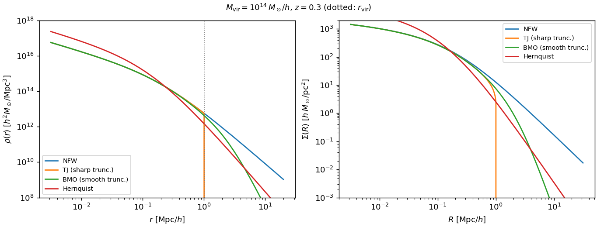
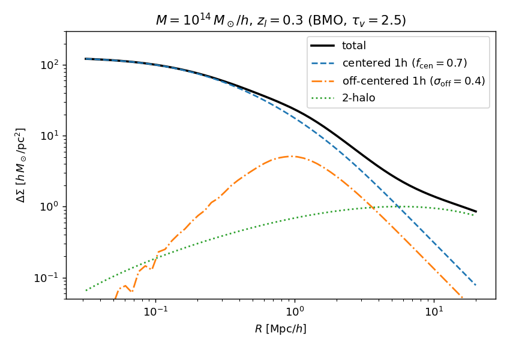
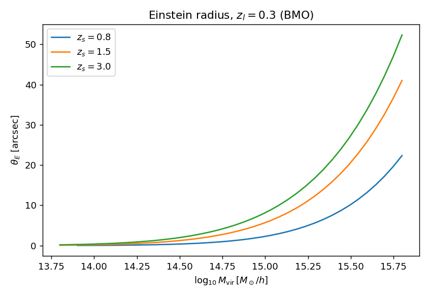
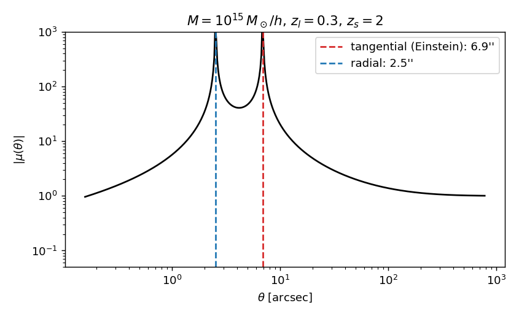

Halo Lensing
============

Weak- and strong-lensing predictions from analytic truncated halo profiles,
in pure JAX.  Ports the feature set of the ``halo_lensing`` reference code
(companion of the HSC final-year cluster catalogs, `Oguri et al. 2026, PASJ
78, 416 <https://arxiv.org/abs/2512.13954>`_,
`github.com/massarin/halo_lensing <https://github.com/massarin/halo_lensing>`_)
without any colossus/astropy/fftlog dependency, and adds a strong-lensing
block (deflection, Einstein radius, magnification, critical curves).

A worked tour is in ``notebooks/halo_lensing.ipynb``; the test suite
(``tests/test_lensing_profiles.py``, ``tests/test_lensing_observables.py``)
pins every kernel to golden values generated from the reference
implementation.

Profile families
----------------

All in comoving h-units (radii Mpc/h, masses :math:`M_\odot/h`,
:math:`\Sigma` in :math:`h\,M_\odot/\mathrm{Mpc}^2`), parametrized by the NFW
:math:`(\rho_s, r_s)` from :func:`~hod_mod.core.lensing_profiles.nfw_params_from_mass`:

* **Sharply truncated NFW** (Takada & Jain 2003), ``tnfw_*`` — NFW density
  cut at :math:`r_t = c_t r_s`:

  .. math::

     \Sigma(R) = 4\rho_s r_s\, f_{\rm TJ}(R/r_s,\,c_t), \qquad
     \pi R^2 \bar\Sigma(<R) \to 4\pi\rho_s r_s^3\, m_{\rm nfw}(c_t)

  normalized to the exact projection of the truncated density (the
  reference's real-space ``tj_*`` functions carry an extra
  :math:`m_{\rm nfw}(c)` relative to their own Fourier window; verified by
  direct Abel integration).

* **Smoothly truncated NFW** (Baltz, Marshall & Oguri 2009, n=2), ``bmo_*`` —
  :math:`\rho_{\rm NFW}(r)\,[\tau^2/(\tau^2 + x^2)]^2` with
  :math:`\tau = r_t/r_s`; closed forms for :math:`\Sigma`,
  :math:`\bar\Sigma`, :math:`M(<r)`, the finite total mass, and the Fourier
  window :math:`\hat u(k)` (via cancellation-free scaled exponential
  integrals :math:`e^{x}E_1(x)`, :math:`e^{-x}\mathrm{Ei}(x)`).

* **Hernquist** (1990), ``hernquist_*`` — :math:`\rho \propto 1/[x(1+x)^3]`
  with :math:`r_b = 0.551\,r_e`; the stellar component for galaxy-scale
  lenses.

All kernels use autodiff-safe branch handling (double-``where`` on inputs, a
quadratic interpolation window at :math:`x = 1`), so ``jax.grad`` is NaN-free
across every branch point, including the sharp truncation edge.

Weak lensing
------------

:func:`~hod_mod.observables.lensing.sigma_crit` (comoving or physical
convention), mis-centering by **real-space azimuthal averaging** of the
analytic :math:`\Sigma` (fixed-offset and Gaussian/Rayleigh PDFs — exact at
:math:`R \ll R_{\rm off}`, validated to sub-percent against brute-force
quadrature where the reference's fftlog rings), and a Tinker10-bias 2-halo
term reusing the validated hybrid line-of-sight grid of the clustering
pipeline.  The stacked-cluster model of Oguri et al. (2026):

.. math::

   \Delta\Sigma_{\rm tot} = f_{\rm cen}\,\Delta\Sigma_{\rm 1h}
     + (1 - f_{\rm cen})\,\Delta\Sigma_{\rm off}(\sigma_{\rm off})
     + \Delta\Sigma_{\rm 2h}

The full pipeline (matched profile parameters) reproduces the reference
fftlog implementation to ~1% max / 0.04% median on the total
:math:`\Delta\Sigma`.

Strong lensing
--------------

For an axisymmetric lens with :math:`\theta = R_{\rm com}/\chi_l`:

.. math::

   \alpha(\theta) = \theta\,\bar\kappa(\theta), \qquad
   \bar\kappa(\theta_E) = 1, \qquad
   \mu^{-1} = (1 - \bar\kappa)(1 + \bar\kappa - 2\kappa)

:func:`~hod_mod.observables.lensing.solve_einstein_radius` combines a fixed
log-bisection with one Newton step through ``stop_gradient``, so its
``jax.grad`` is the exact implicit-function-theorem derivative
:math:`dR_E/dp = -(\partial\bar\kappa/\partial p)/(\partial\bar\kappa/\partial R)`
(verified against finite differences to :math:`10^{-6}`); sub-critical halos
return NaN.  Composite lenses (e.g. Hernquist stars + truncated-NFW halo)
pass summed :math:`\bar\kappa` callables.

API reference
-------------

(`hod_mod.core.lensing_profiles`)

.. automodule:: hod_mod.core.lensing_profiles
   :members:
   :undoc-members:

(`hod_mod.observables.lensing`)

.. automodule:: hod_mod.observables.lensing
   :members:
   :undoc-members:
