Sensitivity study: differentiable pipeline, scale cuts and degeneracy breaking
==============================================================================

This page answers one question, pedagogically:

    **How much cosmological information sits at small scales, and under what
    condition can we actually use it?**

The short answer, demonstrated below with the full ZM15 + X-ray gas + AGN
pipeline: the sensitivity to the cosmological parameters :math:`(\Omega_m,
\sigma_8)` **increases towards small scales, but for clustering and lensing
alone that gain is throttled by degeneracies with the galaxy–halo connection.
Adding an X-ray and/or a thermal-SZ cross-statistic breaks those degeneracies,
which is what lets the small-scale information convert into cosmological
constraining power.**

Everything here is exact autodifferentiation.  The one ingredient that makes
that possible is using the analytic **Eisenstein & Hu (1998)** transfer function
for the linear :math:`P(k)` instead of CAMB (which is not JAX-traceable): the
whole forward model — cosmology included — is then a single differentiable
JAX function, and the Fisher Jacobian :math:`\partial d/\partial\theta` is one
``jax.jacfwd`` call.

Code: :mod:`hod_mod.forecast` (forward model + Fisher engine),
:mod:`hod_mod.scripts.forecasts.run_sensitivity_study` (the study),
:mod:`hod_mod.scripts.forecasts.make_sensitivity_figures` (these figures).

.. contents::
   :local:
   :depth: 2

----

The fiducial model and the twelve summary statistics
----------------------------------------------------

We fix a single representative sample — a BGS :math:`M_*>10` threshold sample at
:math:`z\simeq0.2` — at the best-fit parameters of the campaign:

* **cosmology** — Planck 2018 (:math:`\Omega_m=0.31`, :math:`\sigma_8=0.811`;
  :math:`h, \Omega_b, n_s` are free but carry their Planck/BBN priors — they are
  near-flat directions for these low-:math:`z`, small-scale probes on their own);
* **HOD** — the Zu & Mandelbaum 2015 MAP of the BGS joint fit (9 free parameters);
* **X-ray gas / AGN** — the S1 energy-band MAP
  (:math:`L_X`–:math:`M`, :math:`kT`–:math:`M`, profile shape ``p2``/``r_max``,
  duty cycle ``log10DC``);
* **hot-gas / baryon-feedback sector** — a mass fraction :math:`f_b(M)` and gas
  puffiness :math:`\eta(M)` (parameters ``log10_M_pivot``, ``log10_eta_min``),
  shared between the lensing, X-ray and tSZ legs (see the baryon section below).

The Fisher vector has 31 parameters: 5 cosmological
(:math:`\Omega_m,\sigma_8,h,n_s,\Omega_b`), 9 HOD, 6 X-ray gas
(:math:`L_X`/:math:`kT`/profile), 2 baryon-feedback, :math:`\beta_P`,
:math:`\log_{10}\rm DC`, and **7 for the Powell (2022) AGN X-ray
luminosity-function sector** (the :math:`M_{\rm BH}`–:math:`M_*` relation
:math:`\mu_{\rm BH},\alpha_{\rm BH},\sigma_{\rm BH}`, the universal
Eddington-ratio distribution :math:`\log_{10}\lambda_*,\delta_1,\delta_2`, and
the active fraction :math:`\log_{10}f_{\rm ERDF}`).

From it we predict twelve data vectors: projected clustering :math:`w_p(r_p)`,
galaxy–galaxy lensing :math:`\Delta\Sigma(R)`, the angular cross/auto power
spectra :math:`C_\ell^{gX}` (galaxy × X-ray), :math:`C_\ell^{gy}` (galaxy × tSZ)
and :math:`C_\ell^{XX}` (X-ray auto), the **cosmic-shear** convergence spectrum
:math:`C_\ell^{\kappa\kappa}` (source :math:`n(z)` at :math:`z_s\simeq0.8`),
three **CMB-lensing** spectra :math:`C_\ell^{\kappa_c\kappa_c}` (auto),
:math:`C_\ell^{g\kappa_c}` (galaxy×CMB-lensing) and :math:`C_\ell^{\kappa\kappa_c}`
(shear×CMB-lensing, source at :math:`z_*\simeq1089`), the galaxy number density
:math:`n_{\rm gal}` and stellar-mass function :math:`\Phi(M_*)`, and the AGN
**X-ray luminosity function** :math:`\Phi(L_X)` (an abundance, no length scale —
see the AGN section).  A **constant relative error** :math:`f` (0.1 %, 1 %, 5 %)
is assigned to every data point, so the diagonal covariance is
:math:`C=\mathrm{diag}\!\big((f d_i)^2\big)`; an analytic Gaussian covariance with
cross-observable correlations is available as an option (see
:mod:`hod_mod.forecast.covariance`).

The derivative of the pipeline, step by step
--------------------------------------------

Because the model is one differentiable function, we can watch a response
propagate through it by the chain rule.  The figure below shows the
**logarithmic sensitivity** :math:`\partial\ln O/\partial\ln p` of each pipeline
stage to **all five cosmological parameters**
(:math:`\Omega_m,\sigma_8,h,n_s,\Omega_b`), from the linear power spectrum all the
way to the observables.

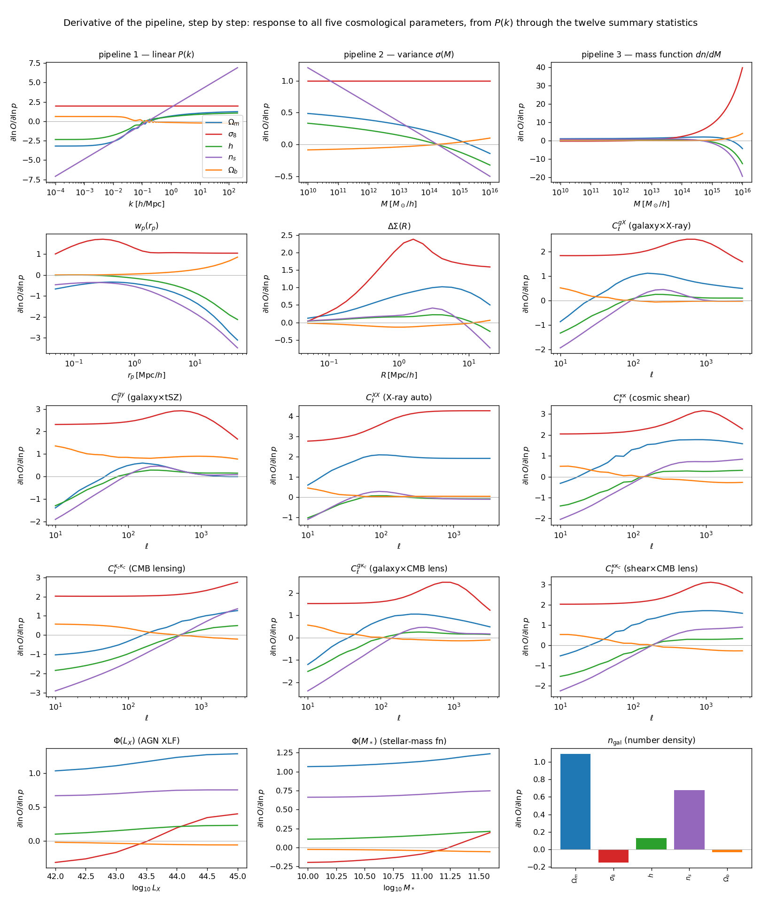

   The cosmological derivative propagating through the pipeline (all via JAX
   autodiff).  The **first row** is the three shared upstream stages: the two exact
   analytic checkpoints that validate the autodiff —
   :math:`\partial\ln P/\partial\ln\sigma_8=2` everywhere (linear :math:`P(k)`) and
   :math:`\partial\ln\sigma(M)/\partial\ln\sigma_8=1` — and the mass function, which
   shows the hallmark **exponential** sensitivity at cluster masses
   (:math:`\partial\ln(dn/dM)/\partial\ln\sigma_8\to+40` at
   :math:`10^{16}\,M_\odot/h`), the physical reason massive halos are such sharp
   cosmological probes.  The remaining twelve panels are the endpoint response of
   **every summary statistic** — :math:`w_p`, :math:`\Delta\Sigma`, the four
   :math:`C_\ell` gas/lensing cross/auto spectra, the three CMB-lensing spectra,
   the AGN XLF :math:`\Phi(L_X)`, the stellar-mass function and :math:`n_{\rm gal}`
   — to :math:`\Omega_m` (blue) and :math:`\sigma_8` (red).  The abundances (XLF,
   SMF, :math:`n_{\rm gal}`) inherit the steep mass-function response; the
   :math:`C_\ell` grow towards high :math:`\ell`.  That steep, mass-localised
   upstream response is exactly what the X-ray, SZ and abundance statistics tap into.

Two things are worth reading off this cascade:

* :math:`\sigma_8` enters as a pure **amplitude** upstream (:math:`\partial\ln
  P/\partial\ln\sigma_8=2`) but its imprint on the observables becomes
  **scale-** and **mass-dependent** downstream, because the halo model reweights
  it by the mass function and the occupation.
* :math:`\Omega_m` changes the **shape** of :math:`P(k)` (panel 1, with the BAO
  wiggles visible) and the growth, so its response is scale-dependent from the
  start.

Where the information lives: response functions
-----------------------------------------------

The rows of the Jacobian, :math:`\partial\ln O/\partial\ln\theta` as a function
of scale, are the raw material of the Fisher matrix.  They show *where* on each
observable a parameter leaves its mark.

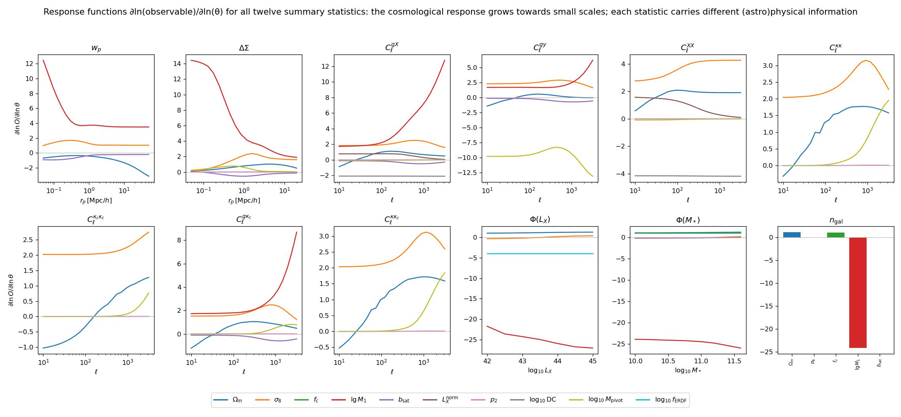

   Response functions :math:`\partial\ln O/\partial\ln\theta` for **all twelve
   summary statistics** (two rows), for a representative set of parameters
   (legend).  The **cosmological** response (:math:`\Omega_m,\sigma_8`) grows
   towards small scales / high :math:`\ell` — there is genuinely more cosmological
   signal there.  But the same small scales are where the **astrophysical**
   parameters live: the satellite amplitude :math:`b_{\rm sat}` and SHMR shape in
   :math:`w_p`/:math:`\Delta\Sigma`, the gas parameters (:math:`L_X`, ``p2``,
   ``log10DC``) in :math:`C_\ell^{gX}`/:math:`C_\ell^{XX}`, the feedback pivot in
   :math:`C_\ell^{gy}`, the active fraction :math:`f_{\rm ERDF}` (flat) in
   :math:`\Phi(L_X)`, and :math:`f_c` in :math:`n_{\rm gal}`.  Note that
   :math:`w_p`, :math:`\Delta\Sigma`, :math:`C_\ell^{gy}` and the lensing spectra
   are **blind** to the gas/AGN emission parameters, while
   :math:`C_\ell^{gX}`/:math:`C_\ell^{XX}`/:math:`\Phi(L_X)` carry them — this
   complementarity is the key to the degeneracy breaking below.

The Fisher matrix and a useful identity
---------------------------------------

With a constant relative error the Fisher matrix is

.. math::

   F_{ab} = \sum_i \frac{1}{(f\, d_i)^2}
            \frac{\partial d_i}{\partial\theta_a}
            \frac{\partial d_i}{\partial\theta_b}
          = \frac{1}{f^{2}}\sum_i
            \frac{\partial\ln d_i}{\partial\theta_a}
            \frac{\partial\ln d_i}{\partial\theta_b},

where :math:`f` is the **relative error level** (0.1 %, 1 %, 5 %) applied to every
data point :math:`d_i` — *not* to be confused with the HOD **central completeness**
parameter :math:`f_c` (one of the :math:`\theta_a`, discussed just below): the
scalar :math:`f` sets the noise, whereas :math:`f_c` is a model parameter being
constrained.  From the second form, the **degeneracy directions do not depend on**
:math:`f` — only the overall size of the error bars scales as :math:`f`.  Parameter constraints follow from
:math:`\mathrm{cov}=F^{-1}` (with Planck priors optionally added as
:math:`\mathrm{diag}(1/\sigma_{\rm prior}^2)`).  The central completeness
:math:`f_c` cancels out of :math:`w_p` and :math:`\Delta\Sigma` exactly, so those
probes cannot constrain it; the galaxy number density :math:`n_{\rm gal}`
(:math:`\propto f_c`), which **is** in this data vector, pins it to
:math:`\sigma/|\theta|\simeq1.8\%` — and correspondingly :math:`f_c` shows a
moderate cosmology degeneracy (:math:`\mathrm{corr}(\sigma_8)=+0.44`).

Breaking the degeneracies with X-ray and SZ
-------------------------------------------

At small scales the clustering and lensing signals are strongly degenerate with
the **galaxy–halo connection**: a change in :math:`\sigma_8` can be mimicked by
adjusting the satellite occupation or the scatter of the stellar-to-halo mass
relation.  The X-ray and SZ cross-statistics see the *same* halos through their
gas and pressure — with a steep, well-localised mass dependence (recall the mass
function panel above) — so they pin the occupation and the halo-mass scale
*independently*, and the cosmology↔nuisance degeneracy opens up.

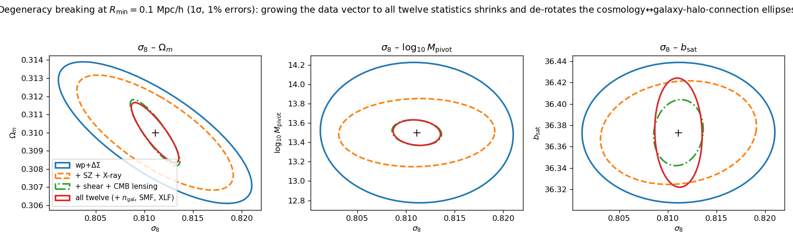

   1σ Fisher ellipses at a small-scale cut (:math:`R_{\min}=0.1` Mpc/h, 1 %
   errors, weakly-informative nuisance priors).  The data vector grows
   cumulatively: clustering + galaxy–galaxy lensing (blue), :math:`+` SZ
   :math:`+` X-ray (orange), :math:`+` cosmic-shear and CMB-lensing spectra
   (green), and all twelve statistics (red, adding :math:`n_{\rm gal}`, the SMF
   and the AGN XLF).  Each addition **shrinks** and **de-rotates** the ellipses
   of :math:`\sigma_8` with :math:`\Omega_m`, with the baryon-feedback mass
   scale :math:`\log_{10}M_{\rm pivot}` (middle — see the next section), and
   with the satellite amplitude :math:`b_{\rm sat}`.  De-rotation is the
   signature of a broken degeneracy, not merely more data.

The result: small scales help — conditionally
----------------------------------------------

Putting it together: we marginalise over the full parameter set (HOD + gas + AGN)
and track :math:`\sigma(\sigma_8)` and :math:`\sigma(\Omega_m)` as the scale cut
:math:`R_{\min}` is lowered from 10 to 0.1 Mpc/h, for a data vector grown
cumulatively to all twelve summary statistics.

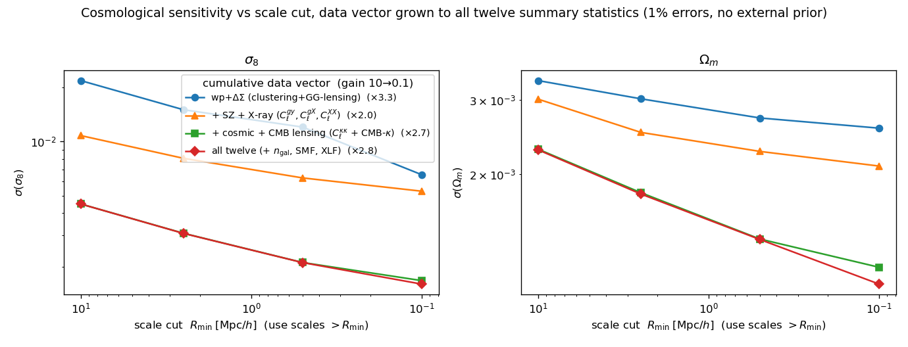

   Small scales to the **right**; 1 % errors, no external prior.  The data
   vector grows cumulatively: clustering + galaxy–galaxy lensing (blue),
   :math:`+` SZ :math:`+` X-ray (orange), :math:`+` cosmic shear and the
   CMB-lensing triplet (green), and finally **all twelve** summary statistics
   (red, adding :math:`n_{\rm gal}`, the SMF and the AGN XLF).  Every set tightens
   by a similar :math:`\times2\text{–}3` from :math:`R_{\min}=10` to :math:`0.1`
   Mpc/h (for :math:`\sigma_8`: :math:`\times2.8`, :math:`\times2.3`,
   :math:`\times2.9`, :math:`\times3.0`); the payoff is in the **absolute** level.
   Two features stand out.  (i) The **lensing spectra dominate the gain** — adding
   cosmic shear + CMB lensing drops :math:`\sigma(\sigma_8)` at
   :math:`R_{\min}=0.1` Mpc/h from :math:`4.3\times10^{-3}` (:math:`+`\ SZ+X-ray)
   to :math:`1.5\times10^{-3}`, and :math:`\sigma(\Omega_m)` from
   :math:`1.8\times10^{-3}` to :math:`9.4\times10^{-4}`.  (ii) **Abundance adds
   almost nothing to the cosmology** (red overlaps green): :math:`n_{\rm gal}`,
   the SMF and the XLF constrain :math:`f_c` and the SHMR, not
   :math:`\sigma_8/\Omega_m`.  End to end the full data vector reaches
   :math:`\sigma(\sigma_8)=1.4\times10^{-3}` and
   :math:`\sigma(\Omega_m)=9.2\times10^{-4}` — a factor :math:`\times4.3` and
   :math:`\times2.6` below clustering+lensing alone.

The physical reading:

* **Large scales** (two-halo, linear): all probes measure essentially the same
  thing (:math:`b_{\rm eff}^2 P_{\rm lin}`), so extra statistics add little and
  the cosmology error is prior/limited.
* **Small scales** (one-halo): more cosmological signal *is* present, but for
  galaxies alone it is entangled with the occupation.  The X-ray and tSZ
  cross-correlations supply an independent handle on the halo occupation and
  mass scale, so the small-scale cosmological information becomes usable.

In other words, the small-scale cosmological sensitivity is real but **latent**:
the gas (X-ray/tSZ) cross-statistics unlock it for the galaxy probes, while the
lensing power spectra — cosmic shear and CMB lensing — contribute the largest
independent share of the total gain.  The abundance statistics
(:math:`n_{\rm gal}`, SMF, XLF) instead target the occupation (:math:`f_c`, the
SHMR), leaving :math:`\sigma_8/\Omega_m` essentially unchanged.

The price of parameter freedom: 31 free parameters vs 111
-----------------------------------------------------------

The study documented on this page was published with the original
**31-parameter** tier-1 vector.  The model has since grown to **111 parameters**
(the :doc:`missing-physics <missing_physics>` waves and the tier-2/3/4
extensions: extra HOD / baryon / AGN shape parameters, redshift-evolution
slopes, an X-ray spectral sector, quenching, morphology, dark energy
:math:`w_0, w_a`, :math:`\sum m_\nu`, …), which the tier-1 scripts pin to their
fiducials by default (``--free-tier2`` releases them).  Rerunning the identical
data setup — the same twelve statistics, the same 229 data points, the same
constant 1 % errors, weakly-informative priors only — with **everything free**
asks the sharpest version of the robustness question: *how much cosmology is
lost when nothing is held fixed?*

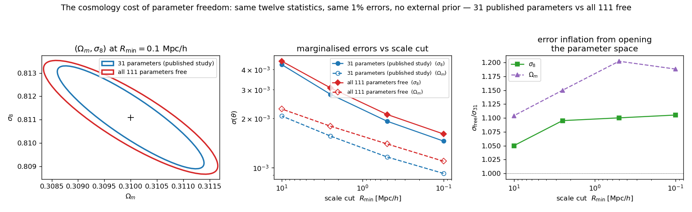

   Both runs are derived from the same 111-parameter Jacobian: the published
   case pins the 80 post-publication parameters with delta-function priors, so
   the comparison isolates the effect of parameter freedom alone.  **Left**:
   the :math:`(\Omega_m,\sigma_8)` 1σ ellipse at :math:`R_{\min}=0.1` Mpc/h
   barely inflates and does **not rotate** — no new degeneracy direction
   opens.  **Middle**: marginalised errors vs scale cut for the two runs.
   **Right**: the error-inflation factor stays :math:`\lesssim\times1.2` at
   every scale cut — from :math:`R_{\min}=10` to :math:`0.1` Mpc/h it is
   ×1.05→×1.11 for :math:`\sigma_8` and ×1.10→×1.19 for :math:`\Omega_m`.

The cosmology is nearly free of charge: opening the parameter space from 31 to
111 free parameters costs only **11 % on** :math:`\sigma(\sigma_8)` **and 19 %
on** :math:`\sigma(\Omega_m)` at the smallest scale cut
(:math:`\sigma(\sigma_8)=1.45\to1.61\times10^{-3}`,
:math:`\sigma(\Omega_m)=0.92\to1.09\times10^{-3}`).  This is the
self-calibration argument of the previous section at full strength: the
twelve-statistic vector measures the newly-freed parameters that *do* touch the
observables (the satellite and baryon shape sectors, the X-ray spectral sector,
quenching, …) well enough that marginalising them is cheap, while the
parameters it cannot see (the HI / radio / IR sectors of tier 3) sit in
cosmology-orthogonal directions and simply return their priors.  The mild
growth of the penalty towards small :math:`R_{\min}` mirrors the baryon story
below: the new freedom lives mostly in the one-halo regime.

Baryonic feedback: contaminating lensing, calibrated by X-ray / SZ
------------------------------------------------------------------

The strongest version of the argument involves **baryons directly**.  Feedback
(AGN + stellar) expels hot gas from group-scale halos, redistributing a
mass fraction :math:`f_b(M)` from the compact dark-matter cusp into an extended
hot atmosphere.  That redistribution **modulates the small-scale matter
distribution probed by lensing** — and it is the *same* hot gas that emits the
X-rays and sources the tSZ pressure.  We add this as a single **shared hot-gas
sector** to the model: a mass fraction :math:`f_b(M)` (a sigmoid with
feedback-mass-scale :math:`\log_{10}M_{\rm pivot}`;
:class:`~hod_mod.observables.baryon_fraction.BaryonFractionSigmoid`) follows an
extended gas profile (puffiness :math:`\log_{10}\eta_{\min}`, truncated at
:math:`r_{\max}R_{200}`).  These two parameters enter **ΔΣ** (the CDM+gas split,
an exact port of
:meth:`~hod_mod.observables.clustering.FullHaloModelPrediction.delta_sigma_split`),
the **X-ray** emissivity (:math:`\propto f_b^2`) and the **tSZ** pressure
(:math:`\propto f_b`) simultaneously.

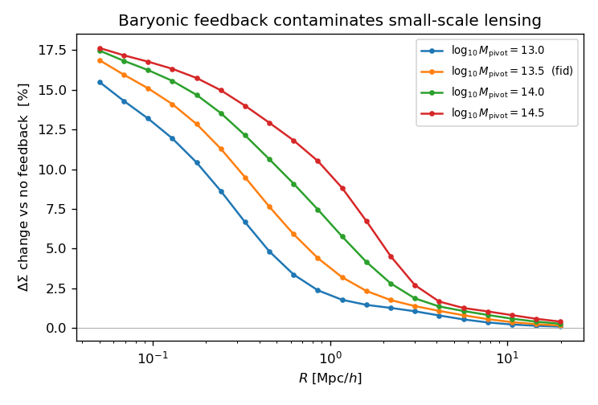

   The imprint of feedback on galaxy–galaxy lensing: fractional change in
   :math:`\Delta\Sigma(R)` relative to a no-feedback (cosmic-gas) reference, for
   several feedback strengths.  It is a **scale-dependent, few-to-~17 %** effect
   concentrated at :math:`R\lesssim1` Mpc/h and it depends on the (a priori
   unknown) feedback parameters — so it must be marginalised over, and it eats
   into the small-scale cosmological information.

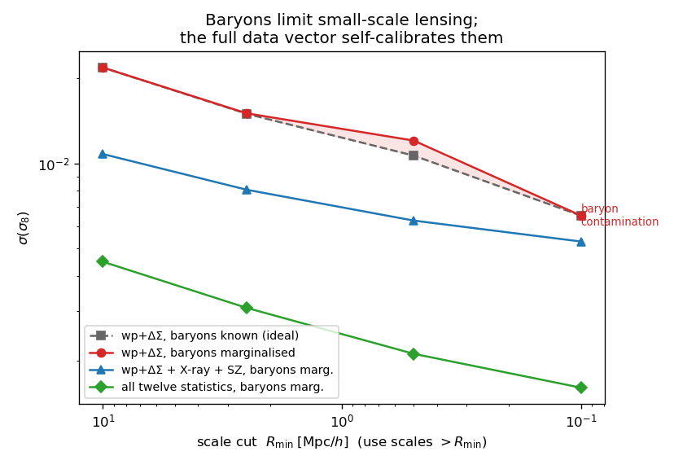

   Marginalising over the baryon parameters (red) inflates :math:`\sigma(\sigma_8)`
   above the baryons-known ideal (grey) — the shaded **baryon-contamination**
   band, which widens towards small scales.  Adding the X-ray and tSZ statistics
   (blue), which measure the same gas directly, **calibrates** the baryons and
   recovers the ideal: at :math:`R_{\min}=0.1` Mpc/h baryon marginalisation
   degrades :math:`\sigma(\sigma_8)` by **×1.22** (:math:`5.1\to6.2\times10^{-3}`)
   and adding X-ray/SZ recovers it by **×1.46** (to :math:`4.3\times10^{-3}` —
   *below* the baryons-known ideal, because the cross-spectra also add their own
   cosmological information).  With the **full twelve-statistic** data vector
   (green) the calibration is complete: :math:`\sigma(\sigma_8)` reaches
   :math:`1.4\times10^{-3}` (a further :math:`\times3.6` below the wp+ΔΣ ideal,
   driven by the lensing spectra), and marginalising over the baryon parameters
   now costs only :math:`\times1.01` (:math:`1.423\to1.435\times10^{-3}`) — the
   contamination band has effectively **closed**: the hot gas is self-calibrated
   by the data.

This closes the loop: baryonic feedback is a genuine small-scale systematic for
weak lensing, degenerate with :math:`\sigma_8`; the X-ray and SZ cross-statistics
are direct, high-signal probes of exactly that gas, so combining them removes the
systematic and lets small-scale lensing deliver cosmology.  For this
:math:`M_*>10` galaxy–galaxy-lensing sample the contamination is bounded by the
group-scale gas fraction (a ~22 % effect on :math:`\sigma_8`); it is larger for
cosmic shear, treated next.

Cosmic shear: the matter power and where baryons bite hardest
-------------------------------------------------------------

The **cosmic-shear** convergence spectrum
:math:`C_\ell^{\kappa\kappa}` — the projected matter power :math:`P_{mm}(k)`
weighted by the weak-lensing efficiency of a background source population.  We
build :math:`P_{mm}` from the halo model (1-halo with the **same baryon-split
matter profile**, plus the linear 2-halo term) so the identical hot-gas sector
that suppresses :math:`\Delta\Sigma` also suppresses the shear signal, and
project it with the lensing kernel :math:`W_\kappa(\chi)` for sources at
:math:`z_s\simeq0.8`.

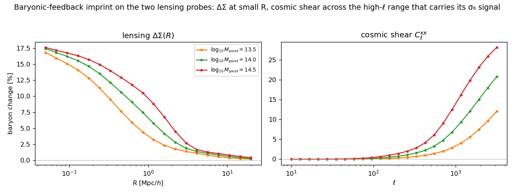

   The baryon imprint on the two lensing probes.  In :math:`\Delta\Sigma` it is
   confined to :math:`R\lesssim1` Mpc/h (often scale-cut away); in cosmic shear it
   grows monotonically across :math:`\ell\gtrsim300`\ –\ :math:`3000` — exactly the
   multipoles that carry the shear :math:`\sigma_8` signal — reaching
   :math:`\sim10\text{–}30\%` for plausible feedback strengths.  Because it cannot
   simply be cut out, baryon calibration is even more important for shear.

Cosmic shear is a useful :math:`\sigma_8` probe: adding it to clustering+lensing
tightens :math:`\sigma(\sigma_8)` from :math:`6.2\times10^{-3}` to
:math:`4.2\times10^{-3}` (a factor :math:`\times1.5`, 1 % errors, no external
prior).  In this regime the *marginalised* baryon degradation of :math:`\sigma_8`
is small (:math:`\sim5\%`), because the broad :math:`\ell` range plus the
weakly-informative priors already pin the suppression — but the systematic is real
and, at the accuracy of Stage-IV shear, the X-ray/tSZ calibration developed above
is exactly what keeps it under
control.

Closing the baryon budget energetically
---------------------------------------

The baryon fraction is below cosmic because feedback has **displaced** the missing
gas.  Is there enough energy?  We compare, per halo, the energy to unbind the
missing baryons, :math:`E_{\rm disp}=\Delta f_b\,M\,v_{200}^2`, against two
feedback channels: **AGN**, tied to the *measured* X-ray sector
(:math:`E_{\rm AGN}\propto \varepsilon_{\rm couple}\,10^{\log_{10}\rm DC}\,
L_X^{\rm on}(M)\,t_H`, the same duty cycle that sets :math:`C_\ell^{gX/XX}`), and
**stellar/SN** (:math:`E_{\rm SN}\propto M_*(M)`, ZM15 SHMR).

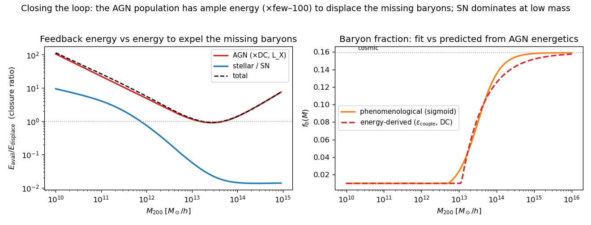

   *Left:* the closure ratio :math:`E_{\rm avail}/E_{\rm disp}`.  The AGN channel
   (red) exceeds unity at all masses and **dips to :math:`\approx1` exactly at the
   group scale** (:math:`\sim2\text{–}3\times10^{13}\,M_\odot/h`) where expulsion
   is hardest — a self-regulation signature — needing only :math:`\varepsilon\sim1\%`
   mechanical coupling of :math:`M_{\rm BH}c^2` (or of the bolometric AGN output).
   The stellar/SN channel (blue) suffices only below :math:`\sim10^{12}\,M_\odot/h`,
   the natural low-mass regime.  *Right:* the baryon fraction *predicted* from this
   energy balance tracks the phenomenological fit.

Two conclusions.  **(i) The loop closes:** the simulated AGN population carries
ample energy (a factor few–100 surplus) to displace and heat the missing baryons,
with stellar feedback taking over at dwarf scales — so the sub-cosmic baryon
fractions are energetically consistent.  **(ii) Closure ≠ constraining power (yet):**
replacing the phenomenological baryon parameter with the physical coupling
:math:`\varepsilon_{\rm couple}` is a one-for-one trade, so :math:`\sigma(\sigma_8)`
is essentially unchanged — even when :math:`\varepsilon_{\rm couple}` is tied to the
X-ray-constrained duty cycle, because cosmic shear already pins :math:`\sigma_8`.
The energy model's value is *physical*: it turns :math:`f_b(M)` from a free nuisance
into a prediction of the (observed) AGN + stellar populations.  Genuine statistical
gain would follow from folding in the measured AGN X-ray luminosity function and
:math:`M_{\rm BH}` census as data, so the feedback normalisation is pinned
externally rather than fitted — the natural next step.  This mode is available as
``ForwardModel(energy_closure=True)``.

The AGN X-ray luminosity function as a cosmology probe
------------------------------------------------------

The energy section ended on a promise: fold in the **measured AGN X-ray
luminosity function** so the accretion sector is pinned by data rather than
fitted.  We now do exactly that, with the physical **Powell (2022)** AGN–halo
model (:class:`hod_mod.agn.powell.PowellAGNModel`, validated standalone against
the Aird+2015 hard XLF).  It forward-models the SMBH luminosity per halo — the
ZM15 SHMR gives :math:`\langle\log M_*\rangle(M_h)`; a free
:math:`M_{\rm BH}`–:math:`M_*` relation gives :math:`\langle\log M_{\rm BH}\rangle`;
a universal Eddington-ratio distribution (Ananna 2022 broken power law) sets the
accretion; :math:`L_{\rm bol}=1.26\times10^{38}\,M_{\rm BH}\lambda` — and
integrates it over the halo mass function:

.. math::

   \Phi(\log L_X) = f_{\rm ERDF}\!\int\! \mathrm d\log M_h\;
      \frac{\mathrm dn}{\mathrm d\log M_h}(\Omega_m,\sigma_8)\;
      P(\log L_X\,|\,M_h).

Because the **amplitude and shape of** :math:`\Phi` **carry** :math:`dn/dM_h`,
the XLF is — like the cluster mass function — a cosmological probe; and its shape
simultaneously pins the AGN sector that contaminates :math:`C_\ell^{gX}`/
:math:`C_\ell^{XX}`.  It is one of the twelve observables, fully differentiable
(a shift-invariant ERDF⊛Gaussian kernel), so the single ``jax.jacfwd`` also
returns :math:`\partial\Phi/\partial\theta`.

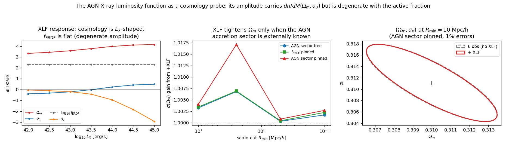

   *Left:* the XLF response :math:`\partial\ln\Phi/\partial\theta`.  The
   cosmological response is **large but** :math:`L_X`-**dependent**
   (:math:`\partial\ln\Phi/\partial\Omega_m\simeq+3.3\to+4.1` rising with
   :math:`L_X`, and :math:`\sigma_8` even *rotates sign* across :math:`L_X`),
   whereas the active fraction :math:`f_{\rm ERDF}` is a **flat** amplitude
   (:math:`\partial\ln\Phi/\partial\log_{10}f_{\rm ERDF}=\ln 10`, grey dashed):
   the XLF's cosmological *amplitude* is therefore degenerate with
   :math:`f_{\rm ERDF}`, and only its *shape* is uniquely cosmological.
   *Middle:* the resulting :math:`\sigma(\Omega_m)`
   improvement from adding the XLF, versus scale cut, under three external-knowledge
   scenarios of the AGN accretion sector.  *Right:* the :math:`(\Omega_m,\sigma_8)`
   ellipse at :math:`R_{\min}=10` Mpc/h with (red) vs without (grey) the XLF when
   the AGN sector is externally pinned.

The result is clean and physical (1 % errors, no Planck prior):

* **AGN sector marginalised (free):** the XLF adds essentially **nothing** to
  :math:`(\Omega_m,\sigma_8)` (:math:`\lesssim1\%`).  Its cosmological signal is
  amplitude-dominated, and that amplitude is soaked up by the unknown active
  fraction :math:`f_{\rm ERDF}` — exactly the flat degeneracy direction in the
  left panel.
* **Active fraction externally known** (:math:`f_{\rm ERDF}` pinned alone): still
  :math:`\lesssim1\%` on :math:`\sigma(\Omega_m,\sigma_8)` — pinning the amplitude
  is not enough while the ERDF shape floats.
* **Full AGN sector pinned** (local :math:`M_{\rm BH}`–:math:`M_*` +
  Eddington-ratio census): the XLF tightens the :math:`(\Omega_m,\sigma_8)` figure
  of merit by **×1.20** at :math:`R_{\min}=10` Mpc/h (with :math:`\sigma(\Omega_m)`
  ×1.03 there), and :math:`\sigma(\Omega_m)` by **×1.10**, :math:`\sigma(\sigma_8)`
  by **×1.09** at :math:`R_{\min}=0.1` Mpc/h.

The lesson mirrors the baryon story, one level deeper: the AGN luminosity
function *does* carry cosmology, but latently — its constraining power is unlocked
not by a scale cut but by **external knowledge of the accretion physics** (the
:math:`M_{\rm BH}` census and Eddington-ratio distribution).  Even then, in this
twelve-observable combination the gain is modest (**~10–20 %** on the
:math:`(\Omega_m,\sigma_8)` FoM), because the abundance information the XLF adds is
largely already supplied by the other probes (:math:`n_{\rm gal}`, the SMF, cosmic
shear and CMB lensing) — the concrete realisation of the "fold in the XLF and the
:math:`M_{\rm BH}` census" step promised above.

Parameter inventory: what carries cosmological vs astrophysical information
---------------------------------------------------------------------------

The forecast has **31 parameters**.  Being exhaustive about their information
content is the whole point: five are cosmological (two targets plus three
Planck/BBN-calibrated), and the other 26 are astrophysical — but they are *not*
all equal.  Some astrophysical parameters are **degenerate with cosmology**
(marginalising over them inflates :math:`\sigma(\Omega_m,\sigma_8)`, and they are
exactly what the X-ray/SZ/XLF statistics calibrate); others are **cleanly
separated** (they carry only astrophysics and marginalising over them barely
touches cosmology).  The classification below is read directly off the Fisher
matrix (marginalised :math:`\sigma`, the probe that supplies each parameter's
information, and the correlation with :math:`\Omega_m,\sigma_8`), at the reference
configuration :math:`R_{\min}=0.1` Mpc/h, 1 % errors, no Planck prior on the
targets (:math:`h,n_s,\Omega_b` carry their Planck/BBN priors).

**1. Cosmological parameters (5).**  The two **targets** are :math:`\Omega_m`
(:math:`\sigma/\theta\approx0.30\%`) and :math:`\sigma_8` (:math:`0.18\%`), spread
across the amplitude-sensitive statistics — the X-ray auto :math:`C_\ell^{XX}`,
cosmic shear :math:`C_\ell^{\kappa\kappa}`, CMB lensing, the cross-spectra and
:math:`w_p` — and mutually correlated at :math:`-0.89`.  The three **calibrated**
parameters :math:`h` (:math:`0.6\%`), :math:`n_s` (:math:`0.3\%`) and
:math:`\Omega_b` (:math:`0.9\%`) still carry their Planck/BBN priors, but with
cosmic shear and CMB lensing now in the vector they are **no longer purely
prior-held**: CMB lensing and :math:`w_p` tighten :math:`h` below its Planck width
(:math:`0.8\%\to0.6\%`) and similarly for :math:`n_s`, while :math:`\Omega_b` is
measured mostly by the tSZ :math:`C_\ell^{gy}` (whose pressure scales as
:math:`\Omega_b/\Omega_m`), improving on BBN alone.  They remain near-flat
directions for cosmology, correlated with the targets only at
:math:`|\mathrm{corr}|\lesssim0.35`.

**2. Astrophysical nuisances that are degenerate with cosmology (7)** — the ones
that *must* be marginalised or externally calibrated:

* :math:`\log_{10}\rm DC` (X-ray duty cycle) — the **strongest** cosmology
  degeneracy, :math:`\mathrm{corr}(\sigma_8)=-0.44`: it is a pure amplitude on
  :math:`C_\ell^{XX}`/:math:`C_\ell^{gX}`, exactly where :math:`\sigma_8` also
  sits.  Very tightly measured (:math:`0.14\%`) *because* it shares that amplitude.
* :math:`f_c` (central completeness) — :math:`\mathrm{corr}(\sigma_8)=+0.44`,
  measured to :math:`1.8\%` by the **SMF** (:math:`\sim90\%` of its information,
  the rest from :math:`n_{\rm gal}`): with the abundance statistics now in the
  data vector, :math:`f_c` is pinned and its amplitude degeneracy with
  :math:`\sigma_8` is exposed.
* :math:`\sigma_{\ln M_*}` (:math:`\mathrm{corr}(\sigma_8)=+0.35`) and
  :math:`b_{\rm sat}` (:math:`\mathrm{corr}(\Omega_m)=+0.26,\ (\sigma_8)=-0.24`):
  the SHMR scatter (pinned mainly by the SMF, then :math:`w_p`/:math:`C_\ell^{gX}`)
  and the classic one-halo clustering↔:math:`\sigma_8` degeneracy (pinned by
  :math:`C_\ell^{gy}`/:math:`w_p`/:math:`C_\ell^{g\kappa_c}`).
* :math:`p_2`, :math:`r_{\max}`, :math:`\log_{10}\eta_{\min}` — **mildly**
  cosmo-degenerate (:math:`|\mathrm{corr}|\sim0.1\text{–}0.2`): the gas
  puffiness/extent/shape.  :math:`p_2` and :math:`r_{\max}` are measured by the
  **lensing power spectra** (cosmic shear and shear×CMB lensing) they suppress,
  and :math:`\log_{10}\eta_{\min}` by the tSZ :math:`C_\ell^{gy}` — the same
  small-scale lensing and gas signals that also hold :math:`\sigma_8`.  These are
  what the baryon section shows the X-ray/SZ statistics calibrating.

**3. Cleanly-separated astrophysical parameters (19)** —
:math:`|\mathrm{corr}(\Omega_m)|,|\mathrm{corr}(\sigma_8)|<0.1`, so they carry
astrophysics only and marginalising over them costs essentially no cosmology:

* **SHMR / HOD shape** — :math:`\lg M_1` (:math:`4.6\%`), :math:`\lg M_{0*}`
  (:math:`4.5\%`), :math:`\beta` (:math:`16\%`), :math:`\delta`, :math:`\gamma`,
  :math:`\eta` (weak): now largely constrained **by the SMF and the XLF** (through
  the :math:`M_*(M_h)` mapping — the high-mass slopes :math:`\delta,\gamma` are in
  fact XLF-dominated) with help from :math:`C_\ell^{gX}`.
* **X-ray gas scaling** — :math:`L_X^{\rm norm}` (:math:`2.1\%`, well measured by
  :math:`C_\ell^{XX}+C_\ell^{gX}`), :math:`L_X^{\rm slope}`, :math:`kT^{\rm norm}`,
  :math:`kT^{\rm slope}` (weak — the band-response weight is deliberately mild).
* **Feedback / pressure** — :math:`\log_{10}M_{\rm pivot}` (:math:`0.3\%`),
  :math:`\beta_P`, both pinned almost entirely by the tSZ :math:`C_\ell^{gy}`.
* **Powell AGN–XLF sector (all 7)** — :math:`\mu_{\rm BH}` (:math:`2.6\%`),
  :math:`\alpha_{\rm BH}`, :math:`\sigma_{\rm BH}`, :math:`\log_{10}\lambda_*`,
  :math:`\delta_1`, :math:`\delta_2` (:math:`1\%`), :math:`\log_{10}f_{\rm ERDF}`:
  constrained **~100 % by the XLF** and with :math:`\approx0` cosmology
  correlation.  This is the quantitative reason the previous section found the XLF
  helps cosmology *only* once these are externally pinned — on its own the XLF
  feeds this cleanly-separated astrophysical block, not :math:`(\Omega_m,\sigma_8)`.

(With the abundance statistics now in the data vector there is no longer any
analytically-unconstrained parameter: :math:`f_c` is pinned by the SMF and
:math:`n_{\rm gal}` and appears in class 2 above.)

.. list-table:: The 31 forecast parameters — marginalised constraint, the probe(s) that supply the information, and the information class (:math:`R_{\min}=0.1` Mpc/h, 1 % errors, no Planck prior on the targets).
   :header-rows: 1
   :widths: 18 10 34 38

   * - Parameter
     - :math:`\sigma/|\theta|`
     - Constrained by (dominant probes)
     - Information class
   * - :math:`\Omega_m`
     - 0.3 %
     - :math:`C_\ell^{XX}`, :math:`C_\ell^{\kappa\kappa}`, CMB lensing, :math:`w_p`
     - **cosmological (target)**
   * - :math:`\sigma_8`
     - 0.2 %
     - :math:`C_\ell^{XX}`, :math:`C_\ell^{gy}`, :math:`C_\ell^{\kappa\kappa}`, CMB lensing
     - **cosmological (target)**
   * - :math:`h`
     - 0.6 %
     - CMB lensing, :math:`w_p` (+ Planck prior)
     - cosmological (calibrated)
   * - :math:`n_s`
     - 0.3 %
     - CMB lensing, :math:`w_p` (+ Planck prior)
     - cosmological (calibrated)
   * - :math:`\Omega_b`
     - 0.9 %
     - :math:`C_\ell^{gy}` (tSZ) (+ BBN prior)
     - cosmological (calibrated)
   * - :math:`\log_{10}\rm DC`
     - 0.1 %
     - :math:`C_\ell^{XX}`, :math:`C_\ell^{gX}`
     - astro, **cosmo-degenerate** (:math:`\sigma_8`: −0.44)
   * - :math:`f_c`
     - 1.8 %
     - :math:`\Phi(M_*)`, :math:`n_{\rm gal}`
     - astro, **cosmo-degenerate** (:math:`\sigma_8`: +0.44)
   * - :math:`\sigma_{\ln M_*}`
     - 7 %
     - :math:`\Phi(M_*)`, :math:`w_p`, :math:`C_\ell^{gX}`
     - astro, **cosmo-degenerate** (:math:`\sigma_8`: +0.35)
   * - :math:`b_{\rm sat}`
     - 5 %
     - :math:`C_\ell^{gy}`, :math:`w_p`, :math:`C_\ell^{g\kappa_c}`
     - astro, cosmo-degenerate (:math:`\Omega_m`: +0.26)
   * - :math:`p_2`
     - weak
     - :math:`C_\ell^{\kappa\kappa}`, :math:`C_\ell^{\kappa\kappa_c}`
     - astro, cosmo-degenerate (mild)
   * - :math:`r_{\max}`
     - 11 %
     - :math:`C_\ell^{\kappa\kappa}`, :math:`C_\ell^{\kappa\kappa_c}`
     - astro, cosmo-degenerate (mild)
   * - :math:`\log_{10}\eta_{\min}`
     - 16 %
     - :math:`C_\ell^{gy}`
     - astro, cosmo-degenerate (mild)
   * - :math:`\lg M_1`
     - 4.6 %
     - :math:`\Phi(M_*)`, :math:`\Phi(L_X)`
     - astro (SHMR), cosmo-clean
   * - :math:`\lg M_{0*}`
     - 4.5 %
     - :math:`\Phi(L_X)`, :math:`\Phi(M_*)`
     - astro (SHMR), cosmo-clean
   * - :math:`\beta`
     - 16 %
     - :math:`\Phi(M_*)`, :math:`\Phi(L_X)`, :math:`C_\ell^{gX}`
     - astro (SHMR), cosmo-clean
   * - :math:`\delta`
     - weak
     - :math:`\Phi(L_X)`, :math:`\Phi(M_*)`
     - astro (SHMR), cosmo-clean
   * - :math:`\gamma`
     - weak
     - :math:`\Phi(L_X)`, :math:`\Phi(M_*)`
     - astro (SHMR), cosmo-clean
   * - :math:`\eta`
     - weak
     - :math:`\Phi(M_*)`
     - astro (SHMR), cosmo-clean
   * - :math:`L_X^{\rm norm}`
     - 2 %
     - :math:`C_\ell^{XX}`, :math:`C_\ell^{gX}`
     - astro (X-ray), cosmo-clean
   * - :math:`L_X^{\rm slope}`
     - weak
     - :math:`C_\ell^{XX}`, :math:`C_\ell^{gX}`
     - astro (X-ray), cosmo-clean
   * - :math:`kT^{\rm norm}`
     - weak
     - :math:`C_\ell^{XX}`, :math:`C_\ell^{gX}`
     - astro (X-ray), cosmo-clean
   * - :math:`kT^{\rm slope}`
     - weak
     - :math:`C_\ell^{XX}`, :math:`C_\ell^{gX}`
     - astro (X-ray), cosmo-clean
   * - :math:`\beta_P`
     - —
     - :math:`C_\ell^{gy}`
     - astro (pressure), cosmo-clean
   * - :math:`\log_{10}M_{\rm pivot}`
     - 0.3 %
     - :math:`C_\ell^{gy}`
     - astro (feedback), cosmo-clean
   * - :math:`\mu_{\rm BH}`
     - 2.6 %
     - :math:`\Phi(L_X)`
     - astro (AGN), cosmo-clean
   * - :math:`\alpha_{\rm BH}`
     - 17 %
     - :math:`\Phi(L_X)`
     - astro (AGN), cosmo-clean
   * - :math:`\sigma_{\rm BH}`
     - weak
     - :math:`\Phi(L_X)`
     - astro (AGN), cosmo-clean
   * - :math:`\log_{10}\lambda_*`
     - 17 %
     - :math:`\Phi(L_X)`
     - astro (AGN), cosmo-clean
   * - :math:`\delta_1`
     - 31 %
     - :math:`\Phi(L_X)`
     - astro (AGN), cosmo-clean
   * - :math:`\delta_2`
     - 1 %
     - :math:`\Phi(L_X)`
     - astro (AGN), cosmo-clean
   * - :math:`\log_{10}f_{\rm ERDF}`
     - 16 %
     - :math:`\Phi(L_X)`
     - astro (AGN), cosmo-clean

The synthesis: **of the 26 astrophysical parameters only 7 actually degrade
cosmology** — the X-ray duty cycle and central completeness most (both
:math:`|\mathrm{corr}(\sigma_8)|\simeq0.44`), the SHMR scatter and satellite
amplitude moderately, and the gas puffiness/extent/shape mildly.  Those are
precisely the ones the X-ray, tSZ, lensing, abundance and XLF statistics measure
directly (:math:`\log_{10}\rm DC` and the gas parameters by :math:`C_\ell^{XX/gX/gy}`;
:math:`f_c` by the SMF and :math:`n_{\rm gal}`; :math:`b_{\rm sat}` by
:math:`C_\ell^{gy}/w_p`; the gas puffiness/extent by the lensing spectra),
which is why adding those statistics converts small-scale signal into cosmological
constraining power.  The remaining 19 astrophysical parameters — the full SHMR,
the X-ray/tSZ scaling relations, and the entire Powell AGN sector — carry rich
astrophysics but sit in cosmology-orthogonal directions, so the pipeline measures
them "for free" alongside :math:`(\Omega_m,\sigma_8)`.

The 31-parameter / 12-observable vector documented above is a deliberate,
well-conditioned core, not a ceiling.  The rest of this section rounds out the
parameter picture two ways: parameters currently **held fixed** that could be
freed, and **observables** the same differentiable pipeline could predict to
constrain them.

Parameters that could be freed
~~~~~~~~~~~~~~~~~~~~~~~~~~~~~~~~

.. admonition:: Now implemented — the tier-2 study

   The 16 promotions below, plus redshift-evolution slopes and an X-ray
   spectral sector, are now in the vector and freed by the
   :doc:`tier-2 forecast <tier2_forecast>` (61 parameters in the original
   design; 90 with the :doc:`missing-physics extension <missing_physics>`);
   the tier-1 scripts pin the extension to its fiducials by default
   (``--free-tier2`` to release).  The cosmology cost of releasing
   *everything* on this same twelve-statistic data vector is quantified in
   the parameter-freedom figure above: :math:`\lesssim20\%` on
   :math:`\sigma(\Omega_m)` and :math:`\sigma(\sigma_8)`.

Beyond the 31 in the vector, about **21 more parameters** could be freed: **16**
currently-fixed nuisance shape parameters the machinery already supports (only a
constant needs to become a ``theta[_IDX[...]]`` entry — taking the vector to 47),
plus **5** genuinely new cosmological parameters
(:math:`w_0, w_a, \sum m_\nu, \Omega_k, \alpha_s`; ~52 total) that first require a
:math:`P(k)` upgrade beyond EH98.  Redshift evolution / tomography would multiply
the nuisance count further and is not counted here.

*Cheap — the machinery already exists, only a constant needs to become a*
``theta[_IDX[...]]`` *entry (16 parameters):*

* **Extra HOD shape** (:data:`_FIXED_HOD`, 4): the satellite slope
  :math:`\alpha_{\rm sat}` (fixed 1.0), amplitude :math:`\beta_{\rm sat}` (0.9),
  and cutoff :math:`b_{\rm cut}` (0.86), :math:`\beta_{\rm cut}` (0.41).  These
  shape the one-halo satellite term of :math:`w_p`/:math:`C_\ell^{gX}`; freeing
  them makes the satellite sector honest (currently :math:`b_{\rm sat}` alone
  carries it and is the strongest cosmology degeneracy).
* **Baryon-sector shape** (:data:`_FIXED_BARYON`, 3): the sigmoid steepness
  :math:`\beta_b` (1.5), the gas-concentration break mass :math:`\log_{10}M_\eta`
  (13.0) and steepness :math:`\beta_\eta` (1.5).  These control *where* and *how
  sharply* feedback expels gas — currently only the pivot :math:`\log_{10}M_{\rm
  pivot}` and floor :math:`\log_{10}\eta_{\min}` are free.
* **Gas emissivity profile shape** (2): the inner and transition slopes
  :math:`\alpha_{\rm in}=0.9`, :math:`\alpha_{\rm tr}=2.0` (only the outer slope,
  via :math:`p_2`, is free).  Freeing them lets :math:`C_\ell^{XX}` /
  :math:`C_\ell^{gX}` constrain the full :math:`n_e^2` shape.
* **Pressure profile shape** (:data:`_A10`, 5): the A10 GNFW
  :math:`P_0, c_{500}, \gamma, \alpha, \beta` (only a :math:`\beta_P` tilt is
  free) — the tSZ :math:`C_\ell^{gy}` could measure the concentration/outer slope.
* **AGN–XLF internals** (2): the :math:`M_{\rm BH}`–:math:`M_h` correlation
  :math:`\rho` (Powell "Model 2", deliberately excluded because the XLF alone
  can't constrain it — see the new observables below) and the :math:`M_*` scatter
  :math:`\sigma_{M_*}=0.20` entering the :math:`M_{\rm BH}` width (could be tied
  to the free :math:`\sigma_{\ln M_*}` instead of fixed); the bolometric /
  hard→soft corrections are further, less well-defined handles.

*Requires a modelling extension:*

* **Redshift evolution.**  Everything is at a single :math:`z_{\rm eff}=0.2`.
  Freeing the evolution of the scaling relations (:math:`L_X`–:math:`M`,
  :math:`kT`–:math:`M` are fixed to self-similar :math:`E(z)^2`, :math:`E(z)^{2/3}`),
  of the HOD, and of the AGN sector (ERDF :math:`\lambda_*(z)`, :math:`\mu_{\rm
  BH}(z)`) turns the single-:math:`z` forecast into a **tomographic** one.
* **Extended cosmology** (new physics): :math:`h`, :math:`\Omega_b`, :math:`n_s`
  are **now free** (differentiable EH98 inputs, carrying their Planck/BBN priors).
  They are near-flat directions for the low-:math:`z` clustering/lensing probes, but
  not purely prior-held: CMB lensing tightens :math:`h`/:math:`n_s` below the Planck
  width and the tSZ :math:`C_\ell^{gy}` measures :math:`\Omega_b` (see the parameter
  inventory above).  Five genuinely new parameters —
  the dark-energy equation of state :math:`w_0, w_a`, the neutrino mass
  :math:`\sum m_\nu`, curvature :math:`\Omega_k`, running :math:`\alpha_s` —
  require upgrading the differentiable :math:`P(k)` beyond the LCDM Eisenstein–Hu
  transfer function (EH98 has no massive-:math:`\nu` suppression and assumes
  :math:`w=-1`); :math:`\sum m_\nu` in particular is the headline target for the
  small-scale + cluster-abundance information this pipeline is built on.
* **Couple the real AGN into the cross-spectra.**  The AGN term in
  :math:`C_\ell^{gX}`/:math:`C_\ell^{XX}` is still a crude surrogate
  (:math:`L_{\rm AGN}\propto M`, ``forward_jax.py`` line ~524), *not* the Powell
  prediction.  Replacing it with ``PowellAGNModel.nc_ns_agn`` /
  ``agn_emissivity_uk`` would let :math:`C_\ell^{gX}`/:math:`C_\ell^{XX}`
  constrain the 7 AGN parameters too — currently they are XLF-only — and tie the
  AGN X-ray amplitude to the same accretion sector.

Observables that could be added
~~~~~~~~~~~~~~~~~~~~~~~~~~~~~~~~~

Six observables originally on this menu are now **in the twelve-observable
vector** and have moved into the analysis above: the galaxy number density
:math:`n_{\rm gal}`, the stellar-mass function :math:`\Phi(M_*)`, cosmic shear
:math:`C_\ell^{\kappa\kappa}`, and the three CMB-lensing spectra
(:math:`\kappa_{\rm CMB}` auto :math:`C_\ell^{\kappa_c\kappa_c}`,
galaxy×\ :math:`\kappa_{\rm CMB}` :math:`C_\ell^{g\kappa_c}`, and
shear×\ :math:`\kappa_{\rm CMB}` :math:`C_\ell^{\kappa\kappa_c}`); multi-bin
tomography is available as :class:`~hod_mod.forecast.tomography.TomographicForecast`
(see the status box below).  What follows is the menu of observables the **same
differentiable pipeline** could *still* predict — i.e. the ones not yet in the
vector — grouped by how much new machinery each needs.  The published
measurements each one would be fit against — and which parts of the model the
*existing* data can already constrain — are compiled on
:doc:`sensitivity_benchmark`.

*Immediately available from quantities the model already computes:*

* **AGN number density / active fraction** :math:`n_{\rm AGN}(>L_X)` — from the
  same XLF integral; would pin :math:`\log_{10}f_{\rm ERDF}` directly (which the
  XLF alone currently measures only to 16 %).

*Same halo model, a new projection or kernel:*

* **Redshift-space clustering multipoles** (monopole + quadrupole) / **RSD**
  :math:`f\sigma_8` — a *direct growth-rate* handle that breaks the
  bias↔:math:`\sigma_8` degeneracy that throttles :math:`w_p`.
* **tSZ auto-spectrum** :math:`C_\ell^{yy}` (only the cross :math:`C_\ell^{gy}`
  is used) — an independent pin on the pressure–mass relation, which currently
  carries most of the :math:`\Omega_b` and :math:`\log_{10}M_{\rm pivot}`
  information through :math:`C_\ell^{gy}` alone.
* **Remaining CMB-lensing cross-correlations** :math:`C_\ell^{y\kappa_{\rm CMB}}`,
  :math:`C_\ell^{X\kappa_{\rm CMB}}` — the gas tracers against the high-:math:`z`
  lensing kernel already built for :math:`\kappa_{\rm CMB}` (galaxy×\ :math:`\kappa_{\rm CMB}`
  is in the vector; these extend the same kernel to the tSZ and X-ray maps).
* **kSZ** (pairwise / velocity-weighted) — probes the gas *momentum* (density ×
  velocity), breaking the gas-density↔cosmology degeneracy and adding velocity
  (:math:`f\sigma_8`) information.
* **Multi-bin cosmic-shear + galaxy–galaxy-lensing tomography** — the full 3×2pt
  combination.  The machinery is in place (``TomographicForecast``); the headline
  forecast on this page uses a single lens/source bin as the minimal case.

*New tracers / data that pin the currently-degenerate or fixed sectors:*

* **Conditional stellar-mass function** — the SMF is already in the vector (and is
  what now pins :math:`f_c` and the SHMR); its *conditional*, per-halo-mass version
  would further separate the SHMR normalisation from the scatter
  :math:`\sigma_{\ln M_*}`.
* **X-ray cluster counts + temperature/luminosity function** — the cluster-scale
  analogue of the AGN XLF: a steep :math:`dn/dM(\Omega_m,\sigma_8)` abundance,
  plus a direct handle on the :math:`L_X`–:math:`M`, :math:`kT`–:math:`M`
  scalings and their evolution (which :math:`C_\ell^{XX}/C_\ell^{gX}` leave weak).
* **AGN clustering** (AGN auto-:math:`w_p`, AGN×galaxy cross, AGN bias) — the
  missing ingredient that constrains the :math:`M_{\rm BH}`–:math:`M_h`
  correlation :math:`\rho` (Powell Model 1 vs Model 2) and the AGN host-halo mass,
  which the XLF abundance alone cannot.
* **Stacked X-ray / SZ gas profiles** (surface brightness, temperature) — pin the
  gas shape/extent (:math:`p_2, r_{\max}, \log_{10}\eta_{\min}`) directly.  The
  lensing spectra now measure :math:`p_2, r_{\max}` only weakly and the tSZ pins
  :math:`\log_{10}\eta_{\min}`; a stacked profile would tighten all three.
* **XLF as a function of redshift** and **multi-wavelength AGN luminosity
  functions / obscured fractions** — pin the AGN sector's *evolution* and its
  *normalisation* externally, which is exactly the "AGN sector pinned" scenario
  that unlocks the XLF's cosmological constraining power above.
* **BAO / full-shape** :math:`P(k)` **multipoles** — a stronger geometric handle on
  the now-free :math:`h` and a robust large-scale :math:`\Omega_m` from the BAO
  standard ruler.

The through-line is the same as the rest of this page: freeing a parameter only
costs cosmology if it is degenerate with :math:`(\Omega_m,\sigma_8)`, and every
such direction has a matching observable — abundance (number densities, XLF,
cluster counts), a direct-growth probe (RSD, kSZ), or a direct measurement of the
gas/AGN sector (stacked profiles, AGN clustering, external LFs) — that pins it and
converts the latent small-scale information into cosmological constraining power.

A detailed plan for the next steps
----------------------------------

The sections above establish the tool (a fully differentiable gas–galaxy–AGN
forward model with a one-pass Fisher Jacobian) and the physics (which scales and
which observables carry cosmology, and which nuisances gate it).  The concrete
roadmap below turns that into a staged programme of **model developments** and the
**sensitivity re-runs** that validate each one.  Each phase is scoped so the Fisher
study can be re-run immediately after it and the gain (or absence of gain) read off
against the results on this page.  The realistic multi-survey error budget used for
the "expected constraint" milestones is developed on the companion page
:doc:`stage4_forecast`.

.. admonition:: Implementation status — first-push robustness stages now in place
   :class: note

   The following have been implemented and validated (see
   :mod:`hod_mod.forecast.tests.test_forward_matches_production`):

   * **Extended cosmology** — :math:`h, n_s, \Omega_b` are now free, differentiable
     EH98 parameters (31-parameter vector), with Planck/BBN priors in
     :mod:`hod_mod.forecast.params`.
   * **Abundance observables** — :math:`n_{\rm gal}` and the stellar-mass function
     ``smf`` (``ForwardModel._n_gal`` / ``._smf``); ``n_gal`` matches the production
     ``HODBase._integrate`` to 0.04 %.  Adding them makes :math:`f_c` **finite**
     (σ shrinks ×46) and tightens the SHMR block (:math:`\beta` ×5.5,
     :math:`\sigma_{\ln M_*}` ×7.8) and cosmology (:math:`\sigma_8` ×1.4).
   * **CMB lensing** — ``cl_kCMB`` (κ_CMB auto), ``cl_gkCMB`` (galaxy×κ_CMB) and
     ``cl_shear_kCMB`` (shear×κ_CMB), reusing the lensing kernel with a single
     source plane at :math:`z_*\simeq1089` (``ForwardModel._cmb_kernel`` etc.).
   * **Analytic Gaussian covariance** — :mod:`hod_mod.forecast.covariance` adds
     cross-observable correlations (exact for the lensing triplet
     ``{cl_kk, cl_shear_kCMB, cl_kCMB}``: e.g. corr(``cl_kk``,``cl_shear_kCMB``)≈0.4);
     ``fisher.fisher_matrix`` gained a full-covariance ``F=JᵀC⁻¹J`` path
     (``run_stage4_forecast --covariance gaussian``).
   * **Tomography** — :class:`hod_mod.forecast.tomography.TomographicForecast`
     stacks the S1–S7 stellar-mass/redshift bins with **shared cosmology + gas +
     AGN** and **per-bin HOD** into one ``jax.jacfwd`` Jacobian.

   The 12-observable Stage-IV forecast (``run_stage4_forecast``) reaches
   :math:`\sigma(\sigma_8)\simeq2.5\times10^{-3}` (with Planck) at
   :math:`R_{\min}=0.1` Mpc/h.  Remaining roadmap phases below are unchanged.

**Phase 1 — close the model that already exists (no new physics).**

* *Implement.*  (i) Replace the crude AGN surrogate in
  :math:`C_\ell^{gX}`/:math:`C_\ell^{XX}` (:math:`L_{\rm AGN}\propto M`) with the
  validated :class:`hod_mod.agn.powell.PowellAGNModel`
  (``nc_ns_agn`` / ``agn_emissivity_uk``), so the same 7 AGN parameters drive the
  XLF *and* the X-ray cross/auto spectra.  (ii) Free the currently-fixed shape
  parameters that a single nuisance now carries: the satellite HOD
  (:math:`\alpha_{\rm sat},\beta_{\rm sat},b_{\rm cut},\beta_{\rm cut}`), the
  baryon sigmoid (:math:`\beta_b,\log_{10}M_\eta,\beta_\eta`), and the gas/pressure
  profile shapes (:math:`\alpha_{\rm in},\alpha_{\rm tr}`; the A10
  :math:`c_{500},\gamma,\alpha,\beta`).
* *Re-run.*  The full Fisher with the enlarged vector.  **Test:** does coupling the
  AGN into :math:`C_\ell^{gX}`/:math:`C_\ell^{XX}` break the "XLF-only" isolation of
  the AGN block found above — i.e. do the cross/auto spectra now co-constrain
  :math:`\mu_{\rm BH}, \log_{10}f_{\rm ERDF}`, and does that in turn feed back onto
  :math:`(\Omega_m,\sigma_8)`?  Confirm the freed shape parameters do not reopen a
  cosmology degeneracy (re-do the parameter-inventory correlation scan).

**Phase 2 — add the observables that pin the degenerate directions.**

* *Implement.*  In rough order of cost/impact: the **galaxy number density**
  :math:`n_{\rm gal}` and **AGN number density** (already computed internally — they
  pin :math:`f_c` and :math:`\log_{10}f_{\rm ERDF}`); the **tSZ auto**
  :math:`C_\ell^{yy}`; **redshift-space multipoles / RSD** (:math:`f\sigma_8`, a
  direct-growth handle); **CMB-lensing cross-spectra**
  (:math:`g\times\kappa_{\rm CMB}`, :math:`y\times\kappa_{\rm CMB}`,
  :math:`X\times\kappa_{\rm CMB}`); and **AGN clustering** (AGN auto-:math:`w_p` /
  AGN×galaxy), which is the missing ingredient that constrains the
  :math:`M_{\rm BH}`–:math:`M_h` correlation :math:`\rho` (Powell Model 1 vs 2).
* *Re-run.*  Add each observable to the data vector one at a time and record the
  incremental :math:`\sigma(\Omega_m,\sigma_8,S_8)`; verify that the RSD /
  number-density legs specifically shrink the :math:`b_{\rm sat}`↔:math:`\sigma_8`
  and :math:`\log_{10}\rm DC`↔:math:`\sigma_8` degeneracies flagged in the
  parameter inventory.

**Phase 3 — redshift evolution and extended cosmology (new physics).**

* *Implement.*  (i) **Tomography**: promote the single :math:`z_{\rm eff}` to
  several redshift bins with evolving scaling relations
  (:math:`L_X`–:math:`M`, :math:`kT`–:math:`M`), HOD, and AGN sector
  (:math:`\lambda_*(z),\mu_{\rm BH}(z)`).  (ii) **Extended cosmology**: swap the
  LCDM Eisenstein–Hu :math:`P(k)` for a differentiable non-linear emulator that
  covers :math:`w_0w_a` and massive neutrinos — the HDR emulator landscape
  (``Aletheia``, ``Goku``, ``EuclidEmulator2``, ``BACCO``, ``CosmoPower``) provides
  JAX-friendly options — and add :math:`w_0, w_a, \sum m_\nu` (and optionally
  :math:`\Omega_k,\alpha_s`) to the vector.
* *Re-run.*  The tomographic Fisher, and the extended-cosmology Fisher with the
  Stage-IV error budget, reporting the :math:`(\Omega_m,\sigma_8,S_8)` and the
  dark-energy / neutrino-mass forecasts as a function of scale cut.  This is the
  configuration that maps directly onto the "full-scale, multi-wavelength by 2030"
  programme.

**Phase 4 — beyond two-point.**  Once the two-point forecast is mature, the same
differentiable forward model is the emulator inside a **field-level** analysis
(the 2040s goal): a biasing/painting scheme predicts the multi-wavelength maps
directly, and the Fisher machinery here becomes the compression / validation layer.

Throughout, the numbers on this page (flat-error, to expose structure) and on
:doc:`stage4_forecast` (realistic multi-survey errors, for expected precision)
provide the two complementary yardsticks against which each phase is measured.

Reproducing this study
----------------------

.. code-block:: bash

   # the forecast (Fisher matrices, constraints, SUMMARY.txt, npz)
   JAX_PLATFORMS=cpu HOD_MOD_RESULTS=/path/to/results \
     python -m hod_mod.scripts.forecasts.run_sensitivity_study \
       --rel-err 0.001 0.01 0.05 --rmin 0.1 0.5 2.5 10 --add-planck-prior

   # the figures on this page
   JAX_PLATFORMS=cpu HOD_MOD_RESULTS=/path/to/results \
     python -m hod_mod.scripts.forecasts.make_sensitivity_figures

The forward model is validated against the production
:class:`~hod_mod.observables.clustering.FullHaloModelPrediction`
(:math:`w_p` and the dark-matter limit of :math:`\Delta\Sigma` agree to
:math:`\sim10^{-7}`\ –\ :math:`10^{-4}`) and its autodiff Jacobian against finite
differences for every parameter — including the two baryon parameters and the
seven Powell AGN-XLF parameters (whose XLF Jacobian matches FD to
:math:`\sim10^{-7}`, with the exact active-fraction identity
:math:`\partial\ln\Phi/\partial\log_{10}f_{\rm ERDF}=\ln 10`)
(:mod:`hod_mod.forecast.tests.test_forward_matches_production`).

.. note::

   The clustering and lensing legs are an exact port of the production halo
   model (the ΔΣ baryon split reduces to it as :math:`f_b\to0`).  The X-ray gas,
   X-ray auto and tSZ legs use analytic, differentiable surrogates (a gNFW
   :math:`n_e^2` emissivity shape with an analytic :math:`L_X(M)` amplitude, and
   an A10 GNFW pressure profile), because the production emissivity/pressure
   Fourier transforms are numpy Gauss–Legendre and the full-APEC path is not
   JAX-traceable.  The **baryon linkage is a modelling choice**: the same hot-gas
   fraction :math:`f_b(M)` and extent :math:`\eta(M)` drive the ΔΣ feedback, the
   X-ray emissivity (:math:`\propto f_b^2`) and the tSZ pressure
   (:math:`\propto f_b`), which is what makes the cross-statistics able to
   calibrate the lensing baryon systematic.  Marginalised errors use
   weakly-informative priors on the nuisance parameters so the 31-parameter
   Fisher matrix is well-conditioned; absolute X-ray amplitudes are arbitrary and
   drop out of the relative-error Fisher.  The AGN X-ray luminosity function
   (final section) is the analytic, differentiable Powell (2022) model
   (:class:`hod_mod.agn.powell.PowellAGNModel`), the only leg whose amplitude is
   physical (an abundance), used there as a cosmological probe.

Structure of the prediction: the forward model, equation by equation
--------------------------------------------------------------------

Everything on this page rests on a single differentiable function
:math:`\theta\mapsto d(\theta)` — the parameter vector in, the twelve data
vectors out — so that the Fisher Jacobian :math:`\partial d/\partial\theta` is one
``jax.jacfwd`` call.  This appendix writes that function out **in full**: the
ordered list of equations exactly as :mod:`hod_mod.forecast.forward_jax`
evaluates them, from the input parameters to the Fisher matrix.  The figure below
wires them together; the numbered badges in the diagram are the equation numbers
:math:`(1)\ldots(31)` used here, and the colours group the equations by physical
**sector** (cosmology → halo abundance → halo structure → galaxy–halo connection →
shared hot-gas/baryon → AGN accretion → projection/observables → Fisher).

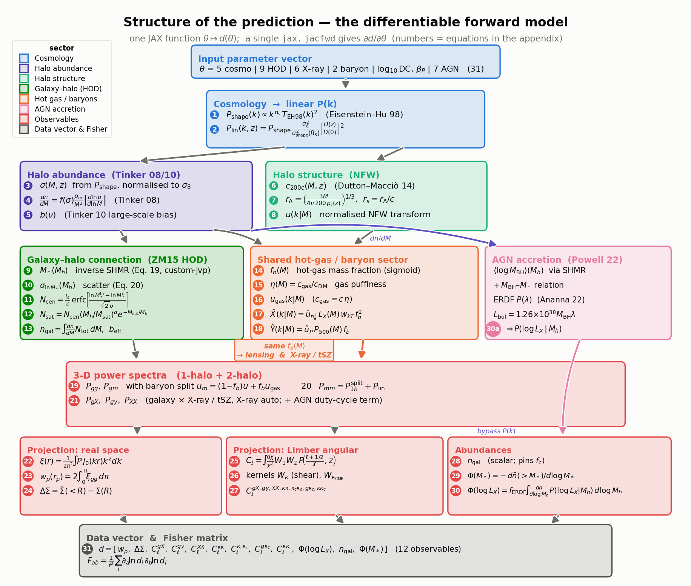

   The forward model as a directed graph of equations, in evaluation order.  The
   linear power spectrum (blue) seeds the halo abundance (violet) and halo
   structure (aqua); these combine with the galaxy–halo connection (green), the
   **shared** hot-gas/baryon sector (orange — the *same* :math:`f_b(M)` drives the
   lensing baryon split *and* the X-ray/tSZ amplitudes) and the AGN accretion
   sector (pink) into the 3-D power spectra (red); a real-space, Limber and
   abundance projection then produces the twelve observables that enter the Fisher
   matrix.  A single ``jax.jacfwd`` differentiates this entire graph at once.

**A. Cosmology → linear power spectrum**
(:mod:`~hod_mod.forecast.pk_eisenstein_hu`; inputs :math:`\Omega_m,\sigma_8,h,n_s,\Omega_b`).

*(1)* The analytic Eisenstein & Hu (1998) transfer function gives the **shape**
spectrum (normalised to :math:`P(0.05\,h/{\rm Mpc})=1`), the one ingredient that
makes the whole model JAX-traceable:

.. math::

   P_{\rm shape}(k)\propto k^{n_s}\,T_{\rm EH98}(k)^2,
   \qquad T_{\rm EH98}=f_b\,T_b(k)+f_c\,T_c(k).

*(2)* It is normalised to :math:`\sigma_8` and evolved with the Carroll+1992
growth factor :math:`D(z)` to the physical linear power used by the 2-halo term,

.. math::

   P_{\rm lin}(k,z)=P_{\rm shape}(k)\;
     \frac{\sigma_8^2}{\sigma^2_{\rm shape}(R_8)}\;
     \left[\frac{D(z)}{D(0)}\right]^2,
   \qquad
   \sigma^2(R)=\frac{1}{2\pi^2}\!\int\! P(k)\,W^2(kR)\,k^2\,dk,

with the real-space top-hat :math:`W(x)=3(\sin x-x\cos x)/x^3`.

**B. Halo abundance**
(:class:`~hod_mod.core.halo_mass_function.HaloMassFunction`, Tinker08, :math:`\Delta=200`).

*(3)* The mass variance on the shape spectrum, renormalised to :math:`\sigma_8`:
:math:`\sigma(M,z)` with :math:`R(M)=\big(3M/4\pi\bar\rho_m\big)^{1/3}`.

*(4)* The halo mass function,

.. math::

   \frac{dn}{dM}=f(\sigma)\,\frac{\bar\rho_m}{M^2}\,
     \left|\frac{d\ln\sigma}{d\ln M}\right|,
   \qquad
   f(\sigma)=A\!\left[\Big(\tfrac{\sigma}{b}\Big)^{-a}+1\right]e^{-c/\sigma^2}
   \ \text{(Tinker 08)}.

*(5)* The large-scale halo bias :math:`b(\nu)`, :math:`\nu=\delta_c/\sigma(M)`
(Tinker 10).

**C. Halo structure** (NFW; :func:`~hod_mod.core.halo_profiles.nfw_uk_jax`).

*(6)* The concentration–mass relation (Dutton & Macciò 2014),

.. math::

   \log_{10}c_{200c}=a(z)+b(z)\,\log_{10}\!\big(M/10^{12}h^{-1}M_\odot\big),
   \quad a=0.520+0.385\,e^{-0.617z^{1.21}},\ b=-0.101+0.026z.

*(7)* The halo radius and scale radius (comoving :math:`h`-units),

.. math::

   r_\Delta=\left(\frac{3M}{4\pi\cdot 200\,\rho_c(z)}\right)^{1/3},\qquad
   r_s=r_\Delta/c,\qquad
   \rho_c(z)=\rho_{c,0}\,E^2(z)/(1+z)^3 .

*(8)* The normalised analytic NFW Fourier transform :math:`u(k|M)` (→ 1 as
:math:`k\to0`),

.. math::

   u(k|M)=\frac{\sin(kr_s)\big[{\rm Si}((1{+}c)kr_s)-{\rm Si}(kr_s)\big]
     -\dfrac{\sin(ckr_s)}{(1{+}c)kr_s}
     +\cos(kr_s)\big[{\rm Ci}((1{+}c)kr_s)-{\rm Ci}(kr_s)\big]}
     {\ln(1{+}c)-c/(1{+}c)} .

**D. Galaxy–halo connection**
(Zu & Mandelbaum 2015 HOD; :mod:`~hod_mod.connection.hod.zumandelbaum15`).

*(9)* The **inverse** stellar-to-halo mass relation :math:`M_*(M_h)` — the
production ZM15 Eq. 19 inverted by bisection, with a ``custom_jvp`` so the
gradient comes analytically from the smooth forward relation:

.. math::

   \log_{10}M_h=\log_{10}M_1+\beta\log_{10}\!\Big(\tfrac{M_*}{M_{*0}}\Big)
     +\frac{(M_*/M_{*0})^\delta}{1+(M_*/M_{*0})^{-\gamma}}\cdot\frac{1}{\ln 10}
     -\frac{1}{2\ln 10}.

*(10)* The mass-dependent scatter (Eq. 20),
:math:`\sigma_{\ln M_*}(M_h)=\sigma_{\ln M_*,0}+\eta\,\max\!\big(0,\log_{10}(M_h/M_1)\big)`.

*(11)* The mean central occupation above the sample threshold (Eq. 21),

.. math::

   \langle N_{\rm cen}\rangle(M_h)=\frac{f_c}{2}\,
     {\rm erfc}\!\left[\frac{\big(\log_{10}M_*^{\rm thr}-\log_{10}M_*^c(M_h)\big)\ln 10}
     {\sqrt{2}\,\sigma_{\ln M_*}(M_h)}\right].

*(12)* The mean satellite occupation (Eq. 22),

.. math::

   \langle N_{\rm sat}\rangle(M_h)=\langle N_{\rm cen}\rangle
     \left(\frac{M_h}{M_{\rm sat}}\right)^{\alpha_{\rm sat}}
     e^{-M_{\rm cut}/M_h},
   \quad
   M_{\rm sat}=b_{\rm sat}M_{\rm min}^{\beta_{\rm sat}},\ \
   M_{\rm cut}=b_{\rm cut}M_{\rm min}^{\beta_{\rm cut}},

with :math:`M_{\rm min}(M_*^{\rm thr})` from the forward SHMR.

*(13)* The occupation-weighted number density and effective bias,

.. math::

   \bar n_{\rm gal}=\!\int\! dM\,\frac{dn}{dM}\,\langle N_{\rm tot}\rangle,
   \qquad
   b_{\rm eff}=\frac{1}{\bar n_{\rm gal}}\!\int\! dM\,\frac{dn}{dM}\,
     \langle N_{\rm tot}\rangle\,b(M),
   \qquad N_{\rm tot}=N_{\rm cen}+N_{\rm sat}.

**E. Shared hot-gas / baryon sector**
(:class:`~hod_mod.observables.baryon_fraction.BaryonFractionSigmoid`).

*(14)* The hot-gas mass fraction — a feedback sigmoid that expels gas below the
pivot :math:`M_{\rm pivot}`,

.. math::

   f_b(M)=f_{b,\min}+\big(\Omega_b/\Omega_m-f_{b,\min}\big)\,
     \frac{1}{1+\big(M_{\rm pivot}/M\big)^{\beta_b}} .

*(15)* The gas puffiness (concentration ratio :math:`c_{\rm gas}/c_{\rm DM}`),
:math:`\eta(M)=1-(1-\eta_{\min})\big/\big[1+(M/M_\eta)^{\beta_\eta}\big]`.

*(16)* The reduced-concentration gas NFW transform used by the ΔΣ / :math:`P_{mm}`
baryon split, :math:`u_{\rm gas}(k|M)=u_{\rm NFW}(k|M;\,c_{\rm gas}=c\,\eta)`.

**F. Gas emission & pressure profiles.**  A spherical profile :math:`f(r)`
truncated at :math:`r_{\max}` is Fourier-transformed by the normalised
Gauss–Legendre kernel

.. math::

   \hat u(k|M)=\frac{\int_0^{r_{\max}} f(r)\,j_0(kr)\,r^2\,dr}
     {\int_0^{r_{\max}} f(r)\,r^2\,dr},
   \qquad
   f_{\rm gNFW}(x)=x^{-\alpha_{\rm in}}\big(1+x^{\alpha_{\rm tr}}\big)^{(\alpha_{\rm in}-\alpha_{\rm out})/\alpha_{\rm tr}}.

*(17)* The X-ray emissivity transform: the :math:`n_e^2\propto f_{\rm gNFW}^2`
shape (outer slope :math:`\alpha_{\rm out}=\alpha_{\rm in}+2p_2`, scale
:math:`r_s/\eta`) times an analytic :math:`L_X(M)`, a weak band weight and the
shared :math:`f_b^2`,

.. math::

   \tilde X(k|M)=\hat u_{n_e^2}(k|M)\,L_X(M)\,w_{kT}\,f_b(M)^2,
   \quad
   L_X\propto 10^{\,L_X^{\rm slope}(\log M_{500}-15)}E^2(z),\ \
   w_{kT}=(kT)^{1/4}.

*(18)* The tSZ pressure transform: the Arnaud+2010 GNFW pressure shape times
:math:`P_{500}(M)` and the shared :math:`f_b`,

.. math::

   \tilde Y(k|M)=\hat u_{P}(k|M)\,P_{500}(M)\,f_b(M),
   \quad
   P_{500}\propto 10^{\,\beta_P'(\log M_{500}-14.5)}E^{8/3}(z),
   \ \ \beta_P'=\tfrac23+0.12+\beta_P.

**G. Three-dimensional power spectra** (halo model, 1-halo + 2-halo).

*(19)* Galaxy auto and galaxy–matter, the latter carrying the **baryon split**
:math:`u_m=(1-f_b)\,u+f_b\,u_{\rm gas}` (More+2015 Eqs. 9, 13):

.. math::

   P_{gg}=\frac{1}{\bar n_{\rm gal}^2}\!\int\! dM\,\frac{dn}{dM}
     \big(N_s^2u^2+2N_cN_su\big)+b_{\rm eff}^2P_{\rm lin},

.. math::

   P_{gm}=\frac{1}{\bar n_{\rm gal}}\!\int\! dM\,\frac{dn}{dM}
     \big(N_c+N_su\big)\frac{M}{\bar\rho_m}\,u_m+b_{\rm eff}P_{\rm lin}.

*(20)* The matter power (the cosmic-shear systematic), same baryon split:

.. math::

   P_{mm}=\int\! dM\,\frac{dn}{dM}\Big(\frac{M}{\bar\rho_m}\Big)^2 u_m^2
     +P_{\rm lin}.

*(21)* The X-ray / tSZ cross and auto spectra (schematically, with
:math:`W\in\{\tilde X,\tilde Y\}` and a duty-cycle AGN term added to
:math:`\tilde X`):

.. math::

   P_{gW}=\frac{1}{\bar n_{\rm gal}}\!\int\! dM\,\frac{dn}{dM}(N_c+N_su)\,W
     +b_{\rm eff}P_{\rm lin}\!\int\! dM\,\frac{dn}{dM}\,b\,W,

.. math::

   P_{XX}=\int\! dM\,\frac{dn}{dM}\,\tilde X_{\rm tot}^2
     +P_{\rm lin}\Big[\int\! dM\,\frac{dn}{dM}\,b\,\tilde X_{\rm tot}\Big]^2 .

**H. Projection to observables.**

*(22)* The isotropic Hankel (Ogata :math:`j_0`) transform to the correlation
function, :math:`\xi(r)=\dfrac{1}{2\pi^2}\!\int\! P(k)\,j_0(kr)\,k^2\,dk`.

*(23)* Projected clustering,
:math:`w_p(r_p)=2\!\int_0^{\Pi_{\max}}\!\xi_{gg}\!\big(\sqrt{r_p^2+\pi^2}\big)\,d\pi`.

*(24)* Excess surface density,
:math:`\Delta\Sigma(R)=\bar\Sigma(<R)-\Sigma(R)`, with
:math:`\Sigma(R)=\bar\rho_m\!\int\!\xi_{gm}\!\big(\sqrt{R^2+\chi^2}\big)\,d\chi`
and :math:`\bar\Sigma(<R)=\tfrac{2}{R^2}\!\int_0^R\!R'\,\Sigma(R')\,dR'`.

*(25)* The angular spectra via the Limber approximation,

.. math::

   C_\ell=\int\! d\chi\,\frac{W_1(\chi)\,W_2(\chi)}{\chi^2}\,
     P\!\left(k=\frac{\ell+1/2}{\chi},\,z(\chi)\right).

*(26)* The projection kernels: the galaxy window :math:`W_g=dN/d\chi` (narrow
:math:`n(z)` shell), the cosmic-shear efficiency and the CMB-lensing kernel
(single source plane at :math:`z_*\simeq1089`),

.. math::

   W_\kappa(\chi)=\tfrac32\Omega_m\Big(\tfrac{H_0}{c}\Big)^2\frac{\chi}{a}
     \!\int_\chi^{\chi_H}\!\! d\chi'\,n_s(\chi')\frac{\chi'-\chi}{\chi'},
   \qquad
   W_{\kappa_{\rm CMB}}(\chi)=\tfrac32\Omega_m\Big(\tfrac{H_0}{c}\Big)^2
     \frac{\chi}{a}\,\frac{\chi_*-\chi}{\chi_*}.

*(27)* The seven realised angular spectra: :math:`C_\ell^{gX},C_\ell^{gy},
C_\ell^{XX}` (galaxy-window × gas), :math:`C_\ell^{\kappa\kappa}` (cosmic-shear
auto), :math:`C_\ell^{\kappa_c\kappa_c}` (CMB-lensing auto), :math:`C_\ell^{g\kappa_c}`
(galaxy × CMB-lensing) and :math:`C_\ell^{\kappa\kappa_c}` (shear × CMB-lensing).

**I. Abundance observables.**

*(28)* The galaxy number density (a scalar; the observable that pins :math:`f_c`),
:math:`\bar n_{\rm gal}=\int\! dM\,\frac{dn}{dM}\,\langle N_{\rm tot}\rangle`.

*(29)* The stellar-mass function,
:math:`\Phi(M_*)=-\,d\bar n(>\!M_*)/d\log_{10}M_*`.

*(30)* The AGN X-ray luminosity function (Powell 2022): the ZM15 SHMR → a free
:math:`M_{\rm BH}`–:math:`M_*` relation → a universal Eddington-ratio distribution
(Ananna 2022) build the per-halo kernel :math:`P(\log L_X|M_h)` (a shift-invariant
ERDF ⊛ Gaussian), integrated over the mass function:

.. math::

   \Phi(\log L_X)=f_{\rm ERDF}\!\int\! d\log M_h\;
     \frac{dn}{d\log M_h}(\Omega_m,\sigma_8)\;P(\log L_X\,|\,M_h).

**J. Data vector and Fisher matrix.**

*(31)* The twelve observables are concatenated into the data vector
:math:`d(\theta)=\big[\,w_p,\Delta\Sigma,C_\ell^{gX},C_\ell^{gy},C_\ell^{XX},
C_\ell^{\kappa\kappa},C_\ell^{\kappa_c\kappa_c},C_\ell^{g\kappa_c},
C_\ell^{\kappa\kappa_c},\Phi(L_X),\bar n_{\rm gal},\Phi(M_*)\,\big]`,
and — with a constant relative error :math:`f` — the Fisher matrix is the single
``jax.jacfwd`` Jacobian contracted against the diagonal covariance,

.. math::

   F_{ab}=\sum_i\frac{1}{(f\,d_i)^2}
     \frac{\partial d_i}{\partial\theta_a}\frac{\partial d_i}{\partial\theta_b}
   =\frac{1}{f^2}\sum_i
     \frac{\partial\ln d_i}{\partial\theta_a}\frac{\partial\ln d_i}{\partial\theta_b},

closing the loop with the Fisher identity used at the top of this page (an
analytic Gaussian covariance with cross-observable correlations is available via
:mod:`hod_mod.forecast.covariance`).
