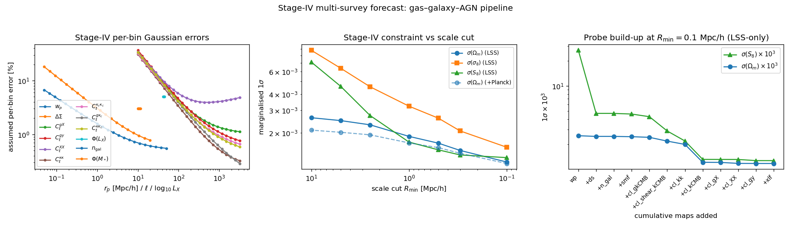
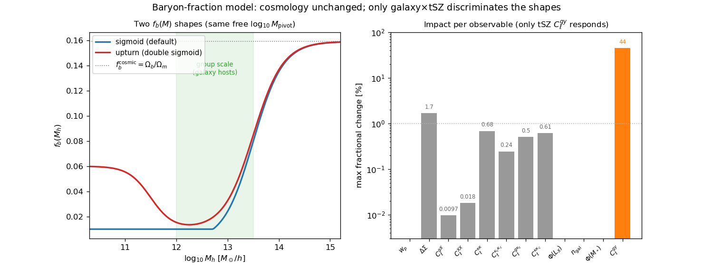

Stage-IV forecast: expected cosmology from the combined multi-wavelength surveys
================================================================================

This page turns the differentiable gas–galaxy–AGN pipeline into a **believable
expectation** for the cosmological precision reachable at the end of the current
(Stage-IV) survey generation, as a function of the small-scale cut.  Where the
:doc:`sensitivity_fisher` page uses a *constant* relative error to expose the
information and degeneracy structure, this page assigns **realistic, per-observable,
scale-dependent Gaussian errors** matched to the surveys that will actually measure
each map, and reports :math:`\sigma(\Omega_m,\sigma_8,S_8)` and the
:math:`(\Omega_m,\sigma_8)` figure of merit.

The survey list and the observable-to-survey mapping follow the multi-wavelength
"by 2030" programme laid out in the 2026 HDR (Comparat): *galaxy maps from
Rubin/LSST (photometry) and DESI+4MOST (spectroscopy), weak lensing from
Euclid+Roman, thermal SZ from Planck/ACT/SPT, soft
X-rays from eROSITA, and AGN from X-ray to radio* — jointly modelled through their
auto- and cross-correlations without a scale cut.

Code: :mod:`hod_mod.scripts.forecasts.run_stage4_forecast`.

.. contents::
   :local:
   :depth: 2

----

The survey combination and the observables
------------------------------------------

The twelve observables of the pipeline map onto the Stage-IV facilities as follows.
Sky areas are from the HDR survey table (Rubin/LSST :math:`\sim18\,000` deg²,
:math:`r\approx27.5` at 10-yr depth; Euclid :math:`15\,000` deg²; DESI
:math:`\sim14\,000` deg², :math:`\sim35`\ M galaxies/QSOs, with 4MOST completing the
South; Roman wide IR from 2027; ACT :math:`12\,000` deg², SPT-3G
:math:`\sim1\,500` deg², Planck full
sky; eROSITA all-sky soft X-ray, :math:`f_{\rm sky}\approx0.35` German extragalactic
footprint); the effective sky fraction :math:`f_{\rm sky}` is the overlap relevant to
each statistic.

.. list-table:: Observable → Stage-IV survey mapping (effective :math:`f_{\rm sky}` used).
   :header-rows: 1
   :widths: 14 52 12

   * - Observable
     - Survey(s)
     - :math:`f_{\rm sky}`
   * - :math:`w_p(r_p)`
     - DESI + 4MOST (spectroscopic clustering)
     - 0.35
   * - :math:`\Delta\Sigma(R)`
     - LSST / Euclid / Roman shapes × DESI / LSST lenses (galaxy–galaxy lensing)
     - 0.25
   * - :math:`C_\ell^{\kappa\kappa}`
     - LSST + Euclid + Roman (cosmic shear)
     - 0.40
   * - :math:`C_\ell^{gy}`
     - DESI / LSST × ACT / SPT / Planck (thermal SZ)
     - 0.30
   * - :math:`C_\ell^{gX}`
     - DESI / LSST × eROSITA soft X-ray (0.5–2 keV)
     - 0.35
   * - :math:`C_\ell^{XX}`
     - eROSITA soft X-ray auto
     - 0.35
   * - :math:`\Phi(L_X)`
     - eROSITA AGN X-ray luminosity function
     - 0.35
   * - :math:`C_\ell^{\kappa_c\kappa_c}, C_\ell^{g\kappa_c}, C_\ell^{\kappa\kappa_c}`
     - ACT / SPT / Planck CMB lensing (auto and × galaxies / shear)
     - 0.35–0.40
   * - :math:`n_{\rm gal}, \Phi(M_*)`
     - DESI / LSST galaxy number density and stellar-mass function
     - 0.35

The error model
---------------

Each data point carries a diagonal Gaussian error :math:`\sigma_i` with a **cosmic
variance** floor set by :math:`f_{\rm sky}` (grounded in the survey areas) plus a
**noise-to-signal** term that grows towards small scales (shot / shape / instrument
/ background):

* **Angular spectra** (:math:`C_\ell^{gX},C_\ell^{gy},C_\ell^{XX},C_\ell^{\kappa\kappa}`)
  — the Knox formula per (log-)\ :math:`\ell` bin

  .. math::

     \frac{\Delta C_\ell}{C_\ell} = \sqrt{\frac{2}{N_{\rm modes}(\ell)}}
        \left(1 + \frac{N_\ell}{C_\ell}\right),\quad
     N_{\rm modes}=(2\ell+1)\,\ell\,\Delta\ln\ell\,f_{\rm sky},\quad
     \frac{N_\ell}{C_\ell}=r_N\Big(\frac{\ell}{100}\Big)^{a_N}.

* **Projected** :math:`w_p,\Delta\Sigma` —
  :math:`\sigma/d=\sqrt{(f_{\rm CV}/\sqrt{f_{\rm sky}})^2 + (r_N\,(1\,{\rm Mpc}/h/r_p)^{a_N})^2}`
  (cosmic-variance floor :math:`f_{\rm CV}=0.3\%` + shot/shape noise rising to small
  :math:`r_p`).  The floor is set well below a percent because a Stage-IV projected
  measurement spans a multi-:math:`{\rm Gpc}^3` volume and averages over a huge number
  of independent large-scale modes, so the irreducible sample variance per :math:`r_p`
  bin is small; at :math:`f_{\rm sky}=0.35` this floor is :math:`\approx0.5\%`.

* **XLF** :math:`\Phi(L_X)` — a constant Poisson-like per-dex error.

The noise-to-signal parameters :math:`(r_N,a_N)` are effective per-bin values for the
**end-of-survey Stage-IV depth**: they are anchored on the current measurement
signal-to-noise (e.g. the Comparat et al. 2025 eROSITA galaxy–X-ray cross-correlation,
which measures the :math:`L_X`–:math:`M` slope to
:math:`\alpha_{\rm SR}=1.63\pm0.09`) and standard shape / shot budgets, but scaled to
the Stage-IV source and tracer densities — so the noise-to-signal at the pivot and its
small-scale growth :math:`a_N` are markedly milder than a Stage-III forecast (higher
:math:`n_{\rm eff}` pushes the shot/shape-noise crossover to smaller scales).  They are
explicit, tabulated assumptions — the honest choice, rather than a false-precision
analytic covariance built on many un-published numbers:

.. list-table:: Per-observable Stage-IV error parameters.
   :header-rows: 1
   :widths: 16 10 10 10 26

   * - Observable
     - :math:`f_{\rm sky}`
     - :math:`r_N`
     - :math:`a_N`
     - Prescription
   * - :math:`w_p`
     - 0.35
     - 0.015
     - 0.5
     - floor + noise (projected)
   * - :math:`\Delta\Sigma`
     - 0.25
     - 0.03
     - 0.6
     - floor + noise (shape-noise limited)
   * - :math:`C_\ell^{\kappa\kappa}`
     - 0.40
     - 0.05
     - 1.1
     - Knox (shape noise)
   * - :math:`C_\ell^{gy}`
     - 0.30
     - 0.25
     - 0.9
     - Knox (tSZ noise/beam)
   * - :math:`C_\ell^{gX}`
     - 0.35
     - 0.30
     - 1.0
     - Knox (X-ray background/shot)
   * - :math:`C_\ell^{XX}`
     - 0.35
     - 0.70
     - 1.2
     - Knox (X-ray auto, noisiest)
   * - :math:`\Phi(L_X)`
     - 0.35
     - 0.05
     - —
     - Poisson (constant per dex)
   * - :math:`C_\ell^{\kappa_c\kappa_c}`
     - 0.40
     - 0.25
     - 0.9
     - Knox (CMB-lensing reconstruction)
   * - :math:`C_\ell^{g\kappa_c}`
     - 0.35
     - 0.15
     - 0.7
     - Knox (galaxy × CMB lensing)
   * - :math:`C_\ell^{\kappa\kappa_c}`
     - 0.35
     - 0.20
     - 0.9
     - Knox (shear × CMB lensing)
   * - :math:`n_{\rm gal}`
     - 0.35
     - 0.01
     - —
     - number density (1 %)
   * - :math:`\Phi(M_*)`
     - 0.35
     - 0.03
     - —
     - per-dex (3 %)

The resulting per-bin errors (left panel of the figure below) fall to sub-percent on
the best-sampled projected and mid-:math:`\ell` scales, and rise to tens of percent
both in the lowest-:math:`\ell` (few-mode, cosmic-variance-limited) bins and for the
noise-dominated X-ray auto :math:`C_\ell^{XX}` — milder throughout than a Stage-III
forecast.

Expected constraints as a function of scale cut
-----------------------------------------------

Marginalising over the full 31-parameter vector (5 cosmological —
:math:`\Omega_m,\sigma_8,h,n_s,\Omega_b` with :math:`h,n_s,\Omega_b` carrying
Planck/BBN priors — 9 HOD, 6 X-ray gas, 2 baryon-feedback, :math:`\beta_P`,
:math:`\log_{10}\rm DC`, 7 Powell AGN — see the :doc:`sensitivity_fisher`
parameter inventory) with weakly-informative nuisance priors, and propagating to
:math:`S_8=\sigma_8(\Omega_m/0.3)^{1/2}`:

.. list-table:: Expected :math:`1\sigma` from the combined Stage-IV data vector (all twelve maps), LSS-only, and adding a Planck prior on :math:`(\Omega_m,\sigma_8)`.  Percentages are relative to the fiducial (:math:`\Omega_m=0.31,\ \sigma_8=0.811,\ S_8=0.825`).
   :header-rows: 1
   :widths: 10 15 15 15 12 15

   * - :math:`R_{\min}` [Mpc/h]
     - :math:`\sigma(\Omega_m)`
     - :math:`\sigma(\sigma_8)`
     - :math:`\sigma(S_8)`
     - FoM
     - :math:`\sigma(S_8)` +Planck
   * - 0.1
     - :math:`1.2\times10^{-3}` (0.38 %)
     - :math:`1.5\times10^{-3}` (0.19 %)
     - :math:`1.3\times10^{-3}` (0.15 %)
     - :math:`7.4\times10^{5}`
     - :math:`1.3\times10^{-3}` (0.15 %)
   * - 0.5
     - :math:`1.7\times10^{-3}` (0.53 %)
     - :math:`2.6\times10^{-3}` (0.32 %)
     - :math:`1.5\times10^{-3}` (0.18 %)
     - :math:`4.2\times10^{5}`
     - :math:`1.4\times10^{-3}` (0.17 %)
   * - 2.5
     - :math:`2.3\times10^{-3}` (0.74 %)
     - :math:`4.6\times10^{-3}` (0.56 %)
     - :math:`2.7\times10^{-3}` (0.33 %)
     - :math:`1.7\times10^{5}`
     - :math:`2.4\times10^{-3}` (0.29 %)
   * - 5.0
     - :math:`2.5\times10^{-3}` (0.80 %)
     - :math:`6.4\times10^{-3}` (0.78 %)
     - :math:`4.6\times10^{-3}` (0.56 %)
     - :math:`9.4\times10^{4}`
     - :math:`3.5\times10^{-3}` (0.43 %)
   * - 10.0
     - :math:`2.6\times10^{-3}` (0.84 %)
     - :math:`8.8\times10^{-3}` (1.08 %)
     - :math:`7.1\times10^{-3}` (0.86 %)
     - :math:`5.8\times10^{4}`
     - :math:`4.5\times10^{-3}` (0.55 %)

   *Left:* the assumed Stage-IV per-bin fractional errors for each map — sub-percent
   on the best-sampled scales, rising to tens of percent in the lowest-:math:`\ell`
   (few-mode) bins and for the X-ray auto.
   *Middle:* the marginalised :math:`\sigma(\Omega_m),\sigma(\sigma_8),\sigma(S_8)`
   versus scale cut (LSS-only; dashed = adding a Planck prior).  *Right:* the
   cumulative build-up of :math:`\sigma(\Omega_m)` and :math:`\sigma(S_8)` as each
   map is added, at :math:`R_{\min}=0.1` Mpc/h, grouped clustering
   (:math:`w_p,\Delta\Sigma`) → abundances (:math:`n_{\rm gal},\Phi(M_*)`) → lensing
   / CMB-lensing → X-ray and SZ.

Reading the forecast:

* **Expected precision.**  The full combination reaches
  :math:`\sigma(S_8)\approx0.15\%`, :math:`\sigma(\sigma_8)\approx0.19\%`,
  :math:`\sigma(\Omega_m)\approx0.38\%` at :math:`R_{\min}=0.1` Mpc/h — an order of
  magnitude below current large-scale-structure results (DESI DR1 full-shape
  :math:`\sim3.2/4/4\%` on :math:`\Omega_m/\sigma_8/S_8`; DES-Y6 3×2pt
  :math:`7.1/4.3/1.4\%`; KiDS-Legacy shear :math:`1.8\%` on :math:`\Sigma_8`) and
  tighter than the CMB (:math:`\sigma_8` :math:`0.5\%`, :math:`\Omega_m`
  :math:`1.6\%`).  This is the quantitative version of the HDR statement that
  full-shape + 3×2pt constraints "will rival CMB results."

* **The scale cut is worth a factor of a few.**  Pushing :math:`R_{\min}` from 10 to
  0.1 Mpc/h tightens :math:`\sigma(S_8)` by :math:`\sim5.6\times` and
  :math:`\sigma(\Omega_m)` by :math:`\sim2.2\times` — the payoff of a model that can
  be trusted below :math:`\sim` Mpc scales, which is the whole motivation for the
  gas/AGN feedback modelling.

* **The lensing sector drives** :math:`S_8`, **but the clustering + gas probes make
  it safe.**  The right panel's cumulative build-up (at :math:`R_{\min}=0.1` Mpc/h,
  in the order clustering → abundances → lensing → X-ray/SZ) shows :math:`w_p` alone
  reaches only :math:`\sigma(S_8)\approx3.2\%`; adding galaxy–galaxy lensing
  (:math:`\Delta\Sigma`) collapses it to :math:`\sim0.57\%`; the abundances
  (:math:`n_{\rm gal},\Phi(M_*)`) are essentially flat; the lensing sector —
  galaxy×CMB-lensing, shear×CMB-lensing, cosmic shear and the CMB-lensing auto —
  drives the decisive drop to :math:`\sim0.16\%` (the CMB-lensing auto alone taking
  :math:`0.27\to0.16\%`); and the X-ray / tSZ / XLF legs tighten it only marginally
  further (to :math:`0.15\%`) *but* calibrate the baryon systematic.  The value of
  the X-ray/SZ legs is not raw :math:`S_8` signal but the de-biasing of the lensing
  (the baryon calibration quantified on the :doc:`sensitivity_fisher` page).

* **Adding a Planck prior** helps most where the LSS data are weakest (large scale
  cuts): at :math:`R_{\min}=10` Mpc/h it tightens :math:`\sigma(S_8)` by
  :math:`\sim1.6\times`, but at :math:`R_{\min}=0.1` Mpc/h the LSS combination is
  already within :math:`\sim1\%` of the joint result — i.e. the small-scale
  multi-wavelength data are self-sufficient.

* **The AGN XLF** adds negligibly here because the AGN accretion sector is
  marginalised (its cosmological amplitude is degenerate with the active fraction);
  with the accretion sector externally pinned it contributes at the
  :math:`\times1.03\text{–}1.1` level in :math:`\sigma(\Omega_m)`
  (``--agn-pinned``; see the :doc:`sensitivity_fisher` XLF section).

Robustness to the baryon-fraction model: a galaxy×tSZ test
----------------------------------------------------------

The forecast fixes the hot-gas fraction :math:`f_b(M)` to the monotonic
:class:`~hod_mod.observables.baryon_fraction.BaryonFractionSigmoid`.  Is that
modelling choice quietly driving the cosmology?  To check, we swap in the
physically-motivated **non-monotonic**
:class:`~hod_mod.observables.baryon_fraction.BaryonFractionUpturn` — a *double
sigmoid* with the same group-scale suppression **plus a low-mass upturn**, where
AGN feedback is weak in dwarf halos and the cold CGM gas fraction rises again
(EAGLE / IllustrisTNG / FLAMINGO; Zhang et al. 2025).  The free group pivot
:math:`\log_{10}M_{\rm pivot}` is reused as the upturn's :math:`M_{\rm hi}`, so the
31-parameter vector is **identical** and only the :math:`f_b(M)` shape changes
(``ForwardModel(baryon_model="upturn")``).  The two shapes diverge only below
:math:`\sim10^{13}\,M_\odot/h`: the upturn fills in the group-scale valley, making
:math:`f_b` about :math:`1.4\text{–}1.5\times` higher at :math:`10^{12}\text{–}10^{13.5}`
— exactly the halos that host the :math:`M_*>10` galaxies.

   *Left:* the two baryon-fraction shapes at the fiducial (they agree at cluster
   scales, where both recover :math:`f_b^{\rm cosmic}`, and in the deep valley, but
   the upturn lifts :math:`f_b` at group and dwarf masses).  *Right:* the maximum
   fractional change this induces in each fiducial observable — **only the thermal
   SZ** :math:`C_\ell^{gy}` **responds** (:math:`\sim40\%`); every other statistic
   moves by :math:`<2\%`.

Two results follow.  First, the **cosmological constraints are unchanged**:

.. list-table:: Stage-IV :math:`1\sigma` (LSS-only) under the two baryon-fraction shapes.
   :header-rows: 1
   :widths: 12 14 16 16 16

   * - :math:`R_{\min}` [Mpc/h]
     - :math:`f_b` model
     - :math:`\sigma(\Omega_m)`
     - :math:`\sigma(\sigma_8)`
     - :math:`\sigma(S_8)`
   * - 0.1
     - sigmoid
     - :math:`1.18\times10^{-3}`
     - :math:`1.54\times10^{-3}`
     - :math:`1.28\times10^{-3}`
   * - 0.1
     - upturn
     - :math:`1.17\times10^{-3}`
     - :math:`1.54\times10^{-3}`
     - :math:`1.24\times10^{-3}`
   * - 2.5
     - sigmoid
     - :math:`2.30\times10^{-3}`
     - :math:`4.56\times10^{-3}`
     - :math:`2.72\times10^{-3}`
   * - 2.5
     - upturn
     - :math:`2.32\times10^{-3}`
     - :math:`4.57\times10^{-3}`
     - :math:`2.65\times10^{-3}`

The differences are :math:`\le3\%` (:math:`\sigma(S_8)` is marginally *tighter*
with the upturn) — within the modelling noise.  The reason the constraints do not
move even though :math:`C_\ell^{gy}` shifts by 40 % is that the Fisher information
depends on the *shape* of :math:`\partial\ln O/\partial\theta`: the 40 % is a pure
amplitude that is degenerate with the gas/pressure nuisances
(:math:`\beta_P,\log_{10}M_{\rm pivot}`) and marginalises away at no cosmological
cost.

Second, and more useful, the test shows **which observable actually carries the
group-scale baryon content**.  The thermal SZ pressure scales as
:math:`f_b` (linear, with a shallow mass weighting), so :math:`C_\ell^{gy}` sees
the group gas directly and changes by :math:`\sim40\%`.  The X-ray, by contrast,
scales as :math:`f_b^2` with a steep :math:`L_X`–:math:`M` slope, so
:math:`C_\ell^{gX}`/:math:`C_\ell^{XX}` are dominated by massive clusters (where
both models recover :math:`f_b^{\rm cosmic}`) and are **blind** (:math:`0.01\%`);
clustering (satellites trace the dark matter) and the abundances do not depend on
:math:`f_b` at all.  The whole galaxy–galaxy and CMB-lensing sector moves by
:math:`<1\%`.

The conclusion mirrors the parameter inventory: whether :math:`f_b` turns up again
at low mass is a **modelling / systematics** question that the galaxy×tSZ
cross-correlation can settle decisively (a :math:`\sim40\%` signal), *not* one that
degrades the cosmological error bars once the feedback sector is marginalised.
Freeing the upturn amplitude :math:`f_b^{\rm lo,amp}` as a genuine extra parameter
would add a nuisance direction that :math:`C_\ell^{gy}` — and only
:math:`C_\ell^{gy}` — constrains.

Caveats
-------

These are **forecasts under stated assumptions**, to be read as expected orders of
magnitude, not guarantees.  The table above uses a diagonal Gaussian error model:
it neglects most of the cross-observable covariance (which correlates the maps that
trace the same field and would loosen the joint constraint somewhat) and the
non-Gaussian small-scale covariance.  An analytic Gaussian covariance with
cross-observable correlations — exact for the lensing triplet
:math:`\{C_\ell^{\kappa\kappa},C_\ell^{\kappa\kappa_c},C_\ell^{\kappa_c\kappa_c}\}`
— is available (:mod:`hod_mod.forecast.covariance`, ``--covariance gaussian``) and
is the next increment.  A single effective redshift is used (no tomography), the cosmology is
LCDM through the Eisenstein–Hu :math:`P(k)` (no :math:`w_0w_a` / :math:`\sum m_\nu`
yet), and the X-ray/tSZ legs use analytic differentiable surrogates.  Removing each
of these approximations is the subject of the staged plan on the
:doc:`sensitivity_fisher` page (couple the real AGN into the cross-spectra; add
:math:`n_{\rm gal}`, RSD, :math:`C_\ell^{yy}`, CMB-lensing crosses and AGN
clustering; go tomographic; swap in a :math:`w_0w_a\nu` emulator for :math:`P(k)`).

Reproducing this forecast
-------------------------

.. code-block:: bash

   JAX_PLATFORMS=cpu HOD_MOD_RESULTS=/path/to/results \
     python -m hod_mod.scripts.forecasts.run_stage4_forecast \
       --rmin 0.1 0.3 0.5 1 2.5 5 10           # add --agn-pinned for the XLF-unlocked case

Outputs (``$HOD_MOD_RESULTS/stage4_forecast/``): ``stage4_forecast.json`` (the full
table + error model), ``stage4_forecast.npz`` (Jacobian, per-bin errors, row
metadata) and ``stage4_forecast.png`` (also copied into ``docs/_images/``).
