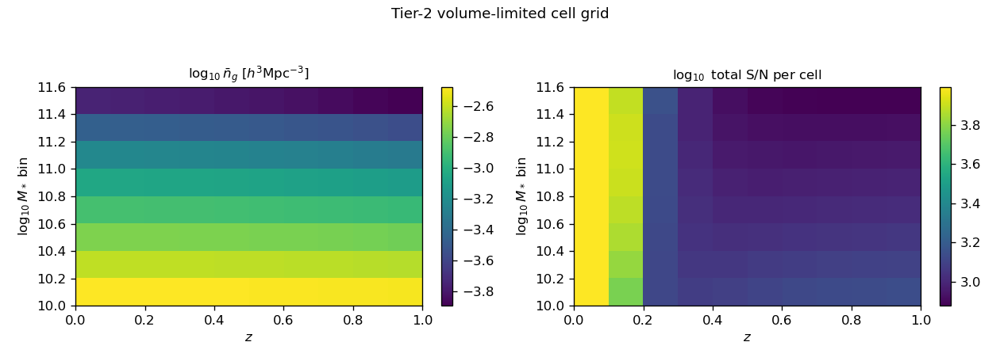
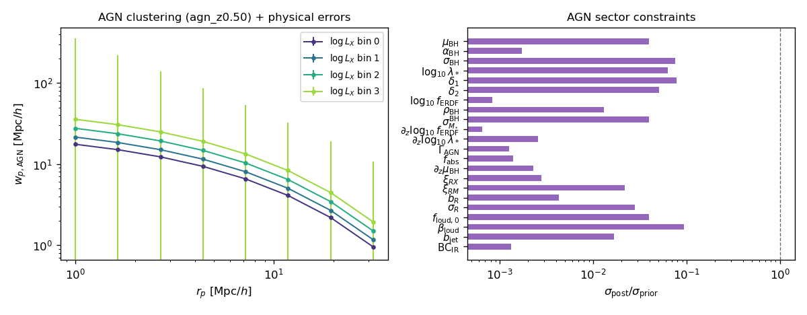
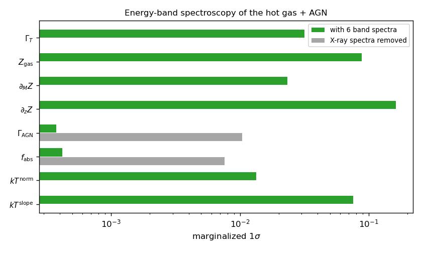
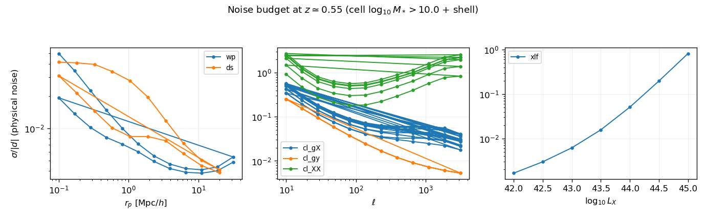
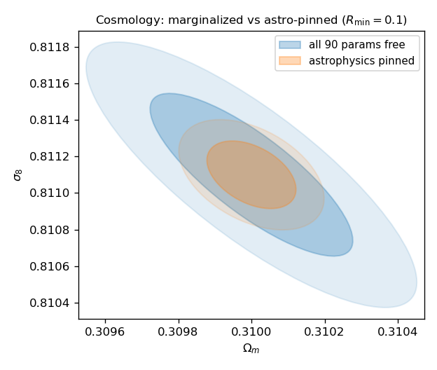
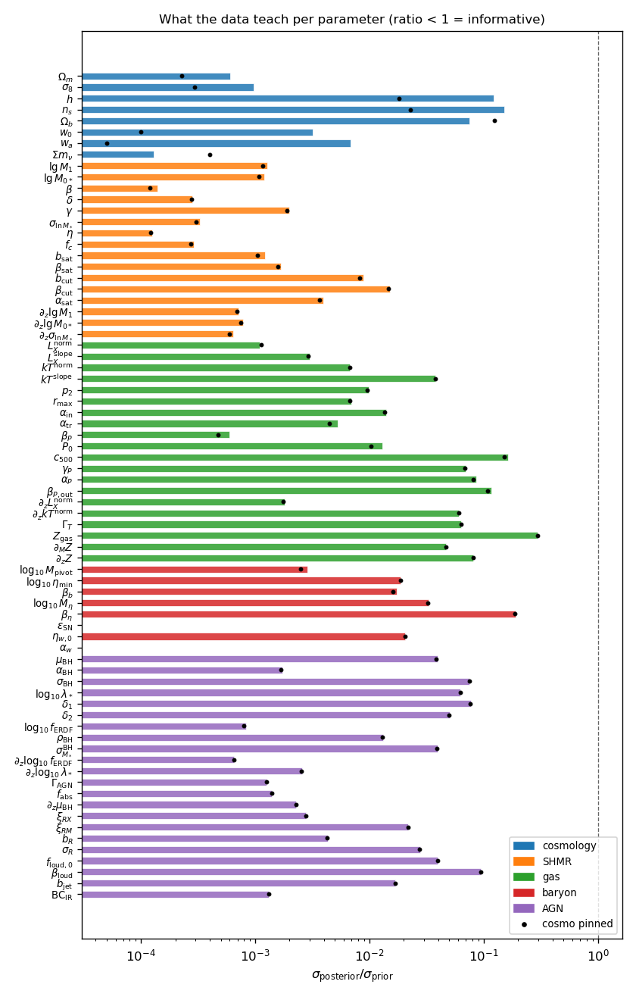
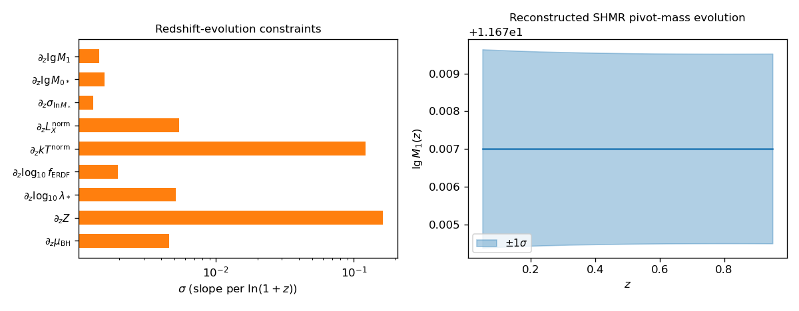
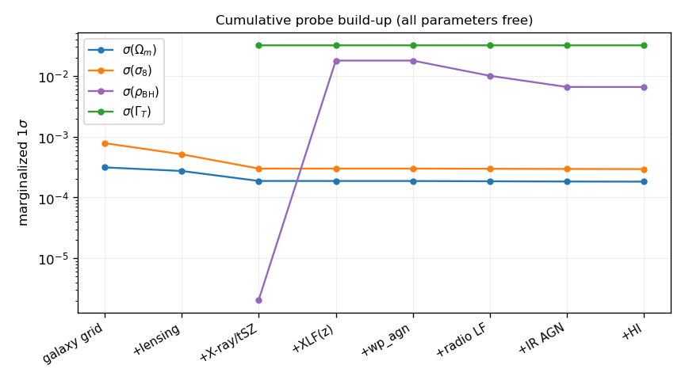
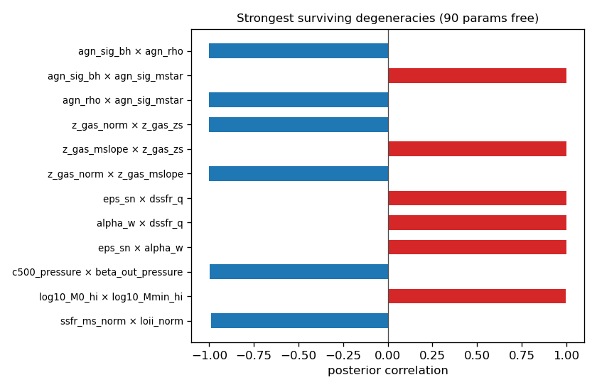

Tier-2 forecast: nothing fixed (90 parameters)
==============================================

The :doc:`tier-1 studies <stage4_forecast>` ask what a Stage-IV survey
combination measures when the model keeps its historically fixed nuisance
shapes.  The tier-2 study asks the harder question the pipeline was built for:

    **With an optimistic end-of-decade data scenario, how much cosmology and
    how much astrophysics do we learn when *nothing* is fixed?**

Every parameter the forward model contains is free — the 31-entry tier-1
vector, the 16 formerly hard-coded nuisance shapes that
:doc:`sensitivity_fisher` flagged as "parameters that could be freed", 7
redshift-evolution slopes, and 7 X-ray spectral parameters enabled by energy
bands: **61 in the original tier-2 design**.  The
:doc:`missing-physics extension <missing_physics>` has since appended 29 more
(the CPL dark-energy pair :math:`w_0, w_a` and :math:`\sum m_\nu`; the
star-forming/quenched split and continuous sSFR sector; the cold-gas/HI
sector; SN/wind energetics; and the radio-loud, X-ray–radio and infrared AGN
channels), so the production run frees **90 parameters**.  The only pinned
entry is the *retired* ``log10DC`` duty cycle: with the Powell AGN chain
providing the point-source emission (``agn_emission="powell"``), the duty
cycle leaves the emissivity entirely and its only remaining consumer is the
optional energy-closure mode.

Reproduce with::

    JAX_PLATFORMS=cpu python -m hod_mod.scripts.forecasts.run_tier2_forecast \
        --rmin 0.1 0.5 2.5 --n-bands 6 \
        --split-sfq --include-radio --include-hi --include-ssfr --include-ir
    # fast end-to-end check (2x2 cells, tiny grids, ~2 min):
    JAX_PLATFORMS=cpu python -m hod_mod.scripts.forecasts.run_tier2_forecast --smoke

The parameter vector (61 → 90)
------------------------------

The vector grows append-only from the tier-1 layout (indices 0–30 unchanged),
so every tier-1 script keeps working — they pin the extension
(:data:`~hod_mod.forecast.forward_jax.TIER2_EXTENSION`) to its fiducials by
default and grow a ``--free-tier2`` flag.

* **Promoted nuisances (16).**  Satellite HOD shape (``beta_sat, bcut,
  beta_cut, alpha_sat``), baryon-sector shape (``beta_b, log10_M_eta,
  beta_eta``), gas emissivity slopes (``alpha_in_gas, alpha_tr_gas``), the A10
  pressure shape (``p0_pressure, c500_pressure, gamma_pressure,
  alpha_pressure, beta_out_pressure``) and the Powell "Model 2" internals
  (``agn_rho, agn_sig_mstar``).  Each fiducial equals the former constant, so
  the fiducial prediction is bit-identical to tier-1 (this is tested).
* **Redshift-evolution slopes (7 + 2).**  Additive on the base parameter per
  :math:`\ln[(1+z_{\rm eff})/(1+z_{\rm pivot})]` with :math:`z_{\rm pivot}=0.3`
  (``ForwardModel._theta_eff``): the SHMR (``lg_m1h_zs, lg_m0star_zs,
  sigma_lnmstar_zs``), departures from the hard-coded self-similar
  :math:`E(z)^2` / :math:`E(z)^{2/3}` scalings (``lx_zs, kt_zs``), the AGN
  sector (``agn_log10_ferdf_zs, agn_log10_lstar_zs, agn_mu_bh_zs``) and the
  ICM metallicity (``z_gas_zs``).  One shared vector drives every cell; the
  chain rule guarantees :math:`\partial d/\partial({\rm slope}) =
  \ln[(1+z)/(1+z_p)]\;\partial d/\partial({\rm base})` exactly (tested to
  :math:`10^{-10}`).
* **X-ray spectral sector (7).**  See the band layer below: ``t_prof_slope``
  (radial temperature profile; 0 = the production isothermal convention),
  ``z_gas_norm, z_gas_mslope, z_gas_zs`` (ICM metallicity and its mass/z
  slopes; fiducial the DPM :math:`Z(0.3R_{200})=0.3\,Z_\odot`), ``agn_gamma``
  (photon index, fiducial 1.8) and ``agn_fabs`` (obscured fraction at
  :math:`N_H=10^{22}` cm\ :math:`^{-2}`).
* **Missing-physics additions (29).**  Documented on the
  :doc:`missing_physics` page: extended cosmology (``w0, wa, sum_mnu`` via the
  CPL growth ODE), the SF/quenched split + continuous sSFR + [OII] sector
  (``log10_Mq_cen, mu_q_cen, log10_Mq_sat, mu_q_sat, dlx_quenched,
  ssfr_ms_norm, ssfr_ms_slope, ssfr_ms_zs, dssfr_q, sigma_ms, loii_norm``),
  the cold-gas sector (``log10_M0_hi, log10_Mmin_hi, alpha_hi,
  dhi_quenched``), SN/wind energetics (``eps_sn, eta_w_norm, alpha_w``), and
  the AGN radio/IR channels (``agn_xi_rx, agn_xi_rm, agn_b_r, agn_sig_r,
  f_loud0, beta_loud, b_jet, agn_bc_ir``).

* **Not freed, deliberately.**  The bolometric correction (exactly degenerate
  with ``agn_mu_bh`` — both shift the L_X zero point), ``f_b_min`` (a
  test-reserved limiting parameter), the radial metallicity shape (DPM-fixed;
  a documented extension), and baryon-sector z-slopes (they would need the
  evolution mapping inside the wide-z lensing line-of-sight integrals).

The (z, M*) cell grid
---------------------

Volume-limited galaxy samples tile the plane: :math:`\Delta z = 0.1` shells
over :math:`0<z<1` × 0.2-dex stellar-mass bins over :math:`10.0 \le \log_{10}
M_* \le 11.6` — **80 cells**.  A bin sample is the exact difference of two
ZM15 threshold occupations, :math:`N^{\rm bin} = N(>M_{*,\rm lo}) -
N(>M_{*,\rm hi})`, each satellite term with its own threshold-derived cutoff
masses; the binned count density *is* the stellar-mass-function datum, so
``smf`` is not a separate observable.  In the production run every cell is
further split into a star-forming and a quiescent sample (``--split-sfq``) —
**160 samples** over the 80-cell grid.  Per cell the forecast predicts
``(wp, ds, cl_gX × bands, cl_gy, cl_gkCMB, n_gal)`` plus the main-sequence
sSFR and SFR-density data (``--include-ssfr``); per shell (M*-independent)
the soft-band AGN XLF, the band X-ray autos ``cl_XX``, and the radio,
[OII] and AGN-infrared luminosity functions (``--include-radio/-ssfr/-ir``);
the HI mass function and 21cm×galaxy crosses at low z (``--include-hi``);
globally the tomographic shear block; plus the AGN clustering samples.

   Fiducial galaxy density and the total signal-to-noise per (z, M*) cell.

This grid is what pins the galaxy–halo connection *and its evolution*: with 8
mass bins per shell the SHMR shape is measured within each shell, and the 10
shells then separate the base parameters from their z-slopes.

.. admonition:: Optimism flag

   "Volume-limited to :math:`M_*=10^{10}` at :math:`z=1` with
   spectroscopic redshifts over :math:`f_{\rm sky}=0.5`" is beyond any single
   funded survey; it is the stated optimistic premise of this tier
   (DESI/4MOST-like coverage extended by Euclid/LSST photometry).

The AGN program and the Athena premise
--------------------------------------

The AGN sector is fully forward-modeled by the Powell chain (SHMR →
:math:`M_{\rm BH}`–:math:`M_*` → ERDF), so the X-ray-selected AGN sample adds
three independent handles:

* the **z-resolved soft XLF** (7 points per shell, 0.5-dex bins over
  :math:`42 \le \log_{10} L_X \le 45`), now including the hard→soft conversion
  :math:`k_{\rm h2s}(\Gamma)` and the two-component obscuration mixture
  (a fraction ``agn_fabs`` dimmed by the :math:`N_H=10^{22}` MM83
  transmission);
* the **projected clustering** ``wp_agn`` of complete L_X-bin samples
  (0.5-dex bins above :math:`10^{42}` erg/s at five redshifts) — a Bernoulli
  central occupation has no self-pairs, so the prediction is the clean 2-halo
  :math:`b^2_{\rm AGN}(L_X, z)\,P_{\rm lin}`.  The bias per luminosity bin
  measures the width :math:`\sigma_{lm}` of the L_X–halo relation (an
  abundance-vs-bias split the XLF alone cannot do).  *Honest finding of the
  production run:* because ``agn_rho``, ``agn_sig_mstar`` and ``agn_sig_bh``
  enter this kernel **only** through :math:`\sigma_{lm} = \sqrt{\alpha_{\rm
  BH}^2\sigma_{M_*}^2(1-\rho) + \sigma_{\rm BH}^2}`, the X-ray probes alone
  leave the three internally degenerate (in the original 61-parameter run
  ``agn_rho`` stayed prior-bound, σ = 0.49 vs prior 0.5).  The 90-parameter
  production run adds observables outside the kernel — the X-ray–radio
  correlation ``agn_xi_rx`` sector and the AGN infrared LF — which shrink
  the individual σ's dramatically (``agn_rho``: σ = 6.6×10⁻³), yet the
  *pairwise* correlations of the triple remain ±1.000: the flat direction is
  narrowed, not opened.  A direct M_BH census or halo-mass-resolved AGN
  fractions would still be the clean way to break it;
* the **point-source term** in every band ``cl_gX``/``cl_XX``, tied to the
  same parameters (the tier-1 :math:`L\propto M` surrogate is retired together
  with ``log10DC``).

The hypothetical **Athena all-sky survey** is specified by one clean premise:
its flux limit :math:`F_{\rm lim}(0.5\!-\!2\,{\rm keV}) = 2\times10^{-16}`
erg/s/cm² is *exactly* the depth that makes the :math:`L_X > 10^{42}` sample
complete to :math:`z = 1` (:math:`L_{\rm lim}(z{=}1) \simeq 1.0\times10^{42}`
erg/s; the driver prints the check and assigns infinite noise to any (z, L_X)
bin below the limit).  The implied all-sky depth is :math:`t\,A_{\rm eff} =
n_{\rm det}\bar e/F_{\rm lim} \approx 8\times10^{7}` s·cm².  The 5″ HEW PSF
enters through source detection and confusion — i.e. through the XLF and the
completeness argument — not through the :math:`\ell \le 3000` band spectra,
where the beam is unity for both 5″ and 30″.

   AGN clustering per L_X bin with its pair-count errors, and the AGN-sector
   parameter constraints.

The multi-band APEC layer
-------------------------

The tier-1 gas model was spectrally blind: one broad band, isothermal halos, a
crude :math:`kT^{0.25}` band weight, and **no metallicity anywhere**.  Tier-2
attaches the production band machinery (the validated
``fit_xray_joint_bands`` 15×100 eV convention) to the differentiable model:

.. math::

   \varepsilon_b(r|M) \;\propto\; f_{\rm gNFW}^2(x)\,
   \Lambda_b\big(T(r|M),\, Z(M,z)\big), \qquad
   T(r|M) = kT(M)\,\big[f_{\rm gNFW}(x)/f_{\rm gNFW}(1)\big]^{\Gamma_T},

with :math:`\Lambda_b(T, Z)` band-integrated APEC tables distilled once into
``hod_mod/data/apec_bands/`` (:mod:`hod_mod.forecast.apec_bands`) and
bilinearly interpolated in JAX — **no emulator is needed** because the tables
are precomputed and the interpolation is exactly differentiable.  The
amplitude convention keeps ``lx_norm`` as the total 0.5–2 keV luminosity and
partitions it by emission-weighted band fractions with
:math:`\sum_b w_b = 1` exact by construction; since APEC bands are additive
pointwise (:math:`\sum_b \Lambda_b = \Lambda_{\rm broad}`), the band stack
sums to the broad-band prediction even with a temperature profile (tested).
The default is 6 bands over 0.5–2 keV (``--n-bands {1,6,15}``).

Band *ratios* are the new information: a temperature profile tilts soft
against hard bands with radius (the ``t_prof_slope`` derivative changes sign
across bands — tested), metallicity moves the line-dominated bands through
:math:`\Lambda_b(T,Z)`, and the AGN spectral shape moves all bands coherently
through :math:`f_b(\Gamma)` and the absorption survival
:math:`(1-f_{\rm abs}) + f_{\rm abs}t_b`.

   What the energy bands buy: spectral-parameter constraints with and without
   the band spectra.

The noise model
---------------

All errors are physical (:mod:`hod_mod.forecast.noise`), replacing the tier-1
effective ``(rN, aN)`` recipe:

.. list-table::
   :header-rows: 1
   :widths: 18 42 40

   * - Observable
     - Noise
     - Survey
   * - ``wp`` (per cell)
     - pair counts :math:`\sigma = 2\pi_{\max}(1+w_p/2\pi_{\max})/\sqrt{N_{\rm
       pair}}` + cosmic variance :math:`\propto V^{-1/2}`, with the cell's own
       model :math:`\bar n_g` and volume
     - DESI/4MOST-like, :math:`f_{\rm sky}=0.5`
   * - ``ds`` (per cell)
     - shape noise :math:`\sigma_e\langle\Sigma_{\rm
       crit}^{-1}\rangle^{-1}/\sqrt{n_{\rm src}^{\rm eff}A_{\rm ann}N_{\rm
       lens}}`, sources at :math:`z_s > z_l + 0.1` (high-z cells go
       noise-dominated automatically)
     - Euclid+LSST, 30 arcmin⁻², :math:`\sigma_e=0.26`
   * - ``cl_kk`` (15 pairs)
     - Knox with per-bin :math:`N_\kappa = \sigma_e^2/\bar n_i`, 5
       equal-number Smail bins with photo-z mixing
     - Euclid+LSST, :math:`f_{\rm sky}=0.5`
   * - ``cl_kCMB`` & crosses
     - Knox with flat :math:`N_L^{\kappa\kappa} = 7\times10^{-9}`
     - S4-like, :math:`f_{\rm sky}=0.4`
   * - ``cl_gX``/``cl_XX`` (bands)
     - CXB photon noise :math:`N_b = I_{{\rm CXB},b}\bar
       e_b/(tA_{\rm eff}\,{\rm conv}^2\Delta\chi)` per shell + galaxy shot
       :math:`1/\bar n_{\rm 2D}`; PSF beam (≈1 here)
     - Athena all-sky, :math:`f_{\rm sky}=0.65`
   * - ``xlf`` (per shell)
     - Poisson :math:`1/\sqrt{\Phi V \Delta\log L_X}` + the completeness cut
       :math:`L_{\rm lo} \ge L_{\rm lim}(z_{\rm hi})`
     - Athena × spec-z overlap, :math:`f_{\rm sky}=0.5`
   * - ``wp_agn``
     - pair counts with the model's own :math:`\bar n_{\rm AGN}(L_X, z)`
     - Athena × spec-z overlap
   * - ``cl_gy``
     - the calibrated stage-4 recipe (kept in v1)
     - SO/ACT/SPT-like, :math:`f_{\rm sky}=0.3`

   Relative errors for a representative mid-z cell and its shell.

Results: cosmology vs astrophysics
----------------------------------

The headline deliverable is the decomposition.  For every scale cut the driver
reports (i) the cosmology block marginalized over all 81 astrophysical
parameters vs the same data with astrophysics pinned — the *cost of honesty*;
(ii) each astrophysics sector marginalized vs cosmology externally pinned —
what the data teach about galaxies, gas and black holes independent of the
cosmological application; and (iii) the information gained per sector in bits,
:math:`\tfrac12\log_2\det C_{\rm prior}/\det C_{\rm post}`.

Headline numbers of the production run (6 bands, :math:`R_{\min}=0.1` Mpc/h,
22,539 data rows, all 90 parameters free):

* **Cosmology is cheap to keep honest.**  :math:`\sigma(\Omega_m) =
  1.8\times10^{-4}` (0.06%), :math:`\sigma(\sigma_8) = 2.9\times10^{-4}`
  (0.04%), :math:`\sigma(S_8) = 1.8\times10^{-4}` — only factors 2.3 / 2.4 /
  1.4 above the astrophysics-pinned limit.  The optimistic data scenario pays
  for full marginalization: the cumulative build-up gives
  :math:`\sigma(\Omega_m)` = 3.1 → 2.7 → 1.9 :math:`\times10^{-4}` for the
  galaxy grid → +lensing → +X-ray/tSZ; the AGN probes and the new radio / IR /
  HI legs add little *to cosmology* (their value is the astrophysical sectors
  themselves).  The extended-cosmology block is measured alongside:
  :math:`\sigma(w_0) = 3.2\times10^{-3}`, :math:`\sigma(w_a) = 1.4\times10^{-2}`,
  :math:`\sigma(\sum m_\nu) = 3.2\times10^{-5}` eV (growth-only, EH98 shape —
  see the caveats).
* **Astrophysics dominates the information budget**: 178 bits in the SHMR
  sector, 153 in the gas, 149 in the SF/quenched sector, 127 in the baryon
  sector, 35 in the cold-gas sector, versus 71 in cosmology (the AGN-sector
  determinant is singular — the :math:`\sigma_{lm}` triple below — so its
  bits are not well-defined).  Redshift evolution — inaccessible to tier-1 —
  is measured at :math:`\sigma(\partial_z \lg M_1) = 1.4\times10^{-3}` per
  :math:`\ln(1+z)`, and the departure from self-similar L_X evolution at
  :math:`\sigma(\rm lx\_zs) = 5.4\times10^{-3}` dex.
* **The energy bands work as spectroscopy**: :math:`\sigma(\Gamma_{\rm AGN}) =
  3.8\times10^{-4}`, :math:`\sigma(f_{\rm abs}) = 4.2\times10^{-4}` (their
  correlation drops from +1.000 with one broad band to +0.94 with six),
  :math:`\sigma(\Gamma_T) = 0.032` for the temperature-profile tilt, and the
  ICM metallicity is recovered to :math:`\sigma(Z) = 0.09\,Z_\odot` with its
  mass slope to 0.023 dex/dex and its *redshift* slope to 0.16 dex per
  :math:`\ln(1+z)` — though the three metallicity parameters remain almost
  perfectly internally correlated (±1.000).  The 1-band control run
  (``--n-bands 1``, kept in the original 61-parameter configuration) makes
  the point sharply: without band ratios :math:`\Gamma_{\rm AGN}` and
  :math:`f_{\rm abs}` sit at their priors (σ ≈ 0.25, a factor ~500 worse),
  the metallicity carries **zero** information (σ = prior), and
  :math:`kT^{\rm norm}` collapses to a flat direction — the temperature
  scaling is measured *through* the band ratios.
* **What stays degenerate** even with everything combined: the
  :math:`\sigma_{lm}` triple (``agn_sig_bh × agn_rho × agn_sig_mstar`` at
  ±1.000), the ICM-metallicity triple (norm × mass-slope × z-slope at
  ±1.000), the A10 pressure shape (:math:`c_{500}\times\beta_{P,\rm out}` at
  −0.998), the two HI break masses (+0.996), and the sSFR↔[OII]
  normalisations (−0.992).
* **Audits**: pinning any sector never loosens any σ; adding rows never
  loosens any σ; a reference cell recomputed at (n_k, n_m, n_gl) = (256, 256,
  96) shifts no σ by more than 2.9% (median 0.0%; audit of the 61-parameter
  configuration).

   :math:`\Omega_m`–:math:`\sigma_8` with all 90 parameters free vs
   astrophysics pinned.

   Per-parameter posterior-to-prior ratios by sector; dots show the
   cosmology-pinned case.

   The redshift-evolution slopes — the qualitatively new tier-2 science — and
   the reconstructed SHMR pivot-mass evolution band (pinched at the
   :math:`z=0.3` pivot, as it must be).

   Cumulative probe build-up: galaxy grid → +shear tomography → +X-ray
   bands/tSZ → +XLF(z) → +AGN clustering → +radio LF → +IR AGN → +HI.

   The strongest degeneracies that *survive* the full data combination.

Caveats
-------

* **Same-shell covariance.**  The 8 M*-bins of one shell share large-scale
  modes; the diagonal treatment (with a per-cell cosmic-variance floor) is
  optimistic for the shell-summed constraints.  A correlated-CV block is the
  first covariance upgrade.
* **Evolution-model rigidity.**  One :math:`\ln(1+z)` slope per parameter over
  :math:`0<z<1` can overstate the evolution constraints; quadratic slopes are
  a drop-in extension.
* **EH98 shape, growth-only extensions.**  :math:`w_0, w_a, \sum m_\nu` are
  free (missing-physics extension) but enter through the CPL growth ODE only:
  the :math:`P(k)` *shape* is still ΛCDM EH98, with no neutrino free-streaming
  suppression — so :math:`\sigma(\sum m_\nu)` here reflects growth information
  alone and needs a differentiable :math:`P(k)` upgrade to be taken at face
  value (:doc:`sensitivity_fisher`).
* **Tomographic-shear covariance** is Knox-diagonal per spectrum; the full
  Gaussian cross-covariance among the 15 pairs is out of scope.
* **Fixed radial metallicity shape** (DPM) and the static NH transmission
  template are documented approximations of the spectral layer.
