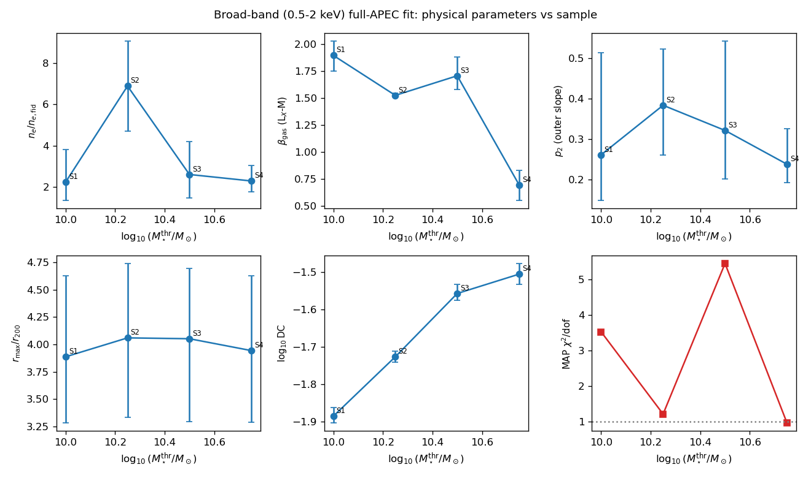
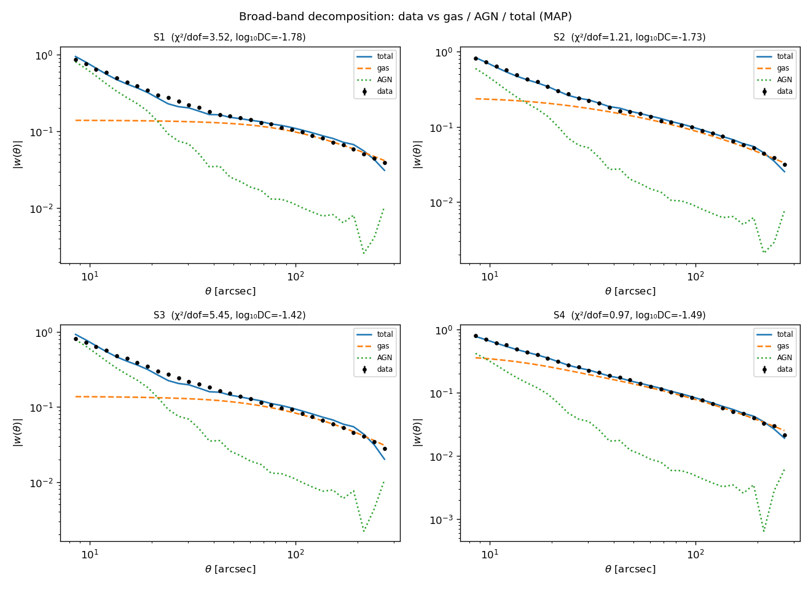
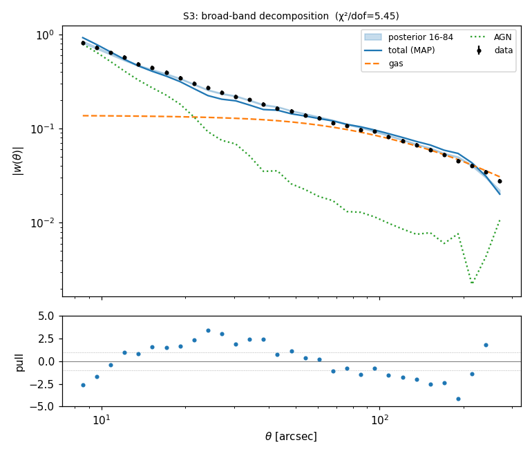
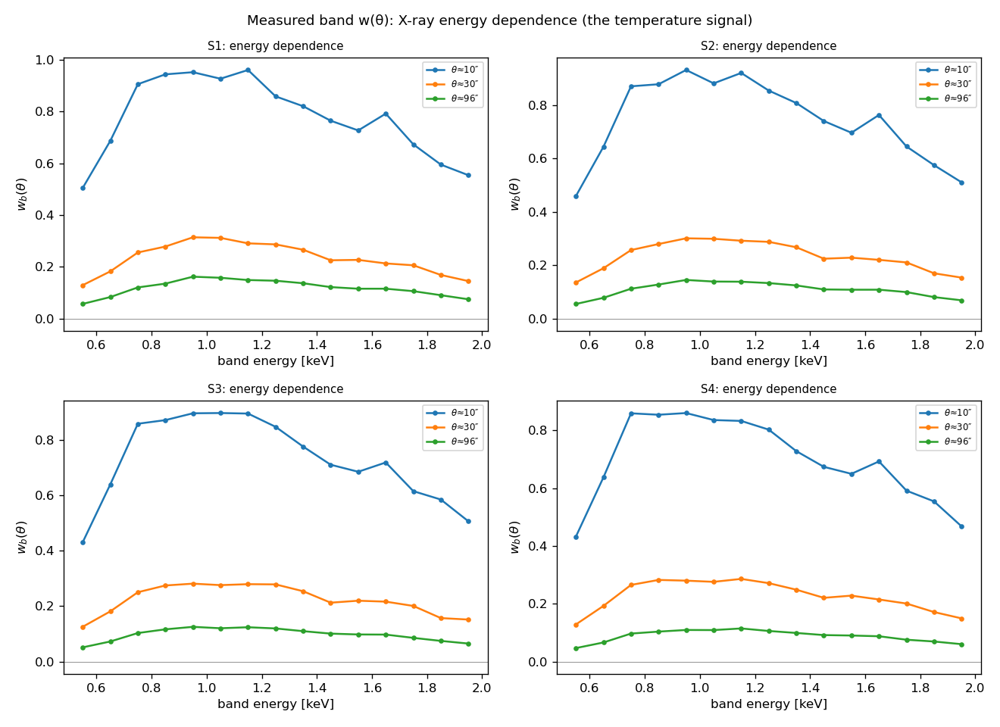
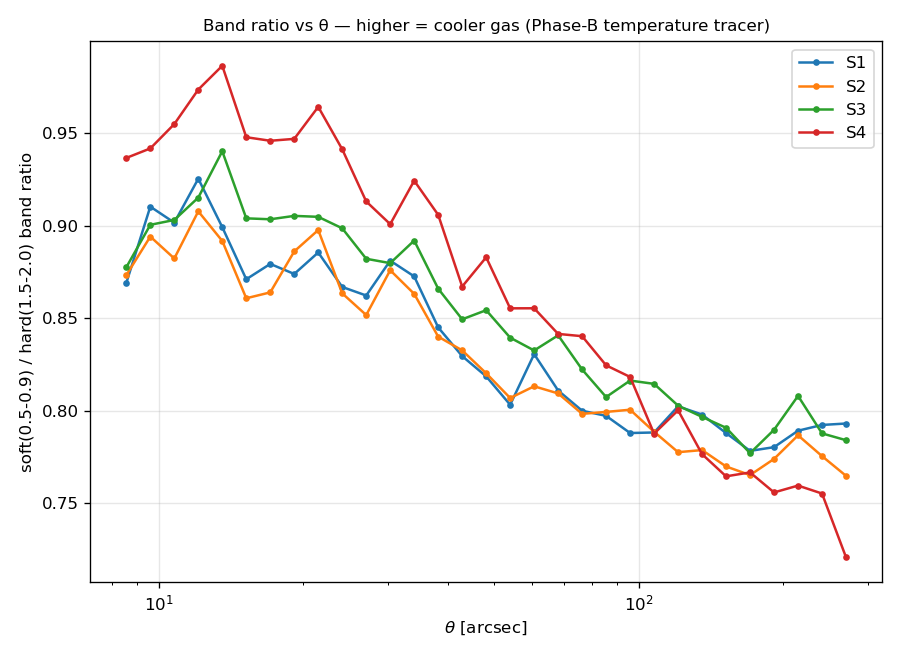
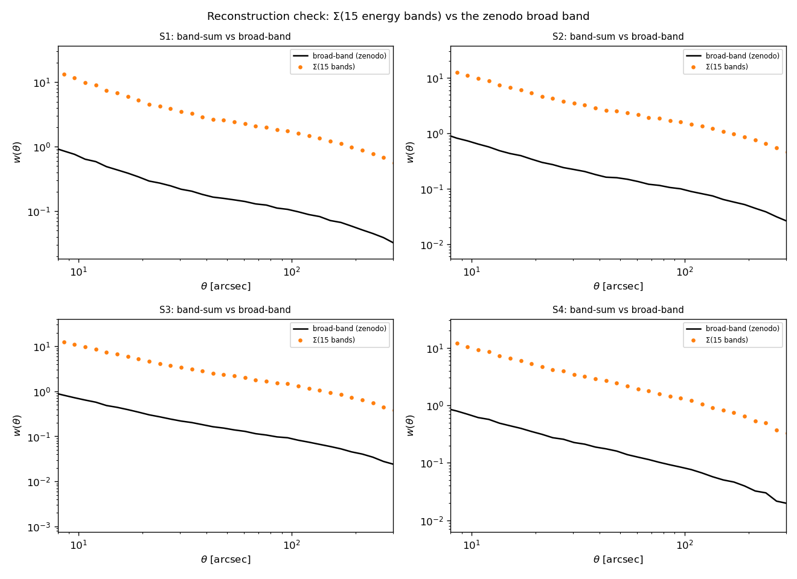

Galaxy × X-ray joint fit: hot gas + AGN across BGS samples
==========================================================

This page documents the **temperature-resolved joint fit** of the galaxy × X-ray
angular cross-correlation :math:`w(\theta)` for the seven LS10-BGS stellar-mass
threshold samples (S1–S7), combining a **full-APEC hot-gas** model with a
**duty-cycle AGN** model.  It covers the forward model, the emulator that makes the
fit tractable, the broad-band (0.5–2 keV) results, and the energy-band (Phase B)
extension that constrains the gas temperature.

The measurement is the Comparat et al. 2025 GALxEVT product
(`arXiv:2503.19796 <https://arxiv.org/abs/2503.19796>`_,
`zenodo:15111974 <https://doi.org/10.5281/zenodo.15111974>`_):
:math:`w(\theta) = (S^{G}_X - S^{R}_X)/S^{R}_X` (Davis–Peebles), where
:math:`S^{R}_X` is the random×events background surface brightness, so the physical
surface brightness is :math:`S_X = (1+w)\,S^{R}_X`.

Code: :mod:`hod_mod.scripts.fitting.fit_xray_joint` (broad band),
:mod:`hod_mod.scripts.fitting.fit_xray_joint_bands` (energy bands),
:mod:`hod_mod.scripts.fitting.make_xray_diagnostics` (figures).

.. contents::
   :local:
   :depth: 2

----

Forward model
-------------

For each halo mass :math:`M` the two X-ray emitters are projected onto the sky and
combined with the galaxy occupation through the halo model.

Hot gas — full APEC emissivity
~~~~~~~~~~~~~~~~~~~~~~~~~~~~~~~~

The X-ray volume emissivity is

.. math::

   \varepsilon(r\,|\,M) = n_e^2(r)\;\Lambda_b\!\big(T(r), Z(r)\big),

with the DPM profiles (Oppenheimer et al. 2025,
`arXiv:2505.14782 <https://arxiv.org/abs/2505.14782>`_):

* electron density :math:`n_e(r|M,z)` — generalised NFW, amplitude
  :math:`n_{e,0.3}` at :math:`0.3\,R_{200}`, mass slope :math:`\beta_{\rm gas}`
  (this is the :math:`L_X`–:math:`M` scaling), outer slope set by ``p2``, truncated
  at ``r_max`` × :math:`R_{200}`  (:class:`~hod_mod.gas.GasDensityDPM`);
* pressure :math:`P(r|M,z)` → temperature :math:`T = P/n_e` (ideal gas)
  (:class:`~hod_mod.gas.PressureProfileDPM`);
* metallicity :math:`Z(r)`  (:class:`~hod_mod.gas.MetallicityProfileDPM`).

:math:`\Lambda_b(T,Z)` is the APEC band-integrated cooling function from
:class:`~hod_mod.gas.cooling.ApecCoolingTable` (built with **soxs** /
`AtomDB <https://hea-www.cfa.harvard.edu/soxs/>`_, integrating the plasma spectrum
over the energy band :math:`[e_{\min}, e_{\max}]`).  Because :math:`\Lambda_b`
depends on :math:`T`, **the predicted** :math:`w(\theta)` **is temperature
dependent** — the physical basis of the energy-band fit below.

AGN — duty cycle
~~~~~~~~~~~~~~~~~

The AGN component is the duty-cycle model
(:class:`~hod_mod.agn.duty_cycle.DutyCycleAGNModel`): the hard-band X-ray
luminosity function (Aird et al. 2015) is K-corrected to the observed soft band and
convolved with the sample redshift kernel; the free normalisation is the **duty
cycle** ``log10DC`` (AGN-host fraction, prior :math:`[10^{-3}, 0.5]`).

From 3-D to :math:`w(\theta)`
~~~~~~~~~~~~~~~~~~~~~~~~~~~~~~~

1. **Profile FT** :math:`\tilde X(k|M) = 4\pi\!\int_0^{r_{\max}}
   \varepsilon(r)\,j_0(kr)\,r^2\,\mathrm{d}r` by Gauss–Legendre quadrature
   (:func:`hod_mod.gas.conversions._profile_uk_gl`).
2. **Halo-model cross-power** :math:`P_{gX}(k,z)` — 1-halo (central + satellite,
   NFW-weighted) + 2-halo (:math:`b_{\rm eff}\,P_{\rm lin}`), with the galaxy
   occupation from the Zu & Mandelbaum 2015 iHOD
   (`arXiv:1505.02781 <https://arxiv.org/abs/1505.02781>`_) held **fixed** at its
   :math:`w_p+n_{\rm gal}` MAP, the Tinker 2008 HMF
   (`arXiv:0803.2706 <https://arxiv.org/abs/0803.2706>`_) + Tinker 2010 bias
   (`arXiv:1001.3162 <https://arxiv.org/abs/1001.3162>`_) and Diemer & Joyce 2019
   concentrations (`arXiv:1809.07326 <https://arxiv.org/abs/1809.07326>`_)
   (:meth:`~hod_mod.observables.cross_spectra.HaloModelCrossSpectra._pk_tables_gX`).
3. **Limber** → :math:`C_\ell^{gX}`, then **Hankel** :math:`w(\theta) =
   \int \frac{\ell\,\mathrm{d}\ell}{2\pi} C_\ell J_0(\ell\theta)`, multiplied by the
   eROSITA **King PSF** window (core :math:`\theta_c = 8.64''`, CalDB on-axis).

eROSITA energy-conversion factor
~~~~~~~~~~~~~~~~~~~~~~~~~~~~~~~~~~

Because the fit is to :math:`w(\theta)` — a *ratio* that is independent of the
measurement's fixed 1 keV/photon ECF assumption — each predicted component folds in
the **true** eROSITA response (TM0 survey ARF × RMF from the
`eSASS4DR1 ARF/RMF page <https://erosita.mpe.mpg.de/dr1/eSASS4DR1/eSASS4DR1_arfrmf/>`_,
`eROSITA DR1 <https://erosita.mpe.mpg.de/dr1/>`_) via
:class:`~hod_mod.gas.erosita_response.ErositaResponse`.

----

The emulator (making the fit tractable)
---------------------------------------

The single expensive step is the emissivity FT: at the production grid
(:math:`N_k = N_M = 512`, :math:`n_{gl}=200`) it is a 52-million-element
:math:`(N_k, N_M, n_{gl})` cube, originally ≈ 5.7 s per redshift, ≈ 13 s per
``angular_cl_gX`` call — far too slow for a 7-sample MAP/MCMC.  Three changes make
it fast **without changing the result**:

* **Vectorised** emissivity mass loop (``GasDensityDPM._ne_grid``) — bit-exact.
* **``np.sinc`` + ``np.einsum``** rewrite of the FT
  (:func:`hod_mod.gas.conversions._profile_uk_gl`): no dense product cube, cached
  Legendre rule — bit-exact (:math:`\lesssim 10^{-10}`), ~1.3 s/call, half the peak
  memory.  ``n_gl`` cannot be lowered (Gauss–Legendre cannot resolve the oscillatory
  :math:`j_0(kr)` at high :math:`k`).
* **X_uk emulator** — ``x_uk_override`` on
  :meth:`~hod_mod.observables.cross_spectra.HaloModelCrossSpectra._pk_tables_gX` /
  ``angular_cl_gX``: the raw :math:`\tilde X(k|M)/\Lambda_{\rm ref}` is cached per
  ``(p2, r_max, β_gas)`` cell (rebuilt exactly per :math:`\beta` — no post-FT tilt
  approximation, which only captures :math:`n_e^2` and misses the :math:`T=P/n_e`
  shift of :math:`\Lambda(T)`), and the exact :math:`(n_e/n_{e,\rm fid})^2` density
  scaling is applied analytically.  The override reproduces a direct call **bit for
  bit**; a fit evaluation drops from ~13 s to ~2 s (interpolation only).

The model→data gas amplitude ``C_total`` is **re-anchored** for the full-APEC path
on S1 (its unconstrained best-fit :math:`A_{\rm gas}` ⇒ ``density_norm`` = 1), then
scaled by :math:`1/S^R_X` per sample; the AGN uses the analogous ``c_obs_total``.

----

Phase A — broad-band (0.5–2 keV) fit
------------------------------------

Five shared physical parameters are fit per sample (or jointly):
``log10_ne_03`` (density normalisation), ``beta_gas`` (:math:`L_X`–:math:`M`
slope), ``p2`` (outer slope), ``r_max`` (extent), ``log10DC`` (AGN duty cycle).
The MAP uses multi-start Nelder–Mead; posteriors use ``emcee`` (64 walkers).
Run with::

    HOD_MOD_RESULTS=$HOD_MOD_RESULTS JAX_PLATFORMS=cpu python -m \
        hod_mod.scripts.fitting.fit_xray_joint --samples S1 --mcmc

   Posterior physical parameters vs stellar-mass threshold (S1–S4).  The **AGN
   duty cycle increases monotonically and tightly with stellar mass**
   (:math:`\log_{10}\mathrm{DC}: -1.89 \to -1.51`), a clean physical trend.  Gas
   parameters are noisier and the MAP :math:`\chi^2/\mathrm{dof}` is uneven (S2, S4
   good; S1, S3 poor — see below).

   Data vs the gas / AGN / total decomposition at the MAP.  The AGN dominates the
   small-scale (:math:`\lesssim 30''`) signal and the gas the large scales.

   S3 residuals (pulls).  A **coherent** :math:`+/-` **oscillation** across
   :math:`\theta` — a systematic model-shape mismatch at the gas→AGN "knee"
   (:math:`\sim 20\text{--}50''`), not statistical scatter.  With only the
   broad-band integrated signal the two components are degenerate, so for S1/S3 the
   MAP leaves this wiggle.  This degeneracy is what the energy bands break.

----

Phase B — energy bands (gas temperature)
----------------------------------------

The signal is measured in **15 narrow bands** (0.5–0.6 … 1.9–2.0 keV, 0.1 keV
steps).  The gas is thermal — its band ratios encode :math:`\Lambda_b(T)` — while
the AGN is a near power law, so the bands **separate gas from AGN spectrally** and
constrain :math:`kT`.

* **Data** — reconstructed from the per-field measurements with
  :mod:`hod_mod.scripts.fitting.reconstruct_band_wtheta` (Landy–Szalay merge over
  the eROSITA-DE fields; validated: :math:`\Sigma`\ (15 bands) matches the zenodo
  broad band to 0.4–3.3 %).
* **Model** — all 15 bands share :math:`n_e, T, Z` and the FT geometry, so
  :meth:`~hod_mod.gas.GasDensityDPM.emissivity_full_uk_bands` computes them in ONE
  batched FT (the :math:`j_0` cube is reused; bit-exact vs looping single bands).
  The fit adds a temperature normalisation ``kT_norm`` (grid axis) to the Phase-A
  shape parameters (:mod:`hod_mod.scripts.fitting.fit_xray_joint_bands`).

   Measured band :math:`w_b(\theta)` vs X-ray energy at three angular scales —
   the energy dependence (peaking near 0.9–1.0 keV) that carries the temperature
   information.

   Soft/hard band ratio vs :math:`\theta` — a direct, model-independent
   gas-temperature tracer (higher ratio = cooler gas).

   Reconstruction check: :math:`\Sigma`\ (15 bands) vs the zenodo broad band.

----

Data & results layout (environment variables)
---------------------------------------------

All paths resolve through :mod:`hod_mod.paths` (no hardcoded paths):

===========================  =========================  ==============================
Helper                       Env var                    Holds
===========================  =========================  ==============================
``data_root()``              ``$HOD_MOD_DATA_DIR``      ``zenodo/``, ``erosita/``, ``xray_bands/``
``results_root()``           ``$HOD_MOD_RESULTS``       emulator caches, chains, figures
``repo_root()``              ``$HOD_MOD_REPO``          ``configs/``, package ``data/``
===========================  =========================  ==============================

Reconstruct the band data (``$HOD_MOD_DATA_DIR/xray_bands/<basename>/``), then::

    JAX_PLATFORMS=cpu python -m hod_mod.scripts.fitting.reconstruct_band_wtheta
    JAX_PLATFORMS=cpu python -m hod_mod.scripts.fitting.fit_xray_joint_bands \
        --samples S1 S2 S3 S4 --map-only
    JAX_PLATFORMS=cpu python -m hod_mod.scripts.fitting.make_xray_diagnostics

----

References
----------

* Comparat et al. 2025 — GALxEVT BGS × eROSITA
  (`arXiv:2503.19796 <https://arxiv.org/abs/2503.19796>`_;
  data `zenodo:15111974 <https://doi.org/10.5281/zenodo.15111974>`_)
* Oppenheimer et al. 2025 — DPM gas profiles
  (`arXiv:2505.14782 <https://arxiv.org/abs/2505.14782>`_)
* Zu & Mandelbaum 2015 — iHOD
  (`arXiv:1505.02781 <https://arxiv.org/abs/1505.02781>`_)
* Tinker et al. 2008 HMF (`arXiv:0803.2706 <https://arxiv.org/abs/0803.2706>`_);
  Tinker et al. 2010 bias (`arXiv:1001.3162 <https://arxiv.org/abs/1001.3162>`_)
* Diemer & Joyce 2019 concentrations
  (`arXiv:1809.07326 <https://arxiv.org/abs/1809.07326>`_)
* eROSITA DR1 (`erosita.mpe.mpg.de/dr1 <https://erosita.mpe.mpg.de/dr1/>`_) and the
  `eSASS4DR1 ARF/RMF <https://erosita.mpe.mpg.de/dr1/eSASS4DR1/eSASS4DR1_arfrmf/>`_
* APEC / AtomDB via `soxs <https://hea-www.cfa.harvard.edu/soxs/>`_
